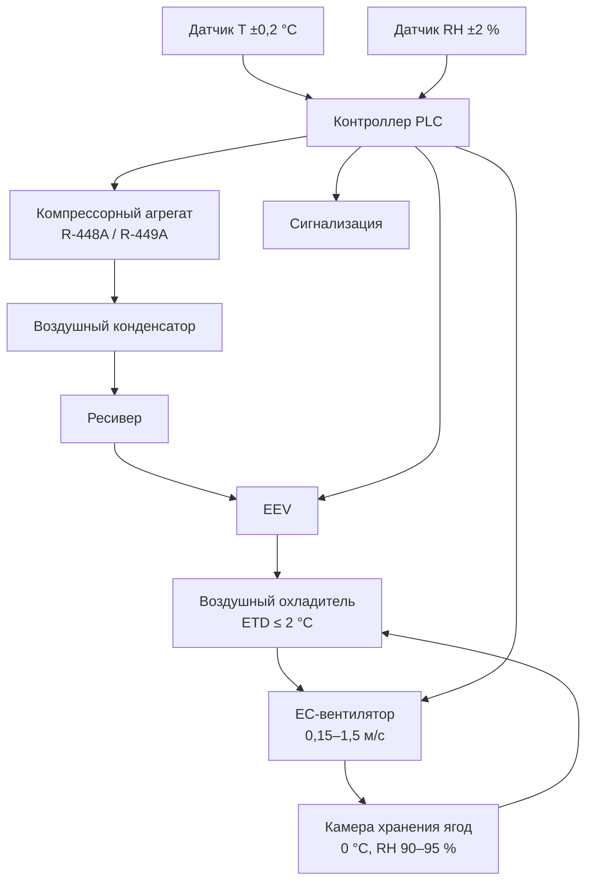

## Обзор

Холодильное хранение ягод представляет значительную техническую проблему из-за чрезвычайно высокой скоропортимости продукции. Клубника (Fragaria × ananassa), черника (Vaccinium corymbosum), малина (Rubus idaeus), ежевика (Rubus spp.) и клюква (Vaccinium macrocarpon) требуют немедленного принудительного охлаждения после сбора урожая — задержка даже на 1–2 ч между сбором и началом охлаждения приводит к измеримой потере качества.

Ягоды демонстрируют исключительно высокую интенсивность дыхания: клубника при 20 °C выделяет 60–100 мг CO₂/(кг·ч), что в 3–6 раз превышает показатели яблок. Коэффициент Q₁₀ в диапазоне 0–20 °C составляет 3–5, то есть ягоды при 10 °C портятся в 4–8 раз быстрее, чем при 0 °C. Нормативная база: ASHRAE Handbook Refrigeration (2022), ASHRAE 15, ISO 5149, EN 378.

## Физиологические характеристики

### Интенсивность дыхания


| Вид ягоды  | Дыхание при 0 °C, мг CO₂/(кг·ч) | Дыхание при 10 °C, мг CO₂/(кг·ч) | Дыхание при 20 °C, мг CO₂/(кг·ч) |
|------------|----------------------------------|-----------------------------------|-----------------------------------|
| Клубника   | 15–25                            | 40–65                             | 60–100                            |
| Малина     | 25–40                            | 65–100                            | 100–160                           |
| Черника    | 5–10                             | 15–25                             | 30–50                             |
| Ежевика    | 20–35                            | 55–90                             | 90–140                            |
| Клюква     | 3–7                              | 8–15                              | 15–30                             |


Высокая скорость дыхания коррелирует с коротким сроком хранения. Клубника и малина (климактерический пик 60–160 мг CO₂/(кг·ч) при 20 °C) требуют немедленного охлаждения и имеют ограниченный потенциал хранения. Клюква — исключение: нeклимактерическая ягода с низкой интенсивностью дыхания и сроком хранения 2–4 месяца.

### Тепловая нагрузка от дыхания


q_{\text{дых}} = m \cdot R(T) \cdot h_{\text{eq}}


где $h_{\text{eq}} = 220$ Дж/(мг CO₂); $R(T)$ — интенсивность дыхания при температуре $T$.

**Пример.** 1000 кг клубники при 0 °C: $R = 20$ мг CO₂/(кг·ч):

q_{\text{дых}} = 1000 \times 20 \times 220 \times 10^{-6} / 3{,}6 \approx 1{,}22 \; \text{кВт}


## Системы принудительного воздушного охлаждения

Охлаждение в помещении (room cooling) неэффективно для ягод. Обязательно применение принудительного воздушного охлаждения (forced-air cooling) с направлением охлаждённого воздуха через упакованные контейнеры.

### Параметры системы

- Объёмный расход воздуха: 1,0–2,0 л/с на кг ягод (3,6–7,2 м³/ч·кг).
- Скорость воздуха через контейнеры: 0,5–1,5 м/с.
- Целевое время охлаждения до семи восьмых (7/8 cooling time): 2–4 ч.
- Температура подаваемого воздуха: −1 до 0 °C.

Конструкция тары должна обеспечивать не менее 5 % открытой площади на противоположных стенках для прохода воздушного потока. Ряды контейнеров укладываются с достаточными воздушными каналами.

### Расчёт времени охлаждения


t_{7/8} = \frac{0{,}693 \cdot m \cdot c_p}{h \cdot A \cdot \overline{\Delta T}}


где $m$ — масса плода (кг или г); $c_p = 3{,}9$ кДж/(кг·К) для ягод; $h$ — коэффициент конвективной теплопередачи (20–50 Вт/(м²·К) при принудительном воздухе); $A$ — площадь поверхности плода (м²); $\overline{\Delta T}$ — логарифмическая средняя разность температур.

**Пример.** Ягода клубники: $m = 15$ г, диаметр ≈ 3 см, $A \approx 28$ см² = 0,0028 м². $h = 35$ Вт/(м²·К), $\overline{\Delta T} = 10$ К:


t_{7/8} = \frac{0{,}693 \times 0{,}015 \times 3900}{35 \times 0{,}0028 \times 10} \approx 4{,}1 \; \text{ч}


При увеличении $h$ до 50 Вт/(м²·К) (более высокая скорость воздуха): $t_{7/8} \approx 2{,}9$ ч.

### Ограничения гидроохлаждения

Гидроохлаждение (hydrocooling) как правило не применяется для ягод, кроме отдельных случаев с клубникой. Прямой контакт с водой повышает влажность поверхности и провоцирует грибковый рост у малины и ежевики. При использовании гидроохлаждения необходимо хлорирование воды 100–150 ppm свободного хлора и строгий контроль микробного обсеменения.

## Требования к температуре и влажности хранения


| Вид ягоды  | T, °C     | RH, %  | Срок хранения | Критические риски               |
|------------|-----------|--------|---------------|----------------------------------|
| Клубника   | 0         | 90–95  | 5–7 дней      | Botrytis; потеря тургора         |
| Черника    | 0         | 90–95  | 10–14 дней    | Обезвоживание при RH < 90 %      |
| Малина     | 0–0,5     | 90–95  | 2–3 дня       | Rhizopus; механические повреждения |
| Ежевика    | 0–0,5     | 90–95  | 2–3 дня       | Botrytis; потеря лоска           |
| Клюква     | 2–4       | 90–95  | 2–4 мес.      | Льдообразование при T < 0 °C     |


Однородность температуры ±0,5 °C по всему объёму хранилища обязательна. Холодные пятна ниже −0,5 °C вызывают льдообразование — признак: водянистый вид и коллапс ткани при оттаивании.

### Управление влажностью

Высокая RH (90–95 %) предотвращает потерю влаги, однако избыток влажности (> 97–98 %) способствует росту Botrytis cinerea. Дефицит давления водяного пара необходимо точно регулировать.

**Стратегии:**
- ETD испарителя не более 1–2 °C выше заданной температуры камеры;
- частые циклы оттаивания испарителя (4–6 раз/сут), короткие по времени;
- кратность воздухообмена в камере 30–60 ч⁻¹;
- перфорированные полиэтиленовые вкладыши в контейнерах для поддержания микроклимата.

## Предотвращение микробной порчи

Грибковая порча — основная причина потерь при хранении ягод. Инфекции Botrytis cinerea, Rhizopus stolonifer и Colletotrichum spp., инициированные до уборки или при транспортировке, становятся видимыми через 2–4 дня в условиях холодильного хранения.

### Интегрированная защита

1. **Фумигация диоксидом хлора** (ClO₂): 3–5 ppm в течение 30 мин до загрузки — снижает популяцию патогенов на поверхности тары и помещения.
2. **Озонирование** (ozonation): 0,3–1,0 ppm непрерывно — подавляет грибковый рост; требует контроля остаточного O₃ (ПДК рабочей зоны 0,1 мг/м³ по ГОСТ 12.1.005-88).
3. **Модифицированная атмосфера (MAP):** повышенный CO₂ (10–20 %) и пониженный O₂ (5–10 %) подавляют Botrytis.
4. **Непрерывная циркуляция воздуха:** предотвращает локальные зоны высокой влажности с конденсацией.
5. **Стабильность температуры:** колебания T провоцируют циклы конденсации — смачивание поверхности ягод — активацию инфекций.

## Упаковка в модифицированной атмосфере

MAP (modified atmosphere packaging) значительно продлевает срок хранения ягод, снижая интенсивность дыхания и ингибируя грибковое развитие. Проницаемость плёнки рассчитывается по характеристикам дыхания ягод.

**Целевые условия MAP:**


| Вид ягоды | O₂, % | CO₂, % | Тип плёнки              |
|-----------|--------|--------|--------------------------|
| Клубника  | 5–10   | 15–20  | Перфорированный PP или OPP |
| Черника   | 2–5    | 12–20  | Микроперфорированный PE  |
| Малина    | 5–10   | 15–20  | Макроперфорированный OPP |


### Расчёт газопроницаемости плёнки


Q_{\text{газ}} = \frac{P \cdot A \cdot \Delta p}{L}


где $Q_{\text{газ}}$ — скорость передачи газа [мл/(ч·упаковка)]; $P$ — коэффициент проницаемости плёнки [мл·мм/(м²·ч·атм)]; $A$ — площадь плёнки, м²; $\Delta p$ — разность парциальных давлений газа, атм; $L$ — толщина плёнки, мм.

Микроперфорированные плёнки (отверстия 50–200 мкм, шаг 25–50 мм) обеспечивают пассивное регулирование атмосферы и не требуют специального газового оборудования.

## Системы распределения воздуха

### Принципы проектирования

Правильная циркуляция воздуха предотвращает температурную стратификацию и обеспечивает равномерную влажность. Подача воздуха направляется вдоль потолка, создавая схему циркуляции без прямого обдува контейнеров.

**Параметры воздушного потока:**
- скорость воздуха у поверхности контейнеров при охлаждении: 0,5–1,5 м/с;
- скорость в режиме поддержания температуры: 0,15–0,25 м/с;
- разность температур подача/обратка: 1–2 °C;
- площадь испарителя: не менее 2,5–3,5 м² на 1 кВт холодопроизводительности.

Мёртвые воздушные зоны в углах и за укладками недопустимы. Беспроводные сенсорные сети с 6–10 точками измерения на 100 м² площади обеспечивают мониторинг однородности в реальном времени.

### Схема холодильной камеры для ягод





## Суммарная тепловая нагрузка

### Составляющие нагрузки


| Составляющая          | Доля от суммарной нагрузки | Примечание                       |
|-----------------------|---------------------------|----------------------------------|
| Дыхание продукции     | 15–35 %                   | Зависит от вида и T хранения     |
| Охлаждение контейнеров| 10–20 %                   | Начальная нагрузка охлаждения    |
| Инфильтрация воздуха  | 20–30 %                   | При интенсивном грузообороте     |
| Оборудование, освещение| 5–10 %                   | Вентиляторы, освещение           |
| Запас (safety factor) | 15–20 %                   | Обязательный резерв              |


Система холодоснабжения должна справляться с пиковыми нагрузками при начальном охлаждении, сохраняя энергоэффективность в стационарном режиме. Компрессоры переменной производительности (variable-capacity compressors) или многоступенчатые системы оптимизируют потребление во всём рабочем диапазоне.

## Мониторинг качества при хранении

### Критические параметры

- **Твёрдость мякоти:** измерения пенетрометром (2–5 Н для клубники); снижение > 30 % — сигнал к ускорению реализации.
- **Растворимые сухие вещества:** рефрактометр (типично 7–12 °Brix для клубники); стабильность — индикатор качества хранения.
- **Потеря массы:** ежедневное взвешивание контрольной выборки; отклонение при потере > 5 % за 48 ч.
- **Частота порчи:** визуальная оценка площади плесени на выборке контейнеров.

### Ротация запасов

Принцип FIFO (first in — first out, первым поступил — первым выбыл) строго обязателен. Срок хранения ягод никогда не должен превышать рекомендуемый максимум даже при приемлемом внешнем виде: невидимые грибковые инфекции становятся очевидными только в розничной точке.

## Требования к обращению с продукцией

Хрупкость ягод требует осторожного обращения на всей холодной цепи. Механические повреждения от ударов, сжатия или вибрации создают точки инфекции для грибков.

**Нормативы обращения:**
- высота падения контейнеров: максимум 15 см;
- высота укладки: 6–8 ярусов (в зависимости от прочности тары на сжатие);
- время на открытом воздухе при перемещении: минимальное, для предотвращения конденсации;
- операции погрузчика: плавное ускорение, без резких остановок.

Предварительное охлаждение паллет и тары до температуры хранилища перед загрузкой предотвращает нагрев ранее охлаждённой продукции от тёплых контейнеров.

## Нормативная база


| Стандарт                             | Область применения                                          |
|--------------------------------------|-------------------------------------------------------------|
| ASHRAE Handbook Refrigeration (2022) | Физиология, режимы и расчёт нагрузок для ягод              |
| ASHRAE 15-2022                       | Безопасность холодильных систем                              |
| ISO 5149-1:2014                      | Холодильные системы: требования безопасности                 |
| EN 378-1:2016+A1:2020                | Холодильные системы и тепловые насосы; экология              |
| ГОСТ 34394-2018                      | Технология хранения плодоовощной продукции в холодильниках   |
| ГОСТ 28547-90                        | Фрукты свежие; условия хранения                              |

