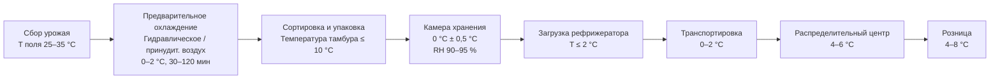

## Обзор

Косточковые фрукты семейства Rosaceae — персики (Prunus persica), нектарины (Prunus persica var. nucipersica), сливы (Prunus domestica), вишня (Prunus avium), абрикосы (Prunus armeniaca) — относятся к наиболее скоропортящимся товарам с высокой интенсивностью дыхания, значительным выделением этилена и узким диапазоном допустимых температур. Правильно организованное холодильное хранение продлевает товарный вид на 2–5 недель в зависимости от вида и сорта.

Основные технические вызовы: предотвращение холодовой травмы (chilling injury), поддержание упругости ткани при относительной влажности 90–95 %, минимизация потерь влаги и микробного обсеменения. Нормативная база: ASHRAE Handbook Refrigeration (2022), ISO 5149, EN 378, ГОСТ 34394-2018, СП 60.13330.2020.

## Физические принципы

### Дыхание климактерических плодов

Косточковые фрукты — климактерические плоды (climacteric fruits) с выраженным пиком дыхания. Температурная зависимость интенсивности дыхания:


V_O(T) = V_{O,\text{ref}} \cdot Q_{10}^{(T - T_{\text{ref}})/10}


где $Q_{10} = 2{,}0$–$2{,}5$ — температурный коэффициент для косточковых; $T_{\text{ref}} = 20$ °C; $V_{O,\text{ref}}$ — интенсивность дыхания при 20 °C [мл O₂/(кг·ч)].

При снижении температуры с 20 °C до 0 °C интенсивность дыхания уменьшается в 4–6 раз ($Q_{10} = 2{,}5$), что замедляет метаболизм, размягчение и деградацию органических кислот.

### Выделение этилена

Косточковые выделяют 5–15 пмоль/(кг·с) (≈ 0,5–5 мкл/(кг·ч)) этилена, интенсивность резко возрастает на климактерическом пике до 50–200 мкл/(кг·ч). Этилен ускоряет размягчение мякоти, снижение кислотности и исчерпание запасов сахаров. Для замедления созревания требуется либо активная вентиляция (10–15 объёмов/ч), либо регулируемая атмосфера (CO₂ = 3–5 %, O₂ = 2–3 %).

## Требования к условиям хранения


| Вид         | T, °C   | RH, %  | Срок, нед. | Особенности                                              |
|-------------|---------|--------|------------|----------------------------------------------------------|
| Персики     | 0       | 90–95  | 2–4        | Высокая чувствительность к холодовой травме             |
| Нектарины   | 0       | 90–95  | 2–4        | Быстрая потеря влаги; риск растрескивания при перепадах RH |
| Сливы       | 0       | 90–95  | 2–5        | Более устойчивы к холодовой травме                       |
| Вишня       | 0       | 90–95  | 2–3        | Высокий риск Botrytis; нужен контроль O₂                |
| Абрикосы    | 0       | 90–95  | 1–3        | Наиболее скоропортящиеся; быстрое размягчение            |


### Критический диапазон температур

Оптимальная температура хранения: **0 °C ± 0,5 °C**. Последствия отклонений:

- **T < −0,5 °C:** начало льдообразования в тканях → потеря упругости, мучнистая текстура после оттаивания.
- **0 °C ≤ T ≤ 2 °C:** оптимальный диапазон; минимальный риск холодовой травмы при существенном замедлении метаболизма.
- **T > 2 °C:** ускоренное размягчение (softening), деградация органических кислот, активизация микробиоты.

Точка замерзания сока косточковых: −1,2…−1,5 °C. Датчики температуры класса ±0,2 °C обязательны.

### Относительная влажность

Поддержание RH = 90–95 % критично для предотвращения трансдермальной потери влаги:

- при RH < 85 % сморщивание кожицы через 3–4 дня;
- потеря массы > 3 % — визуально заметна покупателю;
- снижение тургора увеличивает проницаемость кожицы для патогенов.

Достижение RH = 90–95 % в промышленных камерах требует ограниченного ETD испарителя (не более 3–5 К), регулирования скорости вентилятора и периодического отключения вентилятора испарителя по команде гигростата.

## Расчёт тепловой нагрузки

### Составляющие нагрузки


Q_{\Sigma} = Q_{\text{дых}} + Q_{\text{пд}} + Q_{\text{огр}} + Q_{\text{инф}}


**Теплота дыхания:**


Q_{\text{дых}} = m \cdot v_{\text{CO}_2} \cdot h_{\text{eq}}


где $v_{\text{CO}_2}$ — интенсивность дыхания [мл CO₂/(кг·ч)] при температуре хранения; $h_{\text{eq}} = 220$ Дж/(мг CO₂). При T = 0 °C для персиков: $v \approx 8$–$12$ мл/(кг·ч).

### Скорость потери влаги


\dot{m}_{\text{влага}} = k_{\text{diff}} \cdot A_{\text{пл}} \cdot \left(\rho_{\text{нас}}(T) - \rho_{\text{воз}}\right)


где $k_{\text{diff}}$ — коэффициент диффузии через кожицу [м/с]; $A_{\text{пл}}$ — площадь поверхности плода [м²]; $\rho_{\text{нас}}$ — плотность насыщенного пара при T плода [г/м³]; $\rho_{\text{воз}}$ — фактическая плотность пара в воздухе камеры.

Для персика массой 150 г при T = 0 °C, RH = 95 %, скорость воздуха 0,3 м/с:
- скорость потери влаги ≈ 0,15–0,20 г/сут;
- за 4 недели потеря ≈ 4,2–5,6 г = 2,8–3,7 % массы (допустимо до 5 %).

### Пример расчёта (SI)

**Условие.** Камера объёмом 150 м³. Загрузка персиков $m = 60$ т при $T_{\text{вх}} = 22$ °C. Температура хранения $T_{\text{хр}} = 0$ °C. $U_{\text{огр}} = 0{,}15$ Вт/(м²·К), $A_{\text{огр}} = 270$ м². $T_{\text{н}} = 25$ °C. Время первоначального охлаждения 18 ч.

**Тепло дыхания** при $v = 10$ мл CO₂/(кг·ч):

Q_{\text{дых}} = 60\,000 \times 10 \times 220 \times 10^{-6} / 3{,}6 \approx 37 \; \text{Вт}


**Теплопередача через ограждения:**

Q_{\text{огр}} = 0{,}15 \times 270 \times 25 = 1012 \; \text{Вт} \approx 1{,}0 \; \text{кВт}


**Первоначальное охлаждение** ($c_p = 3{,}7$ кДж/(кг·К)):

Q_{\text{пд}} = \frac{60\,000 \times 3{,}7 \times 22}{18 \times 3600} \approx 75 \; \text{кВт}


**Расчётная мощность холодильной системы** с запасом 1,2: $Q_{\text{пр}} = 75 \times 1{,}2 \approx$ **90 кВт**.

## Холодовая травма и её предотвращение

### Механизм

Холодовая травма (chilling injury) у персиков и нектаринов развивается при хранении при 0–5 °C в течение более 2–3 недель без защитных мер — так называемое «мучнистое распадение» (mealiness или wooliness): ткань мякоти теряет сочность, становится мучнистой и безвкусной. Механизм: нарушение гидролиза пектинов при нарушенной целостности клеточных мембран.

Симптомы: потеря сочности; мучнистая, ватная текстура (woolly texture); коричневые пятна в мякоти; развитие грибковых инфекций по ослабленным тканям.

### Стратегии профилактики

**Контролируемое охлаждение.** Снижение температуры со скоростью 0,3–0,5 К/ч в первые 12–24 ч после уборки для постепенной адаптации метаболизма.

**Регулируемая атмосфера (MAS/CA).** Поддержание CO₂ = 3–5 %, O₂ = 2–3 %, остаток N₂ замедляет дыхание и снижает чувствительность к холодовой травме на 30–50 %.

**Обработка 1-MCP.** Блокирование рецепторов этилена снижает скорость созревания. Применяется в концентрации 0,3–0,6 мкМ в течение 12–24 ч при 20–25 °C непосредственно после уборки. Особенно эффективно для нектаринов и персиков группы White peach.

**Прерывистый прогрев (intermittent warming).** Кратковременное повышение температуры до 15–20 °C на 24 ч через каждые 7 дней хранения снижает накопление токсичных метаболитов.

## Конфигурация холодильного оборудования

### Воздушный охладитель

- Испаритель пластинчатый (plate-fin evaporator) или трубчатый с воздушными вентиляторами.
- ETD не более 3–5 К для сохранения RH = 90–95 %.
- Оснащён осушителем (liquid line filter-drier) и EEV для точного регулирования перегрева.

### Система вентиляции

- Равномерное распределение воздуха со скоростью 0,2–0,5 м/с.
- Перепад температур по объёму камеры: не более 1 К.
- Электронный гигростат с управлением EEV или электромагнитным вентилем испарителя для регулирования влажности.

### Дверные шлюзы

- Время открытия при загрузке/выгрузке: не более 30 с.
- Надувные уплотнители (inflatable door seals) или воздушные завесы (air curtains).
- Тамбур (airlock) при частых загрузках.

## Интеграция в холодную цепь

### Методы предварительного охлаждения

**Гидравлическое охлаждение (hydrocooling).** Погружение или орошение холодной водой (0–2 °C) на 30–60 мин; снижает температуру плода на 15–20 К. Хлорирование воды 50–100 ppm свободного хлора. Применяется для персиков, нектаринов, вишни.

**Принудительный воздух (forced-air cooling).** Перепад давления 25–75 Па; время 2–6 ч. Применяется для слив и абрикосов, не переносящих увлажнения при гидроохлаждении.

**Вакуумное охлаждение.** Эффективно для товаров с высокой удельной поверхностью; для косточковых редко применяется из-за риска потери влаги и повреждения кожицы.

### Схема холодной цепи





## Стандарты и нормативы


| Стандарт                             | Область применения                                             |
|--------------------------------------|----------------------------------------------------------------|
| ASHRAE Handbook Refrigeration (2022) | Физиология, режимы хранения, расчёт нагрузок                   |
| ASHRAE 15-2022                       | Безопасность холодильных систем                                 |
| ISO 5149-1:2014                      | Холодильные системы и тепловые насосы: безопасность             |
| EN 378-1:2016+A1:2020                | Холодильные системы: экология и безопасность                    |
| ГОСТ 34394-2018                      | Технология хранения плодоовощной продукции в холодильниках      |
| ГОСТ 28547-90                        | Фрукты свежие; условия хранения                                 |
| СП 60.13330.2020                     | Отопление, вентиляция и кондиционирование воздуха               |


## Практические рекомендации

**Мониторинг:** датчики температуры в геометрическом центре камеры и в упаковке; интервал записи не более 2 ч. Допуски: T = 0 ± 0,5 °C, RH = 92 ± 3 %.

**Заполнение камеры:** не более 85 % объёма для обеспечения циркуляции воздуха по всему объёму.

**Санитарная обработка:** дезинфекция (0,05 % гипохлорит натрия или надуксусная кислота 0,1 %) перед каждой загрузкой; ежедневное удаление конденсата из поддона испарителя.

**Сортировка перед охлаждением:** обязательное удаление плодов с механическими повреждениями и признаками болезней (монилиоз, клястероспориоз). Один повреждённый плод в ящике инфицирует соседние за 48–72 ч.

**Управление CO₂:** при CA-хранении вишни и слив контроль CO₂ ≤ 5 % — превышение вызывает пустоты в мякоти (pitting in flesh) и посторонние запахи.
