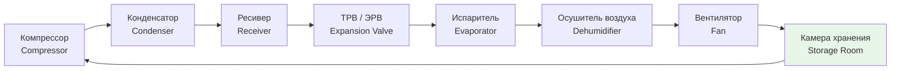

Луковые культуры (лук репчатый, чеснок, зелёный лук, лук-порей) занимают особое место в холодильной логистике: разные виды требуют диаметрально противоположных режимов относительной влажности — от 60 % для чеснока до 100 % для зелёного лука. Ошибка в проектировании системы HVAC (heating, ventilation and air conditioning) или несоблюдение предварительной сушки (curing) приводит к потерям 15–25 % продукции уже за первые два месяца хранения.

Настоящий раздел охватывает физические принципы хранения, параметры по видам, расчёт тепловых нагрузок, выбор холодильного агента и практические ошибки проектирования. Нормативная база: ASHRAE Handbook — Refrigeration (SI Edition, 2022), ASHRAE 15/34, ГОСТ 28547, СП 60.13330, ISO 5149.

## Физические основы хранения луковых культур

### Дыхание и метаболическое тепло

Интенсивность дыхания луковых культур при температуре хранения описывается зависимостью Аррениуса (Arrhenius). Для практических расчётов применяют упрощённую модель с температурным коэффициентом $Q_{10}$:

$$R(T) = R_0 \cdot Q_{10}^{\,(T - T_0)/10}$$

где $R(T)$ — скорость дыхания при температуре $T$, мл CO₂/(кг·ч); $R_0$ — базовая скорость при $T_0 = 0$ °C; $Q_{10} \approx 2{,}0$ для луковых культур.

Для репчатого лука при 0 °C: $R_0 \approx 5$ мл CO₂/(кг·ч); метаболическая теплота — около **10 Вт/т** продукта.

### Потеря влаги (транспирация)

Скорость испарения влаги с поверхности продукта:

$$\dot{m}_{\text{исп}} = h_m \cdot A \cdot \bigl(\rho_{\text{нас}}(T) - \rho_{\text{возд}}\bigr)$$

где $h_m$ — коэффициент массообмена, м/с; $A$ — площадь поверхности, м²; $\rho_{\text{нас}}$ и $\rho_{\text{возд}}$ — плотность водяного пара при насыщении и в воздухе камеры, кг/м³.

Для сухих луковых (репчатый, чеснок) поддержание относительной влажности (relative humidity, RH) 65–70 % удерживает потерю массы на уровне 0,3–0,5 %/нед. Снижение RH ниже 55 % ускоряет обезвоживание до 1–1,5 %/нед.

### Прорастание (sprouting)

Критическая температура активации почек у репчатого лука — около +2 °C, у чеснока — +1 °C. Хранение при 0 ± 0,5 °C подавляет прорастание на 6–8 месяцев без применения химических ингибиторов. Флуктуации температуры выше ±1 °C стимулируют корнеобразование и рост перьев.

## Требования к режимам хранения по видам


| Культура | Температура, °C | RH, % | Срок хранения | Потери, %/нед |
|---|---|---|---|---|
| Лук репчатый | 0 ± 0,5 | 65–70 | 6–8 мес. | 0,3–0,5 |
| Чеснок | 0 ± 0,5 | 60–70 | 6–7 мес. | 0,2–0,4 |
| Зелёный лук | 0 ± 0,5 | 95–100 | 3–4 нед. | 1,0–2,0 |
| Лук-порей | 0 ± 0,5 | 95–100 | 2–3 мес. | 0,5–1,0 |


Источник: ASHRAE Handbook — Refrigeration (2022), Chapter 24 «Commodity Storage Requirements».

### Лук репчатый

Оптимальная температура хранения — 0 °C (диапазон −1…+2 °C). Относительная влажность 65–70 % предотвращает развитие серой гнили (Botrytis allii) при сохранении наружных чешуй в сухом состоянии. Воздухообмен — 30–50 м³/ч на 1 т.

До закладки в камеру лук обязательно проходит **сушку (curing)** — двухэтапный процесс укрепления защитных чешуй. Без сушки потери за первые 3 месяца достигают 20–30 %.

### Чеснок

Чеснок требует более низкой влажности (60–70 %) по сравнению с луком: при RH > 70 % активируются фузариоз (Fusarium spp.) и ботритис. Срок хранения при 0 °C и правильно выполненной сушке — 6–7 месяцев. Воздухообмен: 20–30 м³/ч на 1 т.

### Зелёный лук и лук-порей

Оба вида — влажные культуры: содержание воды в тканях 87–93 %. Требуют RH 95–100 % и герметичной упаковки (modified atmosphere, MA) с CO₂ 3–5 % и O₂ 5–10 %, что продлевает срок хранения на 7–10 суток. Открытое хранение без упаковки или МГС недопустимо.

## Процесс сушки (curing)

Сушка — обязательный технологический этап для репчатого лука и чеснока перед закладкой в основную камеру хранения. Цель: снизить влажность наружных чешуй до 12–14 % по массе, что существенно замедляет микробиологическое поражение.

**Режим сушки репчатого лука:**
- Этап 1 (field curing / сухое лечение): 25–30 °C, RH 50–60 %, активная вентиляция 50–80 м³/(ч·т), длительность 1–2 нед.
- Этап 2 (кондиционирование): 20–22 °C, RH 60–70 %, 1–2 нед.

**Режим сушки чеснока:**
- Сушка: 20–25 °C, RH 50–65 %, 3–4 нед.

Кинетика сушки описывается уравнением первого порядка:

$$\frac{dX}{dt} = -k\,(X - X_{\text{равн}})$$

где $X$ — содержание влаги в продукте, кг воды/кг с.в.; $X_{\text{равн}}$ — равновесное содержание влаги при данных T и RH; $k$ — константа скорости сушки, ч⁻¹.

## Расчёт тепловых нагрузок

Суммарная тепловая нагрузка холодильной камеры:

$$Q_{\text{итог}} = Q_{\text{огр}} + Q_{\text{дых}} + Q_{\text{инф}}$$

### Теплопередача через ограждения

$$Q_{\text{огр}} = U \cdot A \cdot \Delta T$$

где $U$ — приведённый коэффициент теплопередачи, Вт/(м²·К); $A$ — суммарная площадь ограждений, м²; $\Delta T$ — расчётная разность температур, К.

Коэффициент теплопередачи через ограждение из пенополиуретана (polyurethane foam, PUR):

$$U = \frac{\lambda}{d} = \frac{0{,}025}{0{,}15} \approx 0{,}17 \text{ Вт/(м²·К)}$$

### Метаболическое тепло дыхания

$$Q_{\text{дых}} = m \cdot q_{\text{дых}}$$

где $m$ — масса продукта, кг; $q_{\text{дых}}$ — удельная теплота дыхания, Вт/кг.

### Численный пример

Камера хранения репчатого лука: объём 90 м³ (5 × 6 × 3 м), суммарная площадь ограждений $A = 150$ м², $U = 0{,}17$ Вт/(м²·К), $\Delta T = 20$ К (внутри 0 °C, снаружи +20 °C), загрузка $m = 80$ т, $q_{\text{дых}} = 0{,}01$ Вт/кг.

$$Q_{\text{огр}} = 0{,}17 \times 150 \times 20 = 510 \text{ Вт}$$

$$Q_{\text{дых}} = 80\,000 \times 0{,}01 = 800 \text{ Вт}$$

$$Q_{\text{инф}} \approx 300 \text{ Вт (10–15 % от } Q_{\text{огр}})$$

$$Q_{\text{итог}} = 510 + 800 + 300 = 1\,610 \text{ Вт} \approx 1{,}6 \text{ кВт}$$

Холодильный агрегат подбирается с запасом 20–30 %, то есть не менее 2,0–2,1 кВт холодопроизводительности.

COP (coefficient of performance) компрессорной установки при испарении 0 °C и конденсации +35 °C: **2,5–3,5** в зависимости от хладагента.

## Схема холодильной системы





## Выбор холодильного агента

Выбор хладагента определяется требованиями безопасности (ASHRAE 34, ISO 817, ГОСТ 28547), климатическим воздействием и доступностью сервиса.


| Хладагент | GWP | ODP | Класс безопасности (ASHRAE 34) | Применение |
|---|---|---|---|---|
| R-134a | 1 430 | 0 | A1 | Малые герметичные системы |
| R-404A | 3 922 | 0 | A1 | Поэтапно выводится (ЕС 517/2014) |
| R-290 (пропан) | 3 | 0 | A3 | Природный хладагент, ≤ 150 г заряда |
| R-513A | 573 | 0 | A1 | Замена R-134a |
| R-448A | 1 387 | 0 | A1 | Замена R-404A |


Регламент ЕС 517/2014 (F-Gas Regulation) запрещает использование хладагентов с GWP > 2 500 в новых установках коммерческого холодоснабжения с 2020 г. В России ограничения установлены Постановлением Правительства РФ по контролю озоноразрушающих веществ.

## Компоненты системы HVAC и их параметры

### Теплоизоляция камер

Толщина теплоизоляции из PUR — не менее 100–150 мм для камер с $\Delta T \leq 30$ К. Коэффициент теплопроводности PUR: $\lambda \approx 0{,}022$–$0{,}026$ Вт/(м·К). Минеральная вата (mineral wool) применяется в пожароопасных зонах: $\lambda \approx 0{,}035$–$0{,}040$ Вт/(м·К), что требует большей толщины.

### Воздухоохладитель (испаритель)

Для камер репчатого лука и чеснока применяются воздухоохладители (air coolers) с вентилятором EC-типа (electronically commutated). Расчётная разность температур между воздухом и хладагентом (temperature difference, TD):

- Высокотемпературные камеры (0 °C): TD = 4–6 К
- Камеры с RH 65–70 %: испаритель работает с умеренным намораживанием — необходима оттайка горячим газом (hot gas defrost) 1–2 раза в сутки

Производительность воздухоохладителя:

$$A_{\text{исп}} = \frac{Q}{U_{\text{исп}} \cdot \Delta T_{\text{ср}}}$$

где $U_{\text{исп}}$ — коэффициент теплопередачи воздушного теплообменника, 35–60 Вт/(м²·К).

### Осушители воздуха

Для поддержания RH 65–70 % в камерах репчатого лука необходимо удалять влагу, поступающую с продуктом при его дыхании. Расчётный влагопоток:

$$\dot{m}_{\text{вода}} = \dot{V}_{\text{возд}} \cdot (\rho_{w1} - \rho_{w2})$$

где $\dot{V}_{\text{возд}}$ — объёмный расход воздуха, м³/ч; $\rho_{w1}$, $\rho_{w2}$ — плотность водяного пара при входе и выходе из испарителя, кг/м³.

При недостаточной осушке — применяют адсорбционные осушители (desiccant dehumidifiers) на основе силикагеля.

### Система контроля микроклимата

Обязательные датчики и их точность (по ГОСТ Р 8.654, EN 13486):
- Температура: точность ±0,3 °C (термопара PT100 или PT1000)
- Относительная влажность: точность ±2 % RH (ёмкостной датчик)
- Концентрация CO₂ (при МГС): точность ±0,5 %

Контроллер (programmable logic controller, PLC) обеспечивает:
- Автоматическое регулирование температуры с гистерезисом ±0,5 °C
- Управление вентиляторами с частотным приводом (variable frequency drive, VFD)
- Запись данных с интервалом не реже 15 мин (требование HACCP)

## Контроль прорастания

Применяемые методы подавления прорастания:

1. **Температурный**: поддержание 0 °C — наиболее надёжный метод без побочных эффектов.
2. **Химический**: ингибиторы прорастания (chlorpropham, maleic hydrazide) применяются в соответствии с Регламентом ЕС 396/2005 по пестицидам; в России — регламенты Минсельхоза и ГОСТ.
3. **Радиационный**: облучение дозой 60–150 Гр (кобальт-60) разрушает апикальные меристемы. В России — ГОСТ Р 50380 (продукты питания, обработанные ионизирующим излучением).
4. **Газовый**: CO₂ > 10 % и O₂ < 5 % замедляют прорастание, но при длительном воздействии возможно накопление этилена и анаэробный метаболизм.

## Энергоэффективность

Удельное энергопотребление холодильной установки: 10–20 кВт·ч на тонну продукта в месяц. Меры снижения потребления:
- Инвертерные компрессоры (VFD) — экономия 20–35 % по сравнению с компрессорами on/off
- Плавающий напор конденсации (floating condensing pressure) при низких температурах наружного воздуха — экономия 10–20 %
- Дополнительное утепление ограждений до $U \leq 0{,}15$ Вт/(м²·К)
- Использование LED-освещения в камерах с управлением по присутствию

## Типовые ошибки проектирования и эксплуатации

1. **Отсутствие или неполная сушка** перед закладкой — потери от гнили в первые месяцы 15–25 %.
2. **Недостаточная осушка воздуха** — конденсат на продукте, развитие Botrytis и Penicillium.
3. **Избыточная вентиляция** — ускоренное обезвоживание лука при RH ниже целевого значения.
4. **Флуктуации температуры > ±1 °C** — конденсация на холодных участках, стимуляция прорастания.
5. **Отсутствие уплотнений дверей** — инфильтрация тёплого влажного воздуха снаружи, увеличение нагрузки на осушитель.
6. **Смешение сухих и влажных культур** в одной камере — невозможность обеспечить разные уровни RH.

## Нормативная база

- **ASHRAE Handbook — Refrigeration** (2022), Chapter 24 «Commodity Storage Requirements» — режимы хранения овощей
- **ASHRAE 15** — Safety Standard for Refrigeration Systems
- **ASHRAE 34** — Designation and Safety Classification of Refrigerants
- **ISO 5149** — Refrigerating systems and heat pumps — Safety and environmental requirements
- **EN 378** — Refrigerating systems and heat pumps — Safety and environmental requirements
- **ГОСТ 28547** — Установки холодильные. Требования безопасности
- **СП 60.13330.2020** — Отопление, вентиляция и кондиционирование воздуха
- **ГОСТ Р 51697** — Холодильное оборудование; требования безопасности и маркировки
- **ISO 23015** — Хранение и транспортировка сельскохозяйственной продукции
