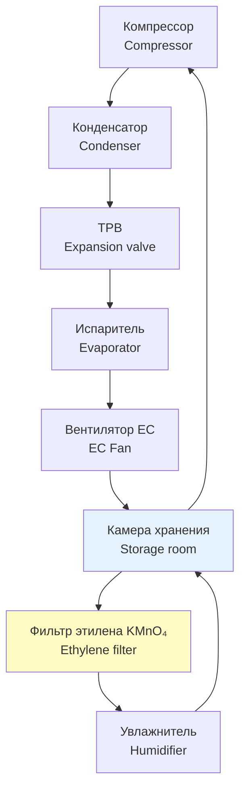

Крестоцветные овощи семейства Brassicaceae — брокколи, цветная капуста, брюссельская капуста и кочанная капуста — относятся к наиболее требовательным продуктам в холодильной логистике. Их интенсивность дыхания при температурах 0–5 °C составляет 60–120 мг CO₂/(кг·ч), что в 10–20 раз выше, чем у картофеля. Эта особенность определяет высокие требования к холодопроизводительности испарителя, контролю газового состава и точности поддержания температуры.

Нормативная база раздела: ASHRAE Handbook — Refrigeration (2022), EN 378, ISO 5149, ГОСТ Р 51618, СП 60.13330.

## Физические и биохимические процессы при хранении

### Дыхание и теплообмен

Скорость дыхания крестоцветных подчиняется модели с температурным коэффициентом $Q_{10}$:

$$R(T) = R_0 \cdot Q_{10}^{\,(T - T_0)/10}$$

где $R(T)$ — интенсивность дыхания, мг CO₂/(кг·ч); $R_0$ — скорость при $T_0 = 0$ °C; $Q_{10} \approx 2{,}5$–$3{,}0$ для крестоцветных.

При повышении температуры с 0 до 5 °C скорость дыхания возрастает в 2,5–3 раза, тепловыделение — пропорционально. Это делает точность терморегулирования критически важной.

### Потеря влаги

Скорость транспирации (transpiration rate) через листовую поверхность:

$$\dot{m}_{H_2O} = k \cdot S \cdot \bigl(\varphi_{\text{пр}} - \varphi_{\text{возд}}\bigr) \cdot P_{\text{нас}}(T)$$

где $k$ — коэффициент проводимости кожицы листа, кг/(м²·с·Па); $S$ — площадь поверхности продукта, м²; $\varphi_{\text{пр}}$, $\varphi_{\text{возд}}$ — относительная влажность на поверхности продукта и в воздухе камеры; $P_{\text{нас}}(T)$ — давление насыщенного пара при температуре $T$, Па.

Снижение RH с 98 % до 90 % при 0 °C увеличивает скорость потери влаги брокколи в 4–5 раз.

### Пожелтение (yellowing) и деградация хлорофилла

Видимое пожелтение брокколи обусловлено ферментативным разрушением хлорофилла (chlorophyllase). Реакция ускоряется при температурах выше 2 °C и в присутствии этилена (C₂H₄). Пороговая концентрация этилена, вызывающая заметное пожелтение брокколи за 3–5 суток — **0,1 ppm**.

## Режимы хранения по видам


| Культура | Температура, °C | RH, % | Удаление этилена | Срок хранения, сут |
|---|---|---|---|---|
| Брокколи | 0 ± 0,5 | 95–100 | Обязательно | 10–14 |
| Цветная капуста | 0 ± 0,5 | 95–98 | Желательно | 21–28 |
| Брюссельская капуста | 0 ± 0,5 | 95–100 | Обязательно | 21–35 |
| Кочанная капуста | 0 ± 0,5 | 90–95 | Не требуется | 90–180 |


Допустимые флуктуации температуры — не более ±0,5 °C: циклические колебания провоцируют конденсацию и микробное поражение поверхности.

## Расчёт тепловых нагрузок

### Тепловыделение при дыхании

Метаболическое тепло, которое должна снять холодильная система:

$$Q_{\text{дых}} = m \cdot R(T) \cdot H_{\text{ок}}$$

где $m$ — масса продукта, кг; $R(T)$ — интенсивность дыхания, мг CO₂/(кг·ч); $H_{\text{ок}} \approx 10{,}7$ кДж/г CO₂ — тепловой эффект окисления углеводов.

**Пример.** Камера с 10 т брокколи при 0 °C, $R = 100$ мг CO₂/(кг·ч):

$$Q_{\text{дых}} = 10\,000 \times 0{,}100 \times 10{,}7 / 3\,600 \approx 2{,}97 \text{ кВт}$$

Это только дыхательная составляющая. С учётом остальных нагрузок суммарная холодопроизводительность будет существенно выше.

### Суммарная тепловая нагрузка

$$Q_{\text{итог}} = Q_{\text{инф}} + Q_{\text{огр}} + Q_{\text{пр}} + Q_{\text{дых}}$$

- $Q_{\text{инф}}$ — теплоприток при инфильтрации воздуха через двери: 10–15 % от $Q_{\text{огр}}$
- $Q_{\text{огр}}$ — теплопередача через ограждения: $Q_{\text{огр}} = U \cdot A \cdot \Delta T$
- $Q_{\text{пр}}$ — охлаждение свежепоступившей партии: $Q_{\text{пр}} = m \cdot c_p \cdot (T_{\text{вх}} - T_{\text{хр}})$, где $c_p \approx 3{,}8$ кДж/(кг·К) для брокколи
- $Q_{\text{дых}}$ — тепло дыхания (рассчитано выше)

**Численный пример для типовой камеры.** Объём 100 м³, изоляция 150 мм PUR ($\lambda = 0{,}025$ Вт/(м·К)), суммарная площадь ограждений $A = 250$ м², $\Delta T = 20$ К:

$$U = \frac{0{,}025}{0{,}15} \approx 0{,}167 \text{ Вт/(м²·К)}$$

$$Q_{\text{огр}} = 0{,}167 \times 250 \times 20 \approx 835 \text{ Вт}$$

При загрузке 10 т брокколи $Q_{\text{дых}} \approx 2\,970$ Вт. Охлаждение партии (500 кг, $T_{\text{вх}} = 15$ °C, $T_{\text{хр}} = 0$ °C, за 4 ч):

$$Q_{\text{пр}} = \frac{500 \times 3{,}8 \times (15 - 0)}{4 \times 3\,600} \approx 1\,979 \text{ Вт}$$

$$Q_{\text{итог}} \approx 835 + 2\,970 + 1\,979 + 125 \approx 5{,}9 \text{ кВт}$$

Компрессорный агрегат подбирается с запасом 20 %: не менее **7,1 кВт**.

## Схема системы хранения с управляемой атмосферой





## Контроль этилена

Брокколи и брюссельская капуста выделяют этилен со скоростью 0,5–1,5 мкл/(кг·ч). При отсутствии удаления этилена его концентрация в закрытой камере достигает 0,5–2 ppm за 12–24 ч, что вызывает необратимое пожелтение за 3–5 суток.

**Адсорбционные фильтры KMnO₄** (перманганат калия): ёмкость 10 мг C₂H₄ на 1 г адсорбента. Для камеры 10 т брокколи с интенсивностью выделения 1 мкл/(кг·ч):

$$\dot{m}_{\text{этилен}} = 10\,000 \times 1 = 10\,000 \text{ мкл/ч} = 10 \text{ мл/ч}$$

При концентрации этилена 1 г/л фильтр ёмкостью 500 г обеспечит работу около 50 ч. **Еженедельная замена** фильтрующего модуля обязательна.

Альтернатива — **каталитические окислители** (catalytic oxidizers): разлагают C₂H₄ до CO₂ и H₂O при температуре 50–200 °C, не требуют замены картриджей, но потребляют электроэнергию 50–200 Вт.

## Параметры вентиляции и воздухораспределения

- Кратность воздухообмена: 4–6 ч⁻¹ для удаления CO₂ и обеспечения однородности температуры
- Скорость воздуха у поверхности продукта: 0,15–0,25 м/с (выше 0,30 м/с — ускоренная потеря влаги)
- Воздухопроводы: нержавеющая сталь или оцинкованный металл, шероховатость внутренней поверхности ≤ 1,6 мкм
- Фильтрация:
  - предфильтр G4 (MERV 8, ISO 16890): задержание частиц > 10 мкм
  - тонкий фильтр H13 (HEPA): задержание спор плесени и PM2,5

## Специфика хранения по видам

### Брокколи

Брокколи — наиболее критичная культура среди крестоцветных. Её необходимо охладить до 0 °C в течение 2–4 ч после уборки (предварительное охлаждение, pre-cooling). Задержка охлаждения на 6 ч при +20 °C сокращает срок хранения вдвое. Применяется гидроохлаждение (hydrocooling) холодной водой (1–2 °C) или вакуумное охлаждение (vacuum cooling).

### Кочанная капуста

Допускает более широкий температурный диапазон (−1…+1 °C) и менее требовательна к этилену. При температуре 0 °C и RH 90–95 % хранится до 6 месяцев. Применяется в крупных центральных овощных базах (500–5 000 т).

### Контейнерное хранение с управляемой атмосферой (CA)

Для брокколи и брюссельской капусты: O₂ 2–3 %, CO₂ 5–8 %, остальное — N₂. Такой состав замедляет дыхание в 3–5 раз и продлевает срок хранения до 60 суток.

## Увлажнение воздуха

При снижении RH ниже 92 % включается ультразвуковой или паровой увлажнитель производительностью 10–20 кг/ч на 100 м³ объёма камеры. Датчики ёмкостного типа (точность ±2 % RH) устанавливаются:
- в центре камеры на высоте 1,5 м
- вблизи испарителя (для контроля намораживания)
- у двери (для контроля инфильтрации)

## Практические рекомендации


| Параметр | Норма | Примечание |
|---|---|---|
| Температура в центре продукта | −0,5…+0,5 °C | Допустимо кратковременно до ±1 °C |
| Гистерезис регулирования | ±0,3 °C | Предотвращение конденсации |
| Кратность воздухообмена | 4–6 ч⁻¹ | Мин. 4, макс. 8 для открытых витрин |
| Скорость воздуха в камере | 0,15–0,25 м/с | Выше 0,3 м/с — усиленная потеря влаги |
| RH в камере | 95–100 % | Ниже 92 % → пожелтение за 5–7 сут |
| Концентрация этилена | < 0,05 ppm | Контроль обязателен для брокколи |
| Предварительное охлаждение | 2–4 ч | До размещения в основной камере |
| Интервал инспекции продукта | 3–5 сут | Удаление повреждённых экземпляров |


**Типовые ошибки проектирования:**
- Недостаточная площадь испарителя → перегрев воздуха в камере, потеря урожая
- Отсутствие осушителя этилена → брокколи теряет товарный вид за 3 суток
- Неравномерное воздухораспределение → локальное подмораживание или «мёртвые зоны»
- Несоответствие толщины изоляции климатической зоне → избыточные теплопотери

## Нормативная база

- **ASHRAE Handbook — Refrigeration** (2022), Chapters 24, 25 — хранение и охлаждение овощей
- **ASHRAE 15** — Safety Standard for Refrigeration Systems
- **ISO 5149** — Refrigerating systems and heat pumps — Safety and environmental requirements
- **EN 378** — Refrigerating systems and heat pumps — Safety and environmental requirements
- **IIAR 2** — Equipment, Design, and Installation of Closed-Circuit Ammonia Mechanical Refrigeration Systems
- **ГОСТ Р 51618** — Свежие овощи, показатели качества и безопасности
- **СП 60.13330.2020** — Отопление, вентиляция и кондиционирование воздуха
- **ГОСТ 28547** — Установки холодильные. Требования безопасности
