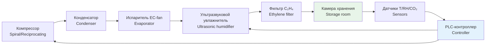

Листовые овощи — салат (lettuce), шпинат (spinach), кале (kale), мангольд (Swiss chard) — относятся к наиболее скоропортящейся категории растительного сырья. Содержание влаги в тканях достигает 90–95 % от массы; интенсивность дыхания при 0 °C составляет 10–20 мл CO₂/(кг·ч), что многократно превышает показатели корнеплодов. Снижение относительной влажности воздуха на каждые 5 % ниже порога 95 % приводит к необратимому увяданию за 2–3 суток.

Правильно спроектированная система HVAC (heating, ventilation and air conditioning) позволяет продлить товарный срок хранения в 1,5–2 раза и снизить отходы до 3–5 % за период хранения.

Нормативная база: ASHRAE Handbook — Refrigeration (2022), ASHRAE 15/34, EN 378, ISO 5149, ISO 23977, СП 60.13330, ГОСТ Р 51121.

## Физические принципы хранения

### Кинетика дыхания

Скорость дыхания листовых культур описывается уравнением Аррениуса (Arrhenius) в биологической форме:

$$R(T) = R_0 \cdot \exp\!\left[\frac{E_a}{R_g}\left(\frac{1}{T_{\text{реф}}} - \frac{1}{T}\right)\right]$$

где $R(T)$ — скорость дыхания, мл CO₂/(кг·ч); $R_0$ — скорость при $T_{\text{реф}}$; $E_a \approx 50$–65 кДж/моль — энергия активации для листовых культур; $R_g = 8{,}314$ Дж/(моль·К) — универсальная газовая постоянная; $T_{\text{реф}}$, $T$ — абсолютные температуры, К.

В упрощённой форме с коэффициентом $Q_{10} \approx 2{,}0$–$2{,}3$: повышение температуры на 1 °C ускоряет дыхание примерно в 1,08–1,10 раза.

### Потеря влаги

Массовый поток испарения влаги с листовой поверхности подчиняется закону Фика (Fick):

$$\dot{m}_{H_2O} = D_w \cdot A \cdot \frac{\Delta p_w}{L}$$

где $D_w \approx 2{,}4 \times 10^{-5}$ м²/с при 0 °C — коэффициент диффузии водяного пара; $A$ — площадь листовой поверхности, м²; $\Delta p_w$ — разность парциального давления пара на поверхности листа и в воздухе камеры, Па; $L$ — толщина вязкого подслоя, м.

Практически: снижение RH с 98 % до 93 % при 0 °C (ΔRH = 5 %) увеличивает движущую силу $\Delta p_w$ примерно на 30 Па, что ощутимо усиливает обезвоживание.

## Температурный режим хранения


| Культура | Оптим. темп., °C | Диапазон, °C | Q₁₀ | Срок хранения | Риск при +10 °C |
|---|---|---|---|---|---|
| Салат | 0 | 0…+1 | 2,1 | 21 сут | 2–3 сут |
| Шпинат | 0 | −1…0 | 2,3 | 10–14 сут | 1 сут |
| Кале | 0 | 0…+1 | 2,0 | 21 сут | 1–2 сут |
| Капуста кочанная | 0 | −1…+1 | 2,0 | 5–6 мес. | 3–5 сут |


При температуре ниже −1 °C возникают физиологические повреждения ткани (ice crystal injury): внутриклеточный сок замерзает, повреждая мембраны. После оттаивания такой продукт утрачивает структуру.

## Влажностный режим и увлажнение

Требуемый диапазон RH: **95–100 %**. На практике целевой диапазон — 96–99 % для предотвращения конденсата на оборудовании и ускоренного развития плесени.

**Методы увлажнения:**
1. Ультразвуковые увлажнители (ultrasonic humidifiers): производительность 10–30 г/ч на 1 м³ объёма камеры; низкое энергопотребление; требуют деминерализованной воды.
2. Паровые увлажнители (steam humidifiers): высокая надёжность; нет риска бактериального загрязнения; более высокое энергопотребление.
3. Гигротермические экраны: пассивная конденсация влаги на охлаждённых поверхностях испарителя с последующим испарением — применяется только в малых камерах.

При RH < 92 % начинается видимое увядание за 5–7 суток. При RH = 100 % и недостаточном движении воздуха — конденсация капельной влаги на листьях, что стимулирует развитие серой гнили (Botrytis cinerea).

## Скорость воздуха и циркуляция

Скорость движения воздуха у поверхности продукта — критический параметр для листовых культур, так как они механически чувствительны:

- Салат: 2–3 м/с (не более 3 м/с)
- Шпинат: 3–5 м/с при упаковке в кассеты; без упаковки — не более 2 м/с
- Кале: 2–3 м/с
- Капуста кочанная: 2–4 м/с (внешние листья механически устойчивее)

Воздухораспределение — через потолочные диффузоры (ceiling diffusers) или боковые щелевые сопла с отводом через решётки у пола. Система ламинарного потока обеспечивает равномерность: допуск ±0,5 °C по температуре и ±2 % по RH в объёме камеры.

## Контроль этилена и CO₂

Листовые культуры одновременно выделяют этилен и чувствительны к нему. Критическая концентрация C₂H₄ для салата — свыше 1 ppm: вызывает появление коричневых пятен (russet spotting) за 2–3 суток. Целевой уровень: **менее 0,1 ppm**.

**Методы контроля этилена:**
- Адсорбционные фильтры на основе KMnO₄ или активированного угля: ёмкость 5–15 мг C₂H₄/г адсорбента; замена еженедельно
- Периодический полный воздухообмен: 6–12 ч⁻¹ (fresh air exchange)
- УФ-озонирование: установленная мощность 5–10 Вт на 100 м³; озон разрушает C₂H₄ при концентрации O₃ 0,1–0,3 ppm

Концентрация CO₂ в камере не должна превышать 5 % (50 000 ppm): выше — анаэробный метаболизм и накопление нежелательных метаболитов.

## Расчёт холодопроизводительности

Полная холодопроизводительность камеры:

$$Q_{\text{итог}} = Q_{\text{дых}} + Q_{\text{явн}} + Q_{\text{скр}} + Q_{\text{огр}} + Q_{\text{нач.охл}}$$

где:
- $Q_{\text{дых}}$ — тепло дыхания продукта
- $Q_{\text{явн}}$ — явная теплота охлаждения воздуха (sensible cooling)
- $Q_{\text{скр}}$ — скрытая теплота конденсации влаги на испарителе (latent heat)
- $Q_{\text{огр}}$ — теплоприток через ограждения и двери
- $Q_{\text{нач.охл}}$ — охлаждение новой партии до 0 °C

### Тепло дыхания

$$Q_{\text{дых}} = m_{\text{пр}} \cdot r(T) \cdot 20{,}1 \text{ кДж/(л CO}_2)$$

где $r(T)$ — скорость дыхания, мл CO₂/(кг·ч); 20,1 кДж — тепловой эффект окисления 1 л CO₂.

**Пример.** Камера объёмом 50 м³, загрузка 10 000 кг салата при 0 °C, $r(0) = 12$ мл CO₂/(кг·ч):

$$Q_{\text{дых}} = 10\,000 \times 12 \times 10^{-3} \times 20{,}1 / 3{,}6 = \frac{10\,000 \times 0{,}012 \times 20{,}1}{3{,}6} \approx 670 \text{ Вт}$$

С коэффициентом запаса 1,30 требуется мощность испарителя не менее **870 Вт** только для компенсации дыхания.

### Охлаждение новой партии

$$Q_{\text{нач.охл}} = \frac{m \cdot c_p \cdot (T_{\text{вх}} - T_{\text{хр}})}{\tau_{\text{охл}} \cdot 3\,600}$$

где $c_p \approx 3{,}9$ кДж/(кг·К) для салата; $\tau_{\text{охл}}$ — время охлаждения, ч.

При поступлении 500 кг салата с $T_{\text{вх}} = 15$ °C, $T_{\text{хр}} = 0$ °C за 4 ч:

$$Q_{\text{нач.охл}} = \frac{500 \times 3{,}9 \times 15}{4 \times 3\,600} \approx 2\,031 \text{ Вт} \approx 2{,}0 \text{ кВт}$$

## Схема холодильной системы





## Компоненты системы HVAC

### Компрессорный агрегат

Для камер объёмом 50–200 м³ применяются спиральные (scroll) или поршневые (reciprocating) компрессоры с хладагентом R-290 (пропан, GWP = 3) или R-513A (GWP = 573) в новых установках. Хладагент R-404A (GWP = 3 922) поэтапно выводится согласно Регламенту ЕС 517/2014 и ограничивается в новых системах.

### Испаритель (воздухоохладитель)

Воздухоохладитель (air cooler) типа plate-fin или tube-fin с вентилятором EC (electronically commutated):
- Разность температур (temperature difference, TD) между воздухом и хладагентом: 3–5 К (высокое значение TD ведёт к намораживанию и снижению RH)
- Шаг рёбер (fin pitch): 6–10 мм для применений с высокой влажностью
- Оттайка: горячим газом (hot gas defrost) 1–2 раза в сутки

### Вентиляторы

Вентиляторы с EC-приводом (переменная производительность 20–100 %). Кратность воздухообмена: 6–12 ч⁻¹. Скорость воздуха в воздуховодах: 3–5 м/с (ограничение уровня шума).

### Контроль параметров

Датчики (по EN 13486):
- Температура: PT100 или PT1000, точность ±0,3 °C
- RH: ёмкостной датчик, точность ±2 % RH
- CO₂ (NDIR-анализатор): точность ±50 ppm
- C₂H₄ (электрохимический датчик): диапазон 0–10 ppm, точность ±0,05 ppm

Данные записываются с интервалом 10–15 мин для целей HACCP (Hazard Analysis and Critical Control Points) и трассируемости по ISO 22005.

## Освещение и давление в камере

- Освещённость в камере: не более 50 лк (избыток ускоряет выработку этилена); предпочтительны светодиоды (LED) спектра 400–500 нм в режиме дежурного света 5–10 лк
- Давление: атмосферное ± 50 Па (герметизация дверных проёмов уплотнителями и воздушными завесами предотвращает инфильтрацию)

## Предварительное охлаждение (pre-cooling)

Свежесобранная продукция должна быть охлаждена до 0–2 °C в течение **2–4 ч** после уборки. Применяемые методы:
- **Вакуумное охлаждение (vacuum cooling)**: наиболее быстрый метод для салата; снижение температуры с 20 °C до 2 °C за 20–30 мин; потеря влаги 1–2 %
- **Гидроохлаждение (hydrocooling)**: орошение холодной водой (1–2 °C); применяется для шпината и кале
- **Воздушное принудительное охлаждение (forced-air cooling)**: универсальный метод; время охлаждения 1–4 ч в зависимости от упаковки

## Упаковка и модифицированная атмосфера

Микроперфорированные полиэтиленовые рукава (отверстия 0,5–1 мм) снижают потерю влаги на 30–40 % без риска накопления CO₂. Для премиальных марок применяют активные MAP (modified atmosphere packaging) с газовой смесью 5 % CO₂ + 5 % O₂ + N₂.

## Практические рекомендации

1. **Флуктуации температуры**: ΔT не более ±0,5 °C в сутки; резкие перепады — главная причина конденсата и плесени.
2. **Фильтры этилена**: еженедельная замена картриджей KMnO₄; проверка концентрации C₂H₄ датчиком.
3. **Испаритель**: ежемесячная проверка и чистка поверхности от ледяной корки (намораживание > 3 мм — удвоение теплового сопротивления).
4. **Вентиляторы**: квартальная проверка подшипников и балансировки.
5. **Журнал параметров**: автоматическая запись T, RH, CO₂ с форматированием по HACCP.


| Параметр | Норма | Комментарий |
|---|---|---|
| ΔT max за сутки | ±0,5 °C | Контроль инфильтрации |
| ΔRH max за час | ±3 % | Датчик у продукта |
| Этилен C₂H₄ | < 0,1 ppm | Ежедневный контроль |
| CO₂ | 0,5–2,0 % | Норм. воздух 0,04 % |
| Скорость воздуха | 2–3 м/с | Для открытых листьев |


## Нормативная база

- **ASHRAE Handbook — Refrigeration** (2022), Chapter 24 «Commodity Storage Requirements»
- **ASHRAE 15** — Safety Standard for Refrigeration Systems
- **ASHRAE 34** — Designation and Safety Classification of Refrigerants
- **ISO 5149** — Refrigerating systems and heat pumps — Safety and environmental requirements
- **ISO 23977:2020** — Холодильное оборудование для хранения растительной продукции
- **EN 378** — Refrigerating systems and heat pumps — Safety and environmental requirements
- **ГОСТ Р 51121** — Холодильные камеры; общие технические требования и методы испытаний
- **СП 60.13330.2020** — Отопление, вентиляция и кондиционирование воздуха
- **ГОСТ 28547** — Установки холодильные. Требования безопасности
