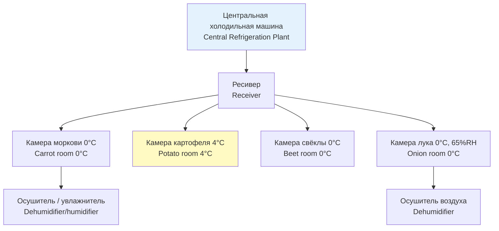

Корнеплоды и луковичные культуры — морковь, картофель, свёкла, лук репчатый, чеснок — образуют наиболее объёмный сегмент овощного хранения. Их биологические особенности: относительно низкая интенсивность дыхания, чувствительность к температурному режиму, склонность к прорастанию и потерям влаги. При правильно спроектированной холодильной системе эти культуры хранятся 4–10 месяцев с потерями не более 3–5 % массы.

Главная задача хранения — замедление метаболических процессов без нанесения физиологических повреждений. Картофель выделяется в отдельный режим: в отличие от остальных корнеплодов он требует повышенной температуры (3–5 °C) для предотвращения накопления редуцирующих сахаров.

Нормативная база: ASHRAE Handbook — Refrigeration (2022), ГОСТ 28081, ГОСТ Р 51618, СП 60.13330, ISO 2628, EN 378, ISO 5149.

## Физические принципы и биологические основы

### Интенсивность дыхания

Скорость дыхания корнеплодов снижается примерно вдвое при каждом снижении температуры на 10 °C:

$$R_T = R_{\text{реф}} \cdot Q_{10}^{\,(T - T_{\text{реф}})/10}$$

где $R_T$ — скорость дыхания при температуре $T$, мл CO₂/(кг·ч); $Q_{10} \approx 2{,}0$–$3{,}0$; $T_{\text{реф}}$ — референтная температура (обычно 20 °C).

Практические значения при 0–5 °C:
- Морковь: 3–5 мл CO₂/(кг·ч) при 0 °C
- Картофель: 4–7 мл CO₂/(кг·ч) при 5 °C
- Свёкла: 3–6 мл CO₂/(кг·ч) при 0 °C

Метаболическое тепловыделение для корнеплодов при рабочей температуре: **50–100 Вт/т**.

### Прорастание (sprouting)

Корнеплоды имеют период покоя апикального меристема (dormancy period). По его истечении при температурах выше критического порога начинается прорастание:
- Картофель: критическая температура ≈ 4–5 °C
- Морковь: ≈ 2–3 °C
- Свёкла: ≈ 2 °C

Для подавления прорастания без применения химических ингибиторов поддерживают температуру ниже критического порога. У картофеля применяют также регуляторы роста (chlorpropham), допускаемые нормами Минсельхоза РФ и Регламентом ЕС 396/2005.

### Транспирация (потеря влаги)

Скорость испарения влаги с поверхности корнеплодов:

$$\dot{m}_{\text{исп}} = k \cdot A \cdot (\varphi_{\text{нас}} - \varphi_{\text{возд}})$$

где $k$ — коэффициент транспирации, зависящий от состояния кожицы; $A$ — суммарная площадь поверхности, м²; $\varphi_{\text{нас}}$ и $\varphi_{\text{возд}}$ — парциальное давление насыщения на поверхности и в воздухе камеры, Па.

Для минимизации потерь поддерживают RH 90–98 %. Потеря массы моркови при RH = 85 % за 3 месяца — 15–20 %; при RH = 98 % — 2–4 %.

## Параметры хранения по видам


| Культура | Темп., °C | RH, % | Период покоя, сут | Макс. срок, мес. |
|---|---|---|---|---|
| Морковь | 0 ± 0,5 | 98–100 | 30–40 | 7–9 |
| Картофель | 3–5 | 90–95 | 60–90 | 5–10 |
| Свёкла столовая | 0 ± 0,5 | 98–100 | 20–30 | 4–6 |
| Лук репчатый | 0 ± 0,5 | 65–70 | 60–90 | 4–8 |
| Чеснок | 0 ± 0,5 | 60–70 | 90–120 | 6–8 |


### Морковь

Хранение при 0 °C в условиях максимальной влажности (98–100 %). Упаковка в полиэтиленовые мешки с микроперфорацией поддерживает RH у поверхности продукта при концентрации CO₂ не более 5 %. Скорость дыхания при 0 °C: 3–5 мл CO₂/(кг·ч). Срок хранения — 7–9 месяцев.

### Картофель

Картофель требует особого внимания. После уборки необходим **период лечения (wound healing)**: 18–20 °C, RH 85–90 %, 1–2 нед. — для формирования суберина на повреждённых участках кожицы. Затем температуру постепенно снижают до 3–5 °C.

Критически важно не допускать охлаждения ниже +2 °C: при этом крахмал гидролизируется до редуцирующих сахаров (глюкоза + фруктоза), что при тепловой обработке вызывает потемнение (реакция Майяра) и накопление акриламида. Напротив, хранение при 5–8 °C с «рекондиционированием» (повышение температуры до 15–18 °C за 2–3 нед. перед реализацией) восстанавливает баланс сахаров.

Относительная влажность 90–95 % предотвращает усыхание клубней. Активная вентиляция (вывод CO₂ и этилена) — обязательна.

### Свёкла

Режим близок к морковному: 0 °C, 98–100 % RH. Перед закладкой требуется подсушивание 2–3 суток при 15–20 °C для испарения поверхностной влаги. Срок хранения — 4–6 месяцев.

### Лук репчатый и чеснок

Требуют пониженной влажности (65–70 % для лука, 60–70 % для чеснока) для предотвращения ботритиса и фузариоза. Перед закладкой — обязательная сушка (curing) 3–4 нед. при 20–25 °C до влажности чешуй 12–14 %. Хранение при 0 °C; активная вентиляция 0,5–1,0 объёма в минуту.

## Расчёт холодопроизводительности

### Охлаждение поступившей партии (sensible cooling)

$$Q_{\text{явн}} = m \cdot c_p \cdot (T_{\text{вх}} - T_{\text{хр}})$$

где $m$ — масса партии, кг; $c_p$ — удельная теплоёмкость, кДж/(кг·К); $(T_{\text{вх}} - T_{\text{хр}})$ — разность температур прихода и хранения.

**Пример.** Партия моркови 1 000 кг при $T_{\text{вх}} = 20$ °C, $T_{\text{хр}} = 0$ °C, $c_p = 3{,}9$ кДж/(кг·К), время охлаждения 6 ч:

$$Q_{\text{явн}} = \frac{1\,000 \times 3{,}9 \times (20 - 0)}{6 \times 3\,600} \approx 3\,611 \text{ Вт} \approx 3{,}6 \text{ кВт}$$

### Тепло дыхания

$$Q_{\text{дых}} = m \cdot R_T \cdot \Delta H_c$$

где $\Delta H_c \approx 20$ кДж/г CO₂ — теплота окисления углеводов.

**Пример.** 500 т моркови при $R_0 = 4$ мл CO₂/(кг·ч) при 0 °C:

$$Q_{\text{дых}} = 500\,000 \times 4 \times 10^{-3} \times 20 / 3{,}6 \approx 11\,111 \text{ Вт} \approx 11{,}1 \text{ кВт}$$

Для хозяйственных хранилищ — 50–100 Вт/т продукта при рабочей температуре.

### Суммарная нагрузка

Суммарная тепловая нагрузка многокамерного хранилища:

$$Q_{\text{итог}} = Q_{\text{явн}} + Q_{\text{дых}} + Q_{\text{огр}} + Q_{\text{инф}}$$

Теплопередача через ограждения: $Q_{\text{огр}} = U \cdot A \cdot \Delta T$.

При $U = 0{,}17$ Вт/(м²·К) (PUR 150 мм), $A = 600$ м², $\Delta T = 20$ К: $Q_{\text{огр}} \approx 2{,}0$ кВт.

## Схема многокамерного хранилища





## Вентиляция и распределение воздуха

Основные требования к системе вентиляции:
- Скорость воздуха у поверхности продукта: 0,3–0,5 м/с (обеспечивает однородность температуры и выводит CO₂)
- Фаза предварительного охлаждения (pre-cooling): 20–40 объёмов помещения в час; интенсивная вентиляция снижает температуру в центре насыпи
- Режим поддержания температуры: 3–5 объёмов в час

Равномерное распределение холодного воздуха достигается напольными воздуховодами с перфорацией или потолочными коробами с направленными соплами.

## Увлажнение воздуха

Для поддержания высокой влажности (98–100 %) у моркови и свёклы применяются:
- Капельные форсунки производительностью 10–50 л/ч на 100–500 м³ объёма
- Системы испарительного охлаждения (evaporative cooling) через орошаемые насадки

Масса воды для подъёма влажности на 1 % в объёме $V$ м³:

$$\Delta m_w = \rho_a \cdot V \cdot \Delta\varphi \cdot \frac{M_{H_2O}}{M_{\text{возд}}} \cdot \frac{\varphi_{\text{нас}}(T)}{1 - \varphi_{\text{нас}}(T)}$$

где $\rho_a \approx 1{,}29$ кг/м³ при 0 °C; $M_{H_2O} / M_{\text{возд}} = 0{,}622$.

## Контролируемая атмосфера (CA storage)

В промышленных хранилищах с продолжительностью хранения более 6 месяцев применяют управляемую атмосферу (controlled atmosphere, CA):
- O₂: 2–5 % — снижение дыхания в 5–10 раз
- CO₂: 5–10 % — подавление прорастания
- N₂: остаток

Для корнеплодов CA применяется реже, чем для плодов, но экономически оправдано при объёмах хранения свыше 500 т. Система CA включает генератор N₂ (мембранный или адсорбционный), CO₂-скруббер и непрерывный газоанализатор.

## Мониторинг параметров

Датчики устанавливаются в трёх уровнях по высоте насыпи (верх, середина, низ). Частота регистрации: не реже 4 раз в сутки (по ГОСТ Р 8.654 и требованиям HACCP).

Предельные отклонения:
- Температура: ±0,5 °C от целевого значения
- RH: ±2 % от целевого значения

## Типовые ошибки при проектировании

1. **Недостаточная влажность для моркови и свёклы** → потери массы 15–20 % за 3 месяца
2. **Переохлаждение картофеля ниже +2 °C** → накопление редуцирующих сахаров, потемнение при жарке
3. **Высокая влажность при хранении лука** → развитие ботритиса (Botrytis allii), серой гнили
4. **Неравномерное воздухораспределение** → локальные очаги конденсации и плесени в «мёртвых зонах»
5. **Отсутствие периода лечения** для картофеля → инфекции через повреждения кожицы

## Нормативная база

- **ASHRAE Handbook — Refrigeration** (2022), Chapter 24 «Commodity Storage Requirements»
- **ASHRAE 15** — Safety Standard for Refrigeration Systems
- **ISO 5149** — Refrigerating systems and heat pumps — Safety and environmental requirements
- **EN 378** — Refrigerating systems and heat pumps — Safety and environmental requirements
- **ISO 2628:2017** — Плоды и овощи. Хранение в контролируемой атмосфере
- **ГОСТ 28081** — Картофель свежий. Требования при хранении и транспортировке
- **ГОСТ Р 51618** — Овощи свежие. Упаковка и маркировка
- **СП 60.13330.2020** — Отопление, вентиляция и кондиционирование воздуха
- **ГОСТ 28547** — Установки холодильные. Требования безопасности
