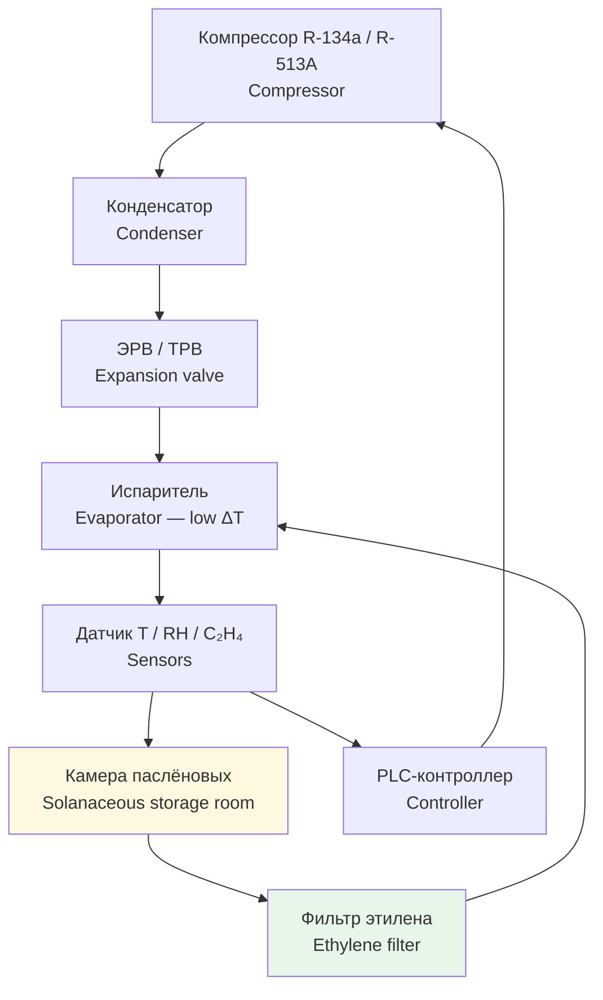

Паслёновые (Solanaceae) — томаты, сладкие перцы и баклажаны — представляют особую сложность для холодильной логистики. В отличие от большинства овощей, эти культуры характеризуются высокой чувствительностью к **холодовому повреждению (chilling injury)**: хранение ниже критической температуры приводит к необратимому нарушению клеточных мембран, потемнению кожицы и размягчению мякоти. Кроме того, томаты — климатерические плоды с интенсивным выделением этилена при дозревании.

Правильное проектирование системы HVAC (heating, ventilation and air conditioning) для хранения паслёновых требует учёта: критической температуры вида, стадии зрелости партии, контроля этилена, влажностного баланса и физиологии дозревания.

Нормативная база: ASHRAE Handbook — Refrigeration (2022), EN 378, ISO 5149, ГОСТ Р 54698, СП 60.13330, ГОСТ 28547.

## Физиология хранения паслёновых

### Холодовое повреждение (chilling injury)

Холодовое повреждение — необратимое нарушение физиологических процессов при длительном воздействии температур ниже критического порога:


| Культура | Критическая температура, °C | Признаки повреждения |
|---|---|---|
| Томаты | < 7 (спелые), < 10 (зелёные) | Пятна, размягчение, потеря вкуса |
| Перцы сладкие | < 7 | Вдавленные пятна, ускоренное гниение |
| Баклажаны | < 10 | Коричневые пятна, потемнение мякоти |


Механизм: переход мембранных липидов из жидкокристаллического в гелеобразное состояние нарушает работу ионных насосов → потеря гомеостаза Ca²⁺ → активация деструктивных ферментов (липоксигеназа, фосфолипаза).

Для снижения риска применяют **условное (постепенное) охлаждение (conditioning cooling)**: выдерживание при 15–18 °C в течение 1–3 суток перед переводом в основной режим хранения. Скорость снижения температуры — не более 1–2 °C в сутки.

### Климатерическое дыхание томатов

Томаты относятся к климатерическим (climacteric) плодам: в процессе дозревания интенсивность дыхания резко возрастает (климактерический пик). Скорость дыхания описывается экспоненциальной зависимостью от температуры:

$$R(T) = R_0 \cdot e^{b \cdot T}$$

где $R$ — скорость дыхания, мл CO₂/(кг·ч); $R_0 \approx 0{,}8$–$1{,}2$ мл CO₂/(кг·ч) при 0 °C; $b \approx 0{,}08$–$0{,}12$ К⁻¹; $T$ — температура, °C.

Снижение температуры с 20 °C до 12 °C уменьшает $R$ примерно в 2–3 раза, замедляя созревание. Перцы и баклажаны активно дышат без выраженного климактерического максимума.

### Выделение этилена

Зрелые томаты выделяют C₂H₄ в количестве 10–50 мкл/(кг·ч). Накопление этилена в камере ускоряет дозревание и размягчение соседних плодов, что приводит к потере текстуры уже через 5–7 суток при концентрации > 5 мкл/л.

Контроль этилена:
- Адсорбционные фильтры (активированный уголь, цеолиты): ёмкость 5–10 мг C₂H₄/г адсорбента
- Каталитические окислители: C₂H₄ + 3O₂ → 2CO₂ + 2H₂O при 50–200 °C
- Раздельное хранение зрелых и незрелых партий в разных камерах

## Режимы хранения по видам


| Вид овоща | Темп., °C | RH, % | Срок хранения | Примечания |
|---|---|---|---|---|
| Томаты зелёные | 20–21 | 90–95 | 3–4 нед. | Дозревание; контроль этилена |
| Томаты спелые | 12–15 | 90–95 | 1–2 нед. | Фильтр C₂H₄ обязателен |
| Перцы сладкие | 7–13 | 90–95 | 2–3 нед. | Не ниже +5 °C |
| Баклажаны | 10–12 | 90–95 | 1 нед. | Высокая чувствительность |


### Томаты

Режим хранения зависит от стадии зрелости при закладке. Зелёные томаты при 20–21 °C дозревают равномерно за 3–4 нед. Спелые томаты хранят при 12–15 °C; температура ниже 10 °C вызывает chilling injury.

Концентрация этилена для ускоренного дозревания (ripening rooms): 100–150 ppm C₂H₄ при 18–20 °C, RH 90–95 %, 24–72 ч — стандартная практика в распределительных центрах.

### Перцы

Нижний предел рабочей температуры — +7 °C. При длительном хранении при +5–6 °C происходит chilling injury: вдавленные пятна (pitting) на кожице. Оптимальный диапазон: 7–10 °C для продолжительного хранения, 10–13 °C — для краткосрочного транзита.

### Баклажаны

Наиболее чувствительная культура среди паслёновых. Хранятся не более 7–10 суток даже при оптимальной температуре 10–12 °C. Потемнение мякоти начинается при первых признаках chilling injury. Не допускать воздействия этилена от соседних партий.

## Расчёт тепловых нагрузок

### Тепловыделение дыхания

$$Q_{\text{дых}} = m \cdot R(T) \cdot q_{CO_2}$$

где $q_{CO_2} \approx 13$ кДж/л CO₂ — тепловой эквивалент окисления углеводов.

**Пример.** Партия спелых томатов 20 т при $T = 12$ °C, $R \approx 1{,}5$ мл CO₂/(кг·ч):

$$Q_{\text{дых}} = 20\,000 \times 1{,}5 \times 10^{-3} \times 13 / 3{,}6 \approx 108 \text{ Вт}$$

Для всей партии за сутки: $108 \times 24 = 2\,592$ Вт·ч/сут ≈ 2,6 кВт·ч/сут, то есть средняя непрерывная нагрузка **108 Вт** от дыхания 20 т.

При более высокой интенсивности дыхания (зелёные томаты при 20 °C, $R \approx 10$ мл CO₂/(кг·ч)):

$$Q_{\text{дых}} = 20\,000 \times 10 \times 10^{-3} \times 13 / 3{,}6 \approx 722 \text{ Вт}$$

### Транспирация (потеря влаги)

Удельный поток транспирации:

$$j = k_p \cdot (p_{\text{нас}} - p_{\text{парц}})$$

где $k_p \approx 0{,}01$–$0{,}05$ г/(м²·ч·Па) — коэффициент проницаемости кожицы; $p_{\text{нас}}$ и $p_{\text{парц}}$ — давление насыщения на поверхности плода и парциальное давление пара в камере, Па.

При $\Delta\varphi = 10$ % (разница между насыщением и текущей RH) потеря массы томатов составляет 0,5–2 г/(кг·сут). Для поддержания RH 90–95 % воздух в камере осушается испарителем (охлаждение ниже точки росы) с последующим частичным подогревом.

### Суммарная холодопроизводительность

$$Q_{\text{итог}} = Q_{\text{огр}} + Q_{\text{дых}} + Q_{\text{тов}} + Q_{\text{вент}}$$

- $Q_{\text{огр}} = U \cdot A \cdot \Delta T_{\text{ср}}$ — теплопередача через ограждения
- $Q_{\text{тов}} = m \cdot q_{\text{уд}}$ — тепловыделение товара ($q_{\text{уд}} \approx 50$–100 Вт/т в зависимости от температуры)
- $Q_{\text{вент}} = \dot{V} \cdot \rho \cdot c_p \cdot \Delta T$ — тепло притока вентиляционного воздуха

**Пример.** Типовая камера 100 м³, загрузка 30 т спелых томатов при 12 °C. Суммарная площадь ограждений $A = 250$ м², $U = 0{,}17$ Вт/(м²·К), $\Delta T = 10$ К (снаружи +22 °C):

$$Q_{\text{огр}} = 0{,}17 \times 250 \times 10 = 425 \text{ Вт}$$

$$Q_{\text{тов}} = 30\,000 \times 0{,}004 = 120 \text{ Вт}$$

$$Q_{\text{итог}} \approx 425 + 120 + 100 = 645 \text{ Вт (установившийся режим)}$$

При охлаждении новой партии 5 т ($T_{\text{вх}} = 25$ °C, $c_p = 3{,}9$ кДж/(кг·К), за 6 ч) добавляется:

$$Q_{\text{пр}} = \frac{5\,000 \times 3{,}9 \times (25 - 12)}{6 \times 3\,600} \approx 1\,174 \text{ Вт}$$

Итоговая нагрузка при загрузке: около **1,8 кВт**; агрегат подбирается с запасом 20–25 %: не менее **2,2 кВт**.

## Схема холодильной системы





## Компоненты системы HVAC

### Холодильный агрегат

Для камер хранения спелых томатов и перцев (12–15 °C) применяются компрессорные агрегаты с хладагентом R-134a (GWP = 1 430) или R-513A (GWP = 573, замена R-134a). Для зон дозревания (20–21 °C) достаточно прецизионных кондиционеров прямого расширения (DX systems).

Требования к терморегулированию:
- Точность регулирования: ±1 °C (PT100 с гистерезисом 0,5 °C)
- Датчики: не менее 3–4 штук в камере для контроля градиентов

### Испаритель

Воздухоохладитель с большой площадью поверхности (низкое TD = 3–5 К): снижает локальные перепады температуры и уменьшает намораживание при высокой RH. Оттайка — горячим газом или электрическим нагревателем 1 раз в сутки.

### Осушение воздуха

Точка росы воздуха в камере должна быть на 2–3 °C ниже температуры воздуха для предотвращения конденсации на продукте. Адсорбционный осушитель (silica gel, zeolite) применяется при необходимости тонкой регулировки влажности.

### Вентиляция

- Кратность воздухообмена: 4–6 ч⁻¹
- Скорость воздуха у продукта: 0,2–0,5 м/с (избегать локального переохлаждения)
- Потолочные испарители с вентилятором низкой скорости + воздуховоды с диффузорами

## Транспортное хранение

В рефрижераторных контейнерах (controlled atmosphere, CA) при транспортировке паслёновых:
- O₂: 3–5 % — замедление дыхания в 3–5 раз
- CO₂: 5–10 % — подавление этилена
- Снижение скорости старения: 50–70 %
- Температура при транспортировке: 10–15 °C; непрерывный газоанализ

## Многозонные хранилища

Крупные хранилища (> 500 т) используют центральную установку с выделенными температурными зонами:
- **Зона дозревания (ripening rooms)**: 18–21 °C для зелёных томатов
- **Зона основного хранения**: 10–13 °C для спелых томатов и перцев
- **Зона длительного хранения**: 7–10 °C для перцев и баклажанов с постепенным охлаждением

## Практические рекомендации

**Ошибки и их предотвращение:**

1. **Быстрое охлаждение ниже критической температуры** → chilling injury, потемнение кожицы
   - Решение: фаза постепенного охлаждения 15–18 °C на 24–72 ч; скорость снижения ≤ 1–2 °C/сут

2. **Накопление этилена в камере** → неравномерное созревание, размягчение
   - Решение: адсорбционные фильтры или каталитические окислители; целевой уровень C₂H₄ < 5 мкл/л для спелых томатов

3. **Недостаточная циркуляция воздуха** → локальный конденсат, плесень
   - Решение: контроль скорости воздуха у продукта; ежемесячная чистка испарителя

4. **Неконтролируемая потеря влаги** → сморщивание, потеря текстуры
   - Решение: поддержание RH 92–95 %; поверка датчиков ежеквартально


| Параметр | Томаты зелёные | Томаты спелые | Перцы | Баклажаны |
|---|---|---|---|---|
| Температура, °C | 20 ± 1 | 12–15 | 7–10 | 10–12 |
| RH, % | 90–95 | 90–95 | 90–95 | 90–95 |
| Скорость охлаждения, °C/ч | 1–2 | — | 0,5–1 | 0,5–1 |
| C₂H₄, мкл/л | 10–20 (при дозревании) | < 5 (фильтр) | < 1–3 | < 1 |


**Контроль и мониторинг:**
- Ежедневный визуальный осмотр: пятна, размягчение, плесень
- Еженедельные замеры: T в 3–4 точках, RH, CO₂/O₂ при CA-хранении
- Ежемесячно: калибровка датчиков, чистка испарителя, проверка герметичности
- При закладке: фитосанитарный контроль, оценка степени зрелости

## Нормативная база

- **ASHRAE Handbook — Refrigeration** (2022), Chapter 24 «Commodity Storage Requirements»
- **ASHRAE 15** — Safety Standard for Refrigeration Systems
- **ASHRAE 34** — Designation and Safety Classification of Refrigerants
- **ISO 5149** — Refrigerating systems and heat pumps — Safety and environmental requirements
- **EN 378** — Refrigerating systems and heat pumps — Safety and environmental requirements
- **IIAR 2** — Equipment, Design, and Installation of Closed-Circuit Ammonia Mechanical Refrigeration Systems
- **ГОСТ Р 54698** — Безопасность и параметры холодильных систем для пищевых продуктов
- **СП 60.13330.2020** — Отопление, вентиляция и кондиционирование воздуха
- **ГОСТ 28547** — Установки холодильные. Требования безопасности
