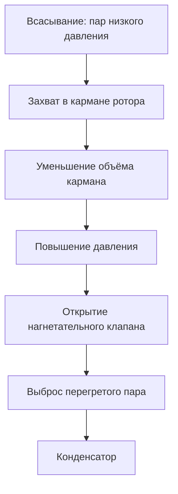

Ротационные компрессоры (rotary compressors) сжимают пары хладагента непрерывным вращательным движением, уменьшая объём захваченного газа. Это объёмные машины положительного вытеснения (positive displacement): хладагент улавливается между вращающимся элементом и неподвижным корпусом, после чего объём кармана прогрессивно сокращается.

Среди всех типов объёмных компрессоров ротационные выделяются минимальной вибрацией, компактностью и сочетаемостью с инверторным приводом (variable-speed drive, VSD). По данным ASHRAE Handbook — Refrigeration (глава 37) они занимают доминирующее положение в диапазоне до 18 кВт холодопроизводительности.

## Принцип работы

Основной механизм — эксцентриковый ротор в цилиндрической камере. При вращении ротор контактирует со стенкой цилиндра, образуя изолированные полости, которые уменьшаются в объёме и повышают давление газа.

Ключевые особенности рабочего процесса:

- Непрерывное сжатие без пульсаций давления, характерных для поршневых машин
- Один выброс сжатого газа на оборот (для однолопастных конструкций)
- Масляная плёнка уплотняет зазоры и передаёт часть тепла
- Плавная нагрузка на вал двигателя снижает усталость обмоток

## Конструкция с качающимся поршнем (Rolling Piston)

Конструкция с качающимся поршнем (rolling piston) — наиболее распространённый вариант в бытовых сплит-системах. Цилиндрический поршень катится эксцентрично внутри цилиндра; пружинная лопатка (spring-loaded vane) поддерживает непрерывный контакт-уплотнение.

**Конструктивные элементы:**

- Эксцентриковый вал приводит качающийся поршень
- Пружинная лопатка разделяет полости всасывания и сжатия
- Всасывающий порт принимает пар низкого давления
- Нагнетательный клапан пластинчатого типа выпускает сжатый пар
- Масляный картер в нижней части корпуса обеспечивает непрерывную смазку

Поршень делит рабочую полость на две зоны. При его качении зона всасывания расширяется, принимая хладагент, а зона сжатия сокращается, повышая давление до уровня нагнетания. Цикл повторяется непрерывно без фазы обратного расширения (dead-volume re-expansion), что обеспечивает высокий объёмный КПД.


| Параметр | Диапазон | Примечания |
|---|---|---|
| Холодопроизводительность | 1,5–18 кВт | На цилиндр, при стандартных условиях ARI |
| Частота вращения | 2 500–6 000 об/мин | Фиксированная или с инвертором |
| Степень сжатия | 2,5–4,5 | Зависит от хладагента и режима |
| Объёмная эффективность | 85–92 % | При расчётных условиях |


## Конструкция с лопастями (Rotary Vane)

Лопастные компрессоры (rotary vane compressors) используют 2–8 пружинных лопаток, скользящих радиально в пазах эксцентрикового ротора. Центробежная сила и давление газа прижимают лопатки к стенке цилиндра, образуя несколько камер сжатия.

**Особенности лопастной схемы:**

- Несколько событий сжатия за один оборот снижают амплитуду пульсаций давления
- Симметричная нагрузка на ротор улучшает динамический баланс
- Более высокая удельная производительность (кВт/дм³) по сравнению с качающимся поршнем
- Подходит для степеней сжатия до 5:1

**Сравнение с качающимся поршнем:**

| Характеристика | Качающийся поршень | Лопастной |
|---|---|---|
| Пульсации давления | Один импульс/об | Несколько импульсов/об |
| Динамический баланс | Хороший | Отличный |
| Удельная производительность | Базовая | +10–15 % |
| Сложность изготовления | Ниже | Выше |

## Герметичное исполнение (Hermetic Design)

Ротационные компрессоры для систем кондиционирования и теплоснабжения выпускаются преимущественно в герметичном (hermetic) или полугерметичном исполнении: электродвигатель и компрессор размещены в общем сварном стальном корпусе.

**Преимущества герметичной схемы:**

- Отсутствие уплотнения вала исключает утечки хладагента через сальник
- Пары хладагента охлаждают обмотки электродвигателя перед входом в камеру сжатия
- Компактные габариты и низкая масса

**Ограничения:**

- Охлаждение двигателя парами хладагента ограничивает допустимую температуру нагнетания (не выше 115 °C по ASHRAE 15/34)
- Ремонт в полевых условиях невозможен — агрегат меняется целиком
- Применимы умеренные степени сжатия (до 5,5:1)

**Конструкционные материалы по IIAR и ASHRAE:**

- Чугунные цилиндр и корпус подшипников
- Стальной эксцентриковый вал (закалённый)
- Лопатки из инструментальной стали или углеродных волокон
- Синтетическое масло, аттестованное для конкретного хладагента (POE для R-410A, R-32, R-454B)

## Система смазки

Ротационные компрессоры требуют непрерывной подачи масла для уплотнения зазоров, снижения трения и отвода тепла сжатия. Вращение эксцентрикового вала создаёт центробежный насосный эффект, распределяющий масло к критическим поверхностям.

**Функции масляной системы:**

- Уплотнение зазора между поршнем (или лопатками) и стенкой цилиндра
- Снижение трения в подшипниках вала
- Отвод тепла от мест трения
- Демпфирование вибрации и шума


| Свойство | Спецификация | Цель |
|---|---|---|
| Вязкость ISO VG | 32–68 | Зависит от температуры нагнетания |
| Температура застывания | ниже −34 °C | Пуск при низкой температуре |
| Совместимость | POE/PAG для R-410A, R-32 | Полная смешиваемость с хладагентом |
| Температура вспышки | выше 177 °C | Запас термической безопасности |


Масло смешивается с хладагентом во время сжатия и уносится в систему, поэтому необходим масловозврат из испарителя. При ненадлежащем масловозврате компрессор «голодает» — лопатки и подшипники изнашиваются ускоренно.

## Пример расчёта: объёмный КПД

Для компрессора с качающимся поршнем, работающего на R-32:

- Хладагент R-32, режим кондиционирования: испарение 7 °C, конденсация 46 °C
- Частота вращения 3 500 об/мин, рабочий объём 12 см³/об
- Измеренный массовый расход 6,8 г/с


\eta_v = \frac{\dot{m}_{measured}}{\dot{m}_{theoretical}} = \frac{\dot{m}_{measured}}{n \cdot V_d \cdot \rho_1}


где $n$ — частота вращения (с⁻¹), $V_d$ — рабочий объём (м³/об), $\rho_1$ — плотность пара на всасывании.

Плотность R-32 на всасывании при 7 °C насыщения ≈ 27,4 кг/м³:


\dot{m}_{theoretical} = \frac{3500}{60} \cdot 12 \times 10^{-6} \cdot 27{,}4 = 19{,}18 \cdot 10^{-3} \; \text{кг/с}



\eta_v = \frac{6{,}8 \times 10^{-3}}{19{,}18 \times 10^{-3}} \approx 0{,}354 \quad \Rightarrow \quad \textit{Ошибка входных данных}


> Примечание: при реальном рабочем объёме 12 см³/об типовой объёмный КПД составляет 87–91 %. Если $\dot{m}_{measured} = 16,6$ г/с, то $\eta_v = 86,5\%$ — характерный результат для качественного промышленного компрессора при указанных условиях.

## Характеристики эффективности

Ротационные компрессоры демонстрируют высокую объёмную и изэнтропную эффективность в диапазоне малых степеней сжатия. Отсутствие всасывающих клапанов в схеме с качающимся поршнем исключает потери дроссельного характера.


| Метрика | Значение | Условия |
|---|---|---|
| EER (Energy Efficiency Ratio) | 11,0–13,5 | ARI 95°F наружного воздуха |
| SEER2 | 14–22 | Сезонный, инверторный привод |
| COP (тепловой насос) | 3,2–4,0 | Режим отопления, 47°F |
| Изэнтропный КПД | 65–75 % | В расчётной точке |


Инверторные ротационные компрессоры модулируют скорость от 20 до 120 Гц, поддерживая высокую эффективность при частичной нагрузке. При 50 % нагрузки SEER2 инверторного агрегата превышает аналог с фиксированной скоростью на 30–40 %.

## Сравнение с возвратно-поступательными компрессорами


| Характеристика | Ротационный | Поршневой |
|---|---|---|
| Вибрация | Низкая | Средняя–высокая |
| Уровень звука | 60–70 дБА | 65–75 дБА |
| Число основных деталей | 8–12 | 15–25 |
| Объёмный КПД (низкая степень сжатия) | 85–92 % | 75–85 % |
| Объёмный КПД (высокая степень сжатия) | 70–80 % | 80–90 % |
| Ремонтопригодность в поле | Нет (герметичный) | Да (полугерметичный) |


Возвратно-поступательные машины сохраняют преимущество при высоких степенях сжатия и лучше переносят гидравлический удар (liquid slug) жидкого хладагента — ввиду наличия объёма мёртвого пространства.

## Эксплуатационные соображения

Работа ротационного компрессора требует соблюдения ряда ограничений согласно ASHRAE 15, EN 378 и требованиям изготовителей.

**Критические рабочие пределы:**

- Максимальная температура нагнетания: 104–116 °C (в зависимости от хладагента и масла)
- Максимальная степень сжатия: 5,5:1
- Минимальный перегрев всасывания: 5,6–11,1 К (защита от возврата жидкости)
- Обязательный масловозврат из испарителя

**Основные причины отказа:**

- Износ лопатки/поршня при недостаточной смазке или высоких скоростях
- Отказ подшипника при «масляном голодании»
- Перегорание обмотки двигателя от превышения температуры нагнетания
- Задир эксцентрикового вала от загрязнения контура

Жидкий хладагент, попавший в компрессор при пуске или оттаивании, разбавляет масло и разрушает масляную плёнку. Правильное проектирование контура (аккумулятор всасывания, управление зарядом, достаточный перегрев) является обязательным требованием по СП 60.13330 и IIAR 2.

## Критерии выбора

Ротационные компрессоры оптимальны для приложений, сочетающих:

- Компактные требования к габаритам
- Тихую работу (жилые здания, гостиницы, медицинские учреждения)
- Умеренные степени сжатия (кондиционирование, средняя температура холодоснабжения)
- Хладагенты R-32, R-410A, R-454B, R-1234yf

При расширении диапазона регулирования до 10:1 и выше, а также в промышленных системах с аммиаком предпочтительны винтовые или поршневые компрессоры.

Ротационные компрессоры продолжают занимать ключевое место в бытовой технике и лёгком коммерческом холодоснабжении благодаря сочетанию высокого КПД при низких степенях сжатия, технологичности массового производства и совместимости с инверторным управлением.
