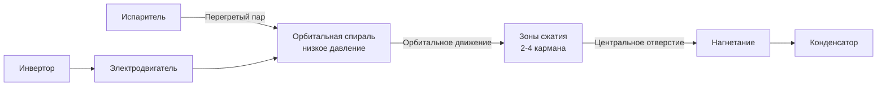

Спиральные компрессоры (scroll compressors) используют два взаимодействующих эвольвентных витка для непрерывного сжатия хладагента. Их отличают минимальный мёртвый объём, отсутствие клапанов и исключительная тихоходность — совокупность свойств, которая сделала их стандартом для жилых и лёгких коммерческих систем кондиционирования производительностью до 200 кВт. ASHRAE Handbook — Refrigeration (гл. 37) и стандарт ASHRAE 210/240 определяют методологию их испытаний и рейтинговых показателей.

## Принцип работы

Механизм сжатия включает два элемента:

- **Неподвижная спираль (fixed scroll)** жёстко закреплена в корпусе
- **Орбитальная спираль (orbiting scroll)** совершает круговое орбитальное движение без вращения вокруг собственной оси

Орбитальное движение создаёт движущиеся серповидные карманы пара между витками. Пар поступает у внешней периферии, где образуются несколько карманов одновременно. По мере орбитального движения карманы смещаются к центру, уменьшаясь в объёме и повышая давление — до момента, когда сжатый газ достигает центрального нагнетательного отверстия.

Принципиально важно: процесс сжатия непрерывен. Несколько карманов в разных фазах сжатия работают одновременно, что исключает пульсации давления, характерные для поршневых машин.

## Геометрия эвольвентной спирали

Профиль витков описывается кривой эвольвенты (involute curve), которая обеспечивает постоянные линии касания между неподвижной и орбитальной спиралями на протяжении всего цикла. Множество одновременно работающих камер распределяет нагрузку по всей поверхности уплотнения, минимизируя точечный перепад давления и пути утечки.


| Параметр | Диапазон | Влияние на производительность |
|---|---|---|
| Высота витка | 25–50 мм | Объём вытеснения на оборот |
| Шаг эвольвенты | 15–30 мм | Достижимая степень сжатия |
| Число витков | 2,5–4,5 оборотов | Количество ступеней сжатия |
| Радиус орбиты | 3–8 мм | Вытеснение на оборот |


Для большинства приложений кондиционирования и теплоснабжения спирали рассчитываются на степени сжатия 2:1–4:1. Более высокие степени требуют увеличения числа витков или уменьшения шага, что усложняет изготовление.

## Механизмы соответствия (Compliance)

Поддержание уплотнения между витками при тепловом расширении и производственных допусках обеспечивают два механизма соответствия:

### Осевое соответствие (Axial Compliance)

Орбитальная спираль может смещаться вдоль оси, поддерживая контакт торцов витков с противоположной базовой пластиной. Реализуется через:

- Камеры противодавления (back-pressure chambers), прижимающие орбитальную спираль с контролируемой силой
- Давление газа из карманов промежуточного сжатия
- Пружинный механизм для условий пуска

### Радиальное соответствие (Radial Compliance)

Уплотнение по боковым поверхностям витков обеспечивается:

- Точными допусками изготовления (обычно 10–25 мкм)
- Согласованным тепловым расширением компонентов из одинакового материала
- Центробежной силой при работе, прижимающей витки орбитальной спирали к неподвижной

Совместно осевое и радиальное соответствие поддерживают объёмный КПД выше 95 % во всём рабочем диапазоне, предотвращая металлический контакт витков.

## Технологии модуляции производительности

### Цифровая спираль (Digital Scroll)

Цифровая спираль модулирует производительность путём циклического включения и отключения механизма сжатия. Механизм осевого соответствия позволяет орбитальной спирали отделяться от неподвижной, создавая условие байпаса (unloaded state), при котором хладагент циркулирует без сжатия.

**Параметры цифровой модуляции:**

- Рабочая частота цикла: 10–20 Гц
- Диапазон регулирования: 10–100 % с шагом 10 %
- Управление: изменение соотношения времени нагруженного и ненагруженного состояния
- Потребление в ненагруженном состоянии: ≈ 5–8 % мощности при полной нагрузке

Цифровая технология сохраняет полный изэнтропный КПД во время нагруженных периодов и не имеет потерь, характерных для байпаса горячего газа.

### Компрессоры с переменной скоростью (Variable-Speed Scroll)

Инверторные спиральные компрессоры изменяют скорость в диапазоне 20–100 % номинальной. Непрерывная модуляция производительности поддерживает оптимальный изэнтропный КПД во всём диапазоне.


| Диапазон скорости, Гц | Производительность, % | Прирост КПД vs. фиксированная скорость |
|---|---|---|
| 20–40 | 20–40 | +15–25 % |
| 40–60 | 40–60 | +10–15 % |
| 60–90 | 60–100 | +5–10 % |


Важно: изэнтропная эффективность геометрии спирали остаётся практически постоянной при изменении скорости. Это принципиально отличает спираль от центробежных компрессоров, КПД которых сильно зависит от скорости.

## Преимущества эффективности

Спиральные компрессоры превосходят поршневые по нескольким механизмам:

1. **Непрерывное сжатие** исключает потери всасывающих и нагнетательных клапанов
2. **Минимальный мёртвый объём** (1–2 % против 4–6 % у поршневых) — нет повторного расширения газа
3. **Меньшее механическое трение** — единственный подвижный узел с балансировочным противовесом
4. **Прямой нагнетательный тракт** без дроссельных клапанов
5. **Непрерывное уплотнение** по боковым поверхностям и торцам витков

Типичные диапазоны изэнтропного КПД:

- Спиральные: 65–75 % во всём рабочем диапазоне
- Поршневые: 55–70 % с большим разбросом в зависимости от условий

Преимущество спиральных компрессоров становится более выраженным при частичных нагрузках, где мёртвый объём поршневых машин ограничивает объёмный КПД.

## Пример расчёта: сравнение мощности компрессоров

Система кондиционирования, Q = 10 кВт, $T_{evap}$ = 7 °C, $T_{cond}$ = 46 °C.


\text{COP}_{Carnot} = \frac{T_{evap}}{T_{cond} - T_{evap}} = \frac{280{,}15}{319{,}15 - 280{,}15} = \frac{280{,}15}{39} \approx 7{,}18


Для спирального компрессора с изэнтропным КПД $\eta_{is}$ = 0,70 и механическим КПД $\eta_{mech}$ = 0,97:


W_{comp} = \frac{Q_{evap}}{COP_{actual}}, \quad COP_{actual} = COP_{Carnot} \cdot \eta_{is} \cdot \eta_{mech} \approx 7{,}18 \cdot 0{,}70 \cdot 0{,}97 \approx 4{,}88



W_{comp} = \frac{10}{4{,}88} \approx 2{,}05 \; \text{кВт}


Для поршневого компрессора с $\eta_{is}$ = 0,60 фактический COP ≈ 4,18, мощность ≈ 2,39 кВт — разница ~16 % в пользу спирального, что хорошо согласуется с промышленными данными ASHRAE.

## Герметичная конструкция

Большинство спиральных компрессоров для HVAC выпускаются в герметичном (hermetic) исполнении: двигатель и механизм сжатия совместно используют герметичный корпус, заполненный хладагентом.

**Преимущества:**

- Охлаждение двигателя парами хладагента предотвращает перегрев обмоток
- Отсутствие уплотнения вала исключает пути утечки хладагента
- Звукопоглощение массой хладагента вокруг корпуса
- Защита внутренних компонентов от атмосферного загрязнения

**Требования к маслосистеме:** герметичная конструкция требует надёжного масловозврата в картер. В более крупных системах применяются масловые сепараторы для снижения концентрации масла в холодильном контуре ниже 1–2 %.

## Применение

### Жилые системы HVAC

Спиральные компрессоры доминируют в жилых сплит-системах и тепловых насосах производительностью 5–18 кВт (1,5–5 тонн). Преимущества:

- Тихая работа (68–76 дБА в типовой точке) против 75–85 дБА у поршневых
- Высокие рейтинги SEER2 (16–26 с инверторным приводом, ASHRAE 210/240)
- Надёжность — единственный подвижный узел
- Компактность наружного блока

### Коммерческие системы HVAC

Коммерческие применения охватывают диапазон 10–210 кВт (3–60 тонн):

- Пакетные крышные агрегаты (packaged rooftop units)
- Раздельные системы кондиционирования
- Тепловые насосы с водяным или грунтовым источником тепла
- Процессное охлаждение

Конфигурации с двумя и тремя спиральными компрессорами обеспечивают ступенчатость и резервирование в более крупных системах.

## Сравнение со спиральным и поршневым компрессорами


| Характеристика | Спиральный | Поршневой |
|---|---|---|
| Подвижных узлов | 1 (орбитальная спираль) | Несколько поршней, клапаны, шатуны |
| Процесс сжатия | Непрерывный | Пульсирующий |
| Изэнтропный КПД | 65–75 % | 55–70 % |
| Уровень звука | 68–76 дБА | 75–85 дБА |
| Вибрация | Минимальная | Значительная |
| Диапазон производительности | 5–210 кВт | 5–1 000+ кВт |
| Эффективность при частичной нагрузке | Отличная с модуляцией | Слабая без разгрузки |
| Устойчивость к жидкому удару | Низкая (нет мёртвого объёма) | Умеренная |


Основное ограничение спиральных компрессоров — чувствительность к попаданию жидкого хладагента (liquid flood-back). Минимальный мёртвый объём не обеспечивает буфера, поэтому правильное проектирование (управление зарядом, перегрев всасывания ≥ 5 К, аккумулятор на всасывании) критически важно — особенно при низких наружных температурах и условиях пуска.

## Интеграция с инверторным приводом

Совместное использование инверторного привода (VFD) и спиральной геометрии даёт оптимальные характеристики:

- Согласование производительности с нагрузкой в пределах 1–2 %
- Исключение температурных колебаний из-за циклирования
- Улучшение сезонной эффективности на 30–40 % по сравнению с поршневыми агрегатами фиксированной скорости
- Снижение токов пуска — снижение пикового электроспроса
- Продление ресурса за счёт уменьшения числа циклов пуск/стоп

Инверторные спиральные компрессоры занимают лидирующую позицию в премиальном жилом сегменте и всё шире применяются в коммерческих системах, где эффективность и комфорт оцениваются выше первоначальной стоимости. Хладагенты R-32 и R-454B с низким GWP становятся новым стандартом в соответствии с требованиями регламентов F-Gas (EU) и директив ASHRAE 34.
