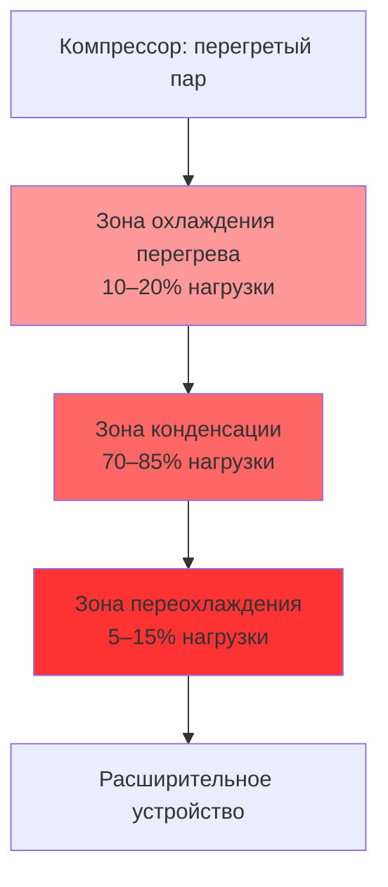

Конденсатор (condenser) — теплообменник, в котором перегретый пар хладагента после компрессора охлаждается, конденсируется и переохлаждается. Вся тепловая энергия, поглощённая испарителем и подведённая компрессором, отводится в окружающую среду через конденсатор. Этим определяется тепловой баланс системы:


Q_c = Q_e + W_{comp}


где $Q_c$ — мощность конденсатора (кВт), $Q_e$ — холодопроизводительность испарителя (кВт), $W_{comp}$ — мощность, потребляемая компрессором (кВт). Типичное соотношение $Q_c / Q_e$ (heat rejection ratio, HRR) составляет 1,15–1,35 для систем кондиционирования и 1,40–1,60 для низкотемпературного холодоснабжения.

## Три зоны конденсации

Процесс конденсации в реальном теплообменнике протекает в трёх последовательных зонах:

**Зона охлаждения перегрева (desuperheating zone):** горячий газ нагнетания охлаждается от температуры нагнетания до температуры насыщения при давлении конденсации. Отвод явного тепла (sensible heat). Доля в общей нагрузке конденсатора: 10–20 % в зависимости от степени сжатия и перегрева всасывания.

**Зона фазового перехода (condensing zone):** хладагент конденсируется при постоянной температуре насыщения. Отвод скрытой теплоты парообразования (latent heat). Это основная зона — 70–85 % общей нагрузки.

**Зона переохлаждения (subcooling zone):** сконденсированная жидкость охлаждается ниже температуры насыщения. Обычно 2–8 °C переохлаждения. Переохлаждение гарантирует поступление чистой жидкости (без паровых пузырей) к расширительному устройству и увеличивает удельную холодопроизводительность.

## Теплопередача в конденсаторе

Расчётное уравнение теплообменника:


Q = U \cdot A \cdot \text{LMTD}


где $U$ — суммарный коэффициент теплопередачи (Вт/м²·К), $A$ — площадь теплопередающей поверхности (м²), LMTD — логарифмическая средняя разность температур (К).


\text{LMTD} = \frac{\Delta T_1 - \Delta T_2}{\ln(\Delta T_1 / \Delta T_2)}


Суммарное тепловое сопротивление конденсатора:


\frac{1}{U} = \frac{1}{h_{ref}} + R_{f,ref} + \frac{t_w}{k_w} + R_{f,cool} + \frac{1}{h_{cool}}


где $h_{ref}$ и $h_{cool}$ — коэффициенты теплоотдачи со стороны хладагента и охлаждающей среды соответственно, $R_f$ — факторы загрязнения (fouling factors) по ASHRAE Handbook — Fundamentals (гл. 4).

## Типы конденсаторов

### Воздушно-охлаждаемые (Air-Cooled)

Воздушно-охлаждаемые конденсаторы используют окружающий воздух, прокачиваемый вентиляторами через оребрённые трубчатые пучки. Преобладают в малых и средних коммерческих системах благодаря простоте, отсутствию водоподготовки и надёжности в эксплуатации.

- Температура конденсации: на 10–20 °C выше температуры наружного воздуха (dry-bulb temperature)
- Значение U: 85–142 Вт/(м²·К)
- Каждое снижение температуры конденсации на 5 °C улучшает COP на 10–15 %
- Вентиляторы с приводом переменной частоты (ECM-motors) оптимизируют потребление энергии при частичной нагрузке

### Водяные (Water-Cooled)

Водяные конденсаторы используют охлаждающую воду. Высокая теплоёмкость и теплопроводность воды обеспечивают превосходные коэффициенты теплопередачи.

- Значение U: 1 420–2 271 Вт/(м²·К) для кожухотрубных теплообменников (shell-and-tube)
- Температурный подход (approach temperature): 2–6 °C — разница между температурой конденсации и температурой выходящей воды
- Потребление воды в системе с градирней: 0,03–0,05 л/с на кВт отводимого тепла (включая продувку и испарение)
- Коэффициент загрязнения: 0,000088–0,000527 м²·К/Вт в зависимости от качества воды (ASHRAE Refrigeration, гл. 36)

### Испарительные (Evaporative)

Испарительные конденсаторы сочетают воздушное и водяное охлаждение: вода распыляется на наружную поверхность змеевика, воздух прокачивается через увлажнённую поверхность. Испарение воды отводит 75–80 % тепловой нагрузки.

- Температура конденсации: на 5–10 °C выше температуры влажного термометра (wet-bulb temperature) — преимущество 8–15 °C перед воздушными системами
- Потребление воды: 0,00032–0,00036 л/(с·кВт) — на 40–60 % меньше, чем у систем с градирней
- Контроль Legionella: обязателен в соответствии с ASHRAE 188, Guideline 12 и СанПиН

## Методология выбора и расчёта

Алгоритм расчёта конденсатора по ASHRAE Handbook — Refrigeration (гл. 36):

1. Рассчитайте тепловую нагрузку: $Q_c = Q_e \cdot (1 + 1/\text{COP})$
2. Определите температуру конденсации на основе доступной охлаждающей среды и целевого подхода
3. Рассчитайте требуемую площадь: $A = Q_c / (U \cdot \text{LMTD})$
4. Введите коэффициенты загрязнения и запас на деградацию 10–15 %
5. Проверьте физические ограничения (пространство, масса, подключения)

## Пример расчёта: холодопроизводительность 350 кВт

Система кондиционирования, R-134a, воздушный конденсатор:

- $T_{evap}$ = 5 °C, $T_{cond}$ = 42 °C, COP = 4,5
- $Q_c = 350 \cdot (1 + 1/4{,}5) = 350 \cdot 1{,}222 = 427{,}8$ кВт
- Температура наружного воздуха 32 °C, LMTD = 42 − 32 = 10 K (упрощённо для зоны конденсации)
- При U = 110 Вт/(м²·К): $A = 427\,800 / (110 \cdot 10) = 389$ м²

Площадь 389 м² типична для воздушного конденсатора в данном диапазоне производительности при заданных условиях.

## Переохлаждение (Subcooling)

Переохлаждение жидкого хладагента ниже температуры насыщения даёт:

**Прирост холодопроизводительности:** каждый градус переохлаждения увеличивает удельный холодильный эффект на 0,3–0,7 % (зависит от хладагента). При 8 °C переохлаждения R-410A прирост составляет около 3 %.

**Предотвращение вскипания жидкости:** переохлаждение защищает жидкостную линию от образования паровых пробок (flash gas) при перепадах давления. Минимум 3–5 °C переохлаждения — обязательное требование для нормальной работы терморегулирующего вентиля (TXV).

**Целевые значения (ASHRAE Refrigeration):** 5–8 °C для большинства применений. Переохлаждение более 12 °C указывает на избыток хладагента в системе или ограниченный воздухопоток через конденсатор.

## Влияние загрязнения и технического обслуживания

**Воздушно-охлаждаемые системы:** загрязнение рёбер снижает воздухопоток. При уменьшении расхода воздуха на 20 % температура конденсации повышается приблизительно на 3–5 °C. Рекомендуемая периодичность очистки: ежеквартально в пыльных условиях, ежегодно — в чистых.

**Водяные системы:** накипь толщиной 0,25 мм увеличивает температуру конденсации на 1,5–2,5 °C. Контроль качества воды по индексу насыщения Ланжелье (Langelier Saturation Index, LSI): целевой диапазон от −0,5 до +0,5. Механическая прочистка трубок — ежегодно или при повышении температурного подхода более чем на 2 °C выше проектного значения.

**Испарительные системы:** мониторинг концентрации биоцидов, pH (7,5–8,5), проводимости воды и уровня Legionella — ежемесячно в период эксплуатации.

## Сравнение энергетической эффективности


| Параметр | Воздушно-охлаждаемый | Водяной (с градирней) | Испарительный |
|---|---|---|---|
| Температура конденсации | 46–52 °C | 35–40 °C | 29–35 °C |
| EER (ориентировочно) | 8–10 | 11–14 | 10–13 |
| Потребление воды | Нет | Высокое | Среднее |
| Стоимость установки | Низкая | Высокая | Средняя |
| Обслуживание | Минимальное | Высокое | Среднее |


Анализ стоимости жизненного цикла (Life Cycle Cost Analysis, LCCA) должен включать все статьи: первоначальная стоимость оборудования и монтажа, стоимость энергии, затраты на воду и водоотведение, стоимость обслуживания и ремонта, стоимость замены оборудования. Разница в энергозатратах между воздушным и водяным конденсаторами при 35 °C составляет 20–35 % — основной аргумент в пользу водяных систем при наличии водоснабжения.

