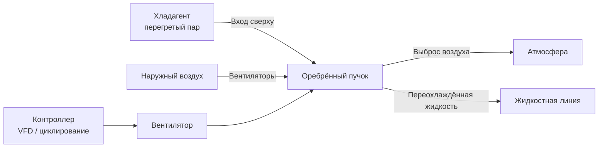

Воздушно-охлаждаемые конденсаторы (air-cooled condensers) отводят теплоту холодильного цикла непосредственно в атмосферный воздух посредством принудительной конвекции через оребрённые пучки. Эти теплообменники преобладают в малых и средних коммерческих холодильных системах и системах кондиционирования благодаря низкой стоимости установки, отсутствию расхода воды и минимальным требованиям к обслуживанию. Проектирование регламентируют ASHRAE Handbook — Refrigeration (гл. 36), стандарт ARI 460/465 и требования EN 378.

## Конструкция оребрённого пучка

Оребрённый пучок (fin-and-tube coil) образует основную поверхность теплопередачи. Медные трубы (наружный диаметр 9,5; 12,7 или 15,9 мм) несут хладагент; алюминиевые рёбра, механически расширенные или высокочастотно приваренные к трубам, увеличивают площадь поверхности со стороны воздуха.

**Параметры оребрения:**

- Шаг рёбер (fin pitch, FPI): 8–20 рёбер/дюйм (3,2–7,9 мм). Более плотный шаг — выше теплопередача, но больше перепад давления воздуха и риск засорения
- Пластинчатые рёбра (plain fins): простота, долговечность
- Ламелированные (louvered fins): турбулизация пограничного слоя, рост коэффициента теплоотдачи воздуха на 20–40 % при увеличении перепада давления
- Шиповые рёбра (spine fin): максимальная площадь поверхности, специализированные применения

**Выбор материала рёбер:** в прибрежных и промышленных зонах алюминий с предварительным полимерным или эпоксидным покрытием продлевает ресурс. Медно-медные пучки применяются в особо агрессивных средах.

Теплопроводность меди — 385 Вт/(м·К) — обеспечивает пренебрежимо малое тепловое сопротивление стенки трубы. Общий коэффициент теплопередачи воздушного конденсатора: 85–142 Вт/(м²·К) — на порядок ниже, чем у водяного, что определяет значительно бо́льшую площадь поверхности.

## Скорость перед пучком и распределение воздуха

Скорость перед пучком (face velocity) — средняя скорость воздуха, перпендикулярная лицевой поверхности:


V_{face} = \frac{\dot{V}_{air}}{A_{face}}


Типовые расчётные значения: 2,03–3,05 м/с. Более низкая скорость снижает мощность вентилятора и шум, но требует большей площади пучка. Более высокая скорость уменьшает габариты агрегата, но увеличивает шум и энергопотребление вентиляторов.

Равномерное распределение воздуха по всей лицевой поверхности критично: локальные «горячие пятна» повышают местную температуру конденсации и снижают теплопередачу. Правильный подбор вентиляторов, их расположение и конфигурация воздуховодов обеспечивают равномерность потока.

## Дельта температуры конденсации (Condensing TD)

Дельта конденсации (condensing temperature difference, TD) — разница между температурой насыщения хладагента и температурой входящего воздуха:


TD = T_{sat} - T_{air,in}


Расчётный диапазон для коммерческой холодильной техники: 11–17 °C. При более низкой дельте требуется бо́льшая площадь пучка, но снижается подъём компрессора, что улучшает КПД. Каждые 0,5 °C снижения температуры конденсации улучшают эффективность компрессора на 2–3 % (ASHRAE Handbook — Refrigeration, гл. 1).

**Пример расчёта дельты конденсации:**

Наружный воздух 35 °C, целевой TD = 14 °C:


T_{cond} = T_{air,in} + TD = 35 + 14 = 49 \; °C


Снижение температуры конденсации до 46 °C (TD = 11 °C) при неизменной холодопроизводительности потребует увеличения площади пучка примерно на 25–30 %, однако COP возрастёт на 6–9 %.

**Особый случай — CO₂ (R-744) в докритических системах:** дельта 19–22 °C из-за особенностей термодинамических свойств хладагента и каскадных схем.

## Схемы вентиляторов

### Осевые вентиляторы (Axial / Propeller Fans)

Осевые вентиляторы перемещают большие объёмы воздуха при низком статическом давлении (25–75 Па). Лопасти вращаются перпендикулярно направлению потока. Оптимальны для приложений со свободным выбросом.

- КПД: 50–60 %
- Конструкция с 4–6 лопастями — тихая работа по сравнению с двух-трёхлопастными промышленными вентиляторами
- Прямой привод исключает ремни и шкивы, снижая потребность в обслуживании
- ECM-двигатели (electronically commutated motors) с плавным регулированием скорости всё шире вытесняют асинхронные

### Центробежные вентиляторы (Centrifugal Fans)

Центробежные вентиляторы развивают более высокое статическое давление (до 500 Па) и применяются в установках с воздуховодами или при ограниченном пространстве для воздушного потока.

- Лопасти с обратным изгибом (backward-curved): КПД 70–80 %, стабильная характеристика
- Лопасти с прямым изгибом (forward-curved): высокий расход воздуха при меньших габаритах, но ниже КПД
- Снижение передачи шума в сравнении с осевыми — важно для городских крыш и жилых зон
- Ременный привод позволяет регулировку скорости заменой шкивов, прямые ECM-приводы предпочтительнее

## Управление давлением конденсации

При низкой температуре окружающей среды давление конденсации падает, что нарушает работу расширительного устройства и снижает масловозврат в компрессор. Необходимо поддерживать минимальное давление конденсации.

**Циклирование вентиляторов (fan cycling):** включение/отключение вентиляторов ступенями. Простой и дешёвый метод, но создаёт колебания давления. Минимальное время работы двигателя: не менее 3 мин.

**Вентиляторы с переменной скоростью:** ECM-двигатели или частотные приводы (VFD) плавно регулируют скорость вентилятора. Минимизируют потребление энергии, снижают шум и устраняют циклирование давления. Срок окупаемости по сравнению с фиксированной скоростью: 2–3 года.

**Затопление конденсатора (condenser flooding):** клапаны затопления ограничивают отток жидкого хладагента из конденсатора, снижая активную поверхность теплопередачи и поддерживая давление конденсации. Стабильный метод, но требует тщательного управления зарядом.

**Байпасные воздушные заслонки (air bypass dampers):** пропускают часть воздуха мимо пучка, снижая его эффективный расход. Механическое решение без изменения скорости вентилятора, но с подвижными частями, подверженными обмерзанию.

## Переохлаждение (Subcooling)

Переохлаждение — снижение температуры жидкого хладагента ниже температуры насыщения при давлении конденсации:


\Delta T_{sc} = T_{sat}(P_{cond}) - T_{liquid,out}


**Целевые значения:** 4–8 °C для большинства систем.

**Диагностика по переохлаждению:**
- Недостаточное переохлаждение (< 3 °C): недозаряд, чрезмерный перепад давления в жидкостной линии или недостаточная площадь конденсатора
- Избыточное переохлаждение (> 12 °C): перезаряд или ограниченный воздухопоток через пучок

**Выделенные цепи переохлаждения (dedicated subcooling circuits):** жидкостный хладагент, подводимый к нижней части пучка, подвергается воздействию наиболее холодного входящего воздуха. Прирост производительности: 2–5 % по сравнению со стандартной компоновкой.

## Влияние температуры окружающей среды

Производительность конденсатора возрастает примерно на 2–3 % на каждые 0,5 °C снижения температуры входящего воздуха. Стандартные рейтинговые условия (ARI): 35 °C входящего воздуха, 40,5 °C температуры конденсации.

**Работа при высокой температуре (> 46 °C):** температура нагнетания компрессора повышается, растёт мощность. При 48 °C наружного воздуха системы нередко переходят в защитный режим ограничения мощности. Решения: увеличенный конденсатор (+15–20 % площади), орошение воздуха перед пучком, впрыск жидкости в нагнетательный тракт компрессора.

**Работа при низкой температуре (до −29 °C):** необходимо активное управление давлением конденсации для поддержания минимума 550–700 кПа (изб.) в зависимости от типа расширительного устройства и хладагента.

## Применение

**Коммерческая холодильная техника (commercial refrigeration):** холодильные камеры, морозильные склады и горки используют выносные воздушные конденсаторы на крыше или на улице. Температуры испарения от −7 до +4 °C (среднетемпературный режим). Хладагенты R-404A (выводимый), R-448A, R-449A, R-744 (CO₂ в каскадных схемах).

**Транспортная холодильная техника (transport refrigeration):** компактные воздушные конденсаторы в грузовых, прицепных и контейнерных рефрижераторах. Крепление под кузовом требует надёжной конструкции и защитных покрытий от дорожного загрязнения.

**Тепловые насосы (heat pumps):** воздушный конденсатор в режиме отопления становится испарителем в режиме охлаждения. Производительность существенно варьируется с температурой наружного воздуха — необходимо проектирование с учётом бивалентной точки (bivalent point) по СП 60.13330.

## Оптимизация производительности


| Фактор деградации | Типичная потеря производительности | Решение |
|---|---|---|
| Загрязнение рёбер (пыль, пыльца) | 10–30 % | Промывка водой / одобренным очистителем |
| Согнутые рёбра | 5–15 % | Выпрямление специальным гребнем |
| Рециркуляция горячего выброса | 10–25 % | Обеспечение зазоров ≥ 600 мм со стороны выброса |
| Недозаряд хладагента | 5–20 % | Дозаправка до целевого переохлаждения |


**Зазоры вокруг агрегата:** минимум 600 мм со стороны выброса вентилятора, 300 мм со стороны забора воздуха. Защитные сетки против мусора: ячейка не мельче 12,7 мм во избежание чрезмерного ограничения воздухопотока.

**Мониторинг производительности:** ежемесячное сравнение фактической температуры конденсации с расчётной при текущей температуре наружного воздуха. Превышение более чем на 3 °C — сигнал для внепланового технического обслуживания.

