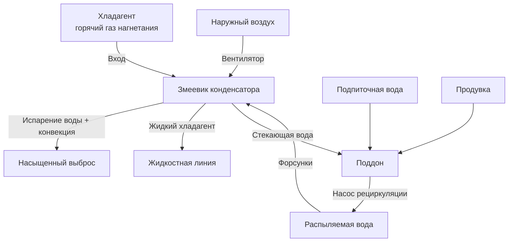

Испарительные конденсаторы (evaporative condensers) объединяют механизмы воздушного и водяного охлаждения в одном агрегате: хладагент конденсируется внутри змеевика, а вода распыляется на его наружную поверхность при одновременном прокачивании воздуха через увлажнённую поверхность. Испарение воды отводит 75–80 % тепловой нагрузки, обеспечивая температуру конденсации, недостижимую для воздушных конденсаторов. Нормативная база: ASHRAE Handbook — Refrigeration (гл. 38), ASHRAE 188, Guideline 12, IIAR 2, EN 378, СП 60.13330.

## Принцип теплоотдачи

Теплообмен в испарительном конденсаторе складывается из двух параллельных процессов:

1. **Чувствительный теплообмен (sensible heat transfer):** разность температур между хладагентом и воздухом/водой
2. **Скрытый теплообмен при испарении (latent heat transfer):** испарение воды с поверхности змеевика уносит теплоту

Доля скрытого теплообмена — 75–80 % суммарной нагрузки; явный теплообмен — 20–25 %. Это принципиально отличает испарительный конденсатор от воздушного, где теплообмен полностью чувствительный.

Суммарный коэффициент массотеплопередачи (overall mass-heat transfer coefficient) по методологии ASHRAE:


Q = K_o \cdot A \cdot (h_{s,ref} - h_{air})


где $K_o$ — суммарный коэффициент массотеплопередачи (кг/(с·м²)), $h_{s,ref}$ — энтальпия насыщенного воздуха при температуре поверхности змеевика (кДж/кг сухого воздуха), $h_{air}$ — энтальпия входящего воздуха.

## Подход по температуре влажного термометра

В отличие от воздушного конденсатора, охлаждающая способность которого определяется температурой сухого термометра (dry-bulb temperature, DBT), испарительный конденсатор работает на температуре влажного термометра (wet-bulb temperature, WBT).

**Расчёт температуры конденсации:**


T_{cond} = T_{WB,ambient} + \Delta T_{approach}


Типичные подходы при проектировании: 5,5–8,3 °C для стандартных агрегатов; 3,9–5,5 °C для высокоэффективных конструкций.

**Пример:**

При расчётной WBT = 25,6 °C и подходе 6,7 °C:
$T_{cond} = 25{,}6 + 6{,}7 = 32{,}3$ °C

Воздушный конденсатор при DBT = 35 °C конденсирует при 43–46 °C — преимущество испарительного составляет 11–14 °C. Каждые 5,6 °C снижения температуры конденсации улучшают COP системы на 8–10 % (ASHRAE Refrigeration, гл. 1).

## Потребление воды

Потребление воды складывается из трёх компонентов:


| Компонент | Типовой расход | Примечания |
|---|---|---|
| Испарение | 0,00027 л/(с·кВт) | Не может быть устранено — это механизм охлаждения |
| Продувка (blowdown) | 0,00005–0,00009 л/(с·кВт) | Поддерживает качество воды |
| Унос капель (drift) | < 0,002 % от циркуляции | Минимизируется сепараторами |


Суммарное потребление: 0,00032–0,00036 л/(с·кВт) — на 40–60 % меньше, чем в системе с градирней, из-за исключения промежуточного водяного контура.

## Система распыления воды

Равномерное орошение поверхности змеевика критично для производительности. Форсунки или распределительные лотки подают воду со скоростью 1,0–2,0 л/(с·м²) площади фронта змеевика. Неравномерное распределение образует сухие участки, где теплопередача возвращается к условиям воздушного конденсатора.

Поддон (basin) собирает воду для рециркуляции. Ёмкость поддона — 1–3 мин работы насоса при расчётном расходе. Насос рециркуляции — ключевой элемент: его отказ немедленно снижает производительность до уровня воздушного конденсатора.

## Конфигурация воздушного потока

**Конструкция с индуцированной тягой (induced draft):** вентилятор расположен на выходе агрегата и нагнетает воздух через увлажнённый змеевик. Обеспечивает равномерное распределение воздуха, предотвращает рециркуляцию влажного выхлопа на вход и позволяет вентилятору работать в относительно сухом воздухе — стандартная и предпочтительная схема.

**Конструкция с принудительной тягой (forced draft):** вентилятор у входа. Риск перегрева электродвигателя в насыщенном воздухе и опасность рециркуляции — требует тщательного проектирования.

Расход воздуха: 15–25 л/(с·кВт) холодопроизводительности. Снижение расхода воздуха уменьшает мощность вентилятора, но требует увеличения площади змеевика.

## Борьба с накипью и коррозией

**Образование накипи (scaling):** при испарении воды растворённые минералы концентрируются и осаждаются на поверхностях теплопередачи. Карбонат кальция, сульфат кальция и кремнезём — наиболее распространённые соединения. Отложение накипи толщиной 0,4 мм повышает температуру конденсации на 1,7–2,8 °C.

**Циклы концентрации (cycles of concentration):** отношение растворённых твёрдых веществ в циркуляционной воде к показателям подпиточной воды. Оптимальный диапазон: 3–5 циклов. Более высокие значения снижают расход подпиточной воды, но увеличивают потенциал накипеобразования.

**Коррозия:** гальваническая коррозия между медными и стальными компонентами требует диэлектрических вставок. Скорость коррозии: цель < 0,05 мм/год.

## Программы водоподготовки

Химическая обработка воды (water treatment) включает:

- **Ингибиторы накипи:** фосфонаты, полимеры — предотвращают кристаллизацию
- **Ингибиторы коррозии:** азолы, фосфаты — защитные плёнки на металлических поверхностях
- **Биоциды:** окисляющие (хлор, бром) для поддержания остаточного хлора 1–2 мг/л; неокисляющие для периодической ударной обработки
- **Регулировка pH:** целевой диапазон 7,5–8,5

Непрерывный контроль проводимости воды обеспечивает автоматическое управление продувкой и поддержание концентрации растворённых твёрдых веществ в заданных пределах.

## Профилактика легионеллёза

Бактерии *Legionella pneumophila* оптимально размножаются при 35–46 °C — диапазоне, характерном для воды испарительного конденсатора. Аэрозолирование воды создаёт потенциальный риск ингаляции.

**Стратегии профилактики (ASHRAE 188, Guideline 12, СанПиН 2.6.1.2369-08):**

1. Поддерживать температуру воды ниже 20 °C во время простоя
2. Непрерывные окисляющие биоциды: свободный хлор 1–2 мг/л; мониторинг ОВП > +650 мВ
3. Периодическая механическая очистка и дезинфекция: удаление биоплёнки и осадка
4. Высокоэффективные сепараторы капель (drift eliminators): унос < 0,001 % расхода циркуляции
5. Регулярные бактериологические анализы воды: не реже одного раза в квартал в сезон работы

## Защита от замерзания

**Методы рабочей защиты:**

- Электрические погружные нагреватели поддона: поддерживают температуру воды выше +4,4 °C
- Непрерывная циркуляция воды: движение предотвращает замерзание
- Пониженный расход воздуха: модуляция заслонок или VFD удерживает температуру выхода воздуха выше 0 °C

**Консервация на зиму:** полный слив воды из всех компонентов. Уклоны трубопроводов, сливные клапаны в нижних точках, продувка сжатым воздухом. В некоторых установках используют раствор гликоля в водяной системе, что снижает теплопередачу на 8–12 %.

## Управление производительностью

Поддержание требуемого давления конденсации при переменной нагрузке достигается:

1. **Ступенчатое циклирование вентиляторов:** включение/отключение по одному вентилятору
2. **Управление скоростью вентиляторов (VFD):** непрерывная модуляция — предпочтительный метод
3. **Модуляция расхода распыляемой воды:** снижение расхода воды; риск сухих участков при чрезмерном снижении
4. **Воздушные заслонки:** ограничение расхода воздуха механическим способом

VFD-управление на вентиляторах превосходит дискретное циклирование по стабильности давления конденсации и экономии энергии при частичных нагрузках.

## Пример расчёта: температура конденсации

Система промышленного холодоснабжения, аммиак (R-717):

- Расчётная WBT наружного воздуха: 23 °C (значение 0,4 % по ASHRAE климатическим данным для Москвы)
- Целевой подход: 6 °C
- $T_{cond} = 23 + 6 = 29$ °C → давление конденсации ≈ 11,3 бар (изб.)

Воздушный конденсатор при DBT = 32 °C потребовал бы $T_{cond}$ ≈ 43–46 °C → давление 17–18 бар (изб.). Снижение давления конденсации на 6–7 бар даёт экономию энергии компрессора 20–28 % при той же холодопроизводительности — стандартный аргумент при выборе испарительного конденсатора для промышленных аммиачных систем по IIAR 2 и EN 378.

## Сравнение с раздельными системами


| Параметр | Испарительный конденсатор | Градирня + водяной конденсатор |
|---|---|---|
| Подход к WBT | 10–15 °F (5,6–8,3 °C) | 15–20 °F (8,3–11,1 °C) |
| Насосная мощность | Один насос | Насос градирни + насос конденсатора |
| Теплообменников | Один агрегат | Два теплообменника |
| Заряд хладагента | Ниже | Выше |
| Площадь под оборудование | Компактная | Рассредоточенная |
| Сложность монтажа | Ниже | Выше |


Испарительные конденсаторы достигают температуры конденсации на 2,8–5,6 °C ниже, чем системы с градирней, поскольку исключается потеря подхода в промежуточном водяном конденсаторе. Экономия мощности компрессора: 8–15 %.

Системы с градирней предпочтительны в крупных установках, где несколько компрессоров используют общий контур охлаждающей воды, а также при проблемах качества воды, затрудняющих прямое орошение змеевиков хладагента.

## Требования к техническому обслуживанию

**Ежемесячно:**

- Проверка равномерности орошения змеевика
- Осмотр форсунок на засорение или смещение
- Контроль остатков биоцидов и значений pH воды
- Проверка работы клапанов подпитки и продувки

**Ежеквартально:**

- Очистка входных сеток и фильтров
- Осмотр сепараторов капель на повреждение
- Проверка работы вентиляторов и уровня вибрации
- Анализ воды: pH, проводимость, биологическая активность

**Ежегодно:**

- Осмотр змеевика: накипь, коррозия, механические повреждения
- Очистка поддона от осадка
- Дезинфекция всей водяной системы (ударная)
- Проверка систем защиты от замерзания

Химическая очистка змеевика от накипи (реагенты удаления накипи с последующей нейтрализацией и пассивацией) эффективнее механической, которая рискует повредить поверхность.

