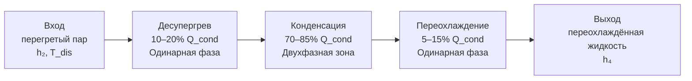
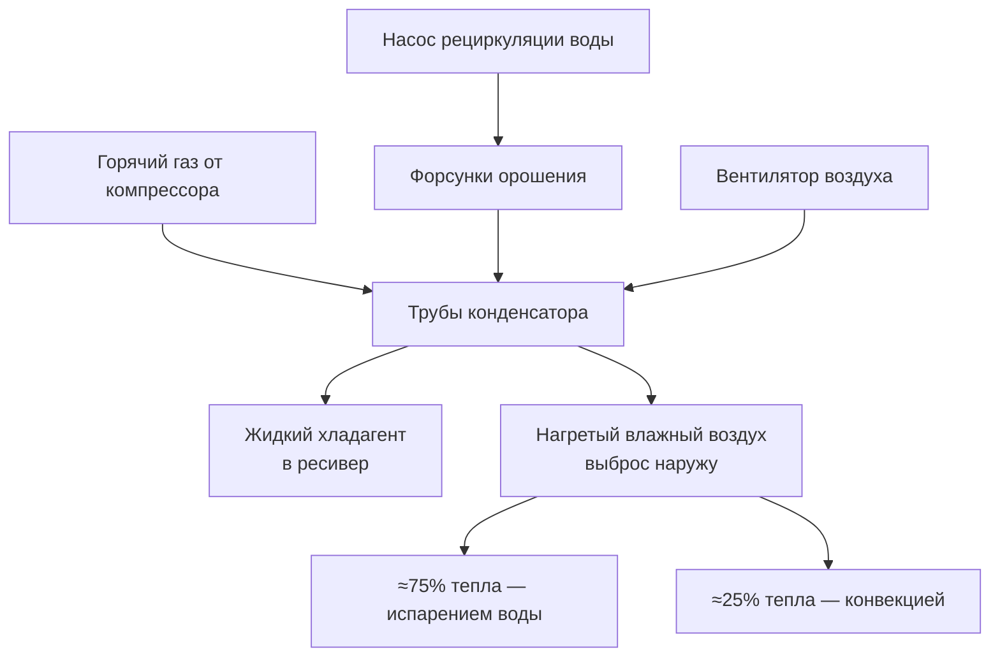

Конденсатор отводит суммарную тепловую энергию из холодильного цикла в окружающую среду. Эта нагрузка всегда превышает холодопроизводительность испарителя на величину тепла, вносимого компрессором. Правильный расчёт и подбор конденсатора определяют эффективность системы на протяжении всего срока службы.

## Энергетический баланс конденсатора

Конденсатор отводит тепло, поглощённое в испарителе (Q_evap), теплоту сжатия компрессора (W_comp), а также небольшую долю от вспомогательного оборудования — насосов и вентиляторов. Тепло отдаётся в трёх последовательных зонах: охлаждение перегретого пара (десупергрев, desuperheating), фазовый переход при постоянной температуре (конденсация) и охлаждение переохлаждённой жидкости (subcooling).


Q_\text{cond} = Q_\text{evap} + W_\text{comp}


В терминах энтальпий хладагента:


Q_\text{cond} = \dot{m} \,(h_2 - h_4)


где:
- $\dot{m}$ — массовый расход хладагента, кг/с
- $h_2$ — энтальпия на выходе компрессора (перегретый пар), кДж/кг
- $h_4$ — энтальпия на выходе конденсатора (переохлаждённая жидкость), кДж/кг

### Пример расчёта — система на R-410A, 10,5 кВт холода

Условия проектирования: испарение 7,2 °C, конденсация 40,6 °C, температура нагнетания 60 °C, переохлаждение 5,6 °C.

Из таблиц свойств R-410A (ASHRAE Handbook Refrigeration, 2022):

| Точка | Состояние | Параметры | $h$, кДж/кг |
|-------|-----------|-----------|-------------|
| 1 | Выход испарителя | 7,2 °C насыщенный пар | 681,1 |
| 2 | Нагнетание компрессора | 60 °C перегретый пар | 735,9 |
| 4 | Выход конденсатора | 35 °C жидкость | 196,5 |

Массовый расход:


\dot{m} = \frac{Q_\text{evap}}{h_1 - h_4} = \frac{10{,}5\,\text{кВт}}{(681{,}1 - 196{,}5)\,\text{кДж/кг}} = 0{,}0217\,\text{кг/с}


Тепловая нагрузка конденсатора:


Q_\text{cond} = \dot{m}\,(h_2 - h_4) = 0{,}0217 \times (735{,}9 - 196{,}5) = 11{,}7\,\text{кВт}


Коэффициент отвода тепла (Heat Rejection Ratio, HRR) = 11,7 / 10,5 = **1,11**. Это типичное значение для систем кондиционирования воздуха в умеренном климате.

## Коэффициент отвода тепла

HRR определяет, насколько тепловая нагрузка конденсатора больше холодопроизводительности:


\text{HRR} = \frac{Q_\text{cond}}{Q_\text{evap}} = 1 + \frac{W_\text{comp}}{Q_\text{evap}} = 1 + \frac{1}{\text{COP}}



| Применение | $T_\text{evap}$, °C | $T_\text{cond}$, °C | HRR |
|-----------|---------------------|---------------------|-----|
| Кондиционирование воздуха | 4,4–10 | 35–46 | 1,15–1,25 |
| Среднетемпературное хранение | −17…−7 | 32–40 | 1,25–1,35 |
| Низкотемпературное хранение | −29…−23 | 32–37 | 1,40–1,60 |
| Ультра-низкие температуры | −40…−34 | 29–35 | 1,70–2,00 |


С ростом степени сжатия (при более низких температурах испарения или более высоких температурах конденсации) компрессор вносит больше теплоты, и HRR увеличивается. Это определяет выбор конденсатора: для низкотемпературных систем его поверхность должна быть пропорционально больше.

## Зоны теплопередачи конденсатора

Реальный конденсатор работает в трёх зонах с существенно различными механизмами теплопередачи.





**Десупергрев** — отвод тепла от перегретого пара до температуры насыщения:


Q_\text{desup} = \dot{m} \cdot c_{p,\text{пар}} \cdot (T_\text{нагн} - T_\text{нас})


**Конденсация** — скрытая теплота фазового перехода, основная доля нагрузки:


Q_\text{lat} = \dot{m} \cdot h_{fg}


**Переохлаждение** — охлаждение жидкости ниже температуры насыщения, снижает флэш-газ (flash gas) перед расширительным устройством:


Q_\text{sub} = \dot{m} \cdot c_{p,\text{жидк}} \cdot (T_\text{нас} - T_4)


Переохлаждение на 5,6 °C типично увеличивает холодопроизводительность цикла на 2–4% без изменения работы компрессора — важный инструмент оптимизации.

## Связь КОП с температурой конденсации

### Теоретический предел — цикл Карно


\text{COP}_\text{Карно} = \frac{T_\text{evap}}{T_\text{cond} - T_\text{evap}}


где температуры — абсолютные, К. Для системы с $T_\text{evap} = -6{,}7$ °C (266,5 К) и $T_\text{cond} = 37{,}8$ °C (310,95 К):


\text{COP}_\text{Карно} = \frac{266{,}5}{310{,}95 - 266{,}5} = \frac{266{,}5}{44{,}45} \approx 5{,}99


Фактический КОП реальных машин составляет 40–60% от значения Карно вследствие необратимостей сжатия, перегревов и гидравлических потерь.

### Влияние температуры конденсации на КОП


| $T_\text{cond}$, °C | Степень сжатия | $T_\text{нагн}$, °C | КОП | Изменение КОП |
|---------------------|----------------|---------------------|-----|---------------|
| 26,7 | 3,2 | 43,3 | 2,85 | базовый |
| 32,2 | 3,7 | 51,7 | 2,55 | −10,5 % |
| 37,8 | 4,3 | 60,0 | 2,28 | −20,0 % |
| 43,3 | 4,9 | 68,3 | 2,05 | −28,1 % |
| 48,9 | 5,6 | 76,7 | 1,85 | −35,1 % |


Каждое повышение температуры конденсации на 5,6 °C снижает КОП на 8–10%. Для системы мощностью 294 кВт холода, работающей 6000 ч/год при тарифе 5 руб./кВт·ч, разница между конденсацией 37,2 °C и 40,6 °C составляет:


\Delta E = (172 - 150)\,\text{кВт} \times 6000\,\text{ч} = 132\,000\,\text{кВт·ч/год}


Это обосновывает вложения в своевременную очистку конденсаторов и поддержание расчётных расходов охлаждающей среды.

## Сравнение типов конденсаторов

### Характеристики теплопередачи


| Параметр | Воздушный | Водяной | Испарительный |
|----------|-----------|---------|---------------|
| $T_\text{cond}$ летом | 46–52 °C | 35–40 °C | 29–35 °C |
| Приближение к среде | $T_\text{нар}$ + 11–14 °C | $T_\text{воды}$ + 5,6 °C | ТМ + 8–11 °C |
| Коэффициент $U$, Вт/(м²·К) | 45–84 | 843–1689 | 680–1360 |
| КОП (относительный) | 1,0 | 1,15–1,25 | 1,20–1,35 |
| Потребление воды | нет | высокое | умеренное |
| Riск легионеллёза | нет | да (градирня) | да |


### Воздушные конденсаторы (Air-Cooled Condensers)

Медные трубки с алюминиевым оребрением, пластина 10–16 рёбер/дюйм, скорость воздуха на входе 2,0–3,0 м/с. Схема расположения труб — шахматная для улучшения теплообмена. Основное уравнение:


Q = U \cdot A \cdot \text{LMTD}


**Достоинства:** нулевое водопотребление, минимальное обслуживание, отсутствие градирни, пригодность для регионов с дефицитом воды.

**Ограничения:** наиболее высокая температура конденсации из трёх типов, деградация КОП при высоких летних температурах, значительные габариты и шум от вентиляторов. Согласно ASHRAE 15–2019 и EN 378-1:2021, воздушные конденсаторы не требуют специального помещения для хладагентов группы A1 при соблюдении лимитов заряда.

### Водяные конденсаторы (Water-Cooled Condensers)

Кожухотрубная конструкция (shell-and-tube): хладагент — на стороне межтрубного пространства, вода — внутри трубок. Скорость воды 1,8–2,4 м/с, повышение температуры воды 5,6–11 °C, приближение температуры конденсации к температуре выходящей воды (approach temperature) 2,8–5,6 °C.

Расход охлаждающей воды:


\dot{V}_\text{воды} = \frac{Q_\text{cond}}{c_p \cdot \rho \cdot \Delta T_\text{воды}}


Для $Q_\text{cond}$ = 352,6 кВт, $\Delta T$ = 5,6 °C:


\dot{V} = \frac{352{,}6}{4{,}18 \times 1000 \times 5{,}6 / 3600} = 0{,}054\,\text{м}^3/\text{с} \approx 54\,\text{л/мин на 100 кВт}


Коэффициенты загрязнения (fouling factors) подбираются по ASHRAE Handbook Refrigeration (раздел «Condensers»): для воды из градирни (обработанной) — 0,000088–0,000176 м²·К/Вт.

**Достоинства:** наименьшая температура конденсации среди закрытых систем, компактные размеры, тихая работа, лучший КОП.

**Ограничения:** обязательная водоподготовка, градирня, риск Legionella. Требования СП 60.13330.2020 и ГОСТ 28547–90 устанавливают нормы к качеству охлаждающей воды и испытаниям теплообменных аппаратов.

### Испарительные конденсаторы (Evaporative Condensers)

Горячий газ хладагента проходит непосредственно через орошаемые водой трубы; испарение воды отводит основную долю тепла (≈75%), остаток — за счёт конвекции воздуха. Температура конденсации приближается к температуре мокрого термометра (wet-bulb temperature, ТМ) наружного воздуха.

**Достоинства:** наиболее низкая температура конденсации, потребление воды на 80–85% меньше, чем у системы с градирней и водяным конденсатором, компактность.

**Ограничения:** обязателен контроль Legionella (IIAR 9, EN 378-2), защита от замерзания при $T_\text{нар}$ < 0 °C (дренаж бассейна или нагрев), нормирование тепловых выбросов в плотной застройке.





## Факторы влияния окружающей среды

### Высокие температуры наружного воздуха

При температуре наружного воздуха выше расчётной воздушные конденсаторы теряют производительность особенно резко. Мощность компрессора растёт по степенному закону:


W_\text{comp} \propto \left(\frac{P_\text{cond}}{P_\text{evap}}\right)^{\!\frac{k-1}{k}}


где $k$ — показатель изоэнтропного расширения (≈ 1,13 для современных HFC хладагентов). На практике повышение температуры конденсации с 37 до 46 °C увеличивает потребляемую мощность компрессора на 18–25%.

### Управление давлением конденсации в холодное время года

При низких наружных температурах давление конденсации может упасть ниже допустимого минимума, что нарушит работу расширительных устройств. Согласно ASHRAE 15–2019, системы должны сохранять устойчивость во всём рабочем диапазоне. Типичные меры:

- Частотно-регулируемый привод (variable frequency drive, VFD) вентилятора с контролем давления нагнетания
- Цикловое управление вентиляторами (fan cycling control)
- Поворотные жалюзи на входе воздуха

### Влажность и испарительное охлаждение

Адиабатическое предварительное охлаждение (adiabatic pre-cooling) воздуха перед воздушным конденсатором снижает температуру входящего воздуха на 4–8 °C в сухом климате, уменьшая температуру конденсации. Требует системы водоподготовки и ёмкостей для хранения воды.

## Стратегии оптимизации

### Снижение температуры конденсации

1. **Очистка поверхности конденсатора.** Слой загрязнения толщиной 0,25 мм на медных трубках снижает общий коэффициент теплопередачи $U$ на 10–15%. Химическая промывка водяных конденсаторов — не реже 1 раза в год, при жёсткой воде — 2 раза.

2. **VFD вентиляторов.** Управление по температуре конденсации вместо фиксированных ступеней снижает потребление электроэнергии вентиляторами на 30–50% и поддерживает оптимальную температуру при переменных нагрузках.

3. **Свободное охлаждение (free cooling / economiser mode).** При наружных условиях ниже точки переключения чиллер отключается, охлаждение обеспечивается через контур охлаждающей воды от градирни. Экономия 20–40% годового потребления энергии холодоснабжением.

4. **Переохлаждение хладагента.** Увеличение переохлаждения на 5 °C снижает влажность (quality) после дросселирования и повышает холодопроизводительность на 1,5–3%, что косвенно снижает нагрузку на конденсатор при той же холодопроизводительности.

### Гибридные решения

В регионах с дефицитом воды применяют гибридные конденсаторы: в жаркий период — испарительное орошение (evaporative assist), в холодный — сухое воздушное охлаждение. Это снижает годовое водопотребление на 70–80% по сравнению с постоянным испарительным режимом при сохранении 80–90% преимущества по температуре конденсации.

### Требования нормативной базы

- **ASHRAE 15–2019** и **ASHRAE 34–2022**: классификация хладагентов, предельные заряды, требования к машинным залам.
- **EN 378-2:2021**: требования к конструкции, испытаниям и маркировке холодильного оборудования.
- **IIAR 2–2021**: проектирование и монтаж аммиачных систем, включая конденсаторы.
- **СП 60.13330.2020** (актуализированная редакция СНиП 41-01-2003): теплоснабжение, вентиляция и кондиционирование воздуха — нормы размещения наружного оборудования.
- **ГОСТ 28547–90**: трубчатые теплообменные аппараты — требования к изготовлению и испытаниям.

## Диагностика и мониторинг

Ключевые показатели эффективности конденсатора в эксплуатации:


| Параметр | Норма | Действие при отклонении |
|----------|-------|------------------------|
| Разность $T_\text{cond} - T_\text{нар}$ (воздушный) | 11–14 °C | > 17 °C → очистить катушку |
| Температура подхода (водяной) | 2,8–5,6 °C | > 8 °C → проверить расход воды, загрязнение |
| Степень переохлаждения | 3–8 °C | < 2 °C → проверить заряд хладагента |
| Перепад давления воды (водяной) | ≤ 25% от проектного | > 50% → химическая промывка |
| Ток компрессора | ≤ 105% номинала | > 110% → вероятна высокая конденсация |


Систематическая регистрация температур и давлений позволяет строить тренды деградации коэффициента теплопередачи и планировать обслуживание до наступления критического снижения КОП, что соответствует рекомендациям ASHRAE Guideline 22–2012 по диагностике систем охлаждения.
