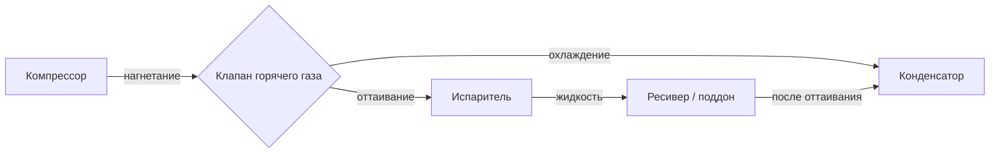

Испаритель прямого расширения (direct expansion evaporator, DX evaporator) поглощает теплоту непосредственно из воздуха или жидкости, испаряя хладагент внутри труб теплообменника. Расход хладагента регулируется расширительным устройством в соответствии с тепловой нагрузкой — хладагент полностью испаряется и выходит в виде перегретого пара. Это принципиально отличает DX от затопленных испарителей, где поверхности постоянно смочены жидкостью.

DX-испарители доминируют в диапазоне мощностей от нескольких киловатт до нескольких сотен киловатт: жилые и коммерческие системы кондиционирования воздуха, коммерческое холодоснабжение, транспортное охлаждение.

## Конструкция пластинчато-трубного змеевика

Медные трубки переносят хладагент, алюминиевые рёбра, механически закреплённые или припаянные к трубкам, увеличивают площадь теплопередачи со стороны воздуха. Трубки стандартных диаметров 9,5 мм (3/8") и 12,7 мм (1/2") расположены в шахматном порядке для улучшения теплообмена.

**Плотность рёбер (fin pitch)** выбирается по условиям эксплуатации:
- 8–10 рёбер/дюйм (315–394 рёбер/м) — низкотемпературное холодоснабжение, интенсивное намерзание инея
- 10–12 рёбер/дюйм (394–472 рёбра/м) — среднетемпературное охлаждение
- 12–14 рёбер/дюйм (472–551 ребро/м) — кондиционирование воздуха
- 14–16 рёбер/дюйм (551–630 рёбер/м) — высокоэффективные системы без образования инея

Более плотное расположение рёбер повышает чувствительную производительность, но требует более частого оттаивания при работе ниже 0 °C.

**Глубина (ряды трубок)** — определяет перепад давления хладагента и теплопередающую мощность:
- 2–3 ряда — жилые кондиционеры, минимальный перепад давления
- 4–6 рядов — коммерческие системы, сбалансированная производительность
- 6–8 рядов — максимальная мощность при ограниченной площади входного сечения

Каждый дополнительный ряд увеличивает производительность, но и перепад давления хладагента. Чрезмерная глубина вызывает значительное снижение температуры насыщения по длине контура, снижая КПД системы.

## Скорость воздуха и аэродинамика змеевика

Скорость воздуха на входном сечении (face velocity) непосредственно влияет как на коэффициент теплоотдачи со стороны воздуха, так и на удаление влаги.


h_\text{возд} = C \cdot V_\text{вх}^{0{,}8}


где $C$ — геометрическая константа, зависящая от типа и шага рёбер.


| Применение | $V_\text{вх}$, м/с | Примечания |
|-----------|-------------------|-----------|
| Комфортное кондиционирование | 1,5–2,5 | Стандарт ASHRAE |
| Осушение | 1,3–1,8 | Увеличенное время контакта воздуха |
| Коммерческое холодоснабжение | 2,0–3,0 | Равномерность потока в камере |
| Технологическое охлаждение | 1,0–2,0 | Точное управление температурой |
| Блочные воздухоохладители | 2,5–4,0 | Преодоление температурного расслоения |


Увеличение скорости выше рекомендуемой вызывает унос капель влаги (moisture carryover) и повышенный шум; снижение — ухудшение теплоотдачи и увеличение требуемой глубины змеевика.

## Распределение хладагента

Качество распределения хладагента по контурам напрямую определяет производительность. Неравномерное распределение приводит к тому, что одни контуры голодают (перегрев слишком высокий), другие переполнены (перегрев недостаточный или возврат жидкости).

### Типы распределителей

**Распределители с откалиброванными отверстиями (orifice distributors):** фиксированные отверстия делят поток пропорционально перепаду давления. Просты, надёжны. Чувствительны к содержанию флэш-газа (flash gas) после расширительного клапана и неравномерности уровня жидкости.

**Вентурные распределители (venturi distributors):** конфузорно-диффузорные сопла создают стабильный перепад давления. Лучше работают при переменной нагрузке. Доля флэш-газа по-прежнему влияет на равномерность.

**Сопловые распределители (nozzle distributors):** прецизионно обработанные отверстия атомизируют хладагент для улучшения равномерности. Наиболее точны при переменных условиях.

Длина распределительных трубок (feeder tubes) от распределителя до контура: 30–61 см для полного перемешивания и завершения процесса расширения. Превышение этой длины не улучшает распределение, но увеличивает гидравлические потери.

### Схемы контуров

**Чередующиеся контуры (interleaved circuits):** трубки из разных контуров чередуются по глубине пучка. Равномерное распределение температуры со стороны воздуха. Более высокий перепад давления хладагента.

**Контуры по секциям (face-split circuits):** каждый контур обслуживает определённую секцию входного сечения. Простота коллектора, меньший перепад давления. Риск температурного расслоения по входу.

Число контуров:


| Мощность | Число контуров |
|---------|----------------|
| ≤ 17,6 кВт | 2–4 |
| 17,6–70 кВт | 4–8 |
| > 70 кВт | 8–12 |


Избыточное число контуров снижает скорость хладагента и ухудшает возврат масла. Недостаточное — вызывает высокий перепад давления.

## Управление перегревом

Перегрев (superheat) — ключевой параметр управления DX-испарителем:


\Delta T_{sh} = T_\text{всас} - T_\text{нас}(P_\text{всас})


Слишком высокий перегрев (> 10 °C) — испаритель недокармливается, снижается производительность, компрессор перегревается. Слишком низкий перегрев (< 2 °C) — риск возврата жидкости в компрессор (liquid slugging).

### Термостатический расширительный клапан (TXV / TEV)

TXV механически регулирует расход хладагента через баланс трёх сил на диафрагме:


P_\text{колбы} \cdot A = (P_\text{evap} + P_\text{пружины}) \cdot A


Колба заполнена хладагентом или кросс-зарядным флюидом и термически контактирует с линией всасывания. При росте перегрева давление в колбе растёт → клапан открывается → больше хладагента подаётся в испаритель.

**Целевые значения перегрева при TXV:**
- Кондиционирование воздуха: 4,4–6,7 °C
- Среднетемпературное охлаждение: 3,3–5,6 °C
- Низкотемпературное охлаждение: 5,0–8,0 °C

**Внутренний уравнитель** — для систем с перепадом давления в испарителе < 0,3 бар. **Внешний уравнитель** — обязателен при перепаде > 0,3 бар, при наличии распределителя или теплообменника в линии всасывания; регистрирует давление на выходе испарителя, компенсируя снижение температуры насыщения по длине.

Регулировка TXV: вращение штока регулировки по часовой стрелке — увеличивает усилие пружины → повышает перегрев. Выдерживать 10–15 мин между корректировками для стабилизации.

### Электронный расширительный клапан (EEV)

EEV управляется микропроцессором по измеренным температуре и давлению всасывания:


\text{Position} = K_p \cdot e(t) + K_i \cdot \int e(t)\,dt + K_d \cdot \frac{de(t)}{dt}


где $e(t)$ — отклонение перегрева от уставки.

**Преимущества EEV:** точность удержания перегрева ±0,5 °C против ±2 °C у TXV; быстрый отклик при переменной нагрузке; целевой перегрев 2,2–4,4 °C вместо 4,4–6,7 °C — это увеличивает эффективное использование поверхности испарителя и повышает производительность на 3–8 %; возможность диагностики и дистанционного мониторинга; оптимальная работа с инверторными компрессорами (variable-speed).

**Явление охоты (hunting):** клапан циклически переполняет и недокармливает испаритель. Причины: чрезмерный размер клапана, неправильное расположение датчиков, неоптимальные коэффициенты ПИД-регулятора. Решение: уменьшить $K_p$, проверить расположение датчиков температуры.

## Оттаивание

При температуре поверхности змеевика ниже 0 °C и наличии влаги в воздухе иней нарастает, блокируя проходы для воздуха и снижая теплопередачу. Потеря производительности до оттаивания — 30–50 %.

### Оттаивание горячим газом (Hot Gas Defrost)

Газ нагнетания компрессора направляется через специальный клапан непосредственно в испаритель, минуя конденсатор. Хладагент конденсируется в испарителе, отдавая теплоту инею изнутри.





Продолжительность: 10–20 мин. Наиболее энергоэффективный метод — использует теплоту цикла. После завершения: выдержка 2–5 мин для стекания жидкости перед возобновлением охлаждения.

### Электрическое оттаивание

Нагревательные элементы сопротивления (ТЭН), расположенные вдоль поверхности змеевика, нагревают иней снаружи. Завершение — по достижении температуры змеевика +7,2…+12,8 °C (датчик на трубке).

Мощность нагревателей: 0,085–0,23 кВт/кВт холода. Продолжительность: 20–30 мин. Энергозатраты на оттаивание: 5–15 % годового электропотребления системы в зависимости от частоты и режима работы.

**Нагреватели поддона** — обязательный элемент для предотвращения замерзания слива конденсата при температурах в камере ниже 0 °C.

### Воздушное оттаивание (Off-Cycle Defrost)

Компрессор отключается, вентиляторы продолжают работу — воздух помещения плавит иней. Применимо только при температуре в камере выше +4,4 °C. Продолжительность: 1–2 ч. Нулевые затраты на нагрев, но значительный нагрев продукции в период оттаивания.

### Инициирование и завершение оттаивания

| Метод инициирования | Особенности |
|--------------------|-------------|
| По времени (time-clock) | Фиксированные интервалы, 6–12 ч; возможны лишние циклы |
| По требованию (demand) | Датчик перепада давления воздуха или тока вентилятора; экономит энергию |
| По температуре | Низкая температура трубок = сигнал о намерзании |

Завершение: по достижении температуры трубки +7,2…+15,6 °C (полное удаление инея).

## Применение

**Системы кондиционирования воздуха:** жилые сплит-системы, крышные (rooftop) агрегаты, центральные обрабатывающие установки. Площадь входного сечения 0,19–0,56 м²/кВт. Стандартные условия: температура испарения 1,7–7,2 °C, значительно выше точки замерзания при нормальной влажности — оттаивание не требуется.

**Коммерческое холодоснабжение:** холодильные и морозильные камеры, проходные витрины, выставочное холодильное оборудование. Среднетемпературные системы ($-2$…+4 °C температура трубок): 2–4 цикла оттаивания/сут. Низкотемпературные (ниже −17,8 °C): 4–6 и более циклов/сут, широкий шаг рёбер 315–394 ребра/м.

**Блочные воздухоохладители (unit coolers):** подвешиваются к потолку холодильной камеры. Скорость воздуха 2,5–4,0 м/с преодолевает температурное расслоение в высоких камерах. Многоскоростные вентиляторы оптимизируют энергопотребление при переменной нагрузке.

**Транспортное охлаждение:** компактные DX-испарители в грузовых автомобилях, прицепах и рефрижераторных контейнерах. Виброустойчивые конструкции и паяные соединения. Плотный шаг рёбер — максимальная мощность при минимальном объёме. Частое открывание дверей вводит большое количество влаги → интенсивное намерзание → актуальность эффективного оттаивания.

## Деградация производительности и диагностика


| Симптом | Вероятная причина | Действие |
|---------|------------------|----------|
| Высокий перегрев (> 10 °C) | Голодание клапана, засорение фильтра | Отрегулировать TXV, проверить фильтр-осушитель |
| Низкий перегрев (< 2 °C) | Переполнение клапана, плохое распределение | Отрегулировать TXV/EEV, проверить распределитель |
| Нарастание инея на части змеевика | Неравномерное распределение по контурам | Проверить распределитель, очистить отверстия |
| Высокий перепад давления воздуха | Иней, загрязнение рёбер | Оттаивание, чистка рёбер |
| Снижение холодопроизводительности | Утечка хладагента, загрязнение | Проверить заряд, очистить поверхности |


Правильный выбор типа распределителя, числа контуров и метода оттаивания формирует базу надёжной и энергоэффективной работы DX-системы на протяжении всего срока службы оборудования.
