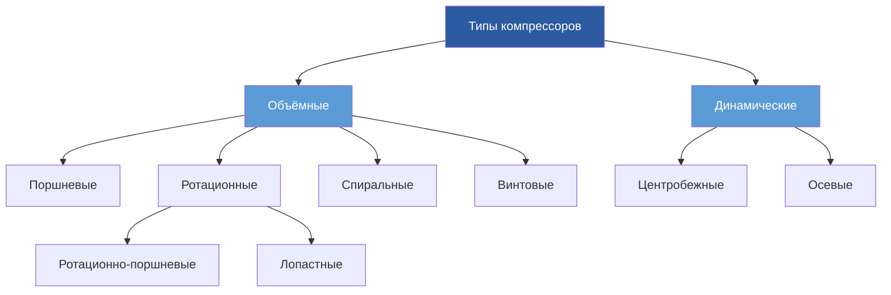

# Компрессоры в Холодильных Системах

Компрессоры служат механическим сердцем холодильных систем с паровым сжатием, выполняя критическую функцию повышения давления и температуры хладагента для обеспечения отвода тепла в конденсаторе. Компрессор потребляет большую часть энергии системы, обычно 60-80% от общей мощности на входе, что делает выбор и эксплуатацию компрессора фундаментальными для эффективности и производительности системы.

## Основной Термодинамический Процесс

Процесс сжатия преобразует низкодавления, низкотемпературный паровой хладагент из испарителя в высокодавления, высокотемпературный пар, подходящий для конденсации. При идеальном адиабатном сжатии энтропия остаётся постоянной (Δs = 0), но реальные компрессоры испытывают необратимость, вызванную трением, теплообменом и потерями давления.

Идеальная работа сжатия на единицу массы составляет:

$$W_{ideal} = h_2s - h_1 = c_p(T_2s - T_1)$$

Где $h_1$ — энтальпия всасывания, $h_2s$ — энтальпия нагнетания при адиабатном сжатии, и $T_2s$ — адиабатная температура нагнетания.

Фактическая работа сжатия превышает идеальное значение из-за необратимости:

$$W_{actual} = h_2 - h_1 = \frac{h_2s - h_1}{\eta_{isen}}$$

Где $\eta_{isen}$ — адиабатный КПД, обычно находящийся в диапазоне от 0,65 до 0,85 в зависимости от типа компрессора и условий эксплуатации.

## Типы Компрессоров и Принципы Работы

### Поршневые Компрессоры

Поршневые компрессоры используют поршне-цилиндровые узлы для сжатия хладагента через механическое вытеснение. Процесс сжатия следует четырёхтактному циклу, аналогичному двигателям внутреннего сгорания: всасывание, сжатие, нагнетание и повторное расширение.

Объёмный КПД учитывает повторное расширение хладагента, оставшегося в мёртвом объёме:

$$\eta_v = 1 + C - C\left(\frac{P_d}{P_s}\right)^{1/n}$$

Где $C$ — отношение мёртвого объёма (обычно 0,02-0,05), $P_d$ — давление нагнетания, $P_s$ — давление всасывания, и $n$ — показатель политропы (1,1-1,3 для хладагентов).

**Основные характеристики:**
- Диапазон мощности: 0,5-200+ кВт
- Возможность степени сжатия: до 10:1 для одной ступени
- Эффективность при частичной нагрузке: хорошая с разгрузкой цилиндров
- Типичный адиабатный КПД: 0,65-0,75

### Спиральные Компрессоры

Спиральные компрессоры используют два элемента с спиралевидным профилем — один неподвижный, один обращающийся — для сжатия хладагента через прогрессивно уменьшающиеся полости, движущиеся от внешнего края к центральному отверстию нагнетания. Этот непрерывный процесс сжатия обеспечивает плавную работу без пульсаций.

Степень сжатия геометрически фиксирована профилем спирали:

$$r_v = \frac{V_{outer}}{V_{inner}} = \frac{2\pi(r_o^2 - r_i^2)h}{2\pi r_i^2 h} = \frac{r_o^2 - r_i^2}{r_i^2}$$

Где $r_o$ — внешний радиус, $r_i$ — внутренний радиус нагнетания, и $h$ — высота спирали.

**Основные характеристики:**
- Диапазон мощности: 1,5-50 кВт
- Меньше движущихся деталей, чем в поршневом компрессоре
- Типичный адиабатный КПД: 0,70-0,80
- Ограниченная модуляция мощности без дополнительных механизмов
- Низкий уровень шума и вибрации

### Винтовые Компрессоры

Винтовые компрессоры используют зацепляющиеся спиральные роторы (самец и самка) для сжатия хладагента по мере его движения вдоль оси через прогрессивно уменьшающийся объём между роторами и корпусом. Встроённая степень сжатия геометрически определяется углом спирали и расположением портов.

Встроённая степень сжатия должна соответствовать степени давления для эффективной работы:

$$r_{v,built-in} = \left(\frac{P_d}{P_s}\right)^{1/\gamma}$$

Несоответствие приводит к недосжатию (требуется дополнительное сжатие на нагнетании) или пересжатию (дросселирование на нагнетании).

**Основные характеристики:**
- Диапазон мощности: 20-1000+ кВт
- Непрерывный процесс сжатия
- Отличная эффективность при частичной нагрузке с модуляцией крутящего момента
- Типичный адиабатный КПД: 0,75-0,85
- Требуется впрыск масла для уплотнения и охлаждения

### Центробежные Компрессоры

Центробежные компрессоры передают кинетическую энергию паровому хладагенту через вращение рабочего колеса с высокой скоростью (10 000-30 000 об/мин), затем преобразуют скорость в давление в диффузоре. Уравнение Эйлера для турбомашин определяет передачу энергии:

$$h_2 - h_1 = \frac{U_2V_{t2} - U_1V_{t1}}{g_c}$$

Где $U$ — скорость на периферии рабочего колеса, $V_t$ — компонента касательной скорости, и индексы 1 и 2 обозначают условия на входе и выходе.

**Основные характеристики:**
- Диапазон мощности: 100-10 000+ кВт
- Степень сжатия на ступень: 1,5-4,0:1
- Требуется несколько ступеней для высокого подъёма
- Типичный адиабатный КПД: 0,75-0,85
- Ограничения помпажа ограничивают минимальную мощность
- Доступно масло-свободное сжатие

## Сравнение Характеристик Компрессоров

| Тип Компрессора | Диапазон Мощности (кВт) | КПД (Адиабатный) | Производительность при Частичной Нагрузке | Обслуживание | Уровень Шума |
|-----------------|----------------------|------------------------|----------------------|-------------|-------------|
| Поршневой   | 0,18-70           | 0,65-0,75           | Хороший                 | Высокое        | Высокий        |
| Спиральный          | 0,53-17,6            | 0,70-0,80           | Ограниченный              | Низкое         | Низкий         |
| Винтовой           | 7-350+          | 0,75-0,85           | Отличный            | Среднее    | Средний    |
| Центробежной     | 35-3500+       | 0,75-0,85           | Хороший (VFD)           | Низкое         | Низкий         |

## Факторы Производительности и Критерии Выбора

### Эксплуатационный Диапазон

Каждый тип компрессора имеет определённый эксплуатационный диапазон, ограниченный:
- **Максимальная температура нагнетания**: Обычно 121-149°C для предотвращения разложения масла и повреждения клапанов
- **Максимальная степень сжатия**: Ограничена механическим напряжением и мощностью двигателя
- **Минимальное давление всасывания**: Предотвращает перегрев двигателя в герметичных агрегатах
- **Предел помпажа**: Только для центробежных компрессоров

### Методы Модуляции Мощности

Эффективность модуляции мощности прямо влияет на производительность при частичной нагрузке:

**Поршневой:**
- Разгрузка цилиндров: Ступени 25%, 50%, 75%, 100%
- Перепуск горячего газа: Непрерывный, но неэффективный
- Переменная скорость (VFD): Непрерывная и эффективная

**Спиральный:**
- Цифровая спираль: Циклирование вкл/выкл с усреднением по времени
- Переменная скорость (VFD): Непрерывная модуляция
- Двухступенчатое сжатие: Расширенный диапазон мощности

**Винтовой:**
- Крутящий момент: Непрерывный от 10-100%, высоко эффективный
- Переменная скорость (VFD): Дальнейшее улучшение эффективности

**Центробежной:**
- Направляющие лопатки входа: Предварительное закручивание снижает мощность 40-100%
- Переменная скорость (VFD): Наиболее эффективная, 10-100%
- Перепуск горячего газа: Только в аварийных ситуациях, крайне неэффективный

### Конфигурации Двигателя и Привода

Типы двигателей компрессора влияют на надёжность, эффективность и ремонтопригодность:

**Открытый привод:** Отдельный двигатель, соединённый через муфту вала. Позволяет обслуживание двигателя без отвода хладагента. Используется в крупных промышленных приложениях.

**Герметичный:** Двигатель и компрессор герметизированы в сварном корпусе. Охлаждение обмоток двигателя хладагентом. Часто встречается в жилых и лёгких коммерческих приложениях. Не подлежит полевому ремонту.

**Полугерметичный:** Болтовой корпус обеспечивает доступ к двигателю. Сочетает преимущества герметичной конструкции с ремонтопригодностью. Промышленные и коммерческие приложения.

## Метрики Эффективности и Стандарты

### Адиабатный КПД

Адиабатный КПД сравнивает фактическую работу с идеальной адиабатной работой:

$$\eta_{isen} = \frac{h_{2s} - h_1}{h_2 - h_1} = \frac{W_{ideal}}{W_{actual}}$$

Стандарт ASHRAE 23 устанавливает процедуры тестирования для оценки эффективности компрессора в стандартизированных условиях. Опубликованные точки рейтинга обычно включают условия стандарта AHRI 540 (температура испарения 1,7°C, конденсации 40,6°C для кондиционирования).

### Объёмный КПД

Объёмный КПД связывает фактический массовый расход хладагента с вытеснением:

$$\eta_v = \frac{\dot{m}_{actual} \cdot v_1}{V_{displacement}}$$

Где $v_1$ — удельный объём при всасывании, и $V_{displacement}$ — вытесняемый объём в единицу времени.

Факторы, снижающие объёмный КПД, включают:
- Повторное расширение мёртвого объёма (поршневые)
- Падение давления на впускном клапане
- Нагрев хладагента в цилиндре/роторе
- Внутренние утечки (износ деталей)

### КПД Сжатия

Общий КПД сжатия сочетает термодинамические и механические потери:

$$\eta_{compression} = \eta_{isen} \cdot \eta_{mechanical}$$

Механический КПД учитывает потери трения в подшипниках, уплотнениях и деталях привода. Типичные значения варьируются от 0,85-0,95.

## Рассмотрения Применения

### Совместимость с Хладагентом

Конструкция компрессора должна учитывать свойства хладагента:
- **Степень сжатия**: Приложения с высоким подъёмом (R-410A) требуют прочной конструкции
- **Температура нагнетания**: R-410A производит более высокие температуры нагнетания, чем R-134a
- **Смазывающие свойства**: R-134a и HFO требуют полиэфирных (POE) смазок
- **Плотность**: Низкоплотные хладагенты (R-123) требуют большего вытеснения

### Интеграция Системы

Надлежащее применение компрессора требует внимания к:
- **Перегрев всасывания**: 5,5-11°C предотвращает гидравлический удар
- **Возврат масла**: Минимальная скорость хладагента (213-305 м/мин в вертикальных участках)
- **Виброизоляция**: Критична для поршневых компрессоров
- **Нагреватели картера**: Предотвращают миграцию хладагента при остановке
- **Соответствие Мощности**: Испаритель и конденсатор должны уравновешивать мощность компрессора

### Звук и Вибрация

Шум компрессора происходит от:
- Пульсации газа: Поршневые и винтовые (требуются глушители)
- Механическая вибрация: Неуравновешенные силы
- Охлаждающие вентиляторы двигателя: Воздушный шум

Стандарт ASHRAE 15 устанавливает требования безопасности, включая предохранительные клапаны и защиту двигателя. Местные коды могут устанавливать ограничения на звук (обычно 65-75 дBA на границе участка).

## Надёжность и Обслуживание

Типичные режимы отказа включают:
- **Отказ подшипника**: Недостаточная смазка или загрязнение
- **Сгорание двигателя**: Перегрузка, однофазная работа или перегрев
- **Отказ клапана**: Поршневые компрессоры, повреждение от гидравлического удара
- **Отказ уплотнения**: Открытые приводы, утечка хладагента
- **Загрязнение масла**: Влага, кислота или частицы

Профилактическое обслуживание продлевает срок службы компрессора:
- Регулярный анализ масла (кислотное число, влага, содержание металлов)
- Мониторинг вибрации (состояние подшипника)
- Тренд давления и температуры всасывания и нагнетания
- Электрический мониторинг (напряжение, ток, коэффициент мощности)
- Проверка заправки хладагентом

Руководящий принцип ASHRAE 3 устанавливает рекомендуемые практики для мониторинга и планирования обслуживания компрессора на основе рабочих часов и условий.

## Передовые Технологии

Современные разработки компрессоров сосредоточены на эффективности и экологических характеристиках:
- **Приводы с переменной скоростью**: Улучшают эффективность при частичной нагрузке на 15-30%
- **Двухступенчатое сжатие**: Снижают температуру нагнетания, улучшают эффективность в приложениях с высоким подъёмом
- **Магнитные подшипники**: Исключают необходимость масляной смазки в центробежных компрессорах
- **Передовые материалы**: Снижают вес и улучшают долговечность
- **Интегрированная электроника**: Мониторинг состояния и прогнозное обслуживание

Компрессор остаётся наиболее критичным компонентом в производительности холодильной системы, эффективности и надёжности. Надлежащий выбор требует комплексного анализа требований мощности, условий эксплуатации, целей эффективности и затрат жизненного цикла.
