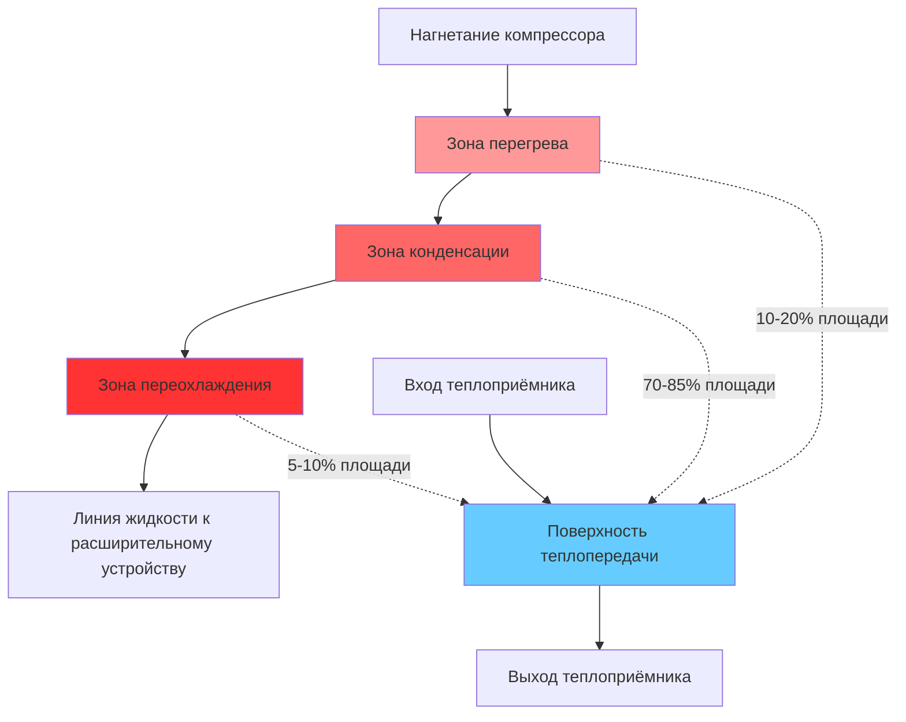

## Основы конденсаторов

Конденсаторы выполняют критическую функцию отвода тепла, поглощённого испарителем, плюс энергия, добавленная компрессором. Отвод тепла происходит в результате фазового перехода паров хладагента в жидкость при повышенных давлении и температуре. Скорость отвода тепла в конденсаторе определяет общую производительность и эффективность системы.

Общий отвод тепла в конденсаторе следует из энергетического баланса:

$$Q_c = Q_e + W_{comp} = \dot{m}_r (h_2 - h_3)$$

где $Q_c$ — отвод тепла в конденсаторе, $Q_e$ — производительность испарителя, $W_{comp}$ — входная мощность компрессора, $\dot{m}_r$ — массовый расход хладагента, а $h_2$, $h_3$ — энтальпия хладагента на входе и выходе конденсатора соответственно.

Для типичных циклов сжатия паров конденсатор отводит в 1,2–1,4 раза больше тепла, чем производительность испарителя, причём соотношение увеличивается при более высоких степенях сжатия.

## Процесс теплопередачи

Процесс конденсации включает три отчётливые зоны в конденсаторе:

### Зона перегрева

Перегретый пар, поступающий от компрессора, охлаждается чувственно до температуры насыщения. Эта зона обычно составляет 10–20% от общей площади теплопередачи. Коэффициент теплопередачи остаётся относительно низким из-за однофазного потока паров.

### Зона конденсации

Основная теплопередача происходит во время фазового перехода при постоянной температуре насыщения. Плёночная конденсация на поверхностях труб обеспечивает высокие коэффициенты теплопередачи, обычно 1000–3000 Вт/м²·К для горизонтальных труб. Эта зона составляет 70–85% общей площади конденсатора.

### Зона переохлаждения

Жидкий хладагент охлаждается ниже температуры насыщения, обеспечивая запас безопасности против образования газов-вспышек в трубопроводе жидкости. Переохлаждение на 5–10°C является стандартной практикой. Эта зона составляет 5–10% площади конденсатора.

Общая теплопередача следует:

$$Q_c = UA \cdot LMTD$$

где $U$ — общий коэффициент теплопередачи (Вт/м²·К), $A$ — площадь поверхности теплопередачи (м²), а $LMTD$ — логарифмическая средняя разность температур (К):

$$LMTD = \frac{(T_{c,in} - T_{ambient,out}) - (T_{c,out} - T_{ambient,in})}{\ln\left(\frac{T_{c,in} - T_{ambient,out}}{T_{c,out} - T_{ambient,in}}\right)}$$

## Типы конденсаторов

### Воздухоохлаждаемые конденсаторы

Воздухоохлаждаемые конденсаторы используют окружающий воздух в качестве теплоприёмника с рёбристыми трубами для увеличения теплопередачи со стороны воздуха. Эти конденсаторы доминируют в жилых и лёгких коммерческих применениях благодаря низкой стоимости установки и минимальным требованиям к обслуживанию.

**Характеристики конструкции:**
- Скорости на лицевой поверхности: 2,0–3,5 м/с через змеевик
- Расстояние между рёбрами: 12–20 рёбер на дюйм
- Материалы труб: медные трубы с алюминиевыми рёбрами
- Подъём температуры воздуха: 8–15°C
- Температура конденсации: окружающая + 10–20°C

Коэффициент теплопередачи со стороны воздуха (15–30 Вт/м²·К) ограничивает общую производительность. Расширенные рёберные поверхности обеспечивают коэффициенты площади 10:1–20:1 (площадь рёбер к площади трубы).

### Водоохлаждаемые конденсаторы

Водоохлаждаемые конденсаторы достигают превосходной теплопередачи благодаря высокой тепловой ёмкости воды и коэффициентам теплопередачи. Конструкции «кожухотрубные» преобладают в крупных установках.

**Кожухотрубные конфигурации:**
- Горизонтальный кожух с конденсацией хладагента снаружи труб
- Скорости воды: 1,0–2,5 м/с через трубы
- Материалы труб: медь, адмиралтейская латунь, медно-никелевый сплав или титан
- Подъём температуры воды: 5–10°C
- Подход температуры: 2–5°C (температура конденсации - температура выходящей воды)

Коэффициент теплопередачи со стороны воды (2000–5000 Вт/м²·К) обеспечивает компактные конструкции с температурами конденсации всего на 5–8°C выше температуры входящей воды.

При проектировании необходимо учитывать сопротивление загрязнению:

$$\frac{1}{U} = \frac{1}{h_r} + R_{f,r} + \frac{t_w}{k_w} + R_{f,w} + \frac{1}{h_w}$$

где $R_f$ представляет коэффициенты загрязнения (м²·К/Вт), обычно 0,00009 для стороны хладагента и 0,00018–0,00035 для стороны воды согласно стандартам ASHRAE.

### Испарительные конденсаторы

Испарительные конденсаторы объединяют теплопередачу и массообмен, распыляя воду над трубами хладагента, пока воздух проходит через установку. Испарение распыляемой воды обеспечивает улучшенное охлаждение, приближаясь к температуре по влажному термометру, а не по сухому.

**Преимущества производительности:**
- Температура конденсации: по влажному термометру + 8–12°C
- На 5–10°C ниже температуры конденсации чем воздухоохлаждаемые при одинаковой окружающей температуре
- Расход воды: 2–5 л/ч на кВт отвода тепла
- Компактный размер по сравнению с воздухоохлаждаемыми конструкциями

Отвод тепла включает как чувственные, так и скрытые компоненты:

$$Q_c = \dot{m}_a c_{p,a} (T_{out} - T_{in}) + \dot{m}_w h_{fg} (W_{out} - W_{in})$$

где $\dot{m}_a$ — массовый расход воздуха, $\dot{m}_w$ — скорость испарения воды, а $W$ — коэффициент влажности.

## Сравнение производительности конденсаторов

| Параметр | Воздухоохлаждаемый | Водоохлаждаемый | Испарительный |
|-----------|------------|--------------|-------------|
| Температура конденсации (35°C окружающая) | 45–50°C | 38–42°C | 40–44°C |
| Общее значение U | 20–40 Вт/м²·К | 800–1200 Вт/м²·К | 400–700 Вт/м²·К |
| Начальная стоимость (относительная) | 1,0 | 1,5–2,0 | 1,3–1,6 |
| Расход воды | Нет | 40–60 л/ч·кВт | 2–5 л/ч·кВт |
| Требование к обслуживанию | Низкое | Среднее-Высокое | Среднее |
| Типичная эффективность (EER) | 9–11 | 13–16 | 11–14 |

## Управление производительностью

Модуляция производительности конденсатора поддерживает надлежащее давление конденсации при различных нагрузках и условиях окружающей среды:

### Управление площадью лицевой поверхности

Включение/отключение по циклам или ступенчатое управление вентиляторами воздухоохлаждаемых конденсаторов обеспечивает поэтапное снижение производительности. Приводы переменной скорости обеспечивают непрерывную модуляцию с экономией энергии 20–40% при частичной нагрузке.

### Наводнение хладагентом

Уменьшение активной площади конденсатора путём заполнения труб жидким хладагентом снижает производительность теплопередачи. Этот метод обеспечивает плавное снижение производительности, но уменьшает переохлаждение.

### Управление давлением нагнетания

Поддержание минимального давления конденсации обеспечивает надлежащую работу расширительного клапана и возврат масла. Методы управления включают:
- Включение/отключение вентилятора с переключателями давления
- Заслонки, ограничивающие поток воздуха
- Клапаны затопления конденсатора
- Обход горячего газа

Стандарт ASHRAE 15 требует минимального давления конденсации приблизительно 690 кПа (100 psig) для систем R-22, чтобы обеспечить минимальное давление жидкости 55 кПа на расширительных клапанах.

## Выбор и проектирование конденсатора

Ключевые критерии выбора включают:

**Расчёты нагрузки:**
- Расчётный отвод тепла: 1,25 × пиковая нагрузка испарителя
- Коэффициент безопасности: 1,1–1,15 расчётной производительности
- Корректировка по высоте: 4% на каждые 300 м над уровнем моря

**Разности температур:**
- Воздухоохлаждаемый: TD = 10–20°C при расчётных условиях
- Водоохлаждаемый: TD = 5–8°C, подход = 2–5°C
- Испарительный: TD = 8–12°C выше температуры по влажному термометру

**Выбор материала:**
Устойчивость к коррозии определяет материалы труб и рёбер в зависимости от условий эксплуатации и химии охлаждающей среды. Прибрежные установки требуют улучшенной защиты от коррозии.

## Оптимизация производительности

Поддержание производительности конденсатора требует:

**Обслуживание стороны воздуха:**
- Очистка змеевика для удаления грязи, волокон и мусора
- Выпрямление рёбер для восстановления потока воздуха
- Натяжение ремня вентилятора и смазка подшипников
- Проверка ампеража двигателя

**Обслуживание стороны воды:**
- Очистка труб механическими или химическими методами каждые 1–2 года
- Обработка воды для контроля отложений, коррозии и биологического роста
- Мониторинг температуры подхода как индикатора загрязнения

**Заправка хладагентом:**
- Надлежащая заправка обеспечивает номинальное переохлаждение (обычно 5–10°C)
- Недостаточная заправка снижает производительность и может вызвать повреждение компрессора
- Перезаправка затапливает конденсатор, уменьшая эффективную площадь

Загрязнение снижает производительность конденсатора, увеличивая тепловое сопротивление. Отложение накипи толщиной 0,4 мм может снизить коэффициент U на 50%, повысив температуру конденсации на 5–8°C и снизив эффективность системы на 15–25%.

## Заключение

Выбор и эксплуатация конденсатора напрямую влияют на производительность, эффективность и операционные затраты системы охлаждения. Надлежащий размер, выбор материала и техническое обслуживание обеспечивают расчётные температуры конденсации и оптимальное энергопотребление на протяжении всего жизненного цикла системы. Понимание механизмов теплопередачи и характеристик производительности каждого типа конденсатора позволяет принимать инженерные решения, которые сбалансируют первоначальные затраты, операционную эффективность и требования к обслуживанию.
