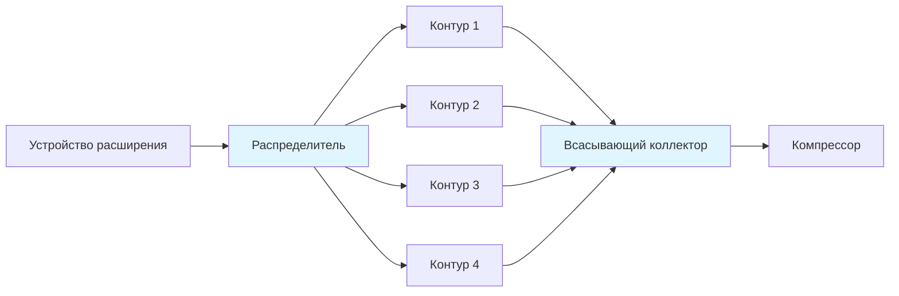

# Испарители в системах охлаждения

Испарители представляют собой компонент поглощения тепла в системах охлаждения, где жидкий хладагент претерпевает фазовое изменение в пар при одновременном извлечении тепловой энергии из кондиционируемого помещения или технологической жидкости. Испаритель является основной поверхностью теплопередачи на стороне низкого давления цикла охлаждения, работая при температурах ниже окружающей среды.

## Основные принципы теплопередачи

Процесс теплопередачи в испарителе включает три различных тепловых сопротивления в последовательности: конвекцию от воздуха или жидкости к наружной поверхности, теплопроводность через стенку трубки и любой слой инея, а также кипение с образованием пузырьков конвекцией от внутренней поверхности к хладагенту.

Общее уравнение теплопередачи, определяющее производительность испарителя:

$$Q_{evap} = U \cdot A \cdot \Delta T_{m}$$

Где:
- $Q_{evap}$ = производительность испарителя (Вт)
- $U$ = общий коэффициент теплопередачи (Вт/м²·К)
- $A$ = эффективная площадь теплопередачи (м²)
- $\Delta T_{m}$ = средняя разность температур (К)

Общий коэффициент теплопередачи объединяет отдельные сопротивления:

$$\frac{1}{U} = \frac{1}{h_{air}} + \frac{t_{tube}}{k_{tube}} + \frac{t_{frost}}{k_{frost}} + \frac{1}{h_{ref}}$$

Коэффициент теплопередачи со стороны хладагента во время испарения зависит от режима течения, при котором кипение с образованием пузырьков доминирует при низких качествах пара и конвективное кипение при более высоких качествах. Коэффициент со стороны воздуха варьируется в зависимости от скорости, геометрии ребер и того, работает ли катушка во влажных или сухих условиях.

## Классификация испарителей

### Системы прямого расширения (DX)

Испарители прямого расширения дозируют жидкий хладагент через устройство расширения непосредственно в катушку, где он полностью испаряется перед выходом. Хладагент выходит в виде перегретого пара, обычно с перегревом 4–6 К для стабильного управления расширительным клапаном.

**Преимущества:**
- Меньший заряд хладагента
- Более простая конструкция системы
- Лучший возврат масла
- Подходит для модульного оборудования

**Ограничения:**
- Неравномерное распределение хладагента в многоконтурных катушках
- Снижение эффективности теплопередачи из-за зоны перегрева
- Чувствительность к изменениям нагрузки

### Затопленные испарители

Затопленные конструкции поддерживают жидкий хладагент по всей поверхности теплопередачи, с разделением пара, происходящим в аккумуляторе или сепараторе. Хладагент остается при температуре насыщения по всей длине испарителя.

**Преимущества:**
- Более высокие коэффициенты теплопередачи
- Равномерные температуры поверхности
- Лучшее использование производительности
- Отличные показатели для низкотемпературных применений

**Ограничения:**
- Больший заряд хладагента
- Проблемы с возвратом масла
- Требует насоса циркуляции жидкости или гравитационной подачи

## Типы испарителей и применения

| Тип испарителя | Применение | Диапазон температур | Типичный h (Вт/м²·К) |
|----------------|-----------|-------------------|----------------------|
| Голая трубка | Чиллеры жидкости | -5 до 15°C | 500-1000 |
| Пластинчато-реберный | Охлаждение воздуха | -40 до 10°C | 20-60 |
| Микроканальный | Компактные блоки | -10 до 10°C | 25-70 |
| Кожухо-трубный | Технологическое охлаждение | -30 до 15°C | 800-2000 |
| Затопленный кожух | Крупные чиллеры | 2 до 12°C | 1500-3500 |
| Пластинчатый теплообменник | Охлаждение гликоля | -20 до 10°C | 2000-5000 |

### Оребренные трубчатые испарители

Оребренные трубчатые катушки увеличивают площадь поверхности со стороны воздуха для компенсации низкого коэффициента конвективной теплопередачи воздуха. Эффективность ребра определяет эффективность этой расширенной поверхности:

$$\eta_{fin} = \frac{\tanh(m \cdot L)}{m \cdot L}$$

$$m = \sqrt{\frac{2 \cdot h_{air}}{k_{fin} \cdot t_{fin}}}$$

Где $L$ представляет высоту ребра от центра трубы до края ребра. Алюминиевые ребра толщиной 0,1–0,2 мм достигают эффективности 75–90% в зависимости от расстояния между ребрами и геометрии.

### Кожухо-трубные испарители

Кожухо-трубные конструкции размещают хладагент на стороне кожуха для затопленной работы или на стороне трубок для DX работы. Затопленная работа со стороны кожуха обеспечивает превосходную теплопередачу через кипение с образованием пузырьков на поверхностях улучшенных трубок.

Усовершенствованные трубки с внешними ребрами, гребешками или пористыми покрытиями увеличивают коэффициенты теплопередачи при кипении на 200–400% по сравнению с гладкими трубками. Корреляция Россенова предсказывает производительность кипения с образованием пузырьков:

$$q'' = \mu_{l} \cdot h_{fg} \left[\frac{g(\rho_{l} - \rho_{v})}{\sigma}\right]^{1/2} \left[\frac{c_{p,l} \cdot \Delta T_{sat}}{C_{sf} \cdot h_{fg} \cdot Pr_{l}^{n}}\right]^{3}$$

## Распределение хладагента

Надлежащее распределение хладагента между параллельными контурами поддерживает равномерные температуры поверхности испарителя и максимизирует производительность. Плохое распределение создает голодающие контуры, работающие при сниженной производительности, и перегруженные контуры с чрезмерным перегревом.

Качество распределения зависит от:
- Конструкции распределителя (размер и количество отверстий)
- Качества хладагента, входящего в распределитель
- Потерь давления в питающей линии
- Вертикальной или горизонтальной ориентации катушки

ASHRAE Standard 15 требует распределителей хладагента на DX катушках с тремя или более контурами для обеспечения коэффициентов безопасности и предотвращения жидкостного удара в компрессоры.

## Образование инея и оттаивание

Испарители, работающие ниже 0°C с влажным воздухом, накапливают иней на наружных поверхностях. Иней действует как тепловая изоляция, снижая поток воздуха и теплопередачу. Тепловое сопротивление слоя инея увеличивается линейно с толщиной:

$$R_{frost} = \frac{t_{frost}}{k_{frost}}$$

Теплопроводность инея варьируется от 0,15–0,50 Вт/м·К в зависимости от плотности, которая варьируется от 100–600 кг/м³. Оттаивание становится необходимым, когда толщина инея достигает 3–6 мм или поток воздуха снижается на 15–20%.

### Методы оттаивания

| Метод | Источник энергии | Применение | Типичная длительность |
|-------|-----------------|-----------|----------------------|
| Цикл без нагрузки | Окружающий воздух | Выше -10°C | 20-45 мин |
| Горячий газ | Разряд компрессора | -40 до -10°C | 15-30 мин |
| Электрический | Резистивные нагреватели | Все температуры | 20-40 мин |
| Вода | Распыляемая вода | Выше -25°C | 10-20 мин |
| Обратный цикл | Реверс теплового насоса | Выше -15°C | 10-25 мин |

Оттаивание горячим газом перенаправляет разрядный газ компрессора через испаритель, конденсируя хладагент внутри трубок для передачи тепла наружу. Электрическое оттаивание обеспечивает точное управление, но потребляет значительную энергию. ASHRAE Standard 72 устанавливает процедуры испытаний оттаивания для рейтингования и сравнения.

## Модуляция производительности

Производительность испарителя реагирует на температуру хладагента, поток воздуха и условия входящей жидкости. Метод логарифмической средней разности температур (LMTD) рассчитывает среднюю движущую силу:

$$\Delta T_{m} = \frac{(T_{in} - T_{evap}) - (T_{out} - T_{evap})}{\ln\left[\frac{T_{in} - T_{evap}}{T_{out} - T_{evap}}\right]}$$

Заслонки расщепления лица, вентиляторы с переменной скоростью и ступенчатое управление контурами хладагента модулируют производительность в соответствии с нагрузкой. Сниженный поток воздуха снижает производительность, но увеличивает осушение через более холодные температуры катушки и более длительное время пребывания.

## Оптимизация производительности

Максимизация эффективности испарителя требует:

1. **Надлежащей скорости хладагента** (1,5–3,5 м/с) для поддержания увлечения масла и высоких коэффициентов теплопередачи
2. **Надлежащего управления перегревом** (4–6 К) балансирования использования производительности и защиты компрессора
3. **Достаточной скорости воздуха** (2–2,5 м/с фасадная скорость) для вынужденной конвекции без чрезмерного падения давления
4. **Регулярного обслуживания**, удаляющего грязевые отложения, действующие как изоляция (очистка восстанавливает 10–30% производительности)
5. **Оптимизированного расстояния между ребрами** (2–4 мм для условий выше точки замерзания, 4–8 мм для приложений с образованием инея)

Испаритель представляет приблизительно 25–35% общей стоимости системы охлаждения, но непосредственно определяет производительность охлаждения и эффективность. Надлежащий выбор и эксплуатация обеспечивают проектную производительность в течение всего срока службы системы.

## Критерии выбора

Выбор испарителя требует согласования производительности, физических ограничений и экономических факторов:

- Величина и профиль охлаждающей нагрузки
- Доступная разность температур
- Ограничения пространства и ограничения по весу
- Тип хладагента и пределы заряда
- Диапазон рабочих температур
- Условия образования инея и требования оттаивания
- Доступность для обслуживания
- Первоначальная стоимость в зависимости от эксплуатационной эффективности
- Допуск по шуму и вибрации

Переразмеренные испарители обеспечивают более низкие эксплуатационные расходы за счет снижения потерь давления и улучшенной теплопередачи, но увеличивают первоначальную стоимость и заряд хладагента. Недоразмеренные блоки работают при более высоких разностях температур с повышенными степенями сжатия и сниженной эффективностью системы.

Обратитесь к справочнику ASHRAE—Refrigeration для получения подробных процедур выбора, расчетов потерь давления и рекомендаций, специфичных для приложений, по полному диапазону типов испарителей и условий эксплуатации.
