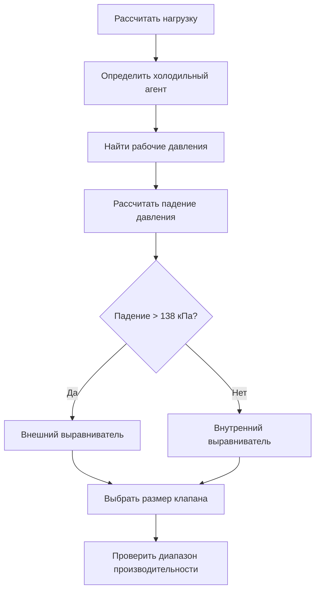

# Устройства расширения в системах охлаждения

Устройства расширения регулируют поток холодильного агента из высокого давления жидкости на низкое давление двухфазной смеси, контролируя перегрев и согласуя нагрузку испарителя с пропускной способностью компрессора. Процесс расширения принципиально изоэнтальпийный, преобразующий энергию давления в кинетическую энергию посредством дросселирования.

## Термодинамические основы

Процесс расширения происходит при постоянной энтальпии на устройстве:

$$h_3 = h_4$$

Где индекс 3 представляет входное отверстие линии жидкости, а индекс 4 — входное отверстие испарителя. Качество на входе испарителя составляет:

$$x_4 = \frac{h_4 - h_f}{h_{fg}}$$

Необратимый процесс дросселирования генерирует энтропию:

$$\Delta s = s_4 - s_3 > 0$$

Это производство энтропии представляет потерю потенциала работы, количественно определяемую потерей доступной энергии в процессе расширения.

## Капиллярные трубки

Капиллярные трубки обеспечивают фиксированное ограничение через медные трубки малого диаметра, обычно 0,79–2,51 мм внутреннего диаметра. Расход зависит от давления выше по потоку, давления ниже по потоку и переохлаждения холодильного агента.

### Уравнения проектирования

Массовый расход через капиллярную трубку следует эмпирическим корреляциям. Для условий критического потока (задушенный поток):

$$\dot{m} = C \cdot d^{2.5} \cdot \sqrt{\Delta P \cdot \rho_L}$$

Где:
- $C$ = эмпирический коэффициент расхода (0,38–0,42 для холодильных агентов)
- $d$ = внутренний диаметр (мм)
- $\Delta P$ = дифференциальное давление (кПа)
- $\rho_L$ = плотность жидкого холодильного агента (кг/м³)

### Характеристики применения

| Параметр | Типичный диапазон | Примечания |
|-----------|--------------|-------|
| Внутренний диаметр | 0,79–2,51 мм | Меньше для меньшей производительности |
| Длина | 0,91–6,10 м | Больше для большего ограничения |
| Рабочее давление | 1034–2068 кПа | Зависит от системы |
| Требуемое переохлаждение | 2,8–8,3 K | Предотвращает вспышку газа |

Капиллярные трубки обеспечивают простоту и низкую стоимость, но не могут модулировать производительность. Критическое количество заряда необходимо для надлежащей работы в различных условиях окружающей среды.

## Термостатические расширительные клапаны (TXV)

Термостатические расширительные клапаны модулируют поток холодильного агента для поддержания постоянного перегрева испарителя. Клапан реагирует на три силы давления, действующие на диафрагму.

### Баланс сил

TXV работает на основе равновесия сил:

$$P_{bulb} = P_{evap} + P_{spring}$$

Где:
- $P_{bulb}$ = давление в колбе (определение перегрева)
- $P_{evap}$ = давление испарителя (внутренний выравниватель) или давление линии всасывания (внешний выравниватель)
- $P_{spring}$ = давление пружины (установка перегрева)

### Рейтинг производительности

Производительность TXV оценивается в кВт охлаждения при стандартных условиях согласно стандарту AHRI 750. Фактическая производительность составляет:

$$Q_{actual} = Q_{rated} \cdot \sqrt{\frac{\Delta P_{actual}}{\Delta P_{rated}}} \cdot \left(\frac{\rho_{actual}}{\rho_{rated}}\right)^{0.5}$$

### Критерии выбора клапана

### Установка датчиковой колбы

Размещение колбы критически влияет на производительность:

- **Горизонтальные линии всасывания**: установите колбу в положение 4 или 8 часов
- **Диаметр линии всасывания < 22,2 мм**: установите колбу полностью вокруг линии
- **Диаметр линии всасывания ≥ 22,2 мм**: установите колбу на верхнюю часть (12 часов)
- **Местоположение**: на расстоянии 152–305 мм ниже по потоку от выхода испарителя, выше по потоку от соединения внешнего выравнивателя

## Электронные расширительные клапаны (EEV)

Электронные расширительные клапаны используют шаговые двигатели или импульсно-модулированное управление для управления потоком холодильного агента на основе электронных сигналов от датчиков температуры и давления.

### Алгоритмы управления

Современные EEV реализуют ПИ или ПИД управление:

$$u(t) = K_p \cdot e(t) + K_i \int_0^t e(\tau) d\tau + K_d \frac{de(t)}{dt}$$

Где:
- $u(t)$ = сигнал управления (положение клапана)
- $e(t)$ = ошибка (фактический перегрев − целевой перегрев)
- $K_p, K_i, K_d$ = коэффициенты пропорционального, интегрального, дифференциального действия

### Преимущества производительности

| Характеристика | TXV | EEV |
|---------|-----|-----|
| Управление перегревом | ±1,7–2,8 K | ±0,6–1,1 K |
| Время отклика | 30–60 секунд | 5–15 секунд |
| Модуляция производительности | Ограниченная | 0–100% |
| Прирост эффективности | Базовый | Улучшение на 5–15% |
| Начальная стоимость | Низкая | Высокая |
| Сложность управления | Механическая | Электронная |

EEV позволяют работать при более низком перегреве, увеличивая производительность испарителя и эффективность системы. Сниженный перегрев позволяет использовать большую поверхность испарителя для теплопередачи при сохранении защиты компрессора.

## Поплавковые клапаны

Поплавковые клапаны поддерживают постоянный уровень жидкого холодильного агента в низконапорных ресиверах или испарителях. Существуют две конфигурации:

**Поплавок на стороне высокого давления**: управляет уровнем жидкости в высконапорном ресивере, питая несколько испарителей

**Поплавок на стороне низкого давления**: управляет уровнем жидкости непосредственно в испарителе, используется в затопленных системах

Поплавковые клапаны обеспечивают непрерывную подачу жидкости, но требуют критического заряда и большого запаса холодильного агента.

## Методология выбора

Выбор устройства расширения зависит от требований приложения:

1. **Рассчитайте нагрузку испарителя** используя процедуры расчета нагрузки стандарта ASHRAE 15
2. **Определите рабочие условия**, включая температуру испарителя, температуру конденсатора и переохлаждение
3. **Выберите тип устройства** на основе:
   - требований изменения нагрузки
   - целей эффективности
   - необходимой точности управления
   - ограничений затрат
4. **Размер устройства** используя таблицы производительности производителя при фактических рабочих условиях
5. **Проверьте падение давления** чтобы обеспечить надлежащее переохлаждение жидкости

## Установка перегрева

Правильный перегрев обеспечивает полное испарение без чрезмерной температуры входа компрессора. Целевые значения перегрева:

| Применение | Диапазон перегрева | Обоснование |
|-------------|----------------|-----------|
| Кондиционирование воздуха | 4,4–6,7 K | Баланс эффективности и защиты |
| Коммерческое холодоснабжение | 3,3–5,6 K | Максимизация производительности |
| Низкотемпературное охлаждение | 2,2–4,4 K | Оптимизация производительности испарителя |
| Тепловые насосы (охлаждение) | 5,6–8,3 K | Учет потерь линии |

Полный перегрев (на входе компрессора) должен учитывать увеличение температуры линии всасывания. Типичный перегрев линии всасывания добавляет 2,8–5,6 K в зависимости от длины линии и условий окружающей среды.

## Монтаж и ввод в эксплуатацию

Критические факторы установки включают:

- **Ориентация монтажа**: следуйте спецификациям производителя
- **Размер линии жидкости**: поддерживайте переохлаждение на входе устройства расширения 2,8–5,6 K
- **Размер линии всасывания**: ограничьте падение давления эквивалентом 0,6–1,1 K насыщения
- **Местоположение датчика**: обеспечьте надлежащий тепловой контакт и изоляцию

Введите в эксплуатацию устройства расширения, проверив перегрев при условиях расчетной нагрузки, отрегулировав давление пружины (TXV) или параметры управления (EEV) для достижения целевых значений, указанных в ASHRAE Handbook—Refrigeration, глава 11.

## Оптимизация производительности

Производительность устройства расширения прямо влияет на эффективность системы. Оптимизируйте следующим образом:

- Поддержание надлежащего переохлаждения (5,6–8,3 K) для предотвращения вспышки газа
- Минимизация перегрева при обеспечении защиты компрессора
- Использование электронного управления для приложений с переменной нагрузкой
- Реализация модуляции производительности, соответствующей нагрузке испарителя

Устройство расширения представляет критическую контрольную точку в системах охлаждения, прямо влияя на производительность, эффективность и надежность посредством точного управления потоком холодильного агента.
