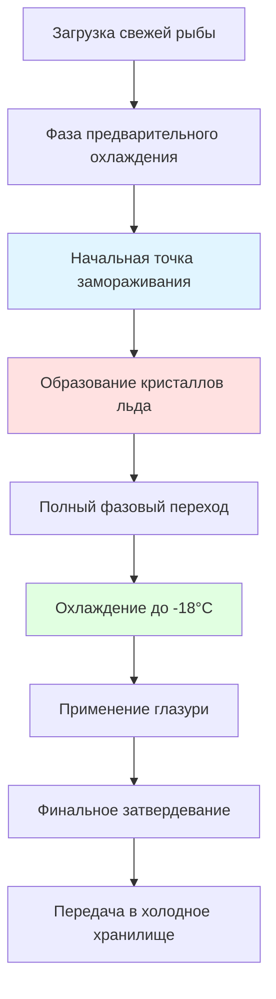
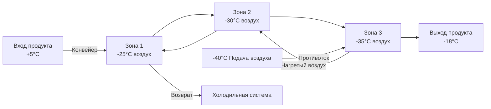

## Физические принципы быстрого замораживания воздухом

Быстрое замораживание воздухом использует принудительный конвективный теплообмен для извлечения тепловой энергии из рыбных продуктов. Процесс замораживания включает три отдельные тепловые фазы: охлаждение без фазового перехода выше начальной точки замораживания, отвод скрытой теплоты при фазовом переходе и охлаждение ниже конечной температуры хранения.

Скорость конвективного теплообмена управляет производительностью замораживания:

$$Q = h \cdot A \cdot (T_{\text{воздуха}} - T_{\text{поверхности}})$$

где $h$ — коэффициент конвективного теплообмена (Вт/м²·К), $A$ — площадь поверхности продукта (м²), а разность температур управляет потоком тепла. Коэффициент теплообмена зависит от скорости воздуха согласно:

$$h = C \cdot v^{0.8}$$

где $C$ — коэффициент, зависящий от конфигурации, и $v$ — скорость воздуха (м/с). Эта нелинейная зависимость демонстрирует, почему повышение скорости дает убывающую отдачу при превышении 5–6 м/с.

## Требования к температуре воздуха

Температура воздуха в аппаратах быстрого замораживания для рыбных продуктов обычно колеблется от -30°C до -40°C для рыбных продуктов. Более низкие температуры обеспечивают более быстрое замораживание, но повышают затраты на холодильную систему и расходы на эксплуатацию.

### Критерии выбора температуры

| Применение | Температура воздуха | Обоснование |
|-------------|-----------------|-----------|
| Тунец, рыба-меч (крупные) | -35°C до -40°C | Толстое поперечное сечение требует максимального температурного перепада |
| Филе лосося | -30°C до -35°C | Умеренная толщина, баланс скорости и затрат |
| Креветки, мелкая рыба | -25°C до -30°C | Тонкий профиль замерзает быстро при более высоких температурах |
| Глазированные продукты | -30°C до -35°C | Замораживание после глазирования требует достаточной мощности |

Температурный перепад между воздухом и поверхностью продукта создает движущую силу для теплообмена. Однако чрезмерно низкие температуры могут вызвать растрескивание поверхности целой рыбы из-за градиентов термического напряжения.

## Оптимизация скорости воздуха

Скорость воздуха непосредственно влияет на коэффициент теплообмена у поверхности и, следовательно, на скорость замораживания. Типичные скорости воздуха в аппаратах быстрого замораживания варьируются от 4 до 6 м/с, измеренные на уровне продукта.

### Анализ влияния скорости

Связь между скоростью и временем замораживания подчиняется:

$$t_f \propto \frac{1}{v^{0.8}}$$

Увеличение скорости воздуха в два раза с 2 до 4 м/с сокращает время замораживания на примерно 43%, в то время как увеличение с 4 до 8 м/с сокращает время только на 25%. Такая убывающая отдача отражает показатель степени скорости в корреляции теплообмена.

**Практические диапазоны скорости:**

- Минимальная эффективная скорость: 3 м/с (избегает застойных пограничных слоев)
- Оптимальный диапазон: 4–5 м/с (баланс между скоростью замораживания и мощностью вентилятора)
- Максимальная практическая скорость: 6–7 м/с (ограниченное дополнительное преимущество, высокое потребление энергии)

Более высокие скорости увеличивают потребление энергии вентилятором пропорционально $v^3$, создавая задачу экономической оптимизации между сокращением времени замораживания и увеличением затрат на энергию.

## Расчёты времени замораживания

Время замораживания зависит от геометрии продукта, его теплофизических свойств и условий процесса. Уравнение Планка обеспечивает упрощенную оценку для правильно сформированных продуктов:

$$t_f = \frac{\rho \lambda}{T_f - T_a} \left(\frac{P \cdot a}{h} + \frac{R \cdot a^2}{k}\right)$$

где:
- $\rho$ = плотность (кг/м³)
- $\lambda$ = скрытая теплота плавления (334 кДж/кг для воды)
- $T_f$ = начальная точка замораживания (обычно -1°C до -2°C для рыбы)
- $T_a$ = температура воздуха (°C)
- $a$ = характерный размер (м)
- $h$ = коэффициент поверхностного теплообмена (Вт/м²·К)
- $k$ = теплопроводность замороженной рыбы (1.8–2.2 Вт/м·К)
- $P$, $R$ = коэффициенты формы (0.5, 0.125 для бесконечной пластины)

### Время замораживания в зависимости от вида

Типичное время замораживания при температуре воздуха -35°C и скорости 5 м/с:

| Продукт | Толщина | Время замораживания | Финальная центральная температура |
|---------|-----------|---------------|-------------------|
| Филе трески | 25 мм | 45–60 мин | -18°C |
| Стейки лосося | 40 мм | 90–120 мин | -18°C |
| Филе палтуса | 50 мм | 120–180 мин | -18°C |
| Целые сардины | 30 мм | 60–90 мин | -18°C |
| Лои тунца | 100 мм | 4–6 часов | -18°C |
| Креветки (средние) | 15 мм | 20–30 мин | -18°C |

Фактическое время замораживания варьируется в зависимости от содержания жира, влажности и геометрии продукта. Жирная рыба (лосось, скумбрия) замерзает немного медленнее, чем нежирная рыба (треска, пикша) из-за меньшего содержания воды и различных теплофизических свойств.

## Этапы процесса замораживания

### Критические температурные зоны

Зона максимального образования кристаллов льда (-1°C до -5°C) определяет конечное качество продукта. Быстрый проход через этот диапазон производит мелкие кристаллы льда, которые минимизируют клеточные повреждения:

$$\text{Размер кристалла} \propto \frac{1}{\text{Скорость замораживания}^{0.5}}$$

Рыба, быстро замороженная в аппаратах быстрого замораживания, развивает кристаллы льда диаметром 10–50 мкм, в сравнении со 100–200 мкм при медленных методах замораживания. Меньшие кристаллы сохраняют клеточную структуру и снижают потерю сока при оттаивании.

## Конструкции аппаратов быстрого замораживания

### Туннельные аппараты

Непрерывные туннельные аппараты используют противоточное или параллельное распределение воздуха. Противоточные системы подвергают теплый продукт воздействию холодного воздуха, максимизируя термодинамическую эффективность:

### Камеры пакетного замораживания

Неподвижные камеры пакетного замораживания используют тележки с поддонами с горизонтальным или вертикальным потоком воздуха. Вертикальный поток воздуха через перфорированные поддоны обеспечивает равномерное распределение температуры, но требует осторожного расположения продукта.

**Параметры конструкции:**
- Обмены воздуха: 60–120 в час
- Плотность загрузки продукта: 100–150 кг/м³
- Расстояние между поддонами: 50–75 мм (позволяет адекватный поток воздуха)
- Мощность испарителя: 1.5–2.0 кВ на кг/ч мощности замораживания

## Факторы сохранения качества

### Управление кристаллами льда

Скорость замораживания непосредственно влияет на распределение размеров кристаллов льда. Критическая граница качества возникает при примерно 5 см/ч скорости замораживания (продвижение изотермы -5°C):

- Быстрое замораживание (>5 см/ч): Мелкие внутриклеточные кристаллы, минимальные клеточные повреждения
- Медленное замораживание (<2 см/ч): Крупные внеклеточные кристаллы, клеточное обезвоживание и разрыв

Быстрое замораживание воздухом обычно достигает 3–8 см/ч для тонких продуктов и 1–3 см/ч для толстых секций.

### Контроль потерь влаги

Потеря веса при замораживании происходит через поверхностную сублимацию. Скорость сублимации подчиняется:

$$\frac{dm}{dt} = k_m \cdot A \cdot (P_{\text{поверхность}} - P_{\text{воздух}})$$

где $k_m$ — коэффициент массообмена и $P$ представляет парциальные давления водяного пара. Типичная потеря веса варьируется от 0.5% до 2.0% в зависимости от времени замораживания и влажности воздуха.

**Стратегии минимизации:**
- Сократить время замораживания (меньше времени воздействия)
- Увеличить относительную влажность воздуха (ограничена обледенением испарителя)
- Применить защитную глазурь сразу после замораживания
- Использовать упаковку или пленочное обёртывание для тонких продуктов

### Предотвращение денатурации белка

Денатурация белка в мышце рыбы ускоряется выше -10°C. Быстрое замораживание минимизирует время, проведённое в критическом диапазоне, где происходят одновременно рост кристаллов льда и повреждение белка. Рекомендации FDA предусматривают достижение центральной температуры -18°C в течение 4 часов для продуктов толщиной до 50 мм.

## Эксплуатационные соображения

### Конфигурация загрузки продукта

Надлежащее расстояние между продуктами обеспечивает адекватную циркуляцию воздуха и равномерное замораживание. Недостаточное расстояние создает тепловые коротких замыканий, где воздух минует продукт:

- Минимальное расстояние: 25 мм между кусками
- Перфорация поддона: 25–40% открытой площади
- Высота укладки: Ограничена для сохранения скорости воздуха выше 3 м/с на уровне продукта
- Схема загрузки: Шахматное расположение предотвращает прямой проход воздуха

### Потребление энергии

Удельное потребление энергии для быстрого замораживания воздухом обычно варьируется от 250 до 400 кДж на кг замороженного продукта в зависимости от:

- Начальной температуры продукта
- Конечной центральной температуры
- Температурного перепада воздуха
- Эффективности вентилятора и размера двигателя
- Частоты оттаивания испарителя

Более низкие температуры воздуха повышают потребление энергии в холодильной системе, но сокращают время замораживания, создавая возможность оптимизации на основе стоимости электроэнергии и требуемой производительности.

### Требования к оттаиванию

Катушки испарителя накапливают иней из влаги продукта и проникновения воздуха. Интервалы оттаивания варьируются от 4 до 8 часов эксплуатации, с длительностью оттаивания 20–40 минут. Оттаивание горячим газом минимизирует повышение температуры в камере замораживания в сравнении с электрическими или водяными методами оттаивания.

## Сравнение с альтернативными методами замораживания

| Параметр | Быстрое замораживание воздухом | Пластинчатый аппарат | Погружение | Криогенное |
|-----------|-----------|---------------|-----------|-----------|
| Время замораживания (40 мм филе) | 90–120 мин | 60–90 мин | 30–45 мин | 5–10 мин |
| Капитальные затраты | Средние | Высокие | Низкие | Средние |
| Расходы на эксплуатацию | Средние | Низкие | Средние | Очень высокие |
| Универсальность продукта | Отличная | Ограниченная | Хорошая | Отличная |
| Качество (кристаллы льда) | Хорошее | Очень хорошее | Очень хорошее | Отличное |
| Потеря веса | 1–2% | 0.2–0.5% | Минимальная | 3–8% |

Быстрое замораживание воздухом предлагает лучшее сочетание универсальности продукта и капитальных затрат, что делает его пригодным для операций по переработке нескольких типов и размеров продуктов.

## Стандарты FDA и ASHRAE

FDA Кодекс федеральных правил (21 CFR 123) требует, чтобы замороженные рыбные продукты сохранялись при температуре -18°C или ниже. Рекомендации ASHRAE предусматривают:

- Температура хранения: -23°C до -29°C для расширенного срока годности
- Скорость замораживания: Достижение центральной температуры -18°C в течение 2–4 часов для оптимального качества
- Циркуляция воздуха: Минимум 60 обменов воздуха в час в аппарате быстрого замораживания
- Мониторинг температуры: Непрерывная запись с точностью ±1°C

Надлежащие спроектированные системы быстрого замораживания воздухом без труда достигают этих требований при сохранении эксплуатационной гибкости для различных типов продуктов и производственных графиков.
