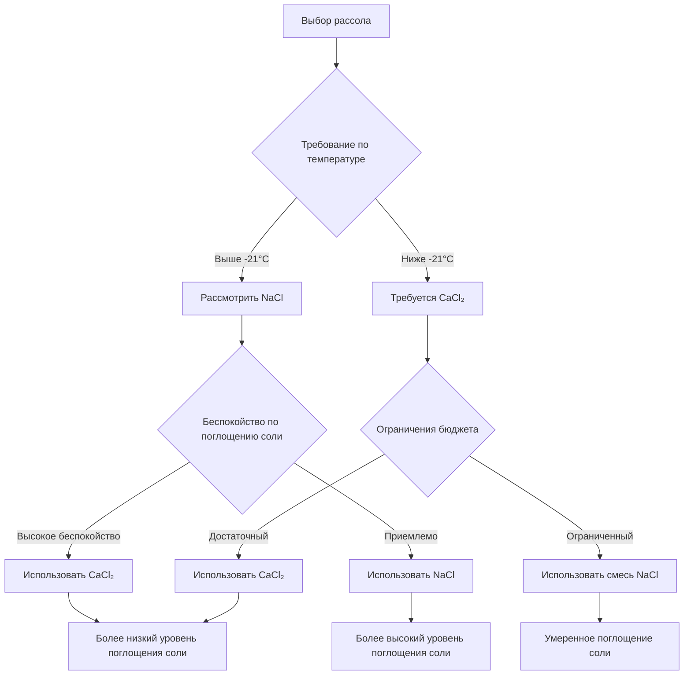
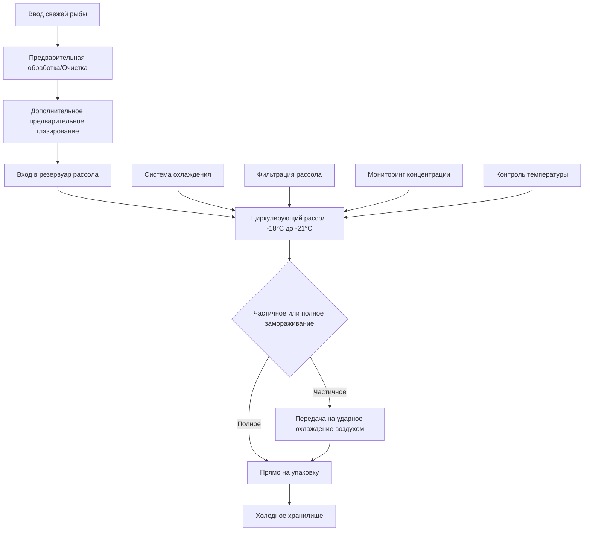

## Основы замораживания в рассоле методом погружения

Замораживание в рассоле методом погружения является одним из самых быстрых методов замораживания рыбных продуктов, использующим прямой контакт между продуктом и охлажденным солевым раствором. Система достигает скорости замораживания в 5-10 раз выше, чем методы ударного охлаждения воздухом, благодаря превосходному коэффициенту теплопередачи жидкого погружения. Температура рассола обычно работает в диапазоне от -18°C до -21°C, выбираемая на основе эвтектической точки солевого раствора и требуемой скорости замораживания.

Фундаментальное преимущество теплопередачи вытекает из физических свойств жидкого контакта. Хотя замораживание ударным охлаждением воздухом достигает коэффициентов теплопередачи на поверхности 25-50 Вт/м²·К, погружение в рассол обеспечивает коэффициенты 250-850 Вт/м²·К, в зависимости от скорости циркуляции рассола и интенсивности турбулентности.

## Механизм теплопередачи

Скорость извлечения тепла во время погружения в рассол подчиняется уравнению нестационарной теплопроводности с конвективными граничными условиями:

$$\rho c_p \frac{\partial T}{\partial t} = k \nabla^2 T$$

Конвективная теплопередача на поверхности рыбы управляется следующим образом:

$$q = h(T_s - T_\infty)$$

где $h$ — коэффициент конвективной теплопередачи (250-850 Вт/м²·К для рассола), $T_s$ — температура поверхности, $T_\infty$ — температура массового рассола. Высокий коэффициент теплопередачи является результатом вынужденной конвекции и термических свойств концентрированных солевых растворов.

Время замораживания для сферической рыбы приблизительно равно:

$$t_f = \frac{\rho L d}{8 h (T_f - T_b)} \left( 1 + \frac{Bi}{2} \right)$$

где $\rho$ — плотность, $L$ — скрытая теплота плавления (приблизительно 250-280 кДж/кг для рыбной ткани), $d$ — характеристический размер, $T_f$ — начальная точка замерзания, $T_b$ — температура рассола, $Bi$ — число Био.

## Типы рассолов и их свойства

### Рассол хлорида натрия

Рассол хлорида натрия (NaCl) представляет традиционный и наиболее экономичный вариант для погружного замораживания рыбы. Эвтектическая точка возникает при -21,1°C с концентрацией соли 23,3% по весу.

| Свойство | Значение | Единицы |
|----------|----------|---------|
| Эвтектическая температура | -21,1 | °C |
| Эвтектическая концентрация | 23,3 | % по весу |
| Типичная рабочая температура | -18 до -21 | °C |
| Типичная концентрация | 20-24 | % по весу |
| Удельная теплоемкость (20% раствор) | 3,35 | кДж/кг·К |
| Плотность (20% раствор) | 1150 | кг/м³ |
| Теплопроводность | 0,54 | Вт/м·К |
| Потенциал коррозии | Высокий | - |
| Стоимость | Низкая | Относительная |

### Рассол хлорида кальция

Рассол хлорида кальция (CaCl₂) обеспечивает превосходные низкотемпературные характеристики и пониженную коррозийность по сравнению с хлоридом натрия. Эвтектическая точка достигает -51°C при концентрации 29,8%, позволяя работать при более низких температурах без замерзания.

| Свойство | Значение | Единицы |
|----------|----------|---------|
| Эвтектическая температура | -51,0 | °C |
| Эвтектическая концентрация | 29,8 | % по весу |
| Типичная рабочая температура | -25 до -29 | °C |
| Типичная концентрация | 24-28 | % по весу |
| Удельная теплоемкость (25% раствор) | 2,93 | кДж/кг·К |
| Плотность (25% раствор) | 1230 | кг/м³ |
| Теплопроводность | 0,48 | Вт/м·К |
| Потенциал коррозии | Умеренный | - |
| Стоимость | Высокая | Относительная |

## Сравнение выбора рассола

## Соображения по поглощению соли

Поглощение соли представляет основной недостаток замораживания методом погружения в рассол. Во время погружения соль мигрирует в ткань рыбы через осмотические перепады давления и диффузию. Скорость проникновения соли подчиняется второму закону Фика:

$$\frac{\partial C}{\partial t} = D \frac{\partial^2 C}{\partial x^2}$$

где $C$ — концентрация соли, $t$ — время, $D$ — коэффициент диффузии (обычно 1-5 × 10⁻¹⁰ м²/с в рыбной ткани), $x$ — глубина в ткани.

Количество поглощенной соли увеличивается с:

- Времением погружения (основной фактор)
- Концентрацией рассола
- Температурой (более высокие температуры увеличивают скорость диффузии)
- Содержанием жира в продукте (более низкое содержание жира = более высокое поглощение)
- Отношением площади поверхности к объему продукта

### Стратегии снижения поглощения соли

| Стратегия | Механизм | Эффективность | Внедрение |
|-----------|----------|---------------|----------|
| Минимизация времени погружения | Сокращение продолжительности воздействия | Высокая | Оптимальный контроль температуры рассола |
| Использование хлорида кальция | Более низкий осмотический потенциал | Умеренная | Система рассола CaCl₂ |
| Предварительное глазирование продукта | Физический барьер | Высокая | Водяной спрей перед погружением |
| Снижение концентрации рассола | Меньший концентрационный градиент | Умеренная | Баланс с точкой замерзания |
| Постпогружающее промывание | Удаление соли с поверхности | Умеренная | Водяной спрей сразу после |
| Вакуумная упаковка | Предотвращение дальнейшей диффузии | Высокая | Упаковка сразу после замораживания |

Типичное поглощение соли варьируется от 0,5% до 2,5% по весу, в зависимости от времени воздействия и характеристик продукта. Справочник по холодильным системам ASHRAE рекомендует минимизировать время погружения до периода, необходимого для замораживания внешних 10-15 мм продукта, затем переводить на ударное охлаждение воздухом для завершения процесса.

## Конструкция системы замораживания в рассоле

### Ключевые компоненты системы

**Резервуар рассола**: Конструируется из нержавеющей стали (304 или 316L) или армированного стеклопластика для сопротивления коррозии. Размер резервуара обеспечивает достаточный объем для стабильности тепловой массы, обычно 3-5 раз объема обрабатываемого продукта за партию.

**Система циркуляции**: Высокоскоростные насосы поддерживают скорость потока рассола 0,3-1,0 м/с мимо поверхностей продукта. Скорость потока прямо влияет на коэффициент конвективной теплопередачи:

$$h = C \cdot Re^{0,8} \cdot Pr^{0,33} \cdot \frac{k}{D}$$

где $Re$ — число Рейнольдса, $Pr$ — число Прандтля, $k$ — теплопроводность, $D$ — характеристическая длина.

**Система охлаждения**: Прямое расширение или затопленные испарительные змеевики, погруженные в резервуар рассола. Температура испарителя работает на 3-5°C ниже температуры рассола. Типичные требования к производительности охлаждения варьируются от 150-250 кВт на тонну обрабатываемого продукта в час, учитывая тепловую нагрузку продукта, тепло насоса циркуляции рассола и потери системы.

**Система фильтрации**: Непрерывная фильтрация удаляет рыбную чешую, слизь и частицы белка, которые накапливаются во время работы. Размер фильтра обеспечивает смену полного объема рассола каждые 15-30 минут.

## Требования контроля температуры

Точный контроль температуры рассола обеспечивает согласованные скорости замораживания и качество продукта. Система управления поддерживает температуру в пределах ±0,5°C от задания через:

- Несколько датчиков температуры (минимум 3 на резервуар)
- Переменная производительность охлаждения (байпас горячего газа или компрессор с переменной скоростью)
- Модуляция скорости циркуляции рассола
- Автоматизированный контроль потока хладагента

Отношение между производительностью охлаждения и стабильностью температуры:

$$\dot{Q}_{req} = \dot{m}_{product} c_{p,product} \Delta T + \dot{Q}_{losses} + \dot{Q}_{pump}$$

## Операционные преимущества

Замораживание методом погружения в рассол обеспечивает несколько отчетливых преимуществ для переработки рыбы:

**Быстрая скорость замораживания**: 5-10-кратное ускорение замораживания по сравнению с ударным охлаждением воздухом приводит к образованию меньших ледяных кристаллов. Размер ледяного кристалла обратно коррелирует со скоростью замораживания в соответствии с теорией нуклеации. Меньшие кристаллы вызывают меньший клеточный ущерб, сохраняя текстуру и снижая потери при оттаивании.

**Равномерное распределение температуры**: Полное погружение продукта исключает холодные пятна и градиенты температуры, обычные в системах ударного охлаждения воздухом. Каждая поверхность получает идентичные условия теплопередачи.

**Сохранение влажности поверхности**: Жидкая среда предотвращает поверхностное обезвоживание и морозную ожог. В отличие от систем ударного охлаждения воздухом, где происходит сублимация поверхности, погруженные продукты сохраняют влажность поверхности.

**Непрерывная обработка**: Конвейерные системы погружения обеспечивают непрерывный поток продукта, улучшая пропускную способность по сравнению с пакетными воздушными туннелями.

**Сниженная тоннаж охлаждения**: Несмотря на более высокие скорости теплопередачи, улучшенная эффективность позволяет использовать меньшие системы охлаждения по сравнению с достижением эквивалентных производственных показателей при ударном охлаждении воздухом.

## Операционные вызовы

**Управление коррозией**: Солевые рассолы атакуют компоненты из углеродистой стали, алюминия и латуни. Конструкция системы требует нержавеющей стали, пластика или специальных сплавов. Скорости коррозии ускоряются с:

- Более высокая концентрация рассола
- Повышенные температуры
- Наличие кислорода (растворенный воздух)
- Гальваническая связь разнородных металлов

**Техническое обслуживание рассола**: Разбавление от транспортируемой продуктом воды и накопления льда требует периодической регулировки концентрации. Непрерывный мониторинг использует:

- Измерение удельного веса (ареометры или датчики плотности)
- Определение точки замерзания
- Измерение проводимости
- Рефрактометрию

ASHRAE рекомендует поддерживать концентрацию в пределах ±1% от расчетного значения для согласованной производительности.

**Контроль качества**: Соответствие нормативным требованиям требует документирования уровней поглощения соли. Руководства USDA и FDA ограничивают содержание натрия в продуктах с маркировкой "низкий натрий" или "пониженный натрий".

## Соображения по конструкции в соответствии с ASHRAE

В соответствии с Справочником по холодильным системам ASHRAE Глава 29 (Замораживание продуктов), конструкция системы замораживания в рассоле должна учитывать:

- Температура рассола поддерживается на 2-3°C ниже требуемой температуры центра продукта
- Скорость циркуляции достаточна для числа Рейнольдса > 10 000 (турбулентный поток)
- Время погружения рассчитано для достижения желаемой глубины замораживания без чрезмерного поглощения соли
- Минимальное отношение объема рассола к продукту 3:1 для тепловой стабильности
- Производительность фильтрации минимум 2× в час общий объем смены
- Процедуры экстренного отключения для разливов рассола или превышения температуры

Коэффициент энергетической эффективности системы (EEF) для погружения в рассол обычно варьируется от 0,25-0,35 кВт·ч на кг замороженной рыбы, по сравнению с 0,35-0,50 кВт·ч/кг для систем ударного охлаждения воздухом, представляя преимущество в энергии на 30-40%.

## Гибридные подходы к замораживанию

Современные установки часто используют гибридные системы, объединяющие погружение в рассол с ударным охлаждением воздухом для оптимизации как скорости замораживания, так и качества продукта, одновременно минимизируя поглощение соли:

1. Погружение в рассол на 5-15 минут (замораживание внешних 10-15 мм)
2. Передача в туннель ударного охлаждения воздухом при -35°C до -40°C
3. Завершение замораживания до центра при -18°C
4. Применение постзамораживающего водяного глазирования

Этот подход достигает 60-70% общего замораживания на этапе рассола при ограничении поглощения соли до 0,3-0,8% по весу.

---

*Содержание основано на принципах Справочника по холодильным системам ASHRAE и устоявшихся практиках промышленного замораживания рыбы.*
