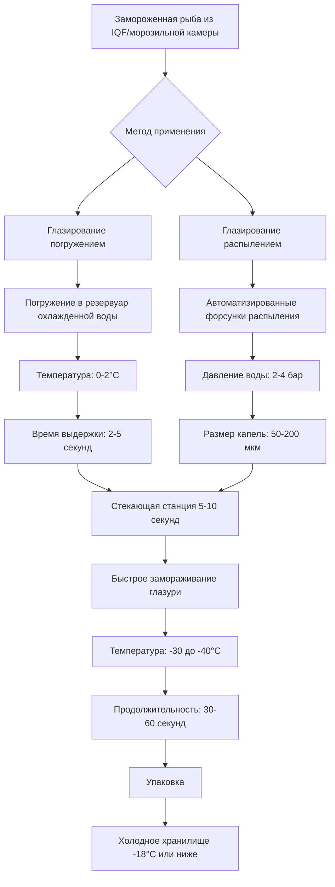

Применение льдяной глазури образует критический защитный барьер на поверхности замороженных рыбных продуктов, предотвращая сублимационные потери влаги и окислительную деградацию во время замороженного хранения. Процесс включает нанесение на поверхность замороженной рыбы тонкого слоя льда, который служит одновременно физическим барьером и тепловым буфером.

## Физика образования глазури

Механизм образования глазури зависит от температурного градиента между поверхностью замороженной рыбы и нанесенной жидкой воды. Когда охлажденная вода контактирует с поверхностью рыбы при температурах ниже -18°C, происходит быстрое зарождение и образование кристаллов льда посредством гетерогенной нуклеации на поверхности рыбы.

Теплопередача при глазировании описывается следующим образом:

$$Q = h \cdot A \cdot (T_{\text{water}} - T_{\text{surface}}) \cdot t$$

где $Q$ представляет тепло, передаваемое от воды к замороженной поверхности, $h$ — коэффициент конвективной теплопередачи (обычно 500–1500 Вт/м²·K при контакте с водой), $A$ — площадь поверхности, и $t$ — время контакта.

Толщина глазури, достигаемая в результате процесса, зависит от тепловой массы замороженного продукта:

$$\delta_{\text{glaze}} = \frac{m_{\text{water}} \cdot c_p \cdot \Delta T}{\rho_{\text{ice}} \cdot A \cdot L_f}$$

где $\delta_{\text{glaze}}$ — толщина глазури, $m_{\text{water}}$ — масса нанесенной воды, $c_p$ — удельная теплоемкость воды (4,18 кДж/кг·K), $\Delta T$ — разность температур, $\rho_{\text{ice}}$ — плотность льда (917 кг/м³), и $L_f$ — скрытая теплота плавления (334 кДж/кг).

## Методы применения глазури

### Системы глазирования погружением

Глазирование погружением предполагает погружение замороженных рыбных продуктов в резервуары охлажденной воды, поддерживаемые при температуре 0–2°C. Температура воды должна оставаться выше точки замерзания, чтобы предотвратить образование льда в резервуаре, однако быть достаточно холодной, чтобы минимизировать термический шок для замороженного продукта.

**Рассмотрение конструкции резервуара:**
- Скорость циркуляции воды: 4–8 объемов резервуара в час
- Однородность температуры: ±0,5°C по всему резервуару
- Система перелива для поддержания уровня воды
- Непрерывная фильтрация для удаления частиц белка
- Холодильная мощность для компенсации теплоприбыли от продуктов

Время нахождения продукта в резервуаре погружения обычно составляет от 2 до 5 секунд, что достаточно для достижения целевых процентов глазури 3–8% по массе.

### Системы глазирования распылением

Глазирование распылением использует автоматизированные матрицы форсунок для нанесения тонких водяных капель на поверхность замороженной рыбы при прохождении продуктов на конвейерах. Этот метод обеспечивает превосходный контроль над однородностью и массой глазури.

**Параметры системы распыления:**
- Давление на форсунке: 2–4 бар (30–60 кПа)
- Размер капель: 50–200 мкм средний диаметр
- Расход воды: 0,5–2,0 л/мин на форсунку
- Расстояние между форсунками: 150–250 мм между центрами
- Несколько проходов для равномерного покрытия

Меньшие капли (50–100 мкм) обеспечивают более равномерное покрытие, но требуют более высокого давления и генерируют больше перераспыляемой воды. Более крупные капли (150–200 мкм) снижают перераспыляемую воду, но могут создать неравномерное покрытие.

## Процентная доля массы глазури

Процентная доля массы глазури представляет отношение массы льдяной глазури к общей массе продукта:

$$\text{Глазурь} \% = \frac{m_{\text{glazed}} - m_{\text{net}}}{m_{\text{glazed}}} \times 100$$

Нормативно-правовые акты требуют точного объявления чистого веса, исключая массу глазури. Стандартные процентные доли глазури варьируются в зависимости от типа продукта:

| Тип продукта | Целевая доля глазури % | Метод применения | Назначение |
|--------------|------------------------|------------------|-----------|
| Целая рыба | 3–5% | Погружение или распыление | Базовая защита |
| Филе рыбы | 5–8% | Распыление предпочтительно | Улучшенная защита |
| Рыбные порции | 4–6% | Распыление | Равномерное покрытие |
| Стейки рыбы | 5–7% | Погружение или распыление | Удержание влаги |
| IQF креветки | 8–12% | Распыление глазури | Защита высокой поверхностной площади |
| Жирная рыба (лосось, макрель) | 6–10% | Распыление с антиоксидантом | Предотвращение окисления |

Более высокие процентные доли глазури обеспечивают лучшую защиту, но добавляют стоимость и снижают эффективность упаковки. Оптимальная процентная доля глазури сбалансирована между защитой продукта и экономическими соображениями.

## Механизм влагозащитного барьера

Льдяная глазурь функционирует как барьер массопередачи, снижая скорость сублимации в соответствии с первым законом Фика:

$$J = -D \cdot \frac{\partial C}{\partial x}$$

где $J$ — массовый поток (скорость сублимации), $D$ — коэффициент диффузии водяного пара через лед, и $\partial C/\partial x$ — градиент концентрации.

Льдяная глазурь увеличивает эффективную длину пути диффузии, снижая общую скорость сублимации следующим образом:

$$\frac{J_{\text{glazed}}}{J_{\text{unglazed}}} = \frac{\delta_{\text{product}}}{\delta_{\text{product}} + \delta_{\text{glaze}}}$$

5% глазурь (приблизительно 0,5–1,0 мм толщины) может снизить скорость сублимации на 60–80% в течение первых 3–6 месяцев замороженного хранения.

## Адгезия глазури и температура продукта

Оптимальная адгезия глазури требует, чтобы температура поверхности замороженной рыбы была ниже -12°C. При более высоких температурах поверхности льдяная глазурь может не заморозиться мгновенно, что приводит к:

- Снижению адгезии и отслаиванию глазури
- Неравномерному распределению покрытия
- Увеличенным потерям капель при упаковке
- Плохой интеграции льда с поверхностью продукта

Критическая температура для мгновенного замерзания возникает, когда температура поверхности продукта удовлетворяет условию:

$$T_{\text{surface}} < T_{\text{freeze}} - \frac{Q_{\text{convection}}}{h \cdot A}$$

где $T_{\text{freeze}}$ — точка замерзания воды глазури (обычно -0,5°C с добавками) и второе слагаемое представляет тепловое сопротивление.

## Добавление антиоксидантов

Для видов жирной рыбы добавление одобренных FDA антиоксидантов к воде глазури продлевает срок хранения путем предотвращения окисления липидов. Обычные добавки включают:

- Эритробат натрия: концентрация 0,1–0,5%
- Аскорбиновая кислота: концентрация 0,05–0,2%
- Лимонная кислота: концентрация 0,05–0,1% (также регулировка pH)
- Триполифосфат натрия: 0,1–0,3% (удержание влаги)

Эти соединения растворяются в воде глазури и становятся включенными в ледяной слой, обеспечивая антиоксидантную защиту на поверхности рыбы, где инициируется окисление.

## Операции переглазирования

При продолжительном замороженном хранении (>6 месяцев) ледяная глазурь постепенно сублимируется, что требует периодического переглазирования для поддержания защиты. Интервал переглазирования зависит от условий хранения:

| Температура хранения | Относительная влажность хранилища | Интервал переглазирования | Скорость сублимации |
|----------------------|----------------------------------|--------------------------|-------------------|
| -18°C | 85–90% | 6–9 месяцев | 0,1–0,2 г/м²/день |
| -23°C | 90–95% | 9–12 месяцев | 0,05–0,1 г/м²/день |
| -29°C | 95–98% | 12–18 месяцев | 0,02–0,05 г/м²/день |
| -35°C | 98%+ | 18–24 месяца | <0,02 г/м²/день |

Процедуры переглазирования следуют тем же методам применения, что и первоначальное глазирование, но могут потребовать несколько более длительного времени контакта для обеспечения адгезии к частично обезвоженным поверхностям.

## Требования соответствия FDA

Нормативно-правовые акты FDA согласно 21 CFR 101.105(q) требуют, чтобы:

1. Объявления чистого веса исключали массу льдяной глазури
2. Процедура удаления глазури использовала темперированную воду (15–21°C) с мягким перемешиванием
3. Средний процент глазури не превышал разумную коммерческую практику
4. Этикетки продукции точно отражали допуски по чистому весу

Производители должны установить валидированные процедуры удаления глазури и вести записи, демонстрирующие соответствие требованиям по чистому весу.

## Продление срока хранения

Должным образом покрытая глазурью замороженная рыба демонстрирует значительно продленный срок хранения:

- Без глазури: 3–4 месяца перед снижением качества
- 3–5% глазури: 6–9 месяцев срока хранения
- 6–8% глазури: 9–12 месяцев срока хранения
- 8–10% глазури с антиоксидантами: 12–18 месяцев срока хранения

Продление срока хранения результирует от снижения сублимации (предотвращения ожога морозом), снижения окисления (особенно при добавлении антиоксидантов) и защиты от механических повреждений во время обработки и транспортировки.

## Параметры управления процессом

Критические контрольные точки для применения глазури включают:

**Управление температурой воды:**
- Заданное значение: 0–2°C
- Допуск: ±0,5°C
- Мониторинг: непрерывный датчик сопротивления или термопара

**Температура поверхности продукта:**
- Целевое значение: -18 до -25°C
- Проверка: точечные проверки ИК-термометром
- Частота: каждые 30 минут

**Проверка массы глазури:**
- Метод: взвешивание до глазирования и после глазирования
- Частота выборки: каждые 15 минут или по партии
- Диапазон приемки: целевое значение ±1% абсолютное

Автоматизированные системы включают встроенные весы, которые регулируют продолжительность распыления или время погружения для поддержания целевых процентных долей глазури в пределах спецификации.
