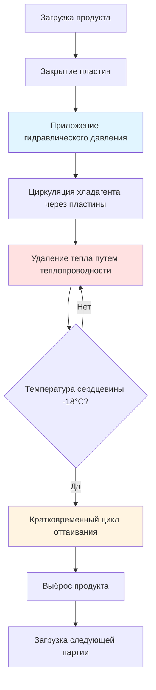
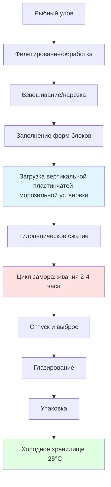

## Принципы контактного замораживания

Пластинчатые морозильные установки используют прямую теплопередачу путем теплопроводности, помещая рыбные продукты между охлажденными металлическими пластинами. Этот метод контактного замораживания достигает превосходных скоростей теплопередачи по сравнению с системами воздушного обдува благодаря фундаментальной разнице в теплопроводности между металлом и воздухом.

Коэффициент теплопередачи для пластинчатого замораживания колеблется от 100-400 Вт/(м²·К), по сравнению с 10-50 Вт/(м²·К) для систем воздушного обдува. Это драматическое улучшение вытекает из того, что теплопроводность устраняет сопротивление конвективного пограничного слоя, который доминирует при воздушном замораживании.

### Механизм теплопередачи

Общая теплопередача при пластинчатом замораживании следует закону теплопроводности Фурье:

$$Q = \frac{k \cdot A \cdot (T_p - T_f)}{x}$$

Где:
- $Q$ = скорость теплопередачи (Вт)
- $k$ = теплопроводность рыбы (1,2-1,8 Вт/(м·К) для незамороженной, 2,0-2,4 Вт/(м·К) для замороженной)
- $A$ = площадь контактной поверхности (м²)
- $T_p$ = температура поверхности пластины (°C)
- $T_f$ = температура рыбы (°C)
- $x$ = толщина продукта (м)

Контактное сопротивление между пластиной и продуктом значительно влияет на эффективность замораживания. Гидравлические системы давления (2-10 бар) минимизируют воздушные зазоры и улучшают контактную теплопроводность с 200 Вт/(м²·К) до 800 Вт/(м²·К).

## Горизонтальные пластинчатые морозильные установки

Горизонтальные пластинчатые морозильные установки состоят из вертикально расположенных охлажденных полок с продуктами, загружаемыми горизонтально между пластинами. Эта конфигурация преобладает на сухопутных перерабатывающих предприятиях благодаря простоте автоматизации и высокой производительности.

**Характеристики конструкции:**

| Параметр | Типичный диапазон | Примечания |
|-----------|------------------|-----------|
| Расстояние между пластинами | 50-150 мм | Регулируется в зависимости от толщины продукта |
| Количество пластин | 12-40 полок | Определяет емкость партии |
| Размеры пластин | 1,0 x 1,5 м до 1,5 x 3,0 м | Стандартные размеры |
| Хладагент | NH₃, R-404A, R-507A | Аммиак предпочтителен для эффективности |
| Температура кипения | -40°C до -45°C | Ниже, чем в системах воздушного обдува |
| Гидравлическое давление | 3-7 бар | Обеспечивает равномерный контакт |
| Вместимость замораживания | 1000-8000 кг/партия | Зависит от предприятия |

### Расчет времени замораживания

Уравнение Планка позволяет оценить время замораживания для пластинчатых морозильных установок:

$$t_f = \frac{\rho L}{T_f - T_m} \left[\frac{Pa}{h} + \frac{Ra^2}{k}\right]$$

Где:
- $t_f$ = время замораживания (с)
- $\rho$ = плотность (1040 кг/м³ для рыбы)
- $L$ = скрытая теплота плавления (250-280 кДж/кг для рыбы)
- $T_f$ = температура среды замораживания (°C)
- $T_m$ = начальная точка замораживания (-1 до -2°C для рыбы)
- $P$ = безразмерная константа (0,5 для бесконечной пластины)
- $R$ = безразмерная константа (0,125 для бесконечной пластины)
- $a$ = половина толщины продукта (м)
- $h$ = коэффициент поверхностной теплопередачи (Вт/(м²·К))
- $k$ = теплопроводность (Вт/(м·К))

Для рыбного блока толщиной 50 мм при температуре пластины -40°C:

$$t_f = \frac{1040 \times 270000}{(-40) - (-1,5)} \left[\frac{0,5 \times 0,025}{300} + \frac{0,125 \times 0,025^2}{2,2}\right] \approx 2,1 \text{ часа}$$

## Вертикальные пластинчатые морозильные установки

Вертикальные пластинчатые морозильные установки расположены вертикально с продуктами, вставляемыми между соседними пластинами. Эта конфигурация преобладает при обработке на море благодаря эффективности использования пространства и стабильности при движении судна.

**Преимущества для морских приложений:**

- **Эффективность пространства:** Меньший размер для установки на судне
- **Стабильность:** Вертикальная ориентация лучше справляется с движением судна
- **Дренаж:** Гравитационное удаление избыточной воды/рассола
- **Качество продукта:** Снижение деформации под гидравлическим давлением

**Конструктивные соображения:**

| Особенность | Горизонтальная | Вертикальная |
|-----------|-----------|----------|
| Площадь пола | Большая | Компактная |
| Загрузка | Ручная или автоматизированная | Обычно ручная |
| Выброс продукта | Требуется поднятие | Гравитационный |
| Пригодность для морского использования | Плохая | Отличная |
| Производительность | Выше | Умеренная |
| Капитальные затраты | Выше | Ниже |

## Приложения замораживания блоков

Пластинчатые морозильные установки отлично подходят для производства однородных замороженных рыбных блоков для дальнейшей обработки. Стандартные размеры блоков (400 x 200 x 50-100 мм) способствуют эффективному хранению, транспортировке и последующим операциям нарезания.

### Формы продукта:

1. **Блоки филе:** Филе без кожи и костей, расположенное равномерно
2. **Блоки фарша:** Механически отделенная рыба для производства сурими
3. **Блоки с прокладками:** Филе, разделенные полиэтиленовыми листами
4. **Целая мелкая рыба:** Сардины, анчоусы в форме блоков

**Факторы качества:**

Быстрое замораживание, достигаемое пластинчатыми системами (скорость охлаждения 5-20°C/час в зоне от -1 до -5°C), производит мелкие ледяные кристаллы (диаметром 20-50 мкм), которые минимизируют клеточные повреждения. Замораживание воздушным обдувом производит более крупные кристаллы (50-150 мкм) с большей потерей жидкости при оттаивании.

$$\text{Размер ледяного кристалла} \propto \frac{1}{\text{скорость охлаждения}}$$

## Системы обработки на море

Рыболовные суда-базы используют вертикальные пластинчатые морозильные установки для обработки и замораживания улова немедленно, максимизируя качество продукта. Типичные установки включают 4-12 вертикальных пластинчатых морозильных установок с общей вместимостью 30-80 тонн за 24-часовой период.

**Интеграция системы:**

**Морские соображения:**

- **Холодопроизводительность:** 500-2000 кВт для полной производственной линии
- **Электроснабжение:** Дизельные генераторные установки с рекуперацией тепла
- **Охлаждение морской водой:** Конденсаторные системы с использованием окружающей морской воды
- **Системы стабилизации:** Гироскопические опоры для морозильных установок
- **Защита от коррозии:** Конструкция из нержавеющей стали (марка 316L)

## Гидравлические системы давления

Гидравлические цилиндры прилагают равномерное давление на поверхности пластин, что критически важно для достижения согласованного теплового контакта. Давление должно преодолевать неровности продукта и выравнивать воздушные зазоры без раздавливания деликатного филе.

Соотношение контактной теплопроводности следует:

$$h_c = C \cdot P^{0,6}$$

Где $h_c$ — контактная теплопроводность (Вт/(м²·К)), $P$ — приложенное давление (Па), а $C$ — эмпирическая константа, зависящая от шероховатости поверхности.

**Оптимизация давления:**

| Тип продукта | Оптимальное давление | Обоснование |
|--------------|------------------|-----------|
| Деликатное филе | 2-4 бар | Предотвращает раздавливание |
| Прочное филе | 4-7 бар | Максимизирует контакт |
| Блоки фарша | 6-10 бар | Компактирует материал |

## Операционная эффективность

Эффективность пластинчатой морозильной установки зависит от минимизации непроизводительного времени:

$$\text{Загрузка} = \frac{t_f}{t_f + t_l + t_r}$$

Где:
- $t_f$ = время замораживания
- $t_l$ = время загрузки (5-15 минут)
- $t_r$ = время отпуска/оттаивания (2-5 минут)

Достижение загрузки 85-90% требует автоматизированных систем загрузки и оптимизированных циклов оттаивания. Кратковременное нагревание поверхности пластины (от -40°C до -5°C в течение 60-90 секунд) разрывает ледяные связи без значительного расхода холодопроизводительности.

**Потребление энергии:** Пластинчатые морозильные установки потребляют 40-80 кВт·ч на тонну замороженного продукта, примерно на 30% более эффективны, чем эквивалентные системы воздушного обдува благодаря сокращению времени замораживания и лучшей эффективности изоляции.

## Параметры контроля качества

**Критические точки мониторинга:**

- Однородность температуры поверхности пластины (±2°C на всех пластинах)
- Согласованность гидравлического давления (вариация ±0,3 бар)
- Температура сердцевины продукта при отпуске (≤ -18°C согласно рекомендациям ASHRAE)
- Достаточность времени контакта (минимум 2 часа для блоков толщиной 50 мм)
- Время цикла оттаивания (чрезмерное нагревание снижает эффективность)

ASHRAE Refrigeration Handbook Глава 29 содержит подробное руководство по проектированию и эксплуатации пластинчатых морозильных установок для рыбных продуктов, подчеркивая важность поддержания качества продукта благодаря контролируемым скоростям замораживания и надлежащему управлению температурой.

---

**Ссылки:**
- ASHRAE Refrigeration Handbook, Глава 29: Рыбные продукты
- ASHRAE Handbook - Fundamentals, Глава 10: Теплопередача
