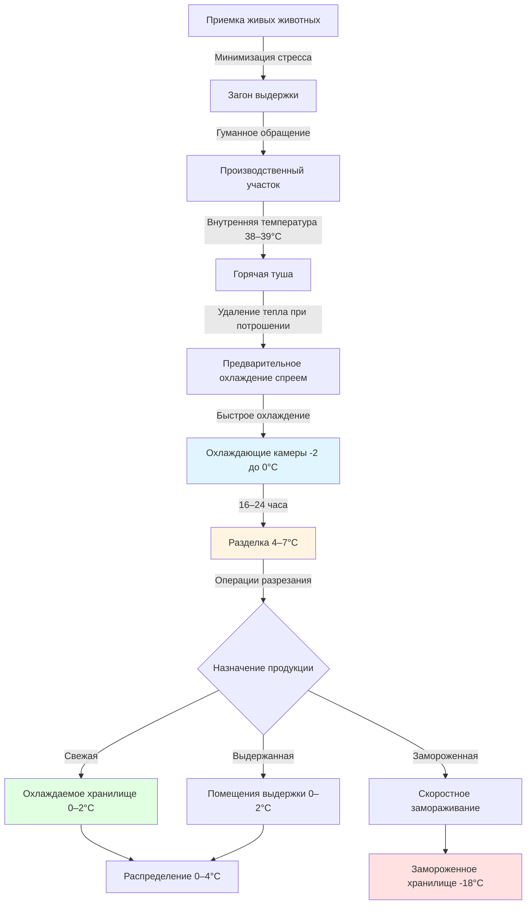

Системы охлаждения при переработке мяса представляют одно из наиболее критичных и сложных применений в технике безопасности пищевых продуктов, требуя точного контроля температуры на протяжении нескольких этапов переработки для предотвращения роста микробов и сохранения качества продукции. Термодинамические трудности обусловлены высокими скоростями удаления теплоты, необходимыми при быстром охлаждении, свойствами фазовых переходов животной ткани и строгими нормативными требованиями, установленными Службой безопасности и инспекции пищевых продуктов (FSIS) USDA.

## Основы холодной цепи

Холодная цепь при переработке мяса поддерживает температуру продукции от убоя до розничного распределения, при этом каждый этап инженерной разработки направлен на контроль размножения бактерий. Фундаментальный принцип вытекает из уравнения Аррениуса, описывающего зависимость скорости роста микробов от температуры:

$$k = A e^{-E_a/(R T)}$$

где $k$ — константа скорости роста, $A$ — предэкспоненциальный множитель, $E_a$ — энергия активации (обычно 50–80 кДж/моль для мезофильных патогенов), $R$ — газовая постоянная (8,314 Дж/моль·К), $T$ — абсолютная температура. Эта экспоненциальная зависимость объясняет, почему снижение температуры с 4°C до 0°C приводит к резкому снижению времени удвоения бактерий — примерно с 2 часов до более чем 12 часов для обычных патогенов.

## Требования к температуре на этапах переработки

Объекты переработки мяса должны управлять отдельными тепловыми зонами, каждая из которых имеет специфические инженерные требования:

| Этап переработки | Целевая температура | Допустимое время | Характеристики тепловой нагрузки |
|-----------------|-------------------|------------|---------------------------|
| Предварительное охлаждение и выдержка | 3–6°C | Макс. 2 часа | Удаление явного тепла |
| Быстрое охлаждение | -2 до 0°C | 16–24 часа | Скрытое + явное тепло |
| Помещения для разделки | 4–7°C | Непрерывно | Тепло людей + оборудования |
| Помещения для выдержки | 0–2°C | 14–28 дней | Минимальная нагрузка, плотный контроль |
| Замороженное хранилище | -18°C или ниже | Долгосрочно | Инфильтрация + передача |

### Расчеты удаления теплоты

Общая холодильная нагрузка при охлаждении объединяет удаление явного тепла выше точки замерзания, скрытое тепло фазового перехода и явное тепло ниже точки замерзания. Для говяжьих туш расчет производится следующим образом:

$$Q_{total} = m \left[ c_{p,above} (T_i - T_f) + h_{fg} x_f + c_{p,below} (T_f - T_{final}) \right]$$

где $m$ — масса туши, $c_{p,above}$ — удельная теплоемкость выше точки замерзания (примерно 3,35 кДж/кг·К для постного говяжьего мяса), $T_i$ — начальная температура (обычно 38–39°C), $T_f$ — точка замерзания (-2°C), $h_{fg}$ — скрытое тепло плавления (334 кДж/кг для воды), $x_f$ — доля замороженного материала, $c_{p,below}$ — удельная теплоемкость замороженного мяса (примерно 1,68 кДж/кг·К), $T_{final}$ — целевая температура.

Для типичной туши говядины массой 318 кг, охлаждаемой с 38,3°C до 0°C без замораживания:

$$Q = 318 \text{ кг} \times 3,35 \text{ кДж/кг·К} \times 38,3\text{°C} = 40,800 \text{ кДж}$$

При распределении в течение 24 часов это составляет примерно 1,70 кДж/с на тушу, требуя значительной холодильной мощности при умножении на сотни туш на крупных объектах.

## Проектирование системы охлаждения

### Физика испарительного охлаждения

Коммерческое охлаждение мяса использует системы с принудительной циркуляцией воздуха и контролируемой влажностью. Испарительный потенциал с поверхностей туш обеспечивает значительное охлаждение благодаря передаче скрытого тепла:

$$q_{evap} = h_m A_s (P_{sat,surface} - P_{air})$$

где $h_m$ — коэффициент массопередачи (функция скорости воздуха), $A_s$ — площадь поверхности, а разница давлений приводит испарение влаги. Типичные охлаждающие камеры поддерживают 90–95% относительной влажности для сбалансирования потери влаги (целевые потери 1,5–2,5%) против эффективности охлаждения. Коэффициент конвективной передачи тепла коррелирует со скоростью воздуха:

$$h_c = C \cdot v^{0.8}$$

где скорость воздуха 0,25–1,0 м/с обеспечивает оптимальную передачу тепла без чрезмерного высыхания поверхности или «корковой заморозки».

## Рамки соответствия USDA/FSIS

Нормативы FSIS устанавливают обязательные требования в соответствии с системой Pathogen Reduction/Hazard Analysis Critical Control Points (HACCP). Ключевые требования к контролю температуры включают:

**Критические контрольные точки (CCPs):**
- Охлаждение после забоя: туши должны достичь внутренней температуры, предотвращающей рост патогенов согласно таблицам времени-температуры в 9 CFR 318.17
- Продукция, готовая к употреблению: поддерживать <4°C или >60°C все время
- Пределы отклонений при охлаждении: максимум 0,5°C выше установки в критических зонах

**Требования к мониторингу:**
- Непрерывная запись температуры с помощью калибруемых приборов (точность ±0,3°C)
- Многоточечное размещение датчиков: температура воздуха, внутренняя температура продукции, обратный воздух
- Сохранение данных: минимум 1 год для нормативного контроля

**Процедуры проверки:**
- Ежедневная проверка калибровки с использованием стандартов, прослеживаемых до NIST
- Ежеквартальная валидация производительности системы
- Документирование корректирующих действий для любого отклонения температуры

### Предотвращение роста микробов

Нормы производительности FSIS направлены на снижение на 6,5–7,0 логарифма по Салмонелле и E. coli O157:H7. Контроль температуры обеспечивает основное вмешательство, с моделированием скорости роста следующим образом:

$$\log_{10}(N/N_0) = \frac{t}{\text{DT}}$$

где $N/N_0$ — отношение численности популяции, $t$ — время, $\text{DT}$ — десятичное время сокращения. При 0°C значения DT превышают 500 часов для большинства патогенов, в то время как при 10°C DT может быть только 2–3 часа. Эта экспоненциальная чувствительность обусловливает инженерное требование для плотного контроля температуры.

## Выбор холодильной системы

Объекты переработки мяса обычно используют централизованные холодильные установки с аммиаком (R-717) благодаря превосходной термодинамической эффективности и безопасности для пищевой промышленности при надлежащей конструкции. Коэффициент полезного действия для применений охлаждения мяса:

$$\text{COP} = \frac{Q_{evap}}{W_{comp}} = \frac{h_1 - h_4}{h_2 - h_1}$$

Современные системы достигают значений COP 3,0–4,5 для применений охлаждения, с температурами испарителя -6 до -5°C и температурами конденсации 29–35°C. Многоступенчатое сжатие с промежуточным охлаждением повышает эффективность для зон замороженного хранилища, работающих при температурах испарителя -29 до -40°C.

**Сравнение конфигураций систем:**

| Конфигурация | Применение | Преимущества | Недостатки |
|--------------|-------------|------------|---------------|
| Прямое расширение | Малые объекты | Низкая начальная стоимость | Ограниченная гибкость |
| Переливной жидкостью | Средние/крупные объекты | Равномерное распределение температуры | Сложное управление |
| Двухступенчатое составное | Замороженное хранилище | Более высокая эффективность при низких температурах | Более высокая стоимость установки |
| Каскадные системы | Ультранизкая температура | Оптимальное термодинамическое согласование | Сложность обслуживания |

## Стратегии оптимизации энергии

Объекты переработки потребляют 6,8–11,4 кДж на грамм перерабатываемого мяса, при этом охлаждение составляет 40–60% общего энергопотребления. Подходы к оптимизации на основе физики включают:

1. **Рекуперация тепла:** Захват тепла конденсатора для горячей воды (49–60°C) обеспечивает улучшения COP на 15–25%
2. **Циклы экономайзера:** Промежуточное охлаждение снижает работу компрессора на $\Delta W = m \cdot (h_2 - h_{2s})$, где индекс s обозначает изотропный процесс
3. **Приводы с переменной скоростью:** Соответствие мощности компрессора мгновенной нагрузке через соотношение $\dot{W} \propto N^3$ (N = скорость вращения)
4. **Тепловое аккумулирование:** Ледяные резервуары или эвтектические растворы смещают электрический спрос и снижают требования по пиковой мощности

Внедрение этих стратегий должно сбалансировать экономию энергии и требования безопасности пищевых продуктов — никакая мера эффективности не может скомпрометировать надежность контроля температуры.

## Рассмотрения качества

Помимо соответствия нормативам безопасности, проектирование холодильной системы глубоко влияет на атрибуты качества мяса. Быстрое охлаждение предотвращает «холодовое сокращение» в говядине (сокращение мышечных волокон при охлаждении ниже 10°C до завершения трупного окоченения), тогда как чрезмерные скорости охлаждения вызывают корковую заморозку поверхности и потерю влаги. Свинина и птица, с более быстрым началом окоченения, переносят более агрессивные протоколы охлаждения.

Инженерная задача требует одновременной оптимизации микробной безопасности, удержания массы, стабильности цвета и нежности — целей с конкурирующими тепловыми требованиями, требующих софистицированных стратегий управления и многозонных систем охлаждения.

## Ссылки

- ASHRAE Handbook—Refrigeration, Chapter 31: "Meat Products"
- USDA FSIS 9 CFR 318: Regulations governing meat processing
- ASHRAE Standard 15: Safety standards for refrigeration systems
- NAMI (North American Meat Institute): Industry processing guidelines
