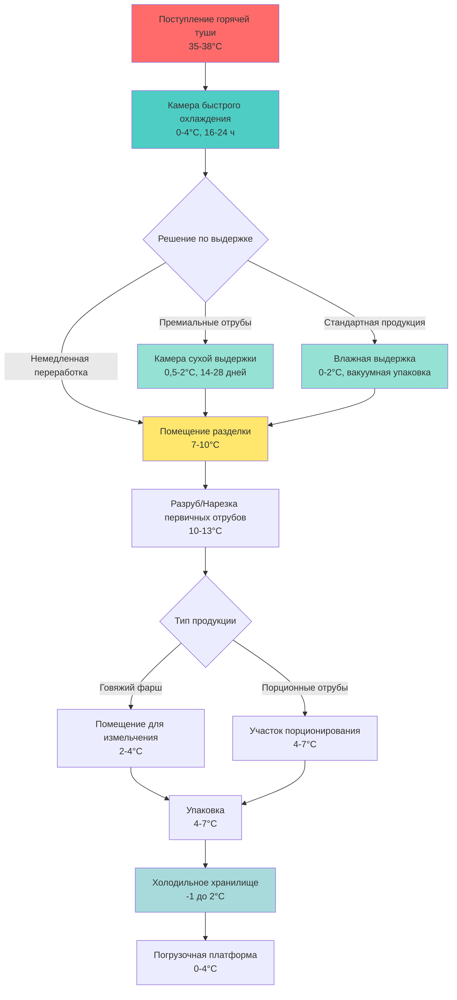
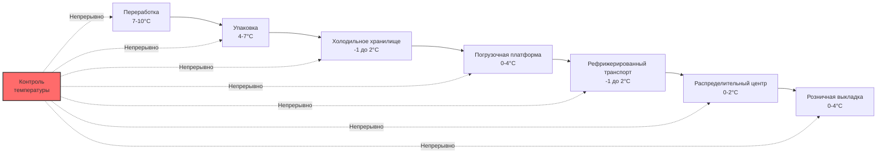

# Системы охлаждения при переработке говядины

Системы охлаждения при переработке говядины представляют одно из наиболее требовательных приложений в пищевой промышленности, требующих точного контроля температуры и влажности на протяжении нескольких этапов переработки. Профиль нагрузки охлаждения варьируется кардинально от начальной фазы охлаждения туш через выдержку, разделку и заключительные операции упаковки.

## Термодинамические аспекты переработки говядины

Требования к удалению тепла на предприятиях переработки говядины определяются фундаментальными принципами теплопередачи и специфическими термофизическими свойствами мышечной ткани говядины. Общая нагрузка охлаждения может быть выражена как:

$$Q_{total} = Q_{product} + Q_{respiration} + Q_{infiltration} + Q_{equipment} + Q_{lights} + Q_{personnel}$$

Для переработки говядины нагрузка от продукта доминирует, рассчитываемая как:

$$Q_{product} = \dot{m} \cdot c_p \cdot \Delta T + \dot{m} \cdot h_{fg}$$

где $\dot{m}$ представляет массовый расход говядины (обычно 500–2000 кг/ч для средних предприятий), $c_p$ — удельная теплоёмкость говядины (приблизительно 3,54 кДж/кг·К выше точки замерзания), $\Delta T$ — температурный перепад, а $h_{fg}$ учитывает любое изменение фазы при операциях замораживания (приблизительно 250 кДж/кг для нежирной говядины).

## Требования по температуре на этапах переработки

Различные этапы переработки требуют отличных друг от друга тепловых условий для сохранения качества продукта и соответствия нормативам USDA по безопасности пищевых продуктов и инспекции (FSIS):

| Этап переработки | Диапазон температуры | Относительная влажность | Типичная продолжительность | Интенсивность теплонагрузки |
|------------------|----------------------|------------------------|----------------------------|------------------------------|
| Поступление горячей туши | 35–38°C | 85–90% | Начальное состояние | Экстремальная (53–56 кВт/туша) |
| Быстрое охлаждение | 0–4°C | 90–95% | 16–24 часа | Высокая (28–42 кВт/туша) |
| Сухая выдержка | 0,5–2°C | 70–85% | 14–28 дней | Низкая (1,8–3,5 кВт/туша) |
| Влажная выдержка | 0–2°C | 95–98% | 14–35 дней | Очень низкая (1,1–1,8 кВт/туша) |
| Помещение разделки | 7–10°C | 50–60% | 2–6 часов/смена | Средняя (10,6–17,6 кВт/1000 кг) |
| Помещение разруба | 10–13°C | 45–55% | Активная переработка | Средне-высокая (14,1–21,2 кВт/1000 кг) |
| Производство фарша | 2–4°C | 60–70% | Непрерывно | Высокая (21,2–28,2 кВт/1000 кг) |
| Участок упаковки | 4–7°C | 55–65% | Непрерывно | Средняя (10,6–14,1 кВт/1000 кг) |

## Динамика охлаждения туш

Процесс охлаждения после убоя критичен как для безопасности пищевых продуктов, так и для качества мяса. USDA требует снижения температуры туши ниже 4°C в течение 24 часов для говяжьих туш. Скорость охлаждения следует закону охлаждения Ньютона, адаптированному для сложной геометрии говяжьих туш:

$$\frac{dT}{dt} = -k \cdot A \cdot (T - T_{\infty})$$

где $k$ — общий коэффициент теплопередачи (обычно 8–12 Вт/м²·К для принудительного охлаждения воздухом), $A$ — эффективная площадь поверхности (приблизительно 3,5–4,5 м² для туши массой 300 кг), $T$ — мгновенная температура туши, а $T_{\infty}$ — температура охлажденного воздуха.

Сложность заключается в достижении быстрого охлаждения для минимизации роста бактерий, при этом избегая «холодного сокращения» (сокращение мышц при понижении температуры ниже 10°C до завершения трупного окоченения) и чрезмерной потери влаги, которая снижает выход продаваемой продукции.

## Архитектура системы охлаждения

## Проектные соображения для камер выдержки

Выдержка представляет контролируемый ферментативный распад белков мышц, который повышает нежность и развивает сложность вкуса. Система охлаждения должна поддерживать точные условия:

**Требования для сухой выдержки:**
- Температура: 0,5–2°C (±0,3°C точность)
- Относительная влажность: 70–85% (строгий контроль для баланса потери влаги и предотвращения плесени)
- Скорость воздушного потока: 0,5–1,5 м/с (способствует испарению влаги и образованию защитной корки)
- Ожидаемая потеря массы: 15–25% за 21–28 дней

Скорость удаления влаги при сухой выдержке может быть рассчитана как:

$$\dot{m}_{water} = h_m \cdot A \cdot (P_{sat,surface} - P_{air})$$

где $h_m$ — коэффициент массопередачи (приблизительно 0,008–0,012 кг/м²·с·Па), а разница давления насыщенного пара управляет испарением.

**Требования для влажной выдержки:**
- Температура: 0–2°C (вакуумно-упакованные в сумки)
- Продолжительность: 14–35 дней
- Без значительной потери массы
- Сниженная нагрузка охлаждения по сравнению с сухой выдержкой

## Проектирование вентиляции помещения разделки

Помещения разделки, где туши разрубаются на первичные отрубы, требуют тщательного контроля окружающей среды для сохранения комфорта работников при предотвращении быстрого повышения температуры продукта. Проектные задачи включают:

1. **Управление температурной стратификацией**: Более теплый воздух у потолка (14–16°C) для комфорта работников, более холодный воздух на уровне рабочей поверхности (7–10°C)
2. **Распределение воздуха**: Высокоскоростные низкотемпературные (HVLT) раздающие устройства, направленные в сторону от рабочих
3. **Контроль влажности**: Осушение до 50–60% ОВ предотвращает конденсацию на поверхностях нарезки
4. **Вентиляция**: Минимум 6–8 воздухообменов в час для контроля запахов

Коэффициент явного тепла (SHR) для помещений разделки обычно находится в диапазоне 0,75–0,85:

$$SHR = \frac{Q_{sensible}}{Q_{sensible} + Q_{latent}}$$

## Управление холодной цепью и контроль температуры

Нормативы USDA FSIS требуют непрерывного контроля температуры с документированной проверкой. Профиль температуры-времени прямо влияет на рост бактерий в соответствии с отношением Аррениуса:

$$k = A \cdot e^{-E_a/(R \cdot T)}$$

где $k$ — константа скорости роста бактерий, $A$ — предэкспоненциальный множитель, $E_a$ — энергия активации (обычно 50–90 кДж/моль для психротрофных бактерий), $R$ — газовая постоянная, а $T$ — абсолютная температура.

Каждый градус Цельсия выше оптимальной температуры хранения приблизительно удваивает скорость роста бактерий, подчеркивая критическую важность непрерывной целостности холодной цепи от переработки через распределение.

## Критерии выбора оборудования

Оборудование охлаждения для переработки говядины должно решать:

1. **Быстрое удаление тепла**: Испарительные катушки с мощностью 20–30% выше расчетной нагрузки для быстрого охлаждения
2. **Циклы оттаивания**: Автоматическое оттаивание каждые 4–6 часов в высокологидных камерах охлаждения
3. **Ступенчатость компрессора**: Несколько компрессоров с модуляцией мощности для различных нагрузок
4. **Резервные системы**: Резервирование для критических камер выдержки и хранения
5. **Рекуперация энергии**: Рекуперация тепла из конденсатора для горячей воды (мытье, санитария)

Коэффициент производительности (COP) для систем охлаждения при переработке говядины обычно находится в диапазоне 2,5–3,5:

$$COP = \frac{Q_{cooling}}{W_{compressor}}$$

Современные системы на аммиаке (R-717) и диоксиде углерода (R-744) предпочитаются благодаря их профилю безопасности для окружающей среды и эффективности в промышленных приложениях переработки мяса.

## Оптимизация качества и выхода продукции

Проектирование системы охлаждения прямо влияет на выход и качество продукции через:

- **Контроль усадки**: Надлежащая влажность снижает потерю влаги с 3–5% до 1–2% при охлаждении
- **Сохранение цвета**: Контролируемая температура предотвращает преждевременное потемнение (окисление миоглобина)
- **Сохранение текстуры**: Предотвращает образование кристаллов льда в мышечной ткани
- **Продление срока хранения**: Каждое снижение на один градус добавляет приблизительно 20–25% к сроку хранения

Экономическое воздействие значительно: для предприятия, перерабатывающего 200 туш в день (средний вес 300 кг), снижение усадки на 1% приносит приблизительно 150 000–200 000 долларов в годовую прибыль при типичных оптовых ценах.

## Соответствие нормативам и документирование

USDA FSIS требует документированных планов HACCP (Анализ опасностей и критические контрольные точки) с охлаждением как критическими контрольными точками (CCP). Логи температуры должны продемонстрировать:

- Внутренняя температура туши ≤4°C в течение 24 часов после убоя
- Температуры в помещении разделки поддерживаются на уровне ≤10°C
- Температуры хранения непрерывно ≤4°C
- Температуры при транспортировке ≤4°C без перерывов, превышающих 30 минут

Несоответствие может привести к задержанию продукции, приостановке деятельности предприятия или нормативным мерам.
