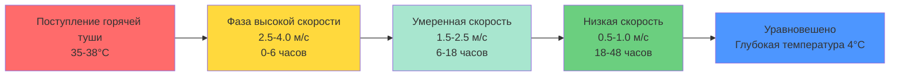
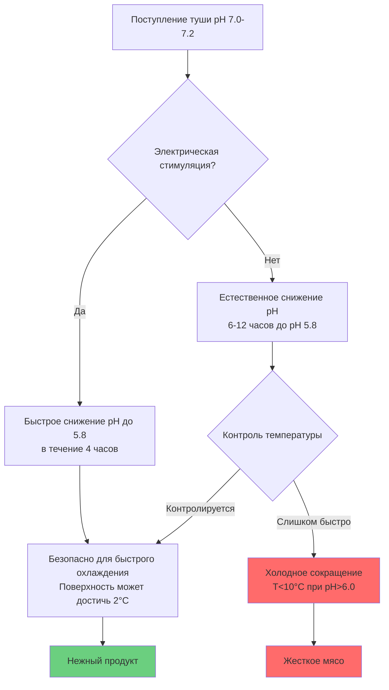

Охлаждение говяжьих туш представляет собой один из наиболее теплонагруженных единичных процессов на предприятиях переработки мяса. Процесс должен отводить значительное количество явного и скрытого тепла от больших тепловых масс, обеспечивая при этом точный контроль окружающей среды для предотвращения дефектов качества. Понимание физики теплопередачи от туш, динамики миграции влаги и биохимии мышечной ткани необходимо для надлежащего проектирования системы охлаждения.

## Характеристики тепловой нагрузки

Горячие говяжьи туши поступают в охладители при температуре 35–38°C после убоя и должны достичь температуры глубоких мышц ниже 4°C в течение 24–48 часов в зависимости от веса туши. Процесс отвода тепла протекает в три отчетливых фазы, каждая из которых предъявляет различные требования к холодопроизводительности.

**Начальная фаза охлаждения (0–6 часов)**

В течение первых 6 часов температуры поверхности падают быстро, в то время как центр туши остается близким к температуре тела. Теплопередача доминируется конвекцией с поверхности туши и излучением на более холодные стены. Тепловой поток в течение этого периода:

$$q'' = h_c(T_s - T_\infty) + \varepsilon\sigma(T_s^4 - T_w^4)$$

где $h_c$ — коэффициент конвективной теплопередачи (типично 15–25 Вт/м²·K при надлежащей скорости воздуха), $T_s$ — температура поверхности, $T_\infty$ — температура воздуха, $\varepsilon$ — коэффициент излучения (приблизительно 0,95 для говядины) и $T_w$ — температура стены.

**Промежуточная фаза (6–18 часов)**

По мере проникновения температурного градиента глубже в мышечную ткань теплопроводность через туш становится ограничивающим механизмом. Коэффициент температуропроводности говядины (приблизительно 1,4 × 10⁻⁷ м²/с) определяет скорость охлаждения:

$$\frac{\partial T}{\partial t} = \alpha \nabla^2 T$$

Эта фаза требует наибольшей постоянной холодопроизводительности, поскольку основная часть явного тепла отводится.

**Заключительное уравновешивание (18–48 часов)**

Температуры глубоких мышц приближаются к заданному значению асимптотически. Нагрузка на холодильную установку значительно снижается, состоя в основном из нагрузок инфильтрации, дыхания продукта и теплопроводности через изоляцию.

## Параметры проектирования охладителя

Оптимальная работа охладителя туш балансирует конкурирующие задачи: быстрое охлаждение для минимизации микробного роста, контролируемая потеря влаги и предотвращение холодного сокращения.

### Контроль температуры

Температура воздуха в охладителе: **0–2°C**

Этот диапазон обеспечивает адекватный температурный дифференциал для отвода тепла без создания чрезмерного обледенения поверхности. Температуры воздуха ниже -1°C увеличивают риск образования ледяных кристаллов на поверхности, что повреждает клеточные мембраны и увеличивает потери капель при последующей переработке.

Температура поверхности должна упасть ниже 7°C в течение 12 часов для соответствия требованиям USDA по снижению содержания патогенов, в то время как температура глубоких мышц должна достичь 4°C перед разделкой для удовлетворения требований FSIS по контролю температуры.

### Управление скоростью воздуха

Скорость воздуха над тушами требует точного контроля на протяжении всего цикла охлаждения:

Коэффициент конвективной теплопередачи варьируется со скоростью воздуха согласно:

$$h_c = C \cdot v^n$$

где $v$ — скорость воздуха, и для цилиндров в поперечном потоке (приблизительно моделируя висящие туши), $C \approx 8,6$ и $n \approx 0,6$ в единицах SI.

Вентиляторы переменной скорости позволяют снижать скорость по мере прогрессирования охлаждения, снижая усадку при сохранении адекватной теплопередачи. Трехэтапный профиль скорости оптимизирует кривую охлаждения.

### Контроль относительной влажности

Целевой диапазон: **85–90%**

Контроль влажности балансирует две противоположные требования. Более низкая влажность увеличивает градиент парциального давления пара, ускоряя испарительное охлаждение, но увеличивает усадку. Более высокая влажность снижает усадку, но может способствовать накоплению поверхностной влаги и микробному росту.

Скорость испарения с поверхности туши:

$$\dot{m}_e = h_m A (P_{sat,s} - P_\infty)$$

где $h_m$ — коэффициент массопередачи и $P_{sat,s}$ — давление насыщения при температуре поверхности.

Достижение 85–90% ОВ обычно требует температур испарителя только на 3–5°C ниже температуры комнатного воздуха, что требует больших площадей поверхности змеевика и высоких скоростей циркуляции воздуха.

## Контроль усадки

Потеря веса во время охлаждения представляет прямые экономические потери и влияет на выход продукта. Усадка является результатом испарения влаги и зависит от скорости воздуха, температурного дифференциала и времени экспозиции.

| Протокол охлаждения | Диапазон усадки | Влияние на качество |
|-------------------|-----------------|----------------|
| Обычное охлаждение (24ч, высокая скорость) | 2.0-2.5% | Хороший внешний вид, риск жесткости |
| Медленное охлаждение (48ч, низкая скорость) | 1.5-2.0% | Минимальный внешний вид, риск холодного сокращения |
| Распылительное охлаждение с водяным туманом | 1.0-1.5% | Отличный выход, требует непрерывного распыления |
| Ультра-быстрое охлаждение (взрывное замораживание) | 2.5-3.5% | Корка из льда на поверхности, высокая усадка |

Приемлемая усадка при обычном охлаждении говяжьих туш: **1.5–2.5%**

Общую потерю влаги можно оценить:

$$\Delta m = \int_0^t h_m A (P_{sat}(T_s) - \phi P_{sat}(T_a)) \, dt$$

где $\phi$ — относительная влажность. Образование поверхностной корки в течение первых 6 часов создает барьер влаги, который снижает последующие скорости испарения на 30–40%.

## Предотвращение холодного сокращения

Холодное сокращение возникает, когда мышечная ткань в дориго состоянии охлаждается ниже 10°C до истощения АТФ, вызывая неконтролируемое сокращение мышц и сильную жесткость. Это явление особенно проблематично для говядины из-за большой мышечной массы и медленного снижения pH.

**Критическое соотношение температура-pH**

$$\text{Риск холодного сокращения} = f(T, \text{pH}, \text{время после убоя})$$

Когда температура мышцы падает ниже 10°C, а pH остается выше 6.0, выпуск кальция из саркоплазматического ретикулума запускает связывание актина-миозина и сокращение, снижая нежность на до 50%.

**Стратегии предотвращения**

1. **Контролируемая скорость охлаждения**: Ограничить охлаждение поверхности в течение первых 6–8 часов после убоя, чтобы позволить гликолизу протекать и pH снизиться ниже 6.0 до того, как глубокие мышцы достигнут 10°C.

2. **Электрическая стимуляция**: Применение электрических импульсов 300–500В сразу после убоя ускоряет снижение pH благодаря повышенному гликолизу, позволяя более быстрое охлаждение без риска холодного сокращения.

3. **Горячая разделка**: Разделка туш в течение 2 часов после убоя перед наступлением трупного окоченения, сопровождаемая быстрым охлаждением меньших кусков, которые охлаждаются равномерно.

## Соображения о больших тушах

Взрослые говяжьи туши, весящие 300–450 кг, представляют уникальные проблемы охлаждения из-за их неблагоприятного соотношения поверхности к объему. Характерный размер для анализа теплопередачи:

$$L_c = \frac{V}{A} \approx 0.15 \text{ м для тяжелых говяжьих боков}$$

Число Био указывает на значимость внутреннего сопротивления:

$$Bi = \frac{h_c L_c}{k} = \frac{(20)(0.15)}{0.45} \approx 6.7$$

При $Bi > 0.1$ внутреннее сопротивление теплопроводности значительно, и температурные градиенты внутри туши не могут быть пренебрежены. Тяжелые туши могут требовать 36–48 часов для достижения 4°C по всей глубине.

**Конфигурация разделенного подвешивания**

Для улучшения однородности охлаждения туши разделяются вдоль позвоночника и подвешиваются с надлежащим промежутком (минимум 300 мм между боками), чтобы обеспечить циркуляцию воздуха вокруг всех поверхностей. Эффективная площадь теплопередачи увеличивается приблизительно на 40% по сравнению с подвешиванием целой туши.

## Проектирование холодильной системы

Расчет общей нагрузки на холодопроизводительность должен учитывать:

$$Q_{total} = Q_{product} + Q_{respiration} + Q_{infiltration} + Q_{equipment} + Q_{lights} + Q_{people}$$

**Нагрузка продукта** (типично 65–75% от общей):

$$Q_{product} = m \cdot c_p \cdot \Delta T + m \cdot h_{fg} \cdot \text{доля усадки}$$

Для говядины: $c_p \approx 3.5$ кДж/кг·K выше температуры замерзания, $h_{fg} = 2450$ кДж/кг для испарения воды.

**Время максимальной нагрузки**: Максимальная потребность в холодопроизводительности возникает через 6–10 часов после поступления туши, когда основное отведение явного тепла происходит одновременно с высокими скоростями дыхания.

Проектируйте емкость испарителя на 125–150% от расчетной установившейся нагрузки для обработки пиковых условий при загрузке горячих туш. Используйте многоступенчатое компрессорное управление или приводы переменной скорости для поддержания эффективности в течение периодов пониженной нагрузки цикла охлаждения.

## Требования нормативных требований USDA

FSIS требует, чтобы предприятия демонстрировали, что их процессы охлаждения достигают адекватного снижения содержания патогенов:

- Температура поверхности ниже 7°C в течение 12 часов
- Температура глубоких мышц ниже 4°C перед началом разделки
- Документирование профилей время-температура
- Подтверждение того, что протоколы охлаждения предотвращают рост патогенов

Предприятия должны разработать и валидировать планы анализа опасности и критические контрольные точки (HACCP), которые включают критические пределы для температуры охладителя и параметров времени.

## Заключение

Эффективное охлаждение говяжьих туш требует интеграции термодинамики, принципов теплопередачи и науки о мясе. Надлежащее проектирование холодильной системы обеспечивает достаточную емкость охлаждения с контролируемой доставкой воздуха для достижения целей безопасности пищевых продуктов при минимизации усадки и предотвращении холодного сокращения. Циркуляция воздуха переменной скорости, контроль влажности и мониторинг профилей время-температура являются необходимыми для оптимальной работы.
