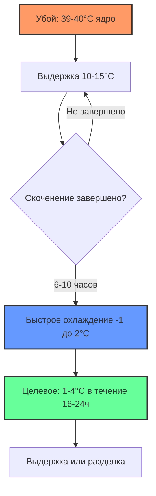
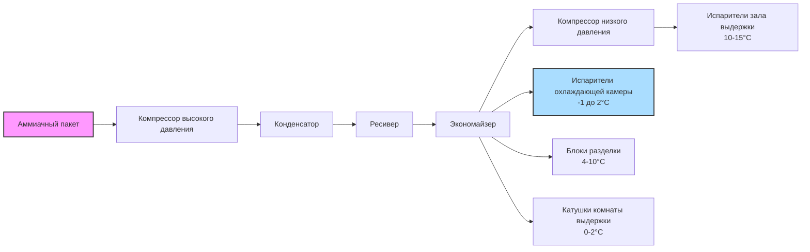

## Обзор

Системы охлаждения при переработке баранины решают уникальные задачи управления тепловыми процессами, вытекающие из меньшей массы туши, более высокого соотношения площади поверхности к объему и отличающихся требований к выдержке по сравнению с говядиной и свининой. Пониженная тепловая инерция туш баранины (типичная масса тушки 15-35 кг) требует точного управления охлаждением для предотвращения холодного сокращения при одновременном достижении быстрого подавления микробного роста в сроки, установленные USDA-FSIS.

## Характеристики туш и теплофизические свойства

### Физические свойства

Туши баранины проявляют теплофизические свойства, которые существенно влияют на конструкцию системы охлаждения:

| Свойство | Значение | Единицы | Примечания |
|----------|----------|---------|-----------|
| Удельная теплоемкость (выше точки замерзания) | 3,18 | кДж/кг·К | Немного ниже, чем у говядины/свинины |
| Удельная теплоемкость (замороженное) | 1,68 | кДж/кг·К | Ниже -1,5°C |
| Коэффициент теплопроводности | 0,41-0,48 | Вт/м·К | Варьируется в зависимости от содержания жира |
| Плотность | 1050-1080 | кг/м³ | Среднее значение для мышечной ткани |
| Начальная температура после убоя | 39-40 | °C | Температура ядра |
| Целевая температура охлаждения | 1-4 | °C | В течение 16-24 часов |

### Влияние площади поверхности

Более высокое соотношение площади поверхности к объему в тушах баранины по сравнению с говядиной существенно влияет на скорость теплопередачи. При цилиндрическом приближении:

$\frac{A}{V} = \frac{2\pi r L + 2\pi r^2}{\pi r^2 L} \approx \frac{2}{r}$ (для длинных цилиндров)

Меньший радиус увеличивает коэффициент, ускоряя теплопередачу, но также повышая восприимчивость к потере влаги на поверхности (усушка) и холодному сокращению, если скорость охлаждения превышает допустимую для мышечных волокон.

## Протоколы охлаждения и предотвращение холодного сокращения

### Критическая температурная зона

Холодное сокращение происходит, когда температура мышечной ткани падает ниже 10°C до завершения трупного окоченения (обычно 6-10 часов после убоя). Явление результируется неконтролируемым высвобождением кальция, вызывающим чрезмерное сокращение миофибрилл, при этом мясо становится жестким.

Сила сокращения подчиняется уравнению:

$F_{contraction} = k \cdot [Ca^{2+}] \cdot e^{-E_a/(R \cdot T)}$

Где концентрация ионов кальция и температура управляют образованием актомиозинового комплекса. Поддержание температуры туши выше 10°C в течение первых 10-12 часов предотвращает этот дефект качества.

### Двухэтапная стратегия охлаждения

**Этап 1: Удержание температуры (0-10 часов)**
- Температура окружающей среды: 10-15°C
- Скорость воздуха: 0,25-0,5 м/с (низкая скорость)
- Относительная влажность: 85-90%
- Задача: Обеспечить завершение окоченения выше критической температуры

**Этап 2: Быстрое охлаждение (10-24 часа)**
- Температура окружающей среды: -1 до 2°C
- Скорость воздуха: 1,0-2,0 м/с (более высокая скорость)
- Относительная влажность: 90-95%
- Задача: Быстро достичь целевой температуры в глубине продукта

### Анализ теплопередачи

Интенсивность конвективной теплопередачи с поверхности туши следует закону охлаждения Ньютона:

$q = h \cdot A \cdot (T_{surface} - T_{air})$

Где:
- q = интенсивность теплопередачи (Вт)
- h = коэффициент конвекции (8-25 Вт/м²·К в зависимости от скорости воздуха)
- A = площадь поверхности (м²)
- T_surface = температура поверхности туши (°C)
- T_air = температура окружающего воздуха (°C)

Коэффициент конвекции увеличивается со скоростью воздуха в соответствии с:

$h = C \cdot v^{0,8}$

Удвоение скорости воздуха увеличивает h примерно на 75%, существенно ускоряя скорость охлаждения.

## Требования к выдержке для развития качества

### Протокол влажной выдержки

Влажная выдержка в вакуумной упаковке позволяет протеолитическим ферментам размягчать мясо, предотвращая потерю влаги. Оптимальные условия:

| Параметр | Спецификация | Обоснование |
|----------|------------|-----------|
| Температура | 0-2°C | Минимизирует микробный рост при сохранении активности ферментов |
| Длительность | 7-14 дней | Баланс улучшения мягкости против риска |
| Относительная влажность | N/A | Вакуумная упаковка предотвращает обмен влаги |
| Циркуляция воздуха | Минимальная | Продукт в упаковке, без прямого контакта с воздухом |

### Протокол сухой выдержки

Сухая выдержка производит концентрированный вкус и повышенную мягкость через контролируемое испарение влаги и ферментативную активность. Этот метод требует точного контроля окружающей среды:

| Параметр | Спецификация | Обоснование |
|----------|------------|-----------|
| Температура | 0-2°C | Активность ферментов без порчи |
| Длительность | 14-28 дней | Продленная выдержка для премиум-продуктов |
| Относительная влажность | 75-85% | Баланс потери воды против чрезмерного высыхания |
| Скорость воздуха | 0,5-1,0 м/с | Равномерное высыхание, предотвращение затвердения поверхности |

Скорость потери влаги при сухой выдержке подчиняется:

$\frac{dm}{dt} = h_m \cdot A \cdot (P_{sat,surface} - P_{air})$

Где:
- dm/dt = скорость потери массы (кг/с)
- h_m = коэффициент массопередачи (кг/м²·с·Па)
- P_sat,surface = давление насыщенного пара при температуре поверхности (Па)
- P_air = парциальное давление водяного пара в воздухе (Па)

Типичные потери усушки варьируются от 8-15% за периоды выдержки 14-21 день.

## Контроль температуры в зале разделки

### Рабочие условия

Разделка баранины (разрубка, обрезка, порционирование) требует температур, уравновешивающих безопасность продукта, консистенцию жира и комфорт рабочих:

| Операция | Диапазон температуры | ОВ | Скорость воздуха |
|----------|---------------------|-----|-----------------|
| Первичная разрубка | 7-10°C | 75-85% | 0,15-0,4 м/с |
| Тонкая разрезка | 4-7°C | 75-85% | 0,2-0,4 м/с |
| Упаковка | 7-10°C | 70-80% | 0,15-0,3 м/с |

Более низкие температуры затвердевают подкожный и внутримышечный жир, облегчая чистые разрезы и снижая размазывание при механической нарезке.

### Компоненты холодильной нагрузки

Общая холодильная нагрузка в залах разделки включает:

$Q_{total} = Q_{product} + Q_{personnel} + Q_{equipment} + Q_{lights} + Q_{infiltration} + Q_{transmission}$

**Нагрузка продуктом:**
Для производительности 1000 кг/ч с нагревом от 2°C до среднего 8°C:

$Q_{product} = \frac{\dot{m} \cdot c_p \cdot \Delta T}{3600} = \frac{1000 \cdot 3,18 \cdot 6}{3600} = 5,3 \text{ кВ}$

**Нагрузка персоналом:**
Каждый рабочий генерирует приблизительно 250-300 Вт явного тепла и 100-150 Вт скрытого тепла при температуре окружающей среды 7-10°C. Для 15 рабочих:

$Q_{personnel} = 15 \cdot 400 = 6,0 \text{ кВ всего}$

**Нагрузка оборудованием:**
Ленточные пилы, шлифмашины, конвейеры и упаковочное оборудование вносят тепло от двигателей. Прогноз 2-4 кВ на единицу основного оборудования.

## Спецификации для экспортных рынков

### Требования документирования температуры

Экспорт баранины на основные рынки (Ближний Восток, Азия, Европа) требует непрерывного мониторинга температуры и документирования от убоя до отправки:

| Рынок | Макс. температура продукта | Частота мониторинга | Период документирования |
|-------|---------------------------|---------------------|----------------------|
| ЕС | 7°C | Непрерывное цифровое | Минимум 3 года |
| Ближний Восток | 4°C | Минимум каждые 4 часа | Минимум 2 года |
| Япония | 5°C | Непрерывное цифровое | Минимум 2 года |
| Китай | 7°C | Непрерывное цифровое | Минимум 2 года |

### Рассмотрение халяльной обработки

Халяльная переработка баранины для экспортных рынков требует интеграции религиозного соответствия с протоколами охлаждения. Критические соображения:

1. **Эффективность кровопускания**: Полное обескровливание перед началом охлаждения
2. **Быстрое начало охлаждения**: В течение 30-60 минут после убоя
3. **Разделение**: Выделенные холодильники предотвращают перекрестное загрязнение
4. **Прослеживаемость**: Записи температуры связаны с религиозной сертификацией

## Конструкция холодильной системы

### Двухступенчатая аммиачная система

Крупные предприятия по переработке баранины выигрывают от двухступенчатых аммиачных систем, работающих при оптимизированных давлениях всасывания для различных температурных зон. Коэффициент производительности улучшается при промежуточном охлаждении с экономайзером:

$COP_{two-stage} = \frac{Q_L}{W_{low} + W_{high}}$

По сравнению с одноступенчатой работой при той же температуре испарителя, двухступенчатые системы достигают повышения эффективности на 15-25% для температур ниже -10°C.

## Контроль микробного роста

Температура остается основной защитой от размножения патогенов. Фаза задержки перед началом бактериального роста увеличивается экспоненциально с понижением температуры:

$t_{lag} = t_0 \cdot e^{b(T_{ref} - T)}$

Где:
- t_lag = длительность фазы задержки (часов)
- t_0 = эталонное время задержки
- b = температурный коэффициент (обычно 0,15-0,25)
- T_ref = эталонная температура (обычно 20°C)
- T = температура хранения (°C)

Снижение температуры хранения с 10°C до 2°C удлиняет фазу задержки с примерно 2 часов до 12-18 часов для обычных микроорганизмов порчи.

## Заключение

Системы охлаждения при переработке баранины требуют интегрированных стратегий управления тепловыми процессами, решающих уникальные физиологические характеристики вида, меньшие размеры туш, требования к выдержке и международные спецификации для экспорта. Двухэтапные протоколы охлаждения предотвращают холодное сокращение при обеспечении быстрого подавления микробного роста. Точный контроль окружающей среды во время выдержки и разделки оптимизирует качество продукта, а комплексное документирование температуры соответствует нормативным требованиям и требованиям доступа на рынок. Надлежащая конструкция холодильной системы, уравновешивающая производительность, эффективность и надежность, обеспечивает стабильное качество продукта и безопасность пищевых продуктов на протяжении всей цепочки обработки.
