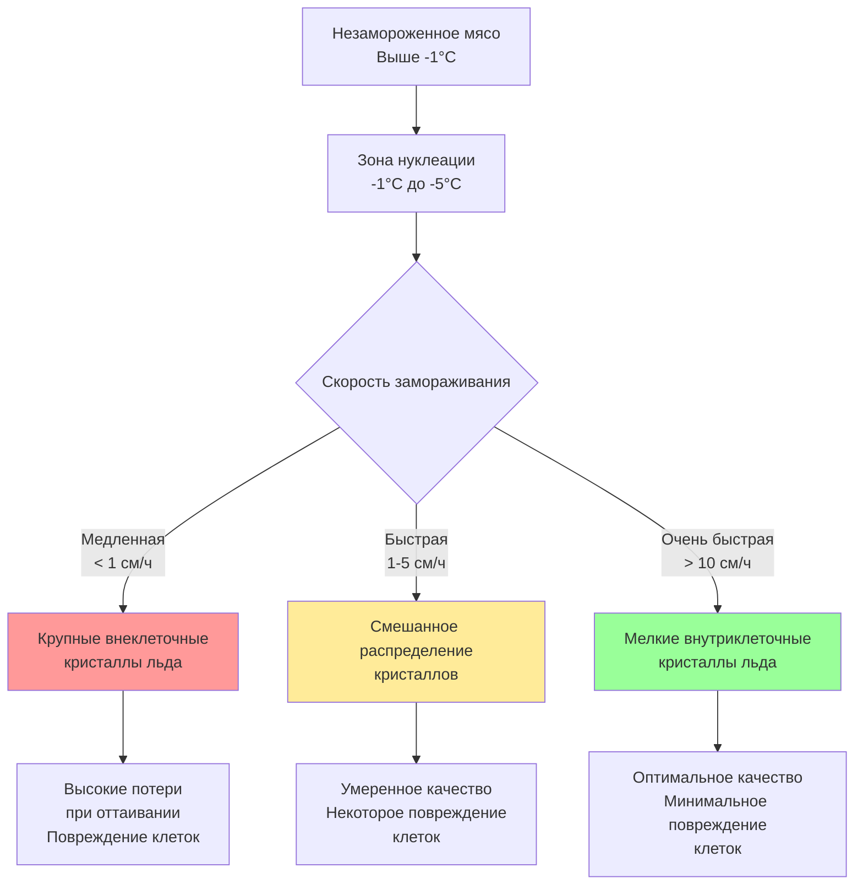
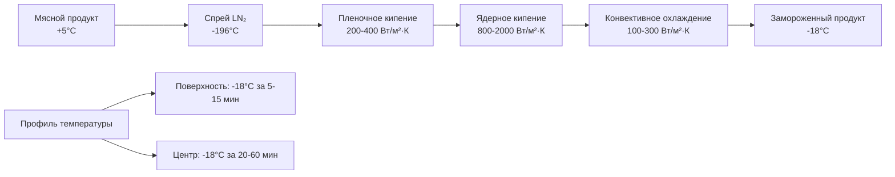

Замораживание мяса сохраняет качество продукции путем контролируемого фазового перехода воды в мышечной ткани. Выбранный метод замораживания напрямую влияет на размер кристаллов льда, потери при оттаивании, сохранение текстуры и микробную стабильность через скорость теплопередачи и профили температуры.

## Физика скорости замораживания

Скорость замораживания определяет морфологию кристаллов льда в мышечной ткани. Теплопередача во время замораживания подчиняется закону Фурье:

$$q = -k A \frac{dT}{dx}$$

где $q$ — скорость теплопередачи (Вт), $k$ — теплопроводность (Вт/м·К), $A$ — площадь поверхности (м²), и $\frac{dT}{dx}$ — градиент температуры.

Время замораживания мясных продуктов можно оценить с использованием уравнения Планка:

$$t_f = \frac{\rho \Delta H}{T_f - T_m} \left(\frac{P \cdot d}{h} + \frac{R \cdot d^2}{k}\right)$$

где:
- $t_f$ = время замораживания (с)
- $\rho$ = плотность (кг/м³)
- $\Delta H$ = скрытая теплота плавления (334 кДж/кг для воды)
- $T_f$ = температура среды замораживания (°C)
- $T_m$ = начальная точка замерзания мяса (-1,5 до -2,5°C)
- $P$, $R$ = коэффициенты формы (0,5, 0,125 для бесконечной пластины)
- $d$ = толщина (м)
- $h$ = коэффициент теплопередачи на поверхности (Вт/м²·К)
- $k$ = теплопроводность (Вт/м·К)

### Механизм образования кристаллов льда

Образование льда в мышечной ткани происходит двумя путями:

1. **Гомогенная нуклеация**: Самопроизвольное образование льда при температурах ниже -40°C
2. **Гетерогенная нуклеация**: Образование кристаллов на сайтах нуклеации (белки, клеточные мембраны) при -1,5 до -5°C

Критический радиус формирования стабильного ледяного зародыша:

$$r^* = \frac{2\sigma T_m}{L_f \rho_{ice} \Delta T}$$

где $\sigma$ — поверхностное натяжение (0,032 Дж/м²), $L_f$ — скрытая теплота, и $\Delta T$ — степень переохлаждения.

**Классификация скорости замораживания (ASHRAE Handbook - Refrigeration)**:
- Медленная: < 1 см/ч (крупные кристаллы льда, 50-200 мкм)
- Быстрая: 1-5 см/ч (средние кристаллы, 20-50 мкм)
- Быстрозамораживание: 5-10 см/ч (мелкие кристаллы, 10-20 мкм)
- Сверхбыстрое: > 10 см/ч (микрокристаллы, < 10 мкм)

## Системы взрывного замораживания

Взрывное замораживание использует высокоскоростной воздух при -30 до -40°C для достижения быстрых скоростей замораживания путем вынужденной конвекции.

**Расчет коэффициента теплопередачи**:

$$h = \frac{Nu \cdot k_{air}}{L}$$

где число Нусселта $Nu$ коррелирует с числом Рейнольдса:

$$Nu = C \cdot Re^m \cdot Pr^{1/3}$$

Для скоростей воздуха 3-6 м/с поперек мясных продуктов $h$ колеблется в диапазоне 25-50 Вт/м²·К.

### Параметры проектирования взрывных морозильников

| Параметр | Непрерывный туннель | Периодическая камера | Спиральный конвейер |
|----------|-------------------|----------------------|---------------------|
| Температура воздуха | -35 до -40°C | -30 до -40°C | -30 до -35°C |
| Скорость воздуха | 4-6 м/с | 3-5 м/с | 2-4 м/с |
| Время замораживания (10 см) | 2-4 часа | 3-6 часов | 3-5 часов |
| Пропускная способность | 2000-5000 кг/ч | 500-2000 кг/цикл | 1000-3000 кг/ч |
| Энергопотребление | 250-350 кВт·ч/т | 300-400 кВт·ч/т | 280-350 кВт·ч/т |
| Типичная теплопередача | 35-45 Вт/м²·К | 25-35 Вт/м²·К | 30-40 Вт/м²·К |
| Размер кристаллов льда | 30-60 мкм | 50-100 мкм | 40-80 мкм |
| Потери при оттаивании | 2-4% | 3-6% | 2,5-5% |

**Применение**: Порционированные куски, мясные котлеты, части птицы, упакованные полутушки

## Системы плиточного замораживания

Плиточные морозильники передают тепло через прямой контакт с охлаждаемыми металлическими пластинами, достигая коэффициентов теплопередачи 150-300 Вт/м²·К.

Теплопередача при контактном замораживании:

$$q = h_{contact} A (T_{product} - T_{plate})$$

Контактное сопротивление на границе раздела:

$$R_{contact} = \frac{1}{h_{contact}} = \frac{\delta_{gap}}{k_{air}} + \frac{\delta_{frost}}{k_{frost}}$$

где типичный $\delta_{gap}$ составляет 0,1-0,5 мм. Приложенное гидравлическое давление (20-50 кПа) минимизирует воздушные промежутки.

### Производительность плиточного морозильника

| Характеристика | Горизонтальная пластина | Вертикальная пластина |
|----------------|--------------------------|----------------------|
| Температура пластины | -35 до -42°C | -35 до -40°C |
| Контактное давление | 20-50 кПа | 15-30 кПа |
| Коэффициент теплопередачи | 200-300 Вт/м²·К | 150-250 Вт/м²·К |
| Время замораживания (5 см) | 1,5-2,5 часа | 2-3 часа |
| Диапазон толщины продукта | 25-100 мм | 30-120 мм |
| Энергоэффективность | 180-250 кВт·ч/т | 200-280 кВт·ч/т |
| Размер кристаллов льда | 20-40 мкм | 25-50 мкм |
| Потери при оттаивании | 1,5-3% | 2-4% |
| Типичное применение | Блоки рыбы и мяса | Розничные упаковки |

**Преимущества**:
- Превосходная теплопередача посредством теплопроводности
- Равномерное замораживание по поверхности продукта
- Минимальное обезвоживание (закрытый контакт)
- Компактные конфигурации вертикальной/горизонтальной ориентации

**Ограничения**:
- Требует плоской, однородной геометрии продукта
- Ограничено упакованными или блочными продуктами
- Высокая стоимость оборудования на единицу мощности

## Криогенные системы замораживания

Криогенное замораживание использует жидкий азот (LN₂ при -196°C) или жидкую углекислоту (LCO₂ при -78°C) для сверхбыстрого замораживания со скоростями, превышающими 10 см/ч.

Теплопередача сочетает конвекцию пара и кипение на поверхности продукта:

$$q_{cryo} = h_{conv}(T_s - T_{\infty}) + h_{boil}(T_s - T_{sat})$$

Коэффициенты теплопередачи при кипении достигают 500-2000 Вт/м²·К во время фазы ядерного кипения.

### Сравнение криогенных систем

| Параметр | Жидкий азот (LN₂) | Жидкая CO₂ (LCO₂) | Снег CO₂ |
|----------|-------------------|-------------------|---------|
| Температура криогена | -196°C | -78°C | -78°C |
| Пиковая теплопередача | 1500-2000 Вт/м²·К | 800-1200 Вт/м²·К | 400-800 Вт/м²·К |
| Время замораживания (2,5 см) | 5-15 минут | 10-20 минут | 15-30 минут |
| Расход криогена | 0,8-1,2 кг/кг продукта | 0,6-1,0 кг/кг продукта | 0,5-0,8 кг/кг продукта |
| Эксплуатационные затраты | $0,40-0,60/кг | $0,25-0,40/кг | $0,20-0,35/кг |
| Размер кристаллов льда | 5-15 мкм | 10-25 мкм | 15-35 мкм |
| Потери при оттаивании | 0,5-1,5% | 1-2% | 1,5-2,5% |
| Поверхностное обезвоживание | Минимальное (< 0,5%) | Низкое (< 1%) | Низкое (< 1%) |

**Преимущества криогенного замораживания**:
- Микрокристаллическая структура льда (5-20 мкм)
- Минимальное нарушение клеток
- Сохранение функциональности белков
- Незначительное окисление (инертная атмосфера)
- Гибкая установка (без механической рефрижерации)

**Экономические соображения**:
Более высокие эксплуатационные затраты ($0,20-0,60/кг) по сравнению с механическим замораживанием ($0,08-0,15/кг) компенсируются:
- Превосходным качеством продукции и выходом
- Сниженными потерями при оттаивании (0,5-2% против 2-6%)
- Более высокой пропускной способностью на единицу площади
- Более низкими капитальными вложениями для небольших производств

## Влияние скорости замораживания на качество мяса

Зависимость между скоростью замораживания и характеристиками качества:

$$\text{Потери при оттаивании (\%)} = a + b \cdot \frac{1}{\text{Скорость замораживания}}$$

где коэффициенты зависят от типа мышц и предварительной подготовки.

### Матрица влияния на качество

| Атрибут | Медленное замораживание | Быстрое замораживание | Сверхбыстрое замораживание |
|---------|--------------------------|------------------------|---------------------------|
| Размер кристаллов льда | 50-200 мкм | 20-50 мкм | 5-20 мкм |
| Повреждение клеточной мембраны | Сильное | Умеренное | Минимальное |
| Потери при оттаивании | 5-8% | 2-4% | 0,5-2% |
| Денатурация белков | 15-25% | 8-15% | 3-8% |
| Сохранение цвета | Плохое | Хорошее | Отличное |
| Оценка текстуры (1-10) | 5-6 | 7-8 | 8-9 |
| Микробная стабильность | 6-9 месяцев | 9-12 месяцев | 12-18 месяцев |
| Окислительная стабильность | 3-6 месяцев | 6-9 месяцев | 9-15 месяцев |

**Физические механизмы**:
1. **Внеклеточное замораживание**: Крупные кристаллы образуются вне клеток, создавая осмотический градиент
2. **Обезвоживание клеток**: Вода мигрирует из клеток, концентрируя растворенные вещества
3. **Разрыв мембраны**: Кристаллы льда физически прокалывают клеточные мембраны
4. **Денатурация белков**: Концентрированные растворенные вещества денатурируют белки при медленном замораживании

Оптимальное замораживание проходит через зону максимального образования кристаллов льда (-1 до -5°C) менее чем за 30 минут, чтобы минимизировать рост кристаллов.

---

**Ссылки**:
- ASHRAE Handbook - Refrigeration, Глава 30: Мясные продукты
- ASHRAE Handbook - Refrigeration, Глава 29: Теплофизические свойства пищевых продуктов
- Journal of Food Engineering: Распределение размеров кристаллов льда в системах замороженного мяса
- International Institute of Refrigeration: Рекомендации по обработке и хранению замороженных пищевых продуктов
