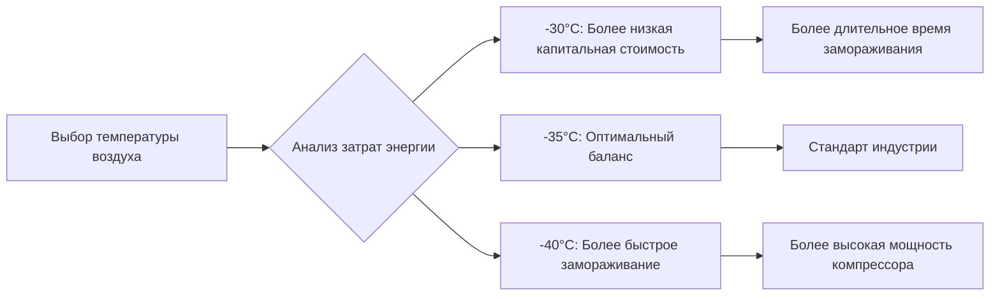
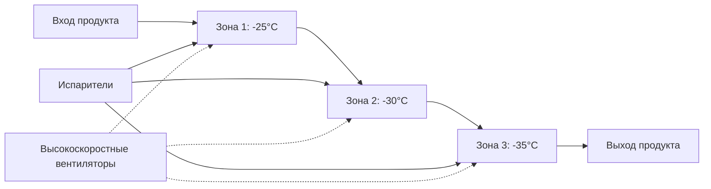
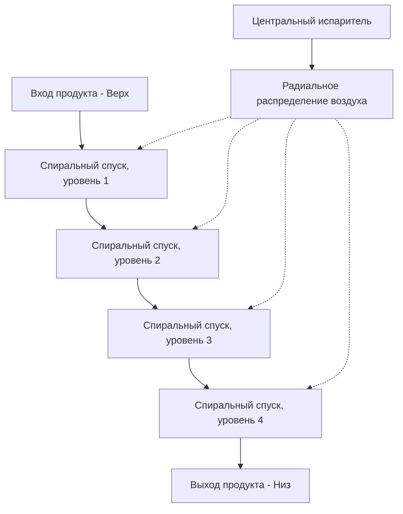

Быстрое замораживание — наиболее широко применяемая технология быстрого замораживания на предприятиях по переработке мяса. Метод основан на теплопередаче за счет вынужденной конвекции, при которой холодный воздух высокой скорости удаляет тепло с поверхности продукта с такой интенсивностью, что минимизируется образование ледяных кристаллов и сохраняется качество мяса. Понимание физики вынужденного замораживания позволяет правильно выбрать систему и оптимизировать её работу.

## Основы конвективной теплопередачи

Удаление тепла при быстром замораживании происходит за счет вынужденной конвекции, при которой скорость воздуха прямо влияет на коэффициент поверхностной теплопередачи. Взаимосвязь следует закону охлаждения Ньютона:

$$q = h \cdot A \cdot (T_s - T_\infty)$$

Где $q$ — интенсивность теплопередачи (Вт), $h$ — коэффициент конвективной теплопередачи (Вт/м²·К), $A$ — площадь поверхности (м²), $T_s$ — температура поверхности (К), и $T_\infty$ — температура воздуха (К).

Коэффициент конвекции связан со скоростью воздуха эмпирическими соотношениями. Для турбулентного потока над мясными продуктами:

$$h = C \cdot v^{0.8}$$

Где $C$ — константа, зависящая от геометрии, и $v$ — скорость воздуха (м/с). Данный показатель степени демонстрирует, что удвоение скорости воздуха увеличивает теплопередачу приблизительно на 74%, хотя с уменьшающейся отдачей при более высоких скоростях.

## Требования к скорости воздуха

Справочник ASHRAE по холодильной технике указывает скорости воздуха в системах быстрого замораживания от 2,5 до 6 м/с, при оптимальных диапазонах, зависящих от конфигурации продукта:

| Тип продукта | Скорость воздуха | Обоснование |
|--------------|------------------|-------------|
| Упакованные куски | 2,5–3,5 м/с | Предотвращает деформацию упаковки |
| Неупакованные туши | 4–6 м/с | Максимизирует поверхностную теплопередачу |
| Блоки фарша | 3–4 м/с | Уравновешивает скорость замораживания и поверхностное высушивание |
| Тонкие продукты (<25 мм) | 5–6 м/с | Достигает быстрого сквозного замораживания |

Скорости, превышающие 6 м/с, обеспечивают минимальное дополнительное преимущество теплопередачи, при этом существенно увеличивая потребление энергии вентилятором (пропорционально $v^3$) и скорость поверхностного высушивания.

## Температурные профили и условия работы

Температура воздуха в системе быстрого замораживания обычно находится в диапазоне от -30°C до -40°C, обеспечивая достаточный температурный перепад для стимуляции быстрого удаления тепла. Температурный перепад между воздухом и поверхностью продукта определяет скорость замораживания:

$$\frac{dT}{dt} = \frac{h}{\rho c_p \delta}(T_\infty - T)$$

Где $\rho$ — плотность (кг/м³), $c_p$ — удельная теплоемкость (Дж/кг·К), и $\delta$ — характеристический размер (м).

Более низкие температуры воздуха ускоряют замораживание, но увеличивают эксплуатационные расходы холодильной системы и образование инея на испарителях. Экономическая оптимизация обычно отдает предпочтение -35°C как точке равновесия:

## Расчеты времени замораживания

Уравнение Планка обеспечивает первоначальные оценки времени замораживания для правильно сформированных продуктов:

$$t_f = \frac{\rho L}{T_f - T_\infty} \left[\frac{P \cdot d}{h} + \frac{R \cdot d^2}{k}\right]$$

Где:
- $t_f$ = время замораживания (с)
- $\rho$ = плотность (кг/м³)
- $L$ = удельная теплота плавления (334 кДж/кг для воды)
- $T_f$ = температура замерзания (°C)
- $T_\infty$ = температура воздуха (°C)
- $P$, $R$ = коэффициенты формы (0,5, 0,125 для бесконечной пластины)
- $d$ = толщина (м)
- $h$ = коэффициент поверхностной теплопередачи (Вт/м²·К)
- $k$ = теплопроводность замороженного продукта (Вт/м·К)

Для пластины говядины толщиной 100 мм с типичными свойствами ($\rho$ = 1050 кг/м³, $k$ = 1,3 Вт/м·К, влажность 75%):

$$t_f = \frac{1050 \times 250}{-5 - (-35)} \left[\frac{0,5 \times 0,1}{25} + \frac{0,125 \times 0,01}{1,3}\right] = 8750 \times 0,003 = 145 \text{ минут}$$

Этот расчет предполагает $h$ = 25 Вт/м²·К при скорости воздуха 4 м/с.

## Конфигурация туннельного морозильника

Туннельные морозильники используют линейный проток продукта через охлажденную камеру с противоточной или параллельной циркуляцией воздуха:

**Преимущества:**
- Простая обработка продукта через ленточные или вагонные системы
- Легко масштабируется путем увеличения длины туннеля
- Подходит для продуктов неправильной формы
- Более низкая капитальная стоимость на единицу производительности

**Ограничения:**
- Требуется значительная площадь пола (обычно 20–40 м длины)
- Изменение скорости воздуха по ширине ленты
- Сложность обеспечения равномерного распределения воздуха

Туннельные морозильники подходят для высокопроизводительных операций по переработке стандартизированных продуктов, где площадь пола позволяет создать линейную схему.

## Конфигурация спирального морозильника

Спиральные морозильники используют винтовой конвейер внутри цилиндрической или прямоугольной камеры, максимизируя производительность на единицу площади пола:

**Преимущества:**
- Компактный размер (диаметр 3–5 м, высота 4–8 м)
- Время выдержки регулируется скоростью ленты
- Эффективная циркуляция воздуха
- Подходит для объектов с ограниченной площадью пола

**Ограничения:**
- Более высокая капитальная стоимость на единицу производительности
- Сложная регулировка и обслуживание ленты
- Ограничение по высоте продукта (обычно <150 мм)
- Возможное изменение скорости от центра к периметру

Спиральная конфигурация полезна при замораживании однородных продуктов в объектах с ограниченной площадью, требующих высокой производительности.

## Сравнение производительности системы

| Параметр | Туннельный морозильник | Спиральный морозильник |
|----------|------------------------|------------------------|
| Площадь пола | 80–150 м² на тонну/ч | 20–40 м² на тонну/ч |
| Равномерность скорости воздуха | ±15–25% | ±10–20% |
| Универсальность продукта | Высокая | Средняя |
| Капитальная стоимость | 800–1200 $/кВ | 1200–1800 $/кВ |
| Сложность обслуживания | Низкая | Средняя–Высокая |
| Типовая производительность | 1–10 тонн/ч | 0,5–5 тонн/ч |

## Расчеты тепловой нагрузки

Общая холодильная нагрузка включает охлаждение продукта, инфильтрацию из помещения и теплоту от вентиляторов:

$$Q_{total} = Q_{product} + Q_{infiltration} + Q_{fans}$$

Тепловая нагрузка продукта учитывает чувствительное охлаждение выше точки замерзания, скрытую теплоту плавления и чувствительное охлаждение ниже точки замерзания:

$$Q_{product} = \dot{m} \left[c_{p,unfrozen}(T_{initial} - T_f) + L + c_{p,frozen}(T_f - T_{final})\right]$$

Для говядины, поступающей при 5°C и выходящей при -18°C с влажностью 75%:

$$Q_{product} = \dot{m} \left[3,5 \times 10 + 250 + 1,8 \times 13\right] = \dot{m} \times 308,4 \text{ кДж/кг}$$

При производительности 1000 кг/ч тепловая нагрузка продукта составляет 85,7 кВ. При добавлении инфильтрации (15–20%) и теплоты от вентиляторов (10–15%) общая производительность испарителя составляет приблизительно 115 кВ.

## Эксплуатационные аспекты

**Равномерность распределения воздуха**: Анализ с использованием методов вычислительной гидродинамики выявляет изменения скорости воздуха до 40% в плохо спроектированных системах. Правильная конструкция камеры и размещение испарителя поддерживают равномерность скорости в пределах ±15%.

**Управление инеем**: Температуры испарителя от -40°C до -45°C приводят к быстрому накоплению инея. Циклы оттаивания горячим газом каждые 6–12 часов поддерживают эффективность теплопередачи.

**Расстояние между продуктами**: Минимальный зазор 25 мм между продуктами предотвращает обход воздухом и обеспечивает адекватное воздействие на поверхность. Укладка продуктов снижает эффективную площадь теплопередачи на 30–50%.

**Температурный мониторинг**: Многоточечное датирование температуры по всей массе продукта подтверждает полное замораживание. Температура центра ниже -18°C подтверждает соответствие требованиям безопасности продуктов питания.

Рекомендации ASHRAE указывают на быстрое замораживание как основной метод быстрого замораживания для большинства применений в мясной промышленности, обеспечивающий баланс капитальных затрат, операционной гибкости и сохранения качества продукции.
