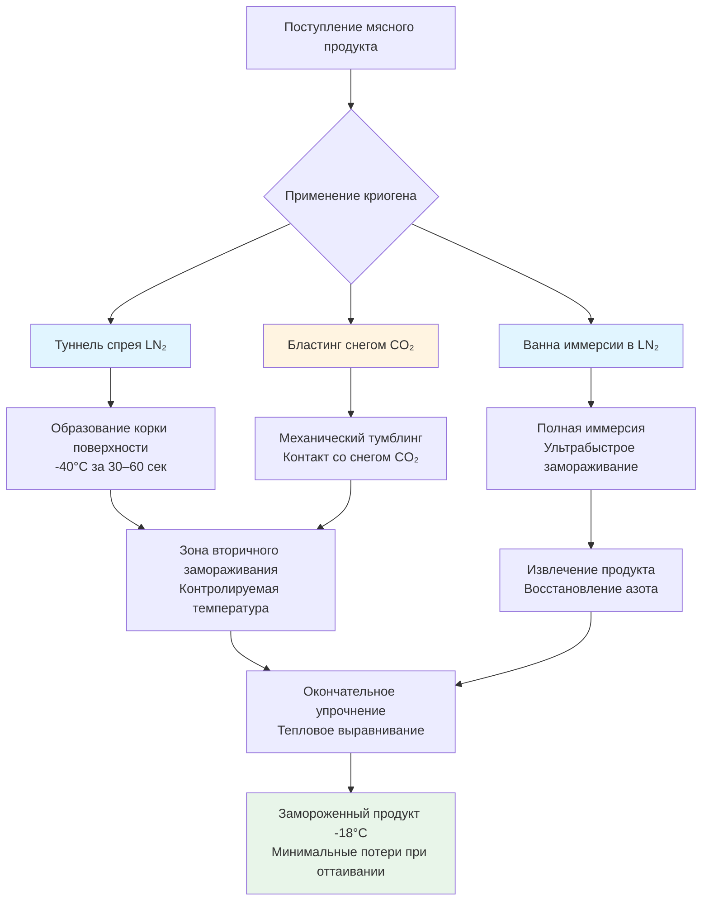

Криогенное замораживание представляет собой самую быструю коммерческую технологию замораживания мяса, использующую ультранизкотемпературные криогены—жидкий азот (LN₂) при -196°C и диоксид углерода (CO₂) при -78°C—для достижения скоростей замораживания в 10–50 раз выше, чем в традиционных механических системах. Это ультрабыстрое отведение тепла принципиально изменяет физику образования кристаллов льда, сохраняя клеточную структуру и минимизируя деградацию качества.

## Основы криогенных сред

### Жидкий азот (LN₂)

Жидкий азот обеспечивает самый холодный коммерчески доступный криоген с исключительными характеристиками теплопередачи:

**Теплофизические свойства:**
- Температура кипения: -196°C при атмосферном давлении
- Скрытая теплота испарения: 199 кДж/кг
- Удельная теплоёмкость (жидкая): 2,04 кДж/(кг·K)
- Плотность (жидкая): 808 кг/м³ при точке кипения

**Механизмы теплопередачи:**

Общая холодопроизводительность включает чувствительное нагревание жидкого азота с последующей фазовой трансформацией:

$$Q = m_{N_2} \left[ c_p \Delta T + h_{fg} \right]$$

где $m_{N_2}$ — массовый расход азота, $c_p$ — удельная теплоёмкость, $\Delta T$ — изменение температуры, $h_{fg}$ — скрытая теплота.

Доминирующая теплопередача происходит при кипении, где коэффициенты конвекции достигают 5000–15000 Вт/(м²·K) в сравнении с 20–50 Вт/(м²·K) при ледяном взрывном замораживании. Это усиление в 100–300 раз обеспечивает ультрабыстрое замораживание.

### Снег диоксида углерода (CO₂)

CO₂ переходит непосредственно из твёрдого состояния в газообразное при атмосферном давлении:

**Теплофизические свойства:**
- Температура сублимации: -78,5°C при атмосферном давлении
- Скрытая теплота сублимации: 571 кДж/кг
- Тройная точка: -56,6°C при 5,18 бар
- Плотность снега: 1560 кг/м³

Пеллеты или снег CO₂ обеспечивают промежуточные скорости замораживания между LN₂ и механическими системами с более низкой стоимостью, чем азот. Энтальпия сублимации в 2,9 раза выше, чем энтальпия испарения азота, обеспечивая значительное охлаждение на единицу массы.

## Физика процесса замораживания

### Образование кристаллов льда

Скорость замораживания фундаментально контролирует размер кристаллов льда благодаря кинетике нуклеации и роста. Характеристическое время замораживания от начальной точки замерзания до достижения тепловым центром -18°C определяет процесс:

$$t_f = \frac{\rho L d^2}{24 h (T_{\infty} - T_f)}$$

где $\rho$ — плотность, $L$ — скрытая теплота, $d$ — толщина, $h$ — коэффициент теплопередачи, $T_{\infty}$ — температура криогена, $T_f$ — точка замерзания.

**Преимущество криогенного метода:**

Огромный перепад температур $(T_{\infty} - T_f)$ и экстремальный коэффициент теплопередачи $h$ снижают время замораживания на несколько порядков:

| Метод замораживания | h [Вт/(м²·K)] | $\Delta T$ [°C] | Время замораживания† |
|---------------------|--------------|-----------------|----------------------|
| Ледяной взрыв (-40°C) | 25 | 40 | 120 мин |
| Контакт пластин | 150 | 40 | 45 мин |
| Иммерсия в LN₂ | 8000 | 196 | 4 мин |
| Спрей LN₂ | 5000 | 196 | 6 мин |
| Снег CO₂ | 1200 | 78 | 15 мин |

† Для котлеты из говядины толщиной 25 мм

### Снижение температуры нуклеации

Ультрабыстрое охлаждение подавляет рост кристаллов льда, обеспечивая нуклеацию при значительно более низких температурах. Скорость нуклеации экспоненциально возрастает с переохлаждением:

$$J = A \exp\left(-\frac{\Delta G^*}{k_B T}\right)$$

где $\Delta G^*$ — энергетический барьер нуклеации, обратно пропорциональный степени переохлаждения.

Криогенное замораживание достигает переохлаждения на 10–15°C в сравнении с 1–3°C при медленном замораживании, создавая в 1000 раз больше центров нуклеации. Это образует многочисленные микроскопические кристаллы льда (5–20 мкм) вместо больших повреждающих кристаллов (50–150 мкм), которые разрывают клеточные мембраны.

## Конфигурации криогенных систем

### Туннели спрея

Туннели спрея жидкого азота представляют наиболее распространённую промышленную конфигурацию:

**Параметры проектирования:**
- Скорость ленты: 0,5–5 м/мин
- Время пребывания: 3–15 минут
- Потребление LN₂: 0,8–1,5 кг на 1 кг продукта
- Снижение температуры продукта: 150–180°C

Форсунки распыляют жидкий азот в мелкие капли, максимизируя площадь поверхности и теплопередачу. Многозонные туннели обеспечивают:

1. **Зона предварительного охлаждения**: -50°C, щадящее охлаждение во избежание термошока
2. **Зона образования корки**: -100°C, быстрое замораживание поверхности
3. **Зона глубокого замораживания**: -150°C, замораживание теплового центра
4. **Зона выравнивания**: -40°C, стабилизация температуры

### Замораживание иммерсией

Прямая иммерсия в ванны жидкого азота достигает максимальной скорости замораживания:

**Характеристики эксплуатации:**
- Время пребывания продукта: 1–5 минут
- Потребление LN₂: 1,2–2,0 кг на 1 кг продукта
- Подходит для IQF порций, небольших продуктов
- Требуется циркуляция азота для предотвращения образования паровой плёнки

Эффект Лейденфроста ограничивает теплопередачу при образовании паровой плёнки вокруг тёплого продукта. Перемешивание и циркуляция азота нарушают эту плёнку, поддерживая режим пузырьковипения.

### Системы со снегом CO₂

Системы диоксида углерода впрыскивают жидкий CO₂ через сопла расширения, производя снег:

**Характеристики процесса:**
- Расширение от 20 бар жидкости до атмосферного снега
- Выход снега: ~45% от массы жидкого CO₂
- Механический тумблинг способствует контакту
- Более низкие капитальные затраты, чем системы LN₂

Системы CO₂ обычно работают при 60–70% от операционных затрат LN₂, но достигают более низких скоростей замораживания.

## Приложения для индивидуально быстро замороженных продуктов (IQF)

Криогенное замораживание превосходит для производства IQF—индивидуально замороженных кусков, остающихся свободно текущими:

**Преимущества IQF:**
- Неслипающиеся продукты обеспечивают контроль порций
- Расширенная площадь поверхности максимизирует контакт криогена
- Однородное замораживание неправильных форм
- Минимальная дегидратация продукта (<0,5% потери массы)

**Распространённые мясные продукты IQF:**
- Кубики куриной грудки
- Полоски и кубики говядины
- Свиные медальйоны
- Сформованные котлеты и тефтели
- Нарезанный бекон

Ультрабыстрое образование корки поверхности (30–60 секунд достижение поверхностью -40°C) предотвращает слипание частиц на последующих этапах замораживания.

## Механизмы сохранения качества

### Минимальные потери при оттаивании

Потери жидкости при оттаивании непосредственно коррелируют с размером кристаллов льда. Большие кристаллы льда физически разрывают клеточные мембраны и денатурируют белки, высвобождая внутриклеточную жидкость при оттаивании.

**Измеренные потери при оттаивании:**

| Метод замораживания | Размер кристалла льда [мкм] | Потери при оттаивании [%] |
|---------------------|------------------------------|-----------------------------|
| Медленное замораживание (-20°C) | 100–150 | 8–12 |
| Ледяной взрыв (-40°C) | 50–80 | 4–6 |
| Криогенный LN₂ | 10–25 | 1–2 |
| Криогенный CO₂ | 20–40 | 2–3 |

Справочник ASHRAE—Холодильная техника (2022) сообщает, что криогенное замораживание снижает потери при оттаивании на 60–75% в сравнении с традиционным ледяным взрывным замораживанием.

### Сохранение цвета и текстуры

Быстрая скорость замораживания минимизирует ферментативную активность и окисление:

$$\text{Скорость реакции} = A \exp\left(-\frac{E_a}{RT}\right)$$

Ультрабыстрое снижение температуры через критическую зону -5°C — -1°C (где происходит большинство ферментативной деградации) за считанные секунды вместо минут сохраняет:

- Стабильность цвета миоглобина (ярко-красная говядина, розовая свинина)
- Функциональность белков и водоудерживающую способность
- Целостность текстуры и нежность

### Микробиологическое качество

Хотя замораживание не стерилизует, ультрабыстрое замораживание через диапазон мезофильного роста (5–40°C) менее чем за 30 секунд предотвращает микробное размножение во время переработки.

## Экономические соображения

### Потребление криогена

Теоретическое минимальное требование криогена равно изменению энтальпии продукта, делённому на холодопроизводительность криогена:

$$m_{cryo} = \frac{m_{product} \left[ c_p \Delta T + L_{product} \right]}{c_{p,cryo} \Delta T_{cryo} + h_{fg,cryo}}$$

Практическое потребление превышает теоретическое в 1,5–3 раза из-за:
- Конвективных потерь в окружающий воздух
- Радиационного теплопритока
- Испарительных потерь при обработке
- Неэффективного контакта продукта и криогена

**Типичные соотношения потребления:**

| Тип продукта | LN₂ [кг/кг] | CO₂ [кг/кг] |
|--------------|------------|------------|
| Тонкие котлеты | 0,8–1,2 | 1,2–1,8 |
| Нарезанное мясо (IQF) | 1,0–1,5 | 1,5–2,2 |
| Целые порции | 1,2–1,8 | 1,8–2,5 |

### Анализ затрат и выгод

Операционные затраты криогенного замораживания обычно в 3–5 раз выше, чем механическое замораживание на кг замороженного продукта. Однако экономическое обоснование вытекает из:

**Количественные преимущества:**
- Сниженные потери при оттаивании: 4–8% удержание массы = 0,10–0,30 USD/кг дохода (премиальное мясо)
- Продлённый срок хранения: увеличение на 25–35% продолжительности хранения
- Премиальное ценообразование: 15–25% для продуктов высшего качества
- Сниженная занимаемая площадь: на 75% меньший размер, чем взрывные туннели
- Более низкие капитальные инвестиции: 100 000–300 000 USD в сравнении с 500 000–1 500 000 USD для эквивалентной механической производительности

**Гибридные системы:**

Двухэтапное замораживание комбинирует криогенные и механические методы:

1. Криогенное образование корки (1–2 минуты, поверхность до -40°C)
2. Механическое упрочнение в туннеле взрыва (30–60 минут, центр до -18°C)

Этот подход достигает 80–90% преимуществ качества при 40–60% операционных затрат полностью криогенного замораживания, используя дорогостоящий криоген только для критической фазы замораживания поверхности.

## Вопросы безопасности и экологии

**Вытеснение кислорода:**

Азот вытесняет кислород в замкнутых пространствах. Надлежащая вентиляция поддерживает концентрацию кислорода >19,5%. Требуется непрерывный мониторинг в закрытых туннелях.

**Криогенные ожоги:**

Прямой контакт с LN₂ вызывает тяжелые обморожения. Средства индивидуальной защиты (СИЗ) включают изолирующие перчатки, защитные маски и криогенные фартуки.

**Воздействие CO₂:**

Предельно допустимая концентрация (8-часовая): 5000 ppm (0,5%). Предельно допустимая концентрация (кратковременная): 30 000 ppm (3%). Надлежащая вентиляция и мониторинг предотвращают риск асфиксии.

**Экологическое воздействие:**

Азот составляет 78% атмосферы—выбросы не вызывают экологического вреда. Системы CO₂ могут восстанавливать и перерабатывать газ, хотя экономическая целесообразность зависит от масштаба и региональной цены углерода.

## Ссылки

- ASHRAE Handbook—Refrigeration, Chapter 29: Food Microbiology and Engineering (2022)
- ASHRAE Handbook—Refrigeration, Chapter 20: Meat Products (2022)
- International Institute of Refrigeration, Recommendations for Chilled Storage of Perishable Produce (2020)
