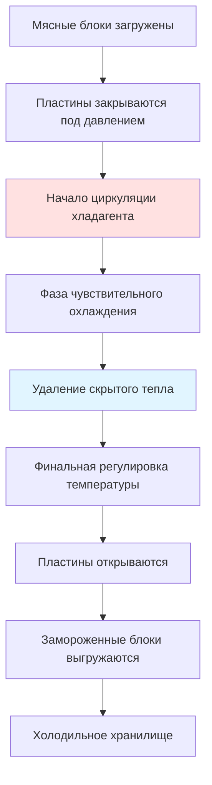

Замораживание на пластинах представляет собой наиболее эффективный метод замораживания плоских, равномерно сформованных мясных продуктов посредством прямой теплопередачи теплопроводностью. Эта технология обеспечивает скорость замораживания в 5–10 раз выше, чем системы взрывного воздушного охлаждения, за счет устранения сопротивления воздушной пленки, которое доминирует в процессах конвективного замораживания.

## Принципы работы

Пластинчатые морозильники работают путем зажима мясных продуктов между охлаждаемыми металлическими пластинами, которые служат прямыми контактными теплообменниками. Фундаментальное преимущество вытекает из механизма теплопередачи — теплопроводность при прямом контакте твердого тела с твердым телом обеспечивает значения термического сопротивления 0,4–0,5 Вт/(м·К) для мяса в сравнении с эффективной теплопроводностью 0,02–0,03 Вт/(м·К) для слоев воздуха на границе раздела в морозильниках с воздушным охлаждением.

Хладагент (обычно аммиак или R-507A) циркулирует по каналам, приваренным или обработанным на алюминиевых или стальных пластинах. Извлечение тепла происходит в три отдельных этапа: чувствительное охлаждение от начальной температуры до точки замораживания, удаление скрытого тепла во время фазового перехода и окончательное охлаждение до температуры хранения.

## Требования к контактному давлению

Эффективная теплопередача при замораживании на пластинах критически зависит от контактного давления между металлическими пластинами и поверхностью мяса. Воздушные зазоры толщиной всего 0,1 мм создают существенное тепловое сопротивление, которое снижает производительность.

**Оптимальные диапазоны давления по типам продукции:**

| Тип продукта | Контактное давление | Назначение |
|--------------|------------------|---------|
| Мясные блоки из фарша | 0,5–1,0 бар (7–15 psi) | Минимизация воздушных карманов без деформации |
| Мясные котлеты | 0,3–0,7 бар (4–10 psi) | Сохранение формы |
| Нарезанное мясо | 0,2–0,5 бар (3–7 psi) | Предотвращение сдавливания деликатной структуры |
| Блоки субпродуктов | 0,6–1,2 бар (9–17 psi) | Обеспечение плотного контакта с неровными поверхностями |

Связь между контактным давлением и межфазовым тепловым сопротивлением определяется выражением:

$$R_{contact} = \frac{1}{h_{contact}} = \frac{\delta_{gap}}{k_{air}} + \frac{1}{h_{surface}}$$

где $\delta_{gap}$ представляет эффективную толщину воздушного зазора (обычно 0,05–0,3 мм), $k_{air}$ — теплопроводность воздуха (0,024 Вт/(м·К) при 0°С), а $h_{surface}$ учитывает эффекты шероховатости поверхности.

Гидравлические системы обеспечивают равномерное распределение давления по площади пластины. Давление должно быть достаточно высоким для сжатия воздушных карманов, но ниже порога, вызывающего деформацию продукта или чрезмерное выделение влаги. Для мясных блоков из говядины давления выше 1,5 бар могут привести к разделению жира и деградации текстуры.

## Анализ теплопередачи

Расчет времени замораживания требует анализа нестационарной теплопроводности сквозь мясной блок. Для прямоугольной геометрии уравнение Планка обеспечивает практичное приближение:

$$t_f = \frac{\lambda \rho}{T_f - T_r} \left(\frac{P \cdot a}{h} + \frac{R \cdot a^2}{k}\right)$$

где:
- $t_f$ = время замораживания (с)
- $\lambda$ = скрытая теплота плавления для мяса (≈ 250 кДж/кг)
- $\rho$ = плотность мяса (1050–1100 кг/м³)
- $T_f$ = точка замораживания мяса (–1,5 до –2,5°С)
- $T_r$ = температура хладагента (–35 до –45°С)
- $a$ = половина толщины продукта (м)
- $h$ = коэффициент поверхностной теплопередачи (200–500 Вт/(м²·К) для контакта пластин)
- $k$ = теплопроводность замороженного мяса (1,8–2,2 Вт/(м·К))
- $P$ = геометрическая константа (0,5 для бесконечной пластины)
- $R$ = геометрическая константа (0,125 для бесконечной пластины)

Для практического применения мясного блока из говядины толщиной 75 мм при начальной температуре 5°С, замораживаемого между пластинами при –40°С:

$$t_f = \frac{250{,}000 \times 1070}{-1{,}5 - (-40)} \left(\frac{0{,}5 \times 0{,}0375}{300} + \frac{0{,}125 \times 0{,}0375^2}{2{,}0}\right)$$

$$t_f = \frac{267{,}500{,}000}{38{,}5} \left(0{,}0000625 + 0{,}0000879\right) = 6950 \times 0{,}0001504 = 1045 \text{ с} \approx 17{,}4 \text{ мин}$$

Это сравнивается с 90–120 минутами для эквивалентной толщины при взрывном воздушном охлаждении при том же температурном перепаде.

## Критерии выбора хладагента

Выбор хладагента влияет на эффективность системы, безопасность и операционные затраты. Основные варианты для приложений пластинчатых морозильников включают:

**Сравнение хладагентов для замораживания на пластинах:**

| Хладагент | Темп. испарения (°С) | Теплопередача | Безопасность | Эффективность (COP) | Экологичность |
|-------------|------------------|---------------|--------|------------------|---------------|
| Аммиак (R-717) | –40 до –45 | Отличная | Токсичен, огнеопасен | 1,8–2,2 | GWP = 0, ODP = 0 |
| R-507A | –40 до –45 | Хорошая | Нетоксичен | 1,5–1,9 | GWP = 3985, ODP = 0 |
| R-404A | –38 до –42 | Хорошая | Нетоксичен | 1,4–1,8 | GWP = 3922, ODP = 0 (фазируется) |
| CO₂ (R-744) | –45 до –50 | Отличная | Нетоксичен | 1,6–2,0 | GWP = 1, ODP = 0 |

Аммиак остается предпочтительным выбором для промышленных предприятий по переработке мяса благодаря превосходным термодинамическим свойствам и нулевому потенциалу глобального потепления. Высокая скрытая теплота испарения (1369 кДж/кг при –40°С) обеспечивает меньший заряд хладагента и меньшие размеры трубопроводов в сравнении с синтетическими хладагентами.

Диоксид углерода (CO₂) набирает популярность в каскадных системах, где CO₂ служит низкотемпературной ступенью (–45 до –55°С) с аммиаком или пропаном в качестве высокотемпературной ступени. Эта конфигурация обеспечивает отличную теплопередачу при сохранении безопасности в помещениях пищевой переработки.

## Применение для мясных блоков из фарша

Мясные продукты из фарша представляют идеальное применение для технологии замораживания на пластинах. Пластичный характер фарша обеспечивает отличный контакт с пластиной, а высокое отношение площади поверхности к объему отдельных блоков максимизирует пропускную способность.

**Типичные характеристики мясных блоков из фарша:**

- Размеры: 400 × 600 × 75 мм (стандарт), 300 × 500 × 100 мм (компактный)
- Масса: 18–22 кг на блок
- Содержание жира: 10–30% (влияет на точку замораживания и теплофизические свойства)
- Начальная температура: 2–7°С (после измельчения)
- Конечная центральная температура: –18 до –20°С

Время замораживания для стандартных блоков составляет 15–25 минут в зависимости от температуры пластины, контактного давления и содержания жира. Высокое содержание жира (>25%) увеличивает время замораживания из-за более низкой теплопроводности жира (1,2 Вт/(м·К)) в сравнении с постной тканью (1,9 Вт/(м·К)).

Упаковка продукта значительно влияет на производительность. Полиэтиленовые пакеты (толщина 0,1–0,15 мм) добавляют минимальное тепловое сопротивление ($R \approx 0{,}0005$ м²·К/Вт), но картонные коробки создают значительную изоляцию, которая нивелирует преимущество замораживания на пластинах. Прямой контакт морозильника с полиэтиленовой оберткой блоков — стандартная практика.

## Рекомендации по проектированию системы

Горизонтальные пластинчатые морозильники обычно содержат 20–40 пластин в вертикальной стопке с расстоянием, регулируемым гидравлическими цилиндрами. Каждая пластина имеет размеры 600 × 1200 мм до 1000 × 2000 мм в зависимости от размеров продукта. Вертикальные пластинчатые морозильники ориентируют пластины горизонтально в конфигурации ящика, облегчая загрузку, но требуя больше площади пола.

Расчет холодильной нагрузки должен учитывать:

1. Удаление тепла продуктом: $Q_{product} = m \cdot [c_p(T_i - T_f) + \lambda + c_{pf}(T_f - T_{final})]$
2. Тепло упаковочного материала: $Q_{packaging} = m_{pack} \cdot c_{pack} \cdot \Delta T$
3. Тепловая масса пластины: Незначительна для непрерывной работы
4. Теплопроникновение: 5–10% продуктивной нагрузки для хорошо изолированных установок

Для системы, перерабатывающей 2000 кг/ч мясных блоков из фарша:

$$Q_{total} = \frac{2000}{3600} \left[3{,}2 \times 7 + 250 + 1{,}8 \times 18\right] + 1{,}05 \times Q_{product}$$

$$Q_{total} = 0{,}556 \times [22{,}4 + 250 + 32{,}4] \times 1{,}05 = 0{,}556 \times 304{,}8 \times 1{,}05 = 178 \text{ кВт}$$

Это требует холодильной системы с производительностью приблизительно 50 кВт (холодильных тонн) при температуре испарителя –40°С.

## Оптимизация производительности

Максимизация эффективности пластинчатого морозильника требует внимания к нескольким операционным параметрам:

- Минимизация времени загрузки/выгрузки для сохранения температуры пластины
- Обеспечение равномерной толщины продукта (допуск ±3 мм)
- Применение адекватного контактного давления в течение первых 30 секунд
- Поддержание стабильности температуры хладагента (±1°С)
- Реализация автоматических циклов оттаивания для удаления ледяных образований на пластинах

Накопление инея на поверхностях пластин увеличивает тепловое сопротивление и требует периодического оттаивания. Оттаивание горячим газом с использованием высокого давления паров хладагента завершает циклы за 10–15 минут каждые 6–8 часов работы.

## Источники информации

ASHRAE Handbook—Refrigeration (2022), Глава 29: Замораживание пищевых продуктов
ASHRAE Handbook—Refrigeration (2022), Глава 31: Мясные продукты

---

*Это техническое содержание отражает установленные инженерные принципы для систем замораживания на пластинах в приложениях переработки мяса. Проектирование и установка должны соответствовать применимым правилам безопасности пищевых продуктов, стандартам ASHRAE и спецификациям производителя.*
