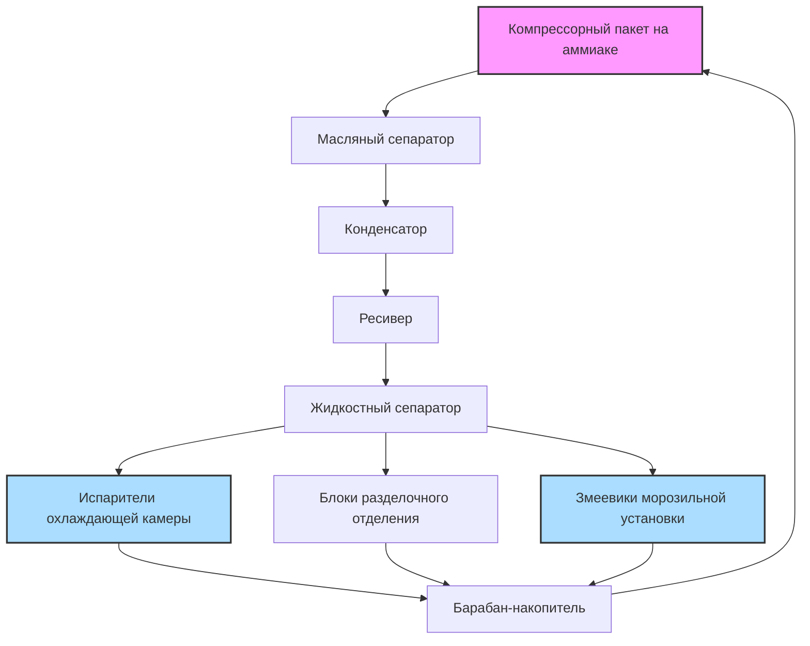

## Обзор

Охлаждение при переработке свинины требует точного управления температурой на всех этапах обработки для обеспечения безопасности пищевых продуктов, сохранения качества продукта и оптимизации выхода продукции. Система должна быстро удалять метаболическое тепло, предотвращая холодное сокращение и достигая целевых температур в течение строгих временных интервалов, определенных нормативами USDA-FSIS.

## Требования к температуре по этапам процесса

### Убойный цех и горячая сторона

Туши свинины после забоя поступают в цепь охлаждения с внутренней температурой примерно 38-40°C. Окружающая среда горячей стороны требует тщательного контроля для предотвращения роста микробов при облегчении инспекции.

| Область процесса | Температура окружающей среды | Относительная влажность | Скорость воздуха |
|------------------|------|------|------|
| Убойный цех | 10-13°C | 85-90% | 0,25-0,5 м/с |
| Предварительное охлаждение распылением | 1-4°C | 95-98% | Низкая скорость |
| Охлаждающая камера | -1 до 2°C | 90-95% | 0,5-1,5 м/с |
| Разделочное отделение | 7-10°C | 75-85% | 0,15-0,4 м/с |

### Требования к времени охлаждения

Справочник ASHRAE по холодильной технике определяет целевые скорости охлаждения для достижения внутренней температуры 4°C в течение 16-24 часов для целых туш. Скорость охлаждения зависит от массы туши, начальной температуры и коэффициента теплопередачи.

Скорость удаления тепла следует:

$Q = m \cdot c_p \cdot \frac{dT}{dt}$

Где:
- Q = скорость удаления тепла (кВт)
- m = масса туши (кг)
- c_p = удельная теплоемкость свинины (3,35 кДж/кг·К выше точки замерзания)
- dT/dt = скорость изменения температуры (К/с)

## Расчеты тепловой нагрузки

### Нагрузка на продукт

Тепловая нагрузка продукта является доминирующей в охлаждающих камерах для свинины. Для типичного предприятия, перерабатывающего 500 голов за смену при средней массе туши 95 кг:

$Q_{product} = \frac{m_{total} \cdot c_p \cdot \Delta T}{t_{chill}}$

Для 20-часового цикла охлаждения от 38°C до 4°C:

$Q_{product} = \frac{47500 \text{ кг} \cdot 3,35 \text{ кДж/кг·К} \cdot 34 \text{ К}}{72000 \text{ с}} = 75,1 \text{ кВт}$

### Нагрузка дыхания

Свежие туши свинины продолжают метаболическую активность после забоя, генерируя тепло посредством ферментативных процессов. Скорость выработки тепла дыхания в среднем составляет 0,15-0,25 Вт/кг в течение первых 24 часов:

$Q_{respiration} = 47500 \text{ кг} \cdot 0,20 \text{ Вт/кг} = 9,5 \text{ кВт}$

### Нагрузка инфильтрации и передачи тепла

Инфильтрация в охлаждающей камере происходит через дверные проемы для загрузки туш, доступа персонала и несовершенные уплотнения. Используя метод подсчета воздухообмена:

$Q_{infiltration} = \frac{ACH \cdot V \cdot \rho_{air} \cdot \Delta h}{3600}$

Где:
- ACH = воздухообмены в час (обычно 1-2 для хорошо управляемых камер)
- V = объем камеры (м³)
- ρ_air = плотность воздуха (кг/м³)
- Δh = разница энтальпии между наружным и внутренним воздухом (кДж/кг)

## Проектирование системы охлаждения

### Выбор испарителя

Охлаждающие камеры для свинины обычно используют блочные охладители с разностью температур 4-6°C между охлаждающей жидкостью и воздухом для предотвращения чрезмерной потери влаги поверхностью при поддержании адекватной теплопередачи. Требуемая производительность испарителя учитывает:

1. **Нагрузка на продукт** (60-70% от общей)
2. **Нагрузка дыхания** (8-12% от общей)
3. **Инфильтрация** (10-15% от общей)
4. **Передача тепла** (5-8% от общей)
5. **Оборудование и освещение** (2-5% от общей)

Применяйте коэффициент безопасности 1,10-1,15 для расчетной производительности.

## Стратегия распределения воздуха

### Принцип противотока

Оптимальное проектирование охлаждающей камеры использует движение воздуха в противотоке, где самый холодный воздух контактирует с почти охлажденным продуктом, а самый теплый воздух контактирует с поступающими горячими тушами. Это максимизирует логарифмическую среднюю разность температур (LMTD):

$LMTD = \frac{\Delta T_1 - \Delta T_2}{\ln(\Delta T_1 / \Delta T_2)}$

Где ΔT₁ и ΔT₂ представляют разности температур на противоположных концах теплообменника.

### Управление скоростью воздуха

Чрезмерная скорость воздуха ускоряет потерю влаги (усадку), а недостаточная скорость продлевает время охлаждения. Целевые скорости варьируются по зонам:

- **Входная зона (горячие туши)**: 1,0-1,5 м/с для быстрого охлаждения поверхности
- **Средняя зона**: 0,75-1,0 м/с для продолжения удаления тепла
- **Выходная зона (почти охлажденные)**: 0,5-0,75 м/с для минимизации усадки

## Условия в разделочном отделении

Разделка свинины (нарезка, обрезка, упаковка) требует температур 7-10°C для сохранения качества продукта при обеспечении приемлемых условий работы. Более низкие температуры повышают твердость жира, облегчая более чистые порезы и снижая скорость бактериального роста.

Тепловая нагрузка в разделочных отделениях включает:

1. **Теплоприбыль продукта**: Охлаждённый продукт нагревается при обработке
2. **Тепло персонала**: 250-350 Вт на рабочего (явное + скрытое)
3. **Тепло оборудования**: Моторы, конвейеры, оборудование упаковки
4. **Освещение**: LED-системы снижают нагрузку по сравнению с традиционными светильниками
5. **Инфильтрация**: Из соседних пространств и зон загрузки

## Микробиологический контроль

Температура напрямую влияет на скорости роста бактерий. Константа скорости роста следует соотношению Аррениуса:

$k = A \cdot e^{-E_a/(R \cdot T)}$

Где:
- k = константа скорости роста
- A = предэкспоненциальный множитель
- E_a = энергия активации
- R = универсальная газовая постоянная
- T = абсолютная температура (К)

Поддержание температур ниже 7°C снижает рост большинства патогенов до пренебрежимых уровней. Каждое снижение температуры хранения на 10°C уменьшает скорость бактериального роста примерно на 50-70%.

## Стратегии повышения энергоэффективности

### Частотные приводы

Применение частотных приводов на вентиляторах испарителя позволяет модулировать скорость воздуха в зависимости от профилей температуры продукта. По мере приближения туш к целевой температуре снижение скорости вентилятора со 100% до 60% может снизить потребление энергии на 40-50% при предотвращении чрезмерной усадки.

### Горячее газовое размораживание

Змеевики испарителя, работающие ниже 0°C, накапливают иней, снижая эффективность теплопередачи. Системы горячего газового размораживания используют нагнетаемый газ от компрессоров для быстрого плавления инея, минимизируя простои по сравнению с электрическим или циклическим размораживанием.

### Управление производительностью компрессора

Современные винтовые компрессоры на аммиаке с переменным ползунком или переменной скоростью вращения согласовывают производительность охлаждения с фактической нагрузкой, устраняя неэффективные циклы включения-выключения и снижая потребление энергии при частичной нагрузке.

## Соображения безопасности пищевых продуктов

USDA-FSIS 9 CFR 416.5 требует непрерывного мониторинга температуры во всех охлаждаемых помещениях. Система охлаждения должна поддерживать температуры в охлаждающей камере, достаточные для достижения 4°C или ниже в течение нормативных сроков. Сигналы тревоги отклонения температуры должны срабатывать при +2°C выше уставки с немедленным уведомлением персонала отдела контроля качества.

Критические контрольные точки включают:
- Время инициирования охлаждения после забоя
- Верификация глубокой температуры туши
- Однородность температуры воздуха в камере
- Время выдержки продукта перед разделкой
- Сохранение холодовой цепи при дистрибуции

## Заключение

Системы охлаждения при переработке свинины требуют тщательной интеграции принципов термодинамики, требований безопасности пищевых продуктов и операционной эффективности. Надлежащее проектирование системы обеспечивает соответствие нормативным требованиям, сохраняет качество продукта, минимизирует потери при усадке и оптимизирует потребление энергии по всему предприятию по переработке.
