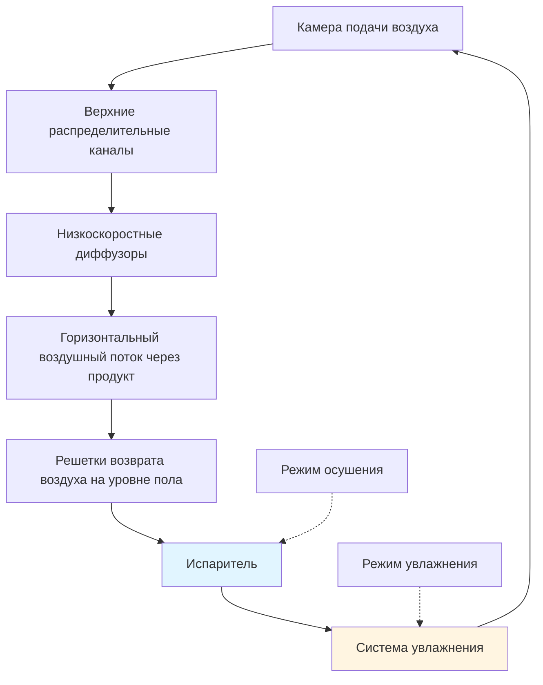
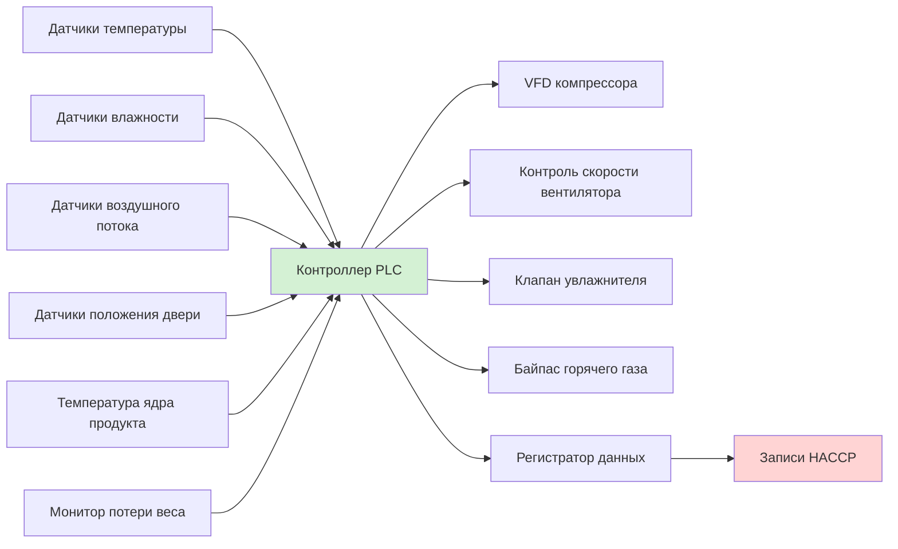

## Требования к контролю окружающей среды

Операции по засолке свинины требуют точного контроля окружающей среды для облегчения проникновения соли, уравновешивания влажности и микробной стабильности. Процесс засолки включает сложные явления массопередачи, при которых температура и влажность непосредственно влияют на скорость диффузии и качество продукта.

### Зоны контроля температуры

Проектирование помещения засолки включает несколько температурных зон в зависимости от типа продукта и стадии засолки:

| Тип засолки | Диапазон температуры | Относительная влажность | Продолжительность | Применение |
|-------------|------------------|-------------------|----------|-------------|
| Сухая засолка | 2-4°C | 65-75% | 14-90 дней | Прошутто, деревенская ветчина |
| Влажная засолка | 0-2°C | 85-95% | 3-10 дней | Бекон, городская ветчина |
| Засолка уравновешивания | 2-4°C | 75-85% | 7-21 дней | Цельномышечные продукты |
| Фаза сушки | 12-18°C | 65-75% | 30-180 дней | Сухие колбасы |
| Операции копчения | 24-60°C | 40-60% | 2-8 часов | Развитие вкуса |

### Психрометрические соображения

Связь между температурой сухого термометра, температурой смоченного термометра и относительной влажностью управляет миграцией влаги с поверхностей мяса. Равновесие водной активности подчиняется:

$$a_w = \frac{p}{p_0} = \frac{RH}{100}$$

где $a_w$ — активность воды, $p$ — парциальное давление пара на поверхности мяса, и $p_0$ — давление насыщенного пара при данной температуре.

Потеря массы во время засолки результирует из диффузии влаги, рассчитываемой по первому закону Фика:

$$J = -D \frac{\partial C}{\partial x}$$

где $J$ — поток диффузии (кг/м²·с), $D$ — коэффициент диффузии (м²/с), и $\frac{\partial C}{\partial x}$ — градиент концентрации.

## Анализ нагрузки на холодоснабжение

Холодильные нагрузки в помещениях засолки отличаются от традиционного хранения в холоде из-за выделения метаболического тепла, реакций растворения соли и характеров периодической загрузки.

### Компоненты тепловой нагрузки

**Нагрузка на продукт:**

$$Q_{product} = m \cdot c_p \cdot \Delta T$$

где $m$ — масса продукта (кг), $c_p$ — удельная теплоемкость засоляемого мяса (3,2-3,6 кДж/кг·К), и $\Delta T$ — изменение температуры.

**Нагрузка дыхания:**

Свежая свинина выделяет метаболическое тепло даже при охлаждении:

$$Q_{resp} = 0,08 \text{ до } 0,15 \text{ Вт/кг при 2-4°C}$$

**Нагрузка инфильтрации:**

Доступ персонала и открытие дверей вводят теплый влажный воздух. Для помещения засолки с объемом $V$ (м³) и количеством воздухообменов в час $ACH$:

$$Q_{infiltration} = \frac{V \cdot ACH \cdot \rho_{air} \cdot \Delta h}{3600}$$

где $\Delta h$ — разница энтальпии (кДж/кг) между внешним и внутренним воздухом помещения.

## Системы распределения воздуха

Надлежащая циркуляция воздуха обеспечивает равномерное распределение температуры и влажности, предотвращая образование поверхностной корки.

### Требования к скорости воздушного потока

Скорость поверхностного воздуха должна быть контролируется для предотвращения чрезмерного удаления влаги:

- **Сухая засолка:** 0,1-0,3 м/с (мягкая циркуляция)
- **Влажная засолка:** 0,3-0,5 м/с (умеренная циркуляция)
- **Фаза сушки:** 0,5-1,0 м/с (активное удаление влаги)

Скорость воздухообмена обычно составляет от 15 до 40 воздухообменов в час, в зависимости от плотности продукта и конфигурации подвески.

## Системы контроля влажности

Поддержание точных уровней влажности требует наличия как увлажнения, так и осушения.

### Методы увлажнения

**Паровпрыск:**
- Обеспечивает быстрый отклик
- Требуется чистый источник пара
- Энергетический ввод: 2260 кДж/кг испарившейся воды

**Испарительные подушки:**
- Более низкое энергопотребление
- Требует непрерывной очистки воды
- Эффект охлаждения должен быть компенсирован

**Ультразвуковая атомизация:**
- Генерация мелких капель (1-10 мкм)
- Минимальное тепловое воздействие
- Более высокая стоимость оборудования

### Подходы к осушению

**На основе холодоснабжения:**

Емкость удаления влаги подчиняется:

$$m_{water} = \frac{Q_{latent}}{h_{fg}} = \frac{V \cdot \rho \cdot (W_1 - W_2) \cdot ACH}{3600}$$

где $W_1$ и $W_2$ — коэффициенты влажности (кг воды/кг сухого воздуха) до и после осушения.

**Системы с десикантом:**

Используются в приложениях с низкой температурой, где испарители холодоснабжения должны покрываться инеем. Энергия регенерации:

$$Q_{regen} = 3000 \text{ до } 4200 \text{ кДж/кг удаленной воды}$$

## Рассмотрение конструкции испарителя

Выбор испарителя влияет как на контроль температуры, так и на поддержание влажности.

### Конфигурация катушки

| Параметр | Сухая засолка | Влажная засолка | Влияние |
|-----------|------------|------------|--------|
| Расстояние между ребрами | 6-8 мм | 4-6 мм | Предотвращение обледенения в сравнении с теплопередачей |
| TD (Δt катушки) | 3-5°C | 5-8°C | Контроль влажности в сравнении с емкостью |
| Скорость потока | 1,5-2,0 м/с | 2,0-2,5 м/с | Скорость удаления влаги |
| Частота разморозки | 1-2/день | 2-4/день | Скорость накопления инея |

Разница температур между хладагентом и воздухом должна быть минимизирована при сухой засолке для предотвращения чрезмерного удаления влаги:

$$RH_{leaving} \approx RH_{entering} - \left(\frac{TD}{T_{dewpoint} - T_{air}}\right) \times 100$$

## Архитектура системы управления

Современные помещения засолки используют интегрированные системы управления, контролирующие несколько параметров.

### Последовательности управления

**Стандартная работа:**
1. Поддерживать заданную температуру ± 0,5°C
2. Модулировать влажность через увлажнение/осушение
3. Регулировать воздушный поток на основе нагрузки продукта
4. Логировать условия при 15-минутных интервалах

**Цикл разморозки:**
1. Инициирование повышения температуры на 0,5°C выше заданного значения
2. Разморозка горячим газом или электричеством на 15-30 минут
3. Период слива 5-10 минут
4. Возобновление нормальной работы с задержкой вентилятора

## Стратегии оптимизации энергии

Операции по засолке представляют значительное потребление энергии из-за длительных времен цикла и требований к контролю влажности.

### Управление нагрузкой

**Планирование партий:**
Группировка похожих продуктов снижает циклирование температуры и влажности. Экономия энергии составляет от 15 до 25% в сравнении со случайной загрузкой.

**Ночной сброс:**
Ограниченное применение из-за чувствительности продукта, но комнаты сушки могут реализовать сброс на 2-3°C в периоды низкой активности.

### Рекуперация тепла

**Использование тепла конденсатора:**

Доступное тепло от конденсатора холодоснабжения:

$$Q_{condenser} = Q_{evaporator} + W_{compressor}$$

Применения включают:
- Производство горячей воды для санитарии (60-80°C)
- Отопление комнаты сушки во время холодной погоды
- Предварительный нагрев воздуха коптильни

Типичный COP для систем рекуперации тепла: 3,5-4,5

## Санитарно-гигиенические требования и выбор оборудования

Требования USDA-FSIS обязывают конкретные конструкции и материалы для холодоснабжения переработки мяса.

### Требования к материалам

- **Испарители:** Нержавеющая сталь 304 или 316
- **Поддоны слива:** Уклон 1:50 минимум, герметичная конструкция
- **Воздуховоды:** Гладкая внутренняя поверхность, сварные швы
- **Изоляция:** Закрытоячеистая пена, одобренное NSF облицовочное покрытие

### Протоколы очистки

Среда с высокой влажностью способствует росту микробов на оборудовании охлаждения. Еженедельная санитарная обработка включает:
- Очистку катушки одобренными противомикробными агентами
- Дезинфекция поддона конденсата
- Замену или очистку воздушного фильтра
- Промывку линии слива четвертичными аммониевыми соединениями

## Мониторинг безопасности

Критические контрольные точки (ККТ) в операциях засолки включают мониторинг температуры, влажности и времени согласно требованиям HACCP.

**Мониторинг температуры:**
- Первичные датчики, калибруемые ежеквартально (точность ±0,3°C)
- Резервные датчики для проверки сигнализации
- Записи на диаграммах или электронное логирование данных

**Проверка влажности:**
- Калибровка сравнительно с насыщенными солевыми растворами
- Ежемесячные проверки верификации
- Уставки сигнализации: ±5% от заданного значения

**Пределы безопасности продукта:**
- Максимальное время выше 4°C: 2 часа совокупно
- Минимальное время сушки для снижения активности воды
- Контроль поверхностной влаги для предотвращения роста Listeria

## Рекомендации по проектированию

На основе справочника ASHRAE—Холодоснабжение и передовой практики промышленности:

**Емкость охлаждения:**
Размеры испарителей для 150-200% рассчитанной нагрузки для учета требований контроля влажности и периодической загрузки.

**Выбор компрессора:**
Системы переменной емкости (VFD спиральные или возвратно-поступательные) обеспечивают превосходный контроль температуры по сравнению с циклированием вкл/выкл.

**Выбор хладагента:**
- R-404A: Традиционный выбор, постепенно выводится (GWP 3922)
- R-448A: Альтернатива с более низким GWP (GWP 1387)
- R-744 (CO₂): Каскадные системы для соответствия экологическим требованиям (GWP 1)

**Значения изоляции:**
Минимум RSI-5,3 для стен и потолка, RSI-7,0 для полов для поддержания стабильных условий и снижения риска конденсации.

Точность, требуемая в операциях засолки свинины, требует тщательной интеграции емкости холодоснабжения, распределения воздуха и контроля влажности для достижения согласованного качества продукта при сохранении стандартов безопасности пищевых продуктов.
