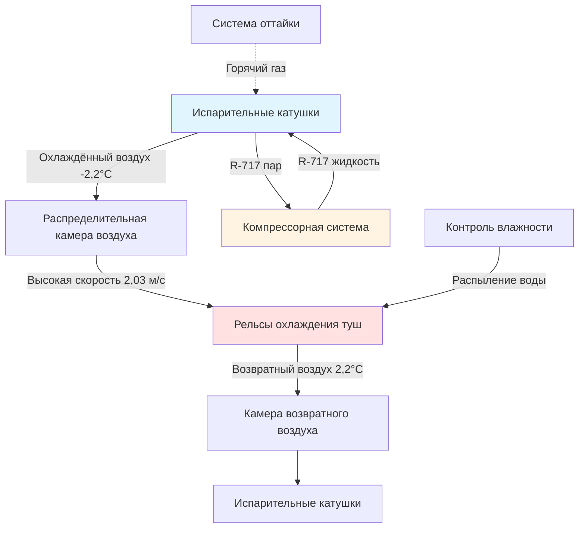

## Обзор

Охлаждение свинины представляет собой один из наиболее термически сложных процессов на мясоперерабатывающих предприятиях. Быстрое удаление тепла животного из только что забитых туш требует точного контроля температуры для предотвращения микробного роста и избежания дефектов качества, таких как холодное сокращение или чрезмерная потеря влаги. Целью является снижение температуры глубоких тканей с примерно 39°C до менее 4,4°C в течение 24 часов при одновременном поддержании температуры поверхности выше 0°C для предотвращения замерзания.

Холодильная нагрузка состоит из трех основных компонентов: удаление остаточного тепла обмена веществ животного, снижение явного тепла до температуры охлаждения и непрерывное удаление тепловых потерь в помещение. Туша свинины весом 91 кг выделяет примерно 31,6 МДж (8,8 кВт·ч) во время полного цикла охлаждения, требуя значительной холодильной производительности при высокопроизводительных операциях.

## Основы теплопередачи

### Расчет холодильной нагрузки

Общая холодильная нагрузка для охлаждения свинины включает несколько источников тепла:

$$Q_{total} = Q_{product} + Q_{respiration} + Q_{infiltration} + Q_{equipment} + Q_{personnel}$$

Холодильная нагрузка продукта доминирует и состоит из:

$$Q_{product} = m \cdot c_p \cdot \Delta T + m \cdot h_{respiration}$$

Где:
- m = массовый расход продукта (кг/ч)
- c_p = удельная теплоемкость свинины (1,47 кДж/кг·°C выше точки замерзания)
- ΔT = температурный перепад (начальная - конечная)
- h_respiration = остаточное метаболическое тепло (обычно 35-42 кДж/кг в первые 6 часов)

Для предприятия, обрабатывающего 500 туш в час при среднем весе 91 кг:

$$Q_{product} = 500 \times 91 \times 1,47 \times (39-4,4) + 500 \times 91 \times 38$$

$$Q_{product} = 4,576,000 + 1,898,000 = 6,474,000 \text{ кДж/ч} = 1,799 \text{ кВ}$$

### Механизмы теплопередачи

Охлаждение свинины происходит посредством трех одновременных механизмов:

**Конвекция (доминирующая):** Передача тепла от поверхности туши циркулирующему воздуху, определяется уравнением:

$$q_{conv} = h \cdot A \cdot (T_{surface} - T_{air})$$

Коэффициент конвективной теплопередачи (h) для туш свинины обычно составляет от 11,4 до 34,1 Вт/м²·°C в зависимости от скорости воздуха, при скоростях выше 2,54 м/с значения выше.

**Теплопроводность (внутренняя):** Передача тепла от мышечного ядра к поверхности следует закону Фурье:

$$q_{cond} = -k \cdot A \cdot \frac{dT}{dx}$$

Коэффициент теплопроводности свинины (k) в среднем составляет 0,52 Вт/м·°C, создавая значительную тепловую инерцию между поверхностью и глубокими температурами тканей.

**Испарение (поверхностное):** Удаление водяного пара с поверхности туши обеспечивает дополнительное охлаждение:

$$q_{evap} = \dot{m}_{water} \cdot h_{fg}$$

Где h_fg = 2,445 кДж/кг при типичных условиях охлаждения.

## Сравнение методов охлаждения

| Метод | Температура воздуха (°C) | Скорость воздуха (м/с) | Время до 4,4°C | Потеря веса | Стоимость капитала |
|-------|--------------------------|----------------------|-----------------|-------------|-------------------|
| Обычное | -2,2 до 0 | 0,25-0,76 | 18-24 ч | 1,8-2,2% | Базовая |
| Скоростное | -6,7 до -2,2 | 1,52-2,54 | 12-16 ч | 2,0-2,5% | +25% |
| Распыление | -2,2 до 0 | 0,51-1,02 | 18-24 ч | 0,5-1,0% | +15% |
| CO₂ охлаждение | -42,8 (поверхность) | Варьируется | 2-4 ч | 1,5-2,0% | +60% |

## Конфигурация проектирования системы

### Выбор испарителя

Испарители охладителей должны сбалансировать удаление тепла с контролем влажности. Ключевые параметры проектирования включают:

**Температурный перепад:** TD между хладагентом и воздухом обычно составляет от 4,4 до 6,7°C. Меньший TD снижает обезвоживание туши, но требует большей площади поверхности катушки:

$$A_{coil} = \frac{Q}{U \cdot TD}$$

Для U = 85,2 Вт/м²·°C (катушка с принудительной тягой) и TD = 5,6°C:

$$A_{coil} = \frac{6,474,000}{85,2 \times 5,6} = 13,471 \text{ м}^2$$

**Расстояние между ребрами:** Более близкое расстояние между ребрами (6-10 на 10 см) увеличивает производительность, но ускоряет накопление инея, требуя более частых циклов оттайки, которые прерывают охлаждение.

**Бросок воздуха:** Распределительные системы должны обеспечивать равномерную скорость воздуха на всех позициях туш. Недостаточный размер воздуховодов создает спад скорости:

$$v_2 = v_1 \cdot \frac{A_1}{A_2}$$

## Требования к холодильной системе

### Производительность компрессора

Справочник ASHRAE по рефрижерации рекомендует превышение производительности компрессора на 15-20% выше рассчитанной нагрузки для учета:
- пиковых нагрузок при начальной загрузке продукта
- периодов восстановления оттайки
- экстремальных температур окружающей среды
- будущего расширения производительности

Для рассчитанной нагрузки 1799 кВ установите компрессорную производительность 2100-2300 кВ, распределенную между несколькими компрессорами для операционной гибкости.

### Выбор хладагента

| Хладагент | Температура испарения (°C) | Температура нагнетания (°C) | Эффективность (кВт/кВ охлаждения) | Группа безопасности | Статус |
|-----------|----------------------------|------------------------------|-------------------------------------|-------------------|--------|
| R-717 (NH₃) | -9,4 | 85 | 0,75 | B2L | Предпочтительный |
| R-404A | -9,4 | 74 | 0,95 | A1 | Поэтапный отказ |
| R-448A | -9,4 | 65 | 0,88 | A1 | Допустимый |
| R-744 (CO₂) | -9,4 | 35 | 0,82 | A1 | Растущий |

Аммиак доминирует на крупных мясоперерабатывающих предприятиях благодаря превосходной термодинамической эффективности, нулевому потенциалу глобального потепления и характеристикам обнаружения утечек, несмотря на повышенные требования безопасности.

## Стратегия распределения воздуха

Надлежащая циркуляция воздуха предотвращает стратификацию температур и обеспечивает равномерное охлаждение. Соображения проектирования включают:

**Воздухообмены:** Поддерживайте 20-30 воздухообменов в час в охлаждающих камерах туш. Для охладителя объемом 1,415 м³:

$$CFM = \frac{1,415 \times 25}{60} = 589 \text{ м}^3\text{/ч}$$

**Профиль скорости:** Нацельтесь на 1,52-2,54 м/с на уровне туши с ламинарным потоком параллельно длине туши. Турбулентный поперечный поток увеличивает испарительные потери.

**Однородность температуры:** Ограничьте изменение температуры до ±1,1°C во всем объеме охлаждающей камеры. Установите точки измерения на входе, центре и на выходе вдоль пути рельсов.

## Системы распыления охлаждения

Распыление охлаждения наносит мелкий водяной туман на поверхности туш, используя испарительное охлаждение для снижения потери веса с 2% до менее 1% при сохранении эквивалентных скоростей охлаждения. Скрытая теплота испарения воды (2,445 кДж/кг) обеспечивает значительный эффект охлаждения.

Параметры проектирования системы:

- Температура воды: 1,1-3,3°C
- Размер капель: 50-150 микрон
- Циклы применения: 12-20 секунд каждые 15-30 минут
- Общее применение воды: 3-5% от веса туши

Распыление охлаждения увеличивает холодильную нагрузку примерно на 8% из-за добавленной влаги, но окупает затраты благодаря снижению усадки продукта. Чистое охлаждение от нанесенной воды:

$$Q_{spray} = m_{water} \cdot [c_p \cdot (T_{carcass} - T_{water}) + h_{fg}]$$

## Нормативные требования USDA

Нормативные требования FSIS (9 CFR 318) предусматривают конкретные показатели охлаждения:

- Внутренняя температура должна достичь 4,4°C или ниже в течение 24 часов
- Обязателен непрерывный мониторинг и регистрация температуры
- Минимальный зазор между туш 5 см
- Предотвращение конденсационного стекания на продукт
- Санитарное проектирование всех контактирующих с продуктом поверхностей

## Интеграция системы управления

Современные операции охлаждения свинины применяют сложные системы управления:

**Поэтапное охлаждение:** Начальное скоростное охлаждение при -6,7 до -4,4°C в течение 4-6 часов с последующей температурной выдержкой при -1,1 до -1,7°C снижает холодное сокращение при сохранении микробного контроля.

**Приводы переменной частоты:** ЧПУ на вентиляторах испарителя модулируют скорость воздуха на основе температурного перепада продукта, снижая потребление энергии на 20-30% во время поздних этапов охлаждения.

**Предиктивная оттайка:** Датчики перепада давления на испарительных катушках инициируют циклы оттайки на основе фактического накопления инея, а не установленных расписаний, минимизируя перерывы в производстве.

## Оптимизация энергоэффективности

Энергопотребление охлаждения обычно составляет 40-50% от общей холодильной нагрузки предприятия. Улучшения эффективности включают:

- Испарительные конденсаторы, снижающие температуру конденсации на 5,6-8,3°C
- Утилизация тепла от масляного охлаждения компрессора и перегрева
- Светодиодное освещение, снижающее внутреннюю тепловую нагрузку на 60% в сравнении с люминесцентным
- Изолированные быстрозакрывающиеся двери, минимизирующие потери при передаче туш
- Системы тепловоаккумулирования, сдвигающие спрос электроэнергии на внепиковые периоды

Коэффициент производительности для хорошо спроектированных аммиачных систем при этих условиях эксплуатации:

$$COP = \frac{Q_{evap}}{W_{comp}} = \frac{h_1 - h_4}{h_2 - h_1}$$

Типичные значения составляют 3,5-4,2, что эквивалентно 0,70-0,85 кВт/кВ охлаждения.

---

**Связанные темы:**
- Системы охлаждения говядины
- Технология скоростной заморозки
- Безопасность аммиачной рефрижерации
- Проектирование мясоперерабатывающих предприятий
- Контроль температуры HACCP
