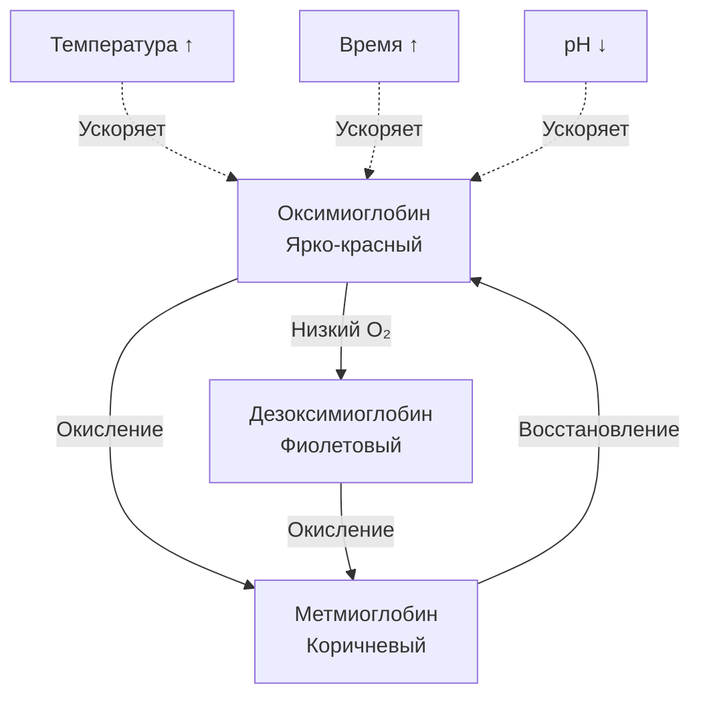
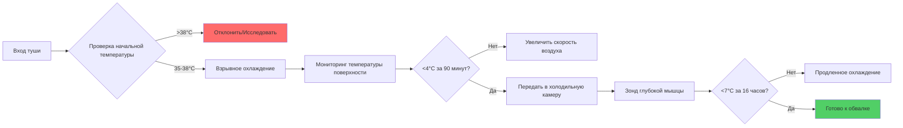

## Обзор

Управление температурой в объектах обработки свинины требует более строгого контроля, чем для многих других мясных продуктов, из-за восприимчивости свинины к окислению липидов, деградации цвета и быстрому размножению бактерий. Высокое содержание ненасыщенных жирных кислот в ткани свинины создает уникальные проблемы теплового управления, которые непосредственно влияют на безопасность продукции, срок годности и атрибуты качества.

## Кинетика роста бактерий и температура

Рост бактерий в ткани свинины следует предсказуемой экспоненциальной кинетике, управляемой уравнением Аррениуса. Время генерации мезофильных патогенов удваивается примерно каждые 10°C увеличения температуры, что делает температурные нарушения особенно опасными.

Зависимость между температурой и скоростью роста бактерий выражается как:

$$
\mu = \mu_{ref} \cdot e^{-\frac{E_a}{R}\left(\frac{1}{T} - \frac{1}{T_{ref}}\right)}
$$

где:
- $\mu$ = удельная скорость роста (ч⁻¹)
- $\mu_{ref}$ = скорость роста в условиях эталонной температуры
- $E_a$ = энергия активации (обычно 60-80 кДж/моль для патогенов)
- $R$ = универсальная газовая постоянная (8,314 Дж/моль·К)
- $T$ = абсолютная температура (К)
- $T_{ref}$ = эталонная температура (К)

Это уравнение демонстрирует, почему поддержание свинины между -1°C и 2°C имеет критическое значение. При 4°C скорости роста бактерий увеличиваются на 40-60% по сравнению с 0°C. При 10°C рост ускоряется в 4-6 раз, создавая опасность для безопасности пищевых продуктов в течение часов, а не дней.

## Критические температурные зоны

| Этап процесса | Диапазон температуры | Время выдержки | Основная проблема |
|---|---|---|---|
| Вход туши на производство | 20-21°C | Минуты | Инициирование быстрого охлаждения |
| Взрывное охлаждение | -2 до 0°C воздух | 2-4 часа | Поверхностная бактериальная нагрузка |
| Холодильная камера | 0-2°C | 24-48 часов | Охлаждение глубоких мышц |
| Цех обвалки | 7-10°C | 2-4 часа | Комфорт и безопасность рабочих |
| После обвалки | -1 до 2°C | Переменное | Продленное хранение |
| Распределение | ≤4°C | Дни-недели | Целостность холодной цепи |

## Окисление липидов и управление температурой

Свинина содержит 45-60% ненасыщенных жирных кислот, что делает её высоко восприимчивой к окислительному прогорканию. Скорость окисления липидов следует зависимостям от температуры, описываемым соотношением Q₁₀:

$$
\text{Скорость}_2 = \text{Скорость}_1 \cdot Q_{10}^{\frac{T_2 - T_1}{10}}
$$

Для окисления липидов в свинине Q₁₀ обычно находится в диапазоне от 2,0 до 2,5, что означает удвоение скоростей окисления при каждом увеличении на 10°C. Поддержание температуры хранения при -1°C вместо 4°C снижает скорости окисления примерно на 35%, значительно продлевая стабильность цвета и качество вкуса.

## Теплопередача при охлаждении свинины

Процесс охлаждения туш свинины включает три механизма теплопередачи, действующих одновременно:

### Конвективное охлаждение

Поверхностная конвекция доминирует в начальном охлаждении и следует закону охлаждения Ньютона:

$$
q_{conv} = h \cdot A \cdot (T_s - T_{\infty})
$$

где:
- $q_{conv}$ = скорость конвективной теплопередачи (Вт)
- $h$ = коэффициент конвективной теплопередачи (10-40 Вт/м²·К для вынужденного воздуха)
- $A$ = площадь поверхности (м²)
- $T_s$ = температура поверхности (К)
- $T_{\infty}$ = температура воздуха (К)

### Кондуктивная теплопередача

Внутреннее охлаждение происходит путем теплопроводности согласно закону Фурье:

$$
q_{cond} = -k \cdot A \cdot \frac{dT}{dx}
$$

Теплопроводность ткани свинины варьируется в зависимости от температуры и содержания жира:
- Мышечная ткань: 0,41-0,48 Вт/м·К
- Жировая ткань: 0,17-0,21 Вт/м·К
- Кость: 0,22-0,25 Вт/м·К

Составной характер туш свинины создает сложные пути теплопередачи, при этом жировые слои действуют как тепловые изоляторы, замедляя охлаждение глубоких мышц.

## Расчеты холодильной нагрузки

Общая холодильная нагрузка для цехов обработки свинины включает несколько источников тепла:

$$
Q_{total} = Q_{product} + Q_{infiltration} + Q_{people} + Q_{equipment} + Q_{lights}
$$

### Нагрузка от продукции

Доминирующий компонент нагрузки - удаление явного тепла от теплых туш:

$$
Q_{product} = \dot{m} \cdot c_p \cdot \Delta T
$$

Для типичной туши свинины (90 кг):
- Удельная теплоемкость: 3,35 кДж/кг·К (выше точки замерзания)
- Снижение температуры: 36°C до 2°C
- Время охлаждения: 24 часа
- Скорость удаления тепла: 391 Вт на туш

Респираторное тепло от туш продолжается 6-8 часов после убоя, добавляя примерно 20-30 Вт на туш во время начального охлаждения.

## Механизмы стабильности цвета

Цвет свинины быстро ухудшается из-за окисления миоглобина в метмиоглобин. Скорость этого преобразования зависит от температуры и резко ускоряется выше 4°C.

Поддержание температуры ниже 2°C снижает скорости образования метмиоглобина на 50-70% по сравнению с хранением при 7°C, продлевая время выставки с 3-4 дней до 7-10 дней в условиях розничной торговли.

## Требования к температуре хранения

Рекомендации справочника ASHRAE по хранению свинины соответствуют требованиям USDA-FSIS, но признают вариативность продукции:

| Тип продукта | Температура | Относительная влажность | Время хранения |
|---|---|---|---|
| Свежие куски свинины | -1 до 0°C | 85-90% | 7-12 дней |
| Свинина молотая | -1 до 0°C | 85-90% | 3-5 дней |
| Соленая свинина | 0-2°C | 80-85% | 14-21 день |
| Обработанные продукты | 0-4°C | 75-85% | По формуляции |
| Замороженная свинина | -23 до -18°C | 90-95% | 6-9 месяцев |

## Мониторинг температуры и стратегия управления

Современные объекты обработки свинины используют многоуровневые системы управления температурой:

### Требования к системе управления

1. Датчики температуры: зонды RTD с точностью ±0,1°C
2. Логирование данных: непрерывная запись с интервалом 5 минут минимум
3. Пороги тревоги: ±1°C от уставки на 15 минут
4. Системы резервирования: резервная холодильная мощность 125%

## Выбор испарителя и распределение воздуха

Камеры охлаждения свинины требуют испарителей, предназначенных для высоких скрытых нагрузок и контролируемого движения воздуха. Ключевые параметры проектирования:

**Перепад температуры испарителя (TD):**
- Взрывное охлаждение: 8-12°C TD (агрессивное охлаждение)
- Холодильные камеры: 4-6°C TD (минимизация обезвоживания)
- Цехи обвалки: 6-8°C TD (баланс охлаждения и влажности)

**Скорость воздуха над продуктом:**
- Начальное охлаждение (0-4 часа): 2,5-4,0 м/с
- Продленное охлаждение (4-24 часа): 0,5-1,5 м/с
- Камеры хранения: 0,2-0,5 м/с

Более низкие скорости воздуха после начального охлаждения поверхности снижают потери веса из-за обезвоживания при сохранении адекватной теплопередачи для охлаждения глубоких мышц.

## Воздействие температурных нарушений

Даже кратковременные отклонения температуры создают измеримую деградацию качества. Двухчасовое воздействие 15°C при транспортировке может:

- Увеличить бактериальные нагрузки на 0,5-1,0 log КОЕ/г
- Снизить время выставки цвета на 30-40%
- Ускорить окисление липидов на 3-4 дня эквивалентного старения
- Снизить оценки приемлемости потребителем на 15-25%

Кумулятивный эффект нескольких небольших температурных нарушений по всей холодной цепи превышает воздействие отдельных событий, подчеркивая важность непрерывного управления температурой от убоя до розничной выставки.

## Психрометрические соображения

Управление относительной влажностью в цехах обработки свинины обеспечивает баланс конкурирующих требований. Высокая влажность (85-90%) минимизирует потери веса, но может способствовать росту поверхностных бактерий и конденсации. Низкая влажность (<75%) увеличивает усадку и ускоряет деградацию цвета.

Оптимальная точка росы для холодильных камер свинины составляет -2 до 0°C, поддерживая градиент давления пара «воздух-поверхность» достаточно низким, чтобы ограничить потерю влаги, при этом предотвращая образование инея на катушках охлаждения, которое снижало бы эффективность теплопередачи.

## Стратегии повышения энергоэффективности

Управление температурой представляет 40-60% от общего потребления энергии на объектах обработки свинины. Стратегии оптимизации включают:

- Вентиляторы с переменной частотой вращения, соответствующие фактическим требованиям нагрузки
- Регуляторы давления испарителя, поддерживающие наивысшее допустимое давление всасывания
- Рекуперация тепла из выпуска компрессора для горячего водоснабжения объекта
- Использование тепловой массы посредством стратегического расположения продукции
- Циклы оттаивания по требованию, минимизирующие простой и потребление энергии

Эти стратегии поддерживают критическое управление температурой при снижении энергоемкости с типичных 0,35-0,45 кВт·ч/кг до 0,25-0,30 кВт·ч/кг обработанной свинины.
