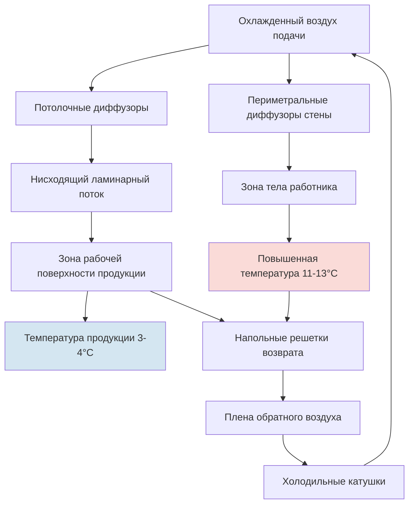
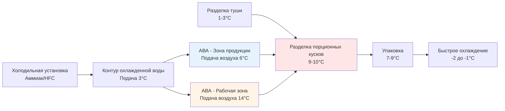

## Обзор

Помещения для разделки порционных кусков представляют уникальные проектные задачи HVAC, требующие балансирования между строгими требованиями безопасности продуктов питания, комфортом и производительностью работников. Эти объекты должны поддерживать температуру, достаточно низкую для предотвращения микробного роста на открытых поверхностях мяса, но достаточно высокую для работников, выполняющих подробные ручные операции в течение длительных периодов.

Фундаментальная сложность вытекает из конфликтующих тепловых требований: безопасность продукции требует температуры ниже 10°C, в то время как комфорт работников обычно требует 18-24°C. Решение проекта включает тщательное управление тепловыми потоками, создавая контролируемый микроклимат вокруг продукции, одновременно поддерживая приемлемые условия для персонала.

## Требования температуры и контрольные зоны

### Температурные стандарты USDA FSIS

Нормативы USDA FSIS требуют, чтобы открытые мясные продукты во время операций переработки оставались при температурах, предотвращающих рост патогенов. Критическая контрольная температура 4,4°C служит эталоном для безопасности продукции.

**Рамки соответствия температуре:**

- **Температура поверхности продукции:** Не должна превышать 4,4°C в течение более чем 2 часов совокупного времени
- **Температура окружающего воздуха в помещении:** Обычно поддерживается на уровне 7-10°C
- **Температура рабочей зоны:** 10-13°C, достижимая путем стратегического распределения воздуха
- **Температура оборудования:** Разделочные столы и конвейеры поддерживаются при 3-6°C

### Анализ тепловой нагрузки

Холодильная нагрузка для помещений разделки порционных кусков состоит из нескольких компонентов, требующих тщательного расчета для надлежащего подбора системы.

**Уравнение общей тепловой нагрузки:**

$$Q_{total} = Q_{product} + Q_{infiltration} + Q_{occupants} + Q_{equipment} + Q_{lighting} + Q_{transmission}$$

**Тепловая нагрузка продукции:**

$$Q_{product} = \dot{m}_{product} \times c_p \times (T_{in} - T_{room})$$

Где:
- $\dot{m}_{product}$ = массовый расход продукции (кг/ч)
- $c_p$ = удельная теплоемкость мяса (приблизительно 3,22 кДж/кг·К выше точки замерзания)
- $T_{in}$ = температура входящей продукции (обычно 1-3°C)
- $T_{room}$ = заданная температура в помещении

**Тепловая нагрузка от присутствия людей:**

Персонал вырабатывает значительное чувствительное и скрытое тепло, которое необходимо удалить. Каждый работник производит приблизительно:

$$Q_{occupant} = 1,3-1,75 \text{ кВт чувствительного} + 0,73-1,02 \text{ кВт скрытого}$$

Для помещения разделки с 20 работниками присутствие людей в одиночку вносит 26-35 кВт охлаждающей нагрузки.

## Стратегия распределения воздуха

Надлежащее распределение воздуха создает тепловые зоны, которые защищают целостность продукции, одновременно минимизируя дискомфорт работников.

### Принципы проектирования

**Вертикальная термическая стратификация:**

Температурный градиент от потолка к полу может использоваться благоприятно. Холодный воздух, подаваемый из потолочных диффузоров, спускается к рабочим поверхностям, создавая более прохладную зону на высоте разделочного стола (19-23 см) при этом более теплый воздух остается на высоте головы работника (38-46 см).

**Рассмотрения скорости воздуха:**

- **Скорость на рабочей поверхности:** 0,25-0,38 м/с для предотвращения нагрева продукции
- **Скорость на теле работника:** 0,13-0,20 м/с для минимизации ощущения сквозняка
- **Скорость возврата:** <2,5 м/с для предотвращения шума и сквозняков

Воспринимаемый охлаждающий эффект на работников следует соотношению охлаждения ветром:

$$T_{perceived} = T_{air} - 0.15 \times V_{air}^{0.7}$$

Где $V_{air}$ выражена в км/ч. При 0,25-0,38 м/с понижение воспринимаемой температуры минимально (<0,3°C).

## Сравнение конфигураций системы

| Конфигурация | Контроль температуры | Энергоэффективность | Комфорт работников | Капитальная стоимость | Обслуживание |
|--------------|-------------------|------------------|----------------|--------------|-------------|
| **Одна зона DX** | Умеренный | Хороший | Плохой | Низкая | Низкое |
| **Двухзонная охлажденная вода** | Превосходный | Очень хороший | Хороший | Высокая | Умеренное |
| **Вентиляция вытеснением** | Очень хороший | Отличный | Очень хороший | Очень высокая | Умеренное |
| **Потолочное радиационное охлаждение** | Хороший | Хороший | Отличный | Умеренная | Низкое |
| **Точечное охлаждение рабочей зоны** | Превосходный | Умеренный | Умеренный | Умеренная | Умеренное |

### Система прямого расширения одной зоны

Традиционный подход, использующий упакованные кровельные агрегаты или сплит-системы с хладагентными катушками. Все помещение поддерживается при равномерной температуре (обычно 9-10°C).

**Преимущества:**
- Простая установка и управление
- Более низкая первоначальная стоимость
- Общедоступное оборудование
- Знакомо персоналу техническом обслуживания

**Ограничения:**
- Дискомфорт работников приводит к потере производительности
- Требуется более теплая одежда персонала
- Сложность достижения соответствия USDA при максимальном производстве
- Энергетические потери при охлаждении всего объема

### Двухзонная система с охлажденной водой

Отдельные воздухообрабатывающие агрегаты обслуживают зоны продукции и рабочие зоны с независимым контролем температуры.

**АВА зоны продукции:** Подает воздух при 4-7°C с более высокими скоростями на рабочие поверхности

**АВА рабочей зоны:** Подает воздух при 13-16°C с более низкими скоростями в верхний объем помещения

Система охлажденной воды обеспечивает точный контроль температуры через модулирующие регулирующие клапаны:

$$Q_{coil} = \dot{m}_{water} \times c_{p,water} \times (T_{entering} - T_{leaving})$$

Типичная температура подачи охлажденной воды: 3-4°C

### Система вентиляции вытеснением

Низкоскоростной воздух (0,15-0,25 м/с) подается на уровне пола и поднимается естественным путем по мере поглощения тепла от людей и оборудования. Это создает более прохладную дыхательную зону при одновременном поддержании холодных условий на рабочих поверхностях.

**Физический принцип:**

Поток, управляемый плавучестью, следует соотношению:

$$\Delta P = \rho_{cold} \times g \times h - \rho_{warm} \times g \times h = g \times h \times (\rho_{cold} - \rho_{warm})$$

Разница в плотности движет вертикальным движением воздуха без механического перемешивания, снижая энергопотребление на 20-30% по сравнению с обычными системами.

## Повышение комфорта работников

### Интеграция средств индивидуальной защиты

USDA-совместимые объекты требуют определенного СИЗ, влияющего на тепловой комфорт:

- **Стальные сетчатые перчатки:** Не обеспечивают изоляцию
- **Резиновые фартуки:** Предотвращают испарительное охлаждение
- **Сетки для волос и головные уборы:** Повышают ощущение теплоты
- **Резиновые ботинки:** Изолируют ноги от холодного пола

Производство метаболического тепла во время операций разделки варьируется от 88-117 Вт, классифицируется как умеренная и тяжелая работа. Комбинация низкой температуры окружающей среды и умеренной активности обычно приводит к тепловому нейтралитету, когда работники носят:

- Изолированные комбинезоны (0,7-1,0 clo)
- Термобелье (0,3-0,5 clo)
- Утепленные перчатки под стальной сеткой (0,2 clo)

### Дополнительное радиационное отопление

Потолочные инфракрасные радиационные панели могут обеспечивать локальное отопление без влияния на температуру воздуха или безопасность продукции.

**Радиационная теплопередача:**

$$Q_{radiant} = \epsilon \times \sigma \times A \times (T_{source}^4 - T_{receiver}^4)$$

Где:
- $\epsilon$ = излучательность (0,9 для типичных панелей)
- $\sigma$ = постоянная Стефана-Больцмана (5,67×10⁻⁸ Вт/м²·K⁴)
- $A$ = площадь поверхности
- $T$ = абсолютная температура (К)

Панели низкой интенсивности на газе или электричестве, расположенные на высоте 3-3,7 м над полом, обеспечивают тепло голове и плечам работников без значительного нагрева продукции или температуры воздуха.

## Рассмотрения оборудования

### Выбор холодильной системы

**Критерии выбора хладагента:**
- **R-404A:** Традиционный выбор, выводится из обращения (GWP 3 922)
- **R-448A:** Прямая замена (GWP 1 387)
- **R-449A:** Альтернатива с более низким GWP (GWP 1 397)
- **Аммиак (R-717):** Промышленный стандарт для крупных объектов (GWP 0)

**Проектирование испарительной катушки:**

Расстояние между ребрами должно приспосабливаться к высоким влажностным нагрузкам, одновременно поддерживая интервалы оттайки, которые не нарушают производство:

- **Расстояние между ребрами:** 6-9 ребер на 10 см для влажной среды
- **Циклы оттайки:** Каждые 6-8 часов с использованием горячего газа или электрической оттайки
- **Подогрев поддона:** Предотвращение образования льда в конденсатных сливах

Разница температуры испарителя (ΔT) между хладагентом и воздухом влияет как на производительность, так и на контроль влажности:

$$TD = T_{air} - T_{refrigerant}$$

Типичное ΔT: 5,6-6,7°C для надлежащего удаления влаги

### Совместимое с санитарией проектирование

Все оборудование HVAC в зонах переработки мяса должно соответствовать требованиям санитарии USDA:

**Технические характеристики оборудования:**
- Конструкция из нержавеющей стали (серия 300 минимум)
- Наклонные поверхности для предотвращения скопления воды
- Герметичные электрические компоненты (рейтинг NEMA 4X минимум)
- Доступность для ежедневной очистки
- Устойчивость к едким чистящим химикатам (диапазон pH 2-12)

**Требования к воздухообрабатывающему агрегату:**
- Съемные панели для доступа к внутренней очистке
- Поддоны из нержавеющей стали с непрерывным уклоном
- Антимикробные покрытия катушек
- Двигатели и приводы, рассчитанные на мойку

## Интеграция технологического процесса

## Контроль влажности

Относительная влажность в помещениях разделки порционных кусков должна балансировать несколько факторов:

**Оптимальный диапазон ОВ:** 85-90%

**Психрометрический анализ:**

При 10°C (50°F) и 85% ОВ:
- Температура точки росы: 8,1°C
- Абсолютная влажность: 5,9 г воды/кг сухого воздуха

$$\omega = 0.622 \times \frac{P_{vapor}}{P_{atmospheric} - P_{vapor}}$$

Высокая влажность предотвращает потерю влаги продукцией (снижая убыль), но увеличивает потенциал роста поверхностных бактерий. Низкая влажность (<75% ОВ) вызывает быструю потерю влаги продукцией и обесцвечивание.

Температура поверхности испарительной катушки должна оставаться выше точки росы, чтобы избежать чрезмерной осушки:

$$T_{coil,surface} > T_{dewpoint} + 1,1°C$$

## Стратегии энергоэффективности

1. **Рекуперация тепла от конденсаторов холодильной системы:** Отводимое тепло может предварительно нагревать воду для мытья или обеспечивать отопление соседних помещений
2. **Компрессоры и вентиляторы с переменной скоростью:** Соответствие производительности фактической нагрузке
3. **Снижение температуры в ночное время:** Повышение температуры до 13°C в непроизводственные часы
4. **Вентиляция по требованию:** Снижение наружного воздуха при низкой занятости
5. **Электродвигатели высокой эффективности:** Премиум-класс (IE3/IE4) для всего механического оборудования

**Ориентир энергопотребления:** 33-55 кВт·ч на 454 кг обработанной продукции

## Заключение

Успешное проектирование холодильной системы помещения разделки порционных кусков требует интегрированного управления тепловыми потоками, одновременно решающего задачи безопасности пищевых продуктов, комфорта работников и операционной эффективности. Оптимальное решение обычно сочетает стратегическое распределение воздуха с дополнительным радиационным отоплением и надлежащим выбором холодильного оборудования. Соответствие требованиям USDA при одновременном поддержании производительных условий работы требует внимательного внимания к тепловым зонам, скоростям воздуха и совместимости санитарной обработки оборудования.
