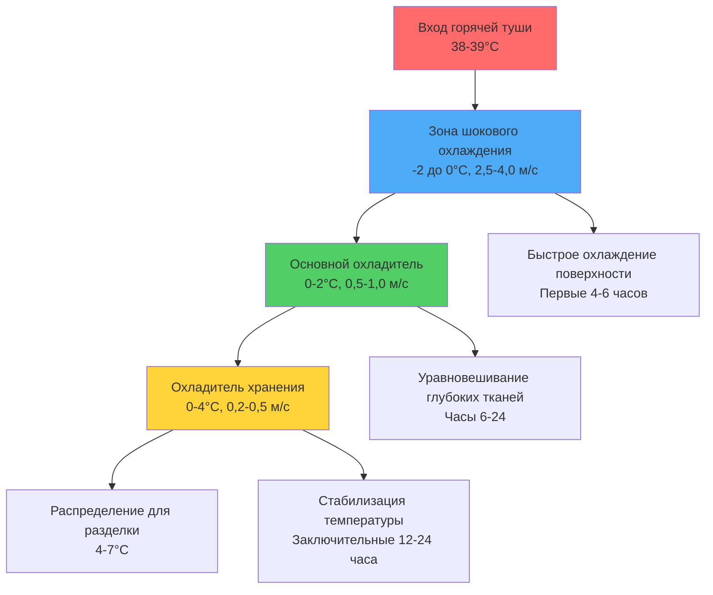
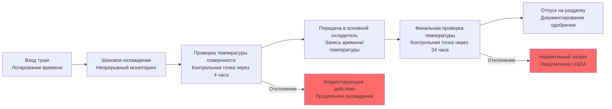

## Обзор

Системы охлаждения на бойнях представляют наиболее критическое применение контроля температуры в мясной промышленности, управляя быстрым переходом от тепловой энергии горячих туш (внутренняя температура 38-39°C) к безопасным условиям хранения (0-4°C) в строго регламентированные сроки. Физика этого процесса охлаждения напрямую влияет на микробиологическую безопасность, удержание влаги, качество мяса и экономический выход продукции.

## Тепловые характеристики горячей туши

### Начальная тепловая нагрузка

Только что забитая туша создаёт уникальные термодинамические вызовы в сравнении с обычными холодильными нагрузками:

**Содержание тепла на одну тушу:**

$$Q_{total} = m \cdot c_p \cdot \Delta T + Q_{metabolic} + Q_{moisture}$$

Где:
- $m$ = масса туши (кг)
- $c_p$ = удельная теплоёмкость мяса (3,3-3,6 кДж/кг·К)
- $\Delta T$ = температурная разница (35-37°C)
- $Q_{metabolic}$ = остаточное выделение метаболического тепла
- $Q_{moisture}$ = скрытая теплота испарения с поверхности

**Типичные требования удаления тепла:**

| Вид животного | Масса туши | Общая тепловая нагрузка | Длительность охлаждения |
|---------|--------------|-----------------|-------------------|
| Говядина | 300-400 кг | 42 000-56 000 кДж | 24-36 часов |
| Свинина | 80-100 кг | 10 000-13 000 кДж | 12-18 часов |
| Баранина | 18-25 кг | 2 200-3 200 кДж | 12-16 часов |
| Телятина | 65-90 кг | 8 000-11 500 кДж | 16-20 часов |

### Выделение тепла после убоя

В течение 2-6 часов после убоя биохимические процессы продолжают выделять тепло посредством гликолиза и развития трупного окоченения:

$$Q_{metabolic} = k \cdot m \cdot e^{-t/\tau}$$

Где:
- $k$ = коэффициент скорости метаболизма (0,8-1,2 Вт/кг первоначально)
- $t$ = время после убоя
- $\tau$ = постоянная времени затухания (2-4 часа)

Это остаточное выделение тепла увеличивает начальную охладительную нагрузку на 15-25% в течение первых 4 часов.

## Требования к быстрому охлаждению

### Температурные стандарты USDA-FSIS

Служба инспекции по безопасности пищевых продуктов USDA устанавливает конкретные критерии производительности охлаждения в соответствии с 9 CFR 310.18:

**Туши говядины (более 300 кг):**
- Охлаждение с 38°C до 7°C на поверхности в течение 24 часов
- Достижение 4°C на глубине 2,5 см в течение 24 часов
- Температура глубоких тканей (центр) не должна превышать 7°C после 36 часов

**Туши свинины:**
- Охлаждение с 38°C до 4°C в течение 12 часов
- Нет установленных требований по глубине (меньшая тепловая масса)

**Критическая контрольная точка:**

$$\frac{dT}{dt}\bigg|_{surface} \geq 1,3 \text{ °C/час (первые 10 часов)}$$

### Конструкция системы охлаждения

### Расчёты теплопередачи

Скорость конвективной теплопередачи с поверхности туши определяет эффективность охлаждения:

$$q = h \cdot A \cdot (T_{surface} - T_{air})$$

Где:
- $h$ = коэффициент конвективной теплопередачи (15-35 Вт/м²·К)
- $A$ = площадь поверхности туши (1,5-3,5 м² в зависимости от вида)
- $T_{surface}$ = температура поверхности туши
- $T_{air}$ = температура охлаждающего воздуха

**Влияние скорости воздуха на коэффициент теплопередачи:**

$$h = C \cdot v^{0,8}$$

Где:
- $C$ = постоянная (10-12 для геометрии туши)
- $v$ = скорость воздуха (м/с)

Увеличение скорости воздуха с 1,0 до 2,0 м/с повышает коэффициент теплопередачи на 74%, значительно ускоряя охлаждение поверхности.

## Конфигурация системы охлаждения

### Требования по производительности

**Расчёт пиковой нагрузки для охладителя шокового охлаждения:**

$$Q_{refrigeration} = Q_{product} + Q_{infiltration} + Q_{equipment} + Q_{lights} + Q_{people}$$

Нагрузка на продукт доминирует в приложениях на бойнях:

$$Q_{product} = \frac{m_{hourly} \cdot c_p \cdot \Delta T}{3600} + \frac{m_{hourly} \cdot h_{evap} \cdot W_{loss}}{3600}$$

Где:
- $m_{hourly}$ = пропускная способность туш (кг/ч)
- $h_{evap}$ = скрытая теплота испарения (2450 кДж/кг)
- $W_{loss}$ = коэффициент потери влаги (0,015-0,025 кг/кг при шоковом охлаждении)

**Типичные холодильные нагрузки:**

| Производительность предприятия | Нагрузка шокового охлаждения | Нагрузка основного охлаждения | Нагрузка охладителя хранения |
|-------------------|------------------|--------------------|---------------------|
| 50 туш/час говядина | 850-1 100 кВт | 450-600 кВт | 180-250 кВт |
| 200 туш/час свинина | 950-1 250 кВт | 500-680 кВт | 200-280 кВт |
| 500 туш/час баранина | 480-640 кВт | 250-350 кВт | 100-150 кВт |

### Технические характеристики испарителя

**Испарители охладителя шокового охлаждения:**
- Расстояние между рёбрами: 6-8 мм (больше, чтобы предотвратить обледенение)
- Скорость на входе в аппарат: 2,5-3,5 м/с
- Перепад температуры испарителя: 6-8°C (средний, для баланса производительности и влажности)
- Цикл оттайки: 3-4 раза в день (горячим газом или обратный цикл)

**Обоснование выбора температурного перепада (ТП):**

Больший ТП (10-12°C) повышает производительность, но ускоряет потерю влаги из-за более низкой относительной влажности:

$$RH = \frac{P_{sat}(T_{evap})}{P_{sat}(T_{air})} \times 100\%$$

Операции на бойнях уравновешивают быстрое охлаждение против чрезмерной "усушки" (потери влаги), целевым показателем является 1,5-2,5% потери массы при охлаждении.

## Требования к санитарии оборудования

### Конструкция, рассчитанная на мойку под давлением

Все холодильное оборудование на предприятиях боен должно выдерживать ежедневную чистку под высоким давлением и высокой температурой в соответствии с нормативами USDA-FSIS:

**Спецификации материалов:**
- Змеевики испарителя: нержавеющая сталь 304 или 316
- Поддоны для конденсата: неразъёмные из нержавеющей стали 316, наклон не менее 2%
- Защиты вентилятора: нержавеющая сталь 304, съёмные для очистки
- Электрические корпуса: рейтинг NEMA 4X (эквивалент IP66)
- Крепежные элементы: нержавеющая сталь 316 повсеместно

**Принципы конструкции для очистки:**
- Отсутствие горизонтальных поверхностей, накапливающих грязь
- Минимальный зазор 15 см над полом
- Герметизированные электрические проходы
- Самотекущие конфигурации
- Съёмные панели для доступа во внутрь

### Обработка поверхностей антимикробными веществами

Современные испарители для боен включают антимикробные покрытия, содержащие ионы серебра или медные сплавы, чтобы подавлять рост бактерий между циклами очистки.

## Документирование температуры и соответствие HACCP

### Требования к мониторингу

USDA-FSIS требует непрерывного мониторинга температуры с постоянными записями в соответствии с 9 CFR 417 (нормативы HACCP):

**Критические точки мониторинга:**
1. Температура поверхности туши (инфракрасные или контактные датчики)
2. Температура воздуха на выходе испарителя
3. Температура глубоких тканей (пробные туши с вставленными датчиками)
4. Температура насыщения хладагента

**Технические характеристики регистрации данных:**
- Интервал записи: максимум 15 минут
- Точность: ±0,5°C
- Сохранение записей: минимум 1 год
- Пороги сигнала тревоги: ±2°C от заданной величины

### Мониторинг процесса

### Протоколы реагирования на отклонения

Когда происходят отклонения в температуре:

1. **Немедленные действия:** Определить затронутую партию продукта, изолировать для расширенного мониторинга
2. **Анализ первопричины:** Отказ оборудования, перегрузка, условия окружающей среды
3. **Корректирующие меры:** Продлённое охлаждение, сниженная плотность загрузки, ремонт оборудования
4. **Документирование:** Отчёт об инциденте, проверка корректирующего действия, уведомление инспектора USDA (если критический предел превышен)

## Вентиляция и качество воздуха

Охладители на бойнях требуют контролируемого обмена воздуха для удаления:
- Метаболического CO₂ из остаточного дыхания тканей
- Летучих органических соединений из крови и ткани
- Влаги из испарительного охлаждения

**Минимальная скорость воздухообмена:** 0,5-1,0 ACH (воздухообмены в час) в охладителях хранения, достигаемая через:
- Контролируемую инфильтрацию через дверные проёмы
- Выделенные системы подачи свежего воздуха на крупных предприятиях
- Дифференциалы положительного давления для предотвращения загрязнения

## Соображения энергоэффективности

**Охлаждение с переменной производительностью:**
Современные установки на бойнях используют винтовые компрессоры с переменной скоростью или тандемные поршневые системы для соответствия колеблющимся нагрузкам на протяжении ежедневных производственных циклов.

**Возможности рекуперации тепла:**
Горячий газ из нагнетания компрессора (60-80°C) может обеспечивать:
- Энергию оттайки испарителя (100% использование)
- Горячее водоснабжение для санитарных операций (40-50% от общего потребления горячей воды)
- Обогрев помещений административных зон

**Эталоны энергоёмкости:**

| Тип предприятия | Использование энергии (кВт·ч/тонну обработано) |
|---------------|----------------------------------|
| Убойный цех говядины | 85-120 кВт·ч/т |
| Убойный цех свинины | 65-95 кВт·ч/т |
| Убойный цех баранины | 70-100 кВт·ч/т |

Эффективные операции достигают значений нижнего диапазона за счёт оптимизированного расписания загрузки, надлежащего обслуживания и интеграции рекуперации тепла.

## Ссылки и стандарты

- ASHRAE Handbook - Refrigeration, Chapter 31: Meat Products
- USDA-FSIS 9 CFR Part 310: Post-Mortem Inspection
- USDA-FSIS 9 CFR Part 417: Hazard Analysis and Critical Control Point Systems
- ASHRAE Standard 15: Safety Standard for Refrigeration Systems
- NSF/ANSI Standard 37: Air Curtains for Entranceways in Food and Food Service Establishments
