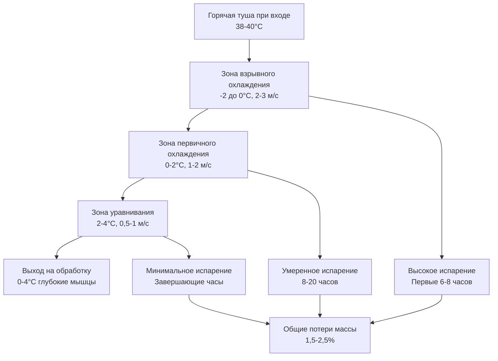
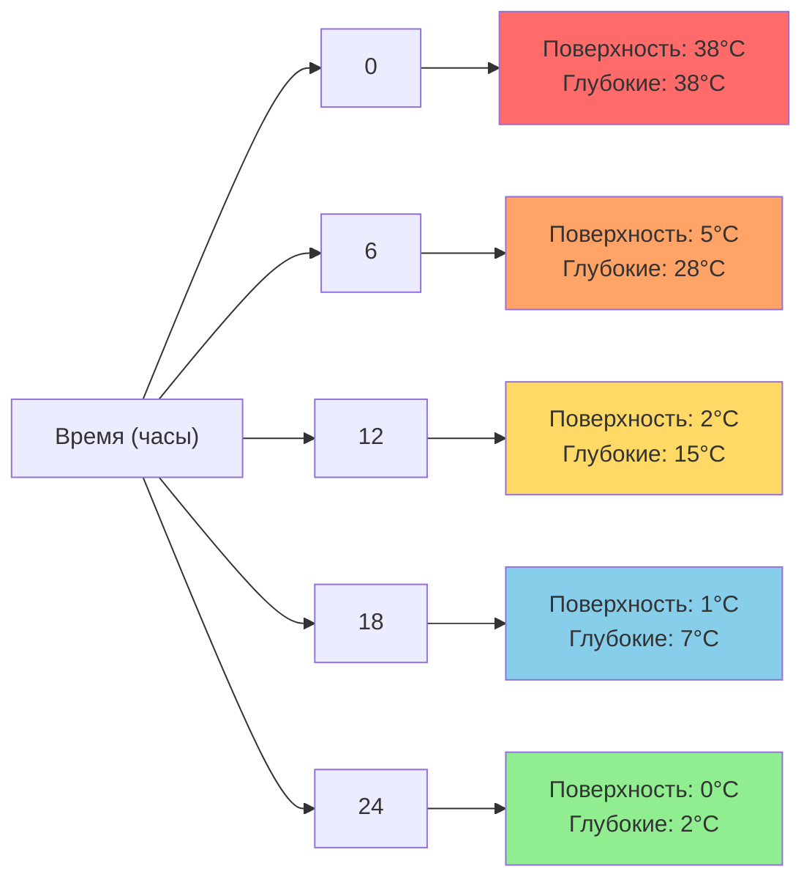

## Основные принципы теплопередачи при охлаждении туш

Охлаждение туш представляет критический первый этап холодильного процесса в мясной промышленности, при котором свежеразделанные туши должны быстро охладиться с примерно 38-40°C до 0-4°C, чтобы замедлить микробный рост, одновременно минимизируя потери влаги и сохраняя качество мяса. Процесс удаления тепла следует нестационарной теплопроводности сквозь тушу в сочетании с конвективной теплопередачей на поверхности.

Уравнение теплопередачи при охлаждении туши:

$$Q = h \cdot A \cdot (T_{surface} - T_{air})$$

где $Q$ — скорость конвективной теплопередачи (Вт), $h$ — коэффициент конвективной теплопередачи (Вт/м²·К), $A$ — площадь поверхности туши (м²), $T_{surface}$ — температура поверхности туши (К), $T_{air}$ — температура воздуха (К).

Число Био определяет, может ли туша рассматриваться как система с сосредоточенными параметрами или требуется учет внутренних градиентов температуры:

$$Bi = \frac{h \cdot L_c}{k}$$

где $L_c$ — характерный размер (отношение толщины к площади поверхности), $k$ — коэффициент теплопроводности мяса (приблизительно 0,45-0,50 Вт/м·К). Для говяжьих туш $Bi > 0,1$, требуется полный анализ нестационарной теплопроводности.

## Традиционные системы воздушного охлаждения

Воздушное охлаждение остается преобладающим методом на североамериканских убойных предприятиях. Туши подвешиваются на подвесной путь в холодильных помещениях, поддерживаемых при температуре -2-2°C с скоростью воздуха 1-3 м/с во время начальной фазы взрывного охлаждения.

**Протоколы охлаждения:**

| Вид | Начальная температура | Целевая температура | Типовая продолжительность | Скорость воздуха | Температура воздуха |
|---------|-------------|-------------|------------------|--------------|-----------------|
| Говядина (бычок) | 38-40°C | 0-4°C | 24-36 часов | 1,5-2,5 м/с | 0-2°C |
| Говядина (тяжелая) | 38-40°C | 0-4°C | 36-48 часов | 1,0-2,0 м/с | -1-1°C |
| Свинина | 38-39°C | 0-4°C | 18-24 часа | 2,0-3,0 м/с | -2-0°C |
| Баранина | 38-40°C | 0-4°C | 12-18 часов | 2,5-3,5 м/с | -1-1°C |

Коэффициент конвективной теплопередачи при воздушном охлаждении зависит от скорости воздуха согласно эмпирическому соотношению:

$$h = C \cdot v^{0.6}$$

где $v$ — скорость воздуха (м/с), $C$ — постоянная (приблизительно 5,7 для геометрии туши). Более высокие скорости увеличивают теплопередачу, но также увеличивают испарительные потери влаги.

## Технология спрей-охлаждения

Спрей-охлаждение периодически наносит тонкий водяной туман на поверхность туши во время начальной фазы охлаждения, используя скрытую теплоту парообразования для ускорения охлаждения и снижения потерь массы. Нормативные требования USDA FSIS разрешают спрей-охлаждение согласно 9 CFR 301.2 с определенными требованиями к качеству воды и режиму подачи.

Усиленная теплопередача объединяет чувствительное охлаждение и испарительное охлаждение:

$$Q_{total} = Q_{convection} + Q_{evaporation}$$

$$Q_{evaporation} = \dot{m}_{water} \cdot h_{fg}$$

где $\dot{m}_{water}$ — скорость испарения воды (кг/с), $h_{fg}$ — скрытая теплота парообразования (приблизительно 2 450 кДж/кг при 0°C).

**Параметры спрей-охлаждения:**

- **Циклы спрея:** 12-15 секунд подачи / 8-12 минут сушки
- **Температура воды:** 1-4°C (питьевая, хлорированная до 20-50 мг/л)
- **Размер капель:** 50-150 мкм (предотвращает скопление на поверхности)
- **Длительность подачи:** Первые 8-12 часов цикла охлаждения
- **Снижение потерь массы:** 0,5-1,2% по сравнению с традиционным воздушным охлаждением

Коэффициент эффективности спрей-охлаждения:

$$\eta_{spray} = \frac{\Delta T_{spray}}{\Delta T_{air}} = 1,3 - 1,6$$

указывает на 30-60% более быстрое охлаждение поверхности по сравнению с воздушным охлаждением во время подачи спрея.

## Кривые снижения температуры

Снижение температуры в глубоких мышцах туши следует экспоненциальной кривой затухания, описываемой приближением сосредоточенной емкости (модифицированным для конечного числа Био):

$$\frac{T(t) - T_{air}}{T_0 - T_{air}} = e^{-\frac{t}{\tau}}$$

где $\tau$ — постоянная времени теплопередачи:

$$\tau = \frac{\rho \cdot c_p \cdot V}{h \cdot A}$$

где $\rho$ — плотность мяса (приблизительно 1 050 кг/м³), $c_p$ — удельная теплоемкость (приблизительно 3 500 Дж/кг·К выше точки замерзания), $V$ — объем туши (м³).

Для типичной говяжьей туши (350 кг, площадь поверхности 5,2 м²):

$$\tau = \frac{1050 \times 3500 \times 0,333}{15 \times 5,2} \approx 15 700 \text{ секунд} \approx 4,4 \text{ часа}$$

## Комбинированные системы охлаждения

Современные предприятия применяют комбинированные системы, интегрирующие несколько технологий охлаждения для оптимизации скорости охлаждения, качества продукции и энергоэффективности:

**Гибридная система спрей-воздух:**
1. **Этап 1 (0-8 часов):** Спрей-охлаждение при -1°C воздуха, скорость 2,5 м/с
2. **Этап 2 (8-16 часов):** Воздушное охлаждение при 0°C, скорость 1,5 м/с
3. **Этап 3 (16-24 часа):** Уравнивание при 2°C, скорость 0,8 м/с

**Система быстрого охлаждения-выдержки:**
1. **Взрывное охлаждение (0-4 часа):** Воздух -4 до -2°C, 3-4 м/с, поверхностное замораживание допустимо
2. **Выдержка при оттаивании (4-6 часов):** Воздух 4-6°C, 0,5 м/с, поверхностное оттаивание
3. **Заключительное охлаждение (6-24 часа):** Воздух 0-2°C, 1-2 м/с, уравнивание

## Микробный контроль через охлаждение

USDA FSIS устанавливает обязательные требования к скорости охлаждения для предотвращения микробного размножения, в частности контроль *Salmonella*, *E. coli* O157:H7 и *Clostridium perfringens*. Критическая температурная зона для роста бактерий — 10-52°C.

**Требования по температуре USDA FSIS (9 CFR 318.17):**

- Поверхность туши должна достичь ≤4,4°C в течение 24 часов для говядины
- Температура глубоких мышц должна достичь ≤4,4°C в течение 36 часов
- Ни одна часть не должна оставаться выше 10°C дольше 12 часов

Скорость роста бактерий следует соотношению Аррениуса:

$$k(T) = A \cdot e^{-\frac{E_a}{R \cdot T}}$$

где $k(T)$ — константа скорости роста, $E_a$ — энергия активации (типично 60-80 кДж/моль для мезофильных бактерий), $R$ — газовая постоянная (8,314 Дж/моль·К), $T$ — абсолютная температура (К).

Снижение температуры на 10°C типично снижает скорость роста бактерий в 2-4 раза (Q₁₀ = 2-4), что делает быстрое охлаждение критичным для безопасности пищевых продуктов.

## Управление потерями массы

Потери массы (испарение влаги) представляют как экономические потери, так и качественную деградацию. Скорость испарения следует:

$$\dot{m}_{evap} = h_m \cdot A \cdot (P_{sat,surface} - P_{air})$$

где $h_m$ — коэффициент массопередачи (м/с), $P$ — парциальные давления водяного пара (Па). Коэффициент массопередачи связан с коэффициентом теплопередачи через число Льюиса:

$$h_m = \frac{h}{\rho \cdot c_p \cdot Le^{2/3}}$$

где число Льюиса (Le) ≈ 1,0 для воздушно-водяных паровых смесей.

**Стратегии снижения потерь массы:**

| Метод | Типовые потери массы | Механизм |
|--------|---------------------|-----------|
| Традиционное воздушное охлаждение | 1,8-2,5% | Только испарение |
| Спрей-охлаждение | 1,0-1,5% | Подмена воды + испарительное охлаждение |
| Охлаждение воздухом высокой влажности | 1,2-1,8% | Сниженный градиент давления паров |
| Быстрое охлаждение-выдержка | 1,5-2,0% | Сокращенное время воздействия |
| Непроницаемые мешки | 0,2-0,5% | Паровой барьер (специальные применения) |

## Конструктивные соображения

Емкость холодильного помещения для туш должна учитывать пиковые производительности с адекватным расстоянием для циркуляции воздуха:

$$\dot{Q}_{total} = \dot{m}_{carcass} \cdot c_p \cdot \Delta T + \dot{m}_{carcass} \cdot f_{shrink} \cdot h_{fg}$$

где $\dot{m}_{carcass}$ — пропускная способность туш (кг/ч), $f_{shrink}$ — относительные потери массы (типично 0,015-0,025).

Для предприятия, перерабатывающего 100 говяжьих туш в час (средняя масса 350 кг), охлаждение с 38°C до 2°C в течение 24 часов:

$$\dot{Q}_{sensible} = \frac{100 \times 350}{24} \times 3500 \times (38-2) = 1,84 \times 10^7 \text{ Вт} = 18,4 \text{ МВт}$$

$$\dot{Q}_{latent} = \frac{100 \times 350}{24} \times 0,02 \times 2,45 \times 10^6 = 7,1 \times 10^5 \text{ Вт} = 0,71 \text{ МВт}$$

Общая холодильная нагрузка ≈ 19,1 МВт (5 430 тонн охлаждения), требует существенной емкости холодильного растения с надлежащим распределением нагрузки по циклу охлаждения.

Расстояние между подвесами должно обеспечивать зазор 0,3-0,5 м между тушами для поддержания равномерной циркуляции воздуха и предотвращения локальных «горячих точек», которые могли бы служить местами скопления бактерий.
