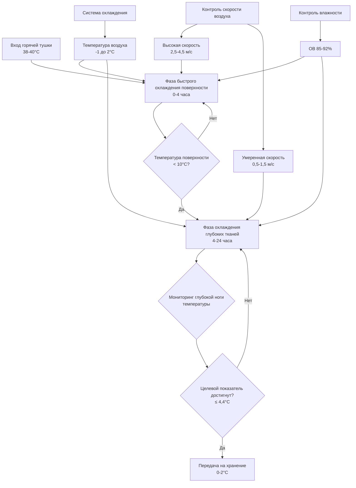

## Обзор

Охлаждение горячих тушек представляет наиболее критический процесс охлаждения в переработке мяса, когда тушки говядины, свинины и баранины должны быстро охлаждаться от температуры забоя (38-40°C) до безопасной температуры хранения (0-4°C) в установленные сроки для предотвращения роста микроорганизмов и одновременного предотвращения дефектов качества. Служба пищевой безопасности и инспекции USDA (FSIS) устанавливает обязательные требования по времени-температуре на основе массы тушки и вида животного для обеспечения контроля патогенов, в частности для *Salmonella* и *Escherichia coli* O157:H7.

Процесс охлаждения включает сложные явления переноса тепла, включая конвективное охлаждение от охлажденного воздуха, испарительное охлаждение от влаги на поверхности и кондуктивный перенос тепла через слои ткани. Проектирование системы должно обеспечить баланс между быстрым охлаждением поверхности для микробной безопасности и контролируемым охлаждением глубоких тканей для предотвращения холодового укорочения и сохранения качества мяса.

## Требования FSIS по времени-температуре

Нормативные акты USDA FSIS 9 CFR 310.18 и 381.66 устанавливают максимальные графики охлаждения на основе массы тушки для ограничения времени, в течение которого ткани остаются в опасной температурной зоне (10-54°C), где бактериальное размножение происходит экспоненциально.

### Требования к охлаждению тушек говядины

FSIS обязывает тушки говядины достичь следующего снижения температуры:

| Масса тушки | Максимальное время охлаждения | Целевая температура глубокой ткани |
|-------------|-------------------------------|-------------------------------------|
| < 12 кг | 16 часов | ≤ 4,4°C |
| 12-20 кг | 20 часов | ≤ 4,4°C |
| 20-31 кг | 24 часа | ≤ 4,4°C |
| > 31 кг | 36 часов | ≤ 4,4°C |

Измерение температуры происходит в глубокой части ноги (окорока), которая представляет тепловой центр с максимальной тепловой массой и самой низкой скоростью охлаждения.

### Требования для свинины и баранины

Тушки свинины должны достичь ≤ 4,4°C в течение 24 часов независимо от массы. Тушки баранины соответствуют аналогичным графикам охлаждения как говядина на основе убойной массы, при этом более легкие тушки требуют максимального охлаждения за 16 часов.

## Физика переноса тепла при охлаждении тушек

Скорость охлаждения тушки говядины следует закону теплопроводности Фурье в сочетании с конвективными граничными условиями, создавая нестационарную задачу переноса тепла с температурно-зависимыми теплофизическими свойствами.

### Модель снижения температуры

Одномерное нестационарное уравнение теплопроводности для охлаждения тушки:

$$\frac{\partial T}{\partial t} = \alpha \frac{\partial^2 T}{\partial x^2}$$

где $\alpha = k/(\rho c_p)$ — коэффициент температуропроводности, $k$ — теплопроводность (0,41-0,48 Вт/м·К для говядины), $\rho$ — плотность (1050-1090 кг/м³) и $c_p$ — удельная теплоемкость (3,22-3,68 кДж/кг·К).

Граничное условие на поверхности включает конвективный перенос тепла:

$$-k\frac{\partial T}{\partial x}\bigg|_{surface} = h(T_{surface} - T_{air}) + h_{evap}$$

где $h$ — коэффициент конвективного переноса тепла (10-25 Вт/м²·К в зависимости от скорости воздуха) и $h_{evap}$ представляет вклад испарительного охлаждения.

### Оценка времени охлаждения

Число Био определяет характер распределения температуры:

$$Bi = \frac{hL_c}{k}$$

где $L_c = V/A$ — характеристическая длина (отношение объема к площади поверхности). Для тушек говядины число Био колеблется от 15 до 35, что указывает на значительные внутренние температурные градиенты во время охлаждения.

Безразмерная температура в центре при нестационарном охлаждении приблизительно равна:

$$\frac{T_{center} - T_{air}}{T_{initial} - T_{air}} = C_1 e^{-\lambda_1^2 Fo}$$

где $Fo = \alpha t/L_c^2$ — число Фурье, а $C_1$ и $\lambda_1$ — константы, определяемые геометрией и числом Био.

Для тушки говядины массой 300 кг с $L_c \approx 0,12$ м, достижение температуры центра 4°C от начальной температуры 38°C в воздухе 0°C с $h = 18$ Вт/м²·К требует приблизительно 28-32 часов.

## Требования к проектированию системы охлаждения

### Расчет холодильной мощности

Общая холодильная нагрузка состоит из удаления явного тепла, метаболического тепла и тепла дыхания:

$$Q_{total} = Q_{sensible} + Q_{metabolic} + Q_{respiration} + Q_{infiltration}$$

#### Нагрузка явного тепла

$$Q_{sensible} = \dot{m}_{carcass} \cdot c_p \cdot \Delta T$$

Для объекта, обрабатывающего 400 тушек говядины/день при средней массе 300 кг в течение 24-часового охлаждения:

$$Q_{sensible} = \frac{400 \times 300 \text{ кг}}{24 \text{ ч}} \times 3,5 \frac{\text{кДж}}{\text{кг·К}} \times (38-2)\text{К} = 630 \text{ кВт}$$

#### Генерация метаболического тепла

Метаболическое тепло после забоя от продолжающихся биохимических реакций:

$$Q_{metabolic} = m_{carcass} \cdot q_{met}$$

где $q_{met}$ снижается приблизительно с 5-8 Вт/кг сразу после забоя до < 1 Вт/кг через 12 часов по мере снижения ферментативной активности.

### Требования к распределению воздуха

**Фаза 1: Быстрое охлаждение поверхности (0-4 часа)**
- Температура воздуха: -1 до 0°C
- Скорость воздуха: 2,5-4,5 м/с на поверхности тушки
- Относительная влажность: 88-92%
- Цель: Снизить температуру поверхности ниже 10°C в течение 2-4 часов

**Фаза 2: Охлаждение глубоких тканей (4-24 часа)**
- Температура воздуха: 0 до 2°C
- Скорость воздуха: 0,5-1,5 м/с
- Относительная влажность: 85-90%
- Цель: Достичь температуру глубокой ноги ≤ 4,4°C без чрезмерного высушивания поверхности

## Предотвращение роста бактерий

Скорость роста микроорганизмов следует температурной зависимости Аррениуса, при этом время генерации приблизительно удваивается при каждом снижении температуры на 10°C.

### Соотношение температура-рост

Константа скорости роста бактерий:

$$k_{growth} = A \cdot e^{-E_a/(RT)}$$

где $A$ — предэкспоненциальный множитель, $E_a$ — энергия активации (типично 50-80 кДж/моль для мезофильных патогенов), $R$ — газовая постоянная и $T$ — абсолютная температура.

Для *Salmonella* и *E. coli* рост фактически прекращается ниже 7°C, при этом время генерации превышает 12 часов при 4°C по сравнению с 20-30 минутами при оптимальной температуре 37°C.

### Критические температурные зоны

| Диапазон температур | Микробная активность | Максимально допустимое время |
|-------------------|-------------------|------------------------------|
| 38-30°C | Фаза быстрого роста | < 2 часов |
| 30-20°C | Активный рост | < 4 часов |
| 20-10°C | Медленный рост | < 8 часов |
| 10-4°C | Минимальный рост | Расширенный (24+ часов приемлемо) |
| < 4°C | Ингибирование роста | Неограниченно для охлаждения |

Поверхностная ткань достигает безопасных температур (< 10°C) в течение 2-4 часов при надлежащих условиях охлаждения, в то время как глубокая ткань требует 16-36 часов в зависимости от размера тушки.

## Системы распыльного охлаждения

Распыльное охлаждение применяет мелкую водяную дымку периодически во время процесса охлаждения для использования испарительного охлаждения при одновременном снижении потерь веса от дегидратации.

### Вклад испарительного охлаждения

Скрытая теплота испарения обеспечивает значительное дополнительное охлаждение:

$$Q_{evap} = \dot{m}_{water} \cdot h_{fg}$$

где $h_{fg} = 2450$ кДж/кг при 0°C.

Испарение 1 кг воды удаляет тепло, эквивалентное охлаждению 700 кг говядины на 1°C. Системы распыльного охлаждения применяют 2-4% воды по массе тушки в течение 8-12 часов, снижая усадку с типичных 2,0-2,5% до 0,5-1,5% при сохранении эквивалентных скоростей охлаждения.

### Параметры цикла распыления

Типичный график распыльного охлаждения:
- Продолжительность распыления: 15-45 секунд
- Интервал цикла: 20-40 минут
- Температура воды: 0,5-2°C
- Размер капель: 50-150 мкм
- Скорость подачи: 0,3-0,5 л/тушка за цикл

## Предотвращение холодового укорочения

Быстрое охлаждение мышечной ткани до окончания окоченения ниже 10°C при рН выше 6,0 вызывает холодовое укорочение — необратимое сокращение мышечных волокон, снижающее нежность.

### Механизм холодового укорочения

Быстрое снижение температуры нарушает регуляцию саркоплазматического ретикулума кальция, вызывая неконтролируемое высвобождение кальция и образование поперечных связей актина-миозина до естественного завершения окоченения. Это создает сокращение саркомеров на 40-50% по сравнению с нормальными 15-20%, создавая жесткое мясо.

### Стратегии предотвращения

**Электрическая стимуляция**
Применение электрических импульсов 200-600 В сразу после забоя ускоряет снижение рН через ускоренный гликолиз, позволяя безопасное быстрое охлаждение без риска холодового укорочения. Мышечный рН падает ниже 6,0 в течение 4-6 часов вместо типичных 12-18 часов.

**Контролируемый профиль охлаждения**
Поддерживайте температуру тушки выше 10°C в течение 8-12 часов после забоя, пока рН не упадет ниже 6,0, затем осуществите быстрое охлаждение. Это увеличивает общее время охлаждения до 36-48 часов для тяжелых тушек.

**Удержание температуры**
Для говядины поддерживайте 12-16°C в течение первых 10 часов, затем снизьте до 0-2°C. Это предотвращает холодовое укорочение при одновременном соответствии требованиям FSIS по времени-температуре благодаря ступенчатому охлаждению.

## Мониторинг и контроль температуры

FSIS требует непрерывного мониторинга с откалиброванными приборами с точностью ±0,5°C, с зондами, позиционируемыми в тепловом центре глубокой ноги.

### Места мониторинга

Для тушек говядины:
- Первичное: Глубокая мышца ноги (окорока), геометрический центр
- Вторичное: Длинная мышца спины на уровне 12-го ребра
- Поверхностное: Внешний жировой слой над ногой

Запись температуры с минимальным интервалом 2 часа с автоматизированными системами оповещения при отклонениях, превышающих ±1°C от целевого профиля.

## Соображения о качестве

### Контроль потерь при усадке

Потеря веса тушки во время охлаждения колеблется от 1,5-2,5%, в основном через испарительное охлаждение и капельные потери. Чрезмерная скорость воздуха или низкая относительная влажность увеличивают усадку:

$$\text{Усадка (%)} = f(RH, v_{air}, t_{chill}, T_{air})$$

Поддержание ОВ выше 85% и ограничение скорости воздуха < 2 м/с после начального охлаждения поверхности минимизирует экономические потери при сохранении микробной безопасности.

### Развитие окраски

Развитие цвета поверхности (окраска) требует проникновения кислорода в ткани, содержащие миоглобин. Адекватная циркуляция воздуха обеспечивает ярко-вишневый цвет для говядины вместо фиолетового обезкислороженного внешнего вида, что важно для принятия потребителем.

## Метрики производительности системы

| Параметр | Целевой диапазон | Метод измерения |
|----------|-----------------|-----------------|
| Скорость снижения температуры глубокой ноги | 1,2-1,8°C/час (первые 12 ч) | Термодатчики, непрерывно |
| Температура поверхности через 4 часа | < 10°C | ИК-термография или поверхностные зонды |
| Конечная температура глубокой ноги | ≤ 4,4°C | Откалиброванные термопары |
| Потеря веса (без распыления) | 1,8-2,5% | Измерения на весах до/после |
| Потеря веса (с распылением) | 0,5-1,5% | Измерения на весах до/после |
| Использование холодильной мощности | 70-90% | Мониторинг системы |
| Однородность температуры воздуха | ±1°C по всему охладителю | Многоточечный мониторинг |

## Заключение

Охлаждение горячих тушек требует точного проектирования системы охлаждения, интегрирующей быстрое охлаждение поверхности для микробной безопасности, контролируемое охлаждение глубоких тканей для сохранения качества и управление влажностью для оптимизации экономического выхода. Требования FSIS по времени-температуре устанавливают минимальные стандарты производительности, в то время как передовые методы, включая распыльное охлаждение и электрическую стимуляцию, позволяют достичь улучшенных результатов. Понимание связанной физики переноса тепла и массы, управляющей процессом охлаждения, позволяет инженерам проектировать системы, отвечающие нормативным требованиям при одновременной оптимизации качества мяса и экономики переработки.
