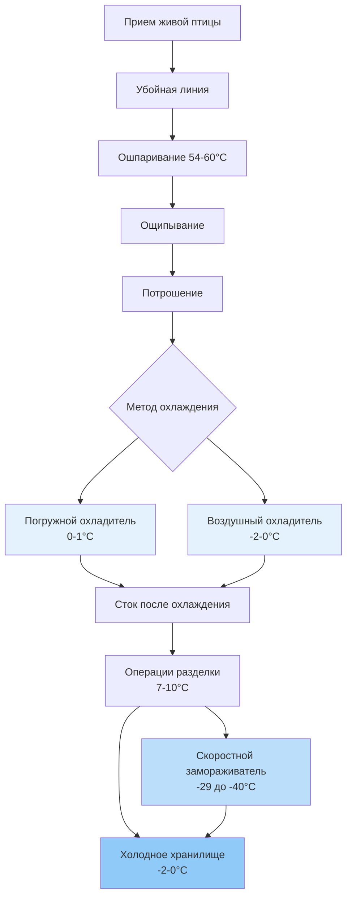

Предприятия по обработке птицы требуют сложных систем охлаждения для поддержания безопасности и качества продукции на всех этапах убоя, потрошения, охлаждения и хранения. Контроль температуры напрямую влияет на скорость роста бактерий, сохранение влаги и качество готовой продукции в этих высокопроизводительных средах.

## Требования к температуре обработки

Нормативные акты USDA FSIS требуют соблюдения определенных предельных температур на всех этапах обработки птицы. Температура туши не должна превышать 4,4°C в конце охлаждения с обязательным непрерывным контролем для обеспечения соответствия. Процесс охлаждения должен снизить температуру внутри туши с примерно 40,6°C после убоя до ниже 4,4°C в установленные сроки.

Снижение температуры следует принципам теплопередачи, управляемым законом охлаждения Ньютона:

$$\frac{dT}{dt} = -hA(T - T_{\infty})$$

Где h — коэффициент конвективной теплопередачи (кДж/ч·м²·°C), A — площадь поверхности (м²), T — температура туши (°C), T_∞ — температура охлаждающей среды (°C). Коэффициент h существенно варьируется в зависимости от метода охлаждения, варьируясь от 85-142 кДж/ч·м²·°C для воздушного охлаждения до 850-1420 кДж/ч·м²·°C для погружного охлаждения.

## Методы охлаждения и системы охлаждения

### Погружное охлаждение

Охладители с водяным погружением доминируют в обработке птицы в Северной Америке благодаря скорости и эффективности. Эти системы используют противоточные резервуары, в которых птица проходит через последовательно более холодные водяные ступени. Первая ступень работает при 10-13°C для первоначального охлаждения, в то время как на финальной ступени поддерживается 0-1°C с использованием механического охлаждения.

Тепловая нагрузка охлаждения для погружных охладителей состоит из:

- Удаления тепла продукта (явное и скрытое)
- Поддержания температуры воды
- Прироста тепла от теплой птицы
- Охлаждения подпиточной воды
- Инфильтрации тепла из окружающей среды

Общая необходимая холодопроизводительность:

$$Q_{total} = Q_{product} + Q_{makeup} + Q_{ambient}$$

$$Q_{product} = \dot{m}_{bird} \times c_p \times \Delta T + \dot{m}_{bird} \times h_{fg} \times x$$

Где $\dot{m}_{bird}$ — расход массы птицы (кг/ч), $c_p$ — удельная теплоемкость птицы (3,27 кДж/кг·°C выше точки замерзания), ΔT — изменение температуры (°C), $h_{fg}$ — скрытая теплота поглощения воды (4,07 МДж/кг), x — доля поглощения воды (обычно 0,06-0,08).

### Воздушное охлаждение

Системы воздушного охлаждения используют охлажденный воздух при -2-0°C с расходом 1,5-2,5 м/с, проходящий поперек подвешенных туш. Этот метод дает более сухую птицу без поглощения воды, но требует 2-3 часов вместо 30-60 минут для погружного охлаждения.

Расчет тепловой нагрузки охлаждения воздушным методом:

$$Q_{air} = \dot{m}_{air} \times c_{p,air} \times (T_{out} - T_{in}) + Q_{fan} + Q_{infiltration}$$

Производительность испарителя должна обеспечивать как явное охлаждение, так и значительное накопление инея от влаги, выделяемой теплыми тушами. Циклы разморозки работают каждые 4-6 часов в непрерывных операциях, требуя 120-150% установленной производительности для поддержания производства во время разморозки.

## Тепловые нагрузки помещения обработки

Помещения разделки и обвалки работают при 7-10°C с относительной влажностью 85-90% для сохранения качества продукции при обеспечении приемлемых условий труда. Тепловые нагрузки охлаждения включают:

| Компонент нагрузки | Типичное значение | Примечания |
|-------------------|------------------|-----------|
| Удаление тепла продукта | 210-256 кДж/кг | С 4,4°C до температуры в помещении |
| Занятость (метаболизм) | 700-930 кВт на человека | Высокая активность |
| Освещение | 27-38 Вт/м² | Светодиодные системы ниже |
| Двигатели оборудования | 11-19 кВ на 1000 птиц/ч | Пилы, конвейеры |
| Инфильтрация | 0,5-1,0 ACH | Зоны с высокой проходимостью |
| Передача через стены | Переменная | В зависимости от изоляции |

Оборудование обработки генерирует значительное тепло от электрических двигателей и трения. Типичная линия обвалки, обрабатывающая 140 птиц/минуту, работает при примерно 19-22 кВ нагрузки двигателя, что способствует 75-88 кВ тепловыделения в помещение.

## Операции скоростного замораживания

Системы индивидуального скоростного замораживания (IQF) замораживают нарезанные куски птицы при -29 до -40°C, используя воздух высокой скорости (7,6-10,2 м/с). Время замораживания следует уравнению Планка для правильных геометрических форм:

$$t_f = \frac{\rho L}{T_f - T_m} \left(\frac{Pa}{h} + \frac{Ra^2}{k}\right)$$

Где ρ — плотность (кг/м³), L — скрытая теплота (445 кДж/кг для птицы), $T_f$ — температура замораживающей среды (°C), $T_m$ — начальная точка замерзания (−3°C для птицы), P и R — коэффициенты формы, a — толщина (м), h — коэффициент поверхностной теплопередачи (кДж/ч·м²·°C), k — теплопроводность (3,8 кДж/ч·м·°C замороженная, 1,26 кДж/ч·м·°C незамороженная).

Системы охлаждения скоростных замораживателей обычно используют аммиак или CO₂ в принудительно-конвективных испарителях с разностью температур 4-7°C (разность между температурой хладагента и воздухом). Разморозка работает по требованию, используя горячий газ или электрические элементы.

## Требования к холодному хранилищу

Замороженное хранилище птицы поддерживает −23 до −18°C согласно рекомендациям ASHRAE для сроков хранения 6-12 месяцев. Тепловая нагрузка хранилища состоит в основном из передачи через изолированную оболочку и инфильтрации через дверные проемы.

Расчет тепловой нагрузки передачи:

$$Q_{trans} = U \times A \times \Delta T$$

Где значение коэффициента U не должно превышать 0,23-0,28 кДж/ч·м²·°C для замороженного хранилища, требуя 15-20 см распыляемой полиуретановой пены или эквивалентного значения RSI теплоизоляции.

Свежее хранилище птицы работает при -2-0°C с максимальным временем хранения 7-10 дней. Эти помещения требуют точного контроля температуры, поскольку продукт замерзает ниже −3°C, вызывая деградацию качества при оттаивании.

## Проектирование системы охлаждения

### Аммиачные системы

Крупные предприятия по обработке птицы (>100 000 птиц/сутки) обычно используют централизованное аммиачное охлаждение с несколькими ступенями сжатия. Двухступенчатая система работает:

- Высокая ступень: 0-4°C TНО (температура насыщения на всасывании)
- Низкая ступень: -40°C TНО для скоростных замораживателей
- Каскадная или бустерная конфигурация

Высокая скрытая теплота аммиака (2 375 кДж/кг при 0°C) и превосходные характеристики теплопередачи обеспечивают преимущества в эффективности в крупных промышленных системах. Стандарты IIAR регулируют проектирование аммиачных систем, с IIAR 2, определяющим требования к машинному отделению и положения по безопасности.

### Сравнение методов охлаждения

| Тип системы | Применение | Температура испарителя | Преимущества | Ограничения |
|------------|-----------|----------------------|------------|-----------|
| Прямое расширение аммиака | Скоростное замораживание | -29 до -20°C | Высокая эффективность, низкая стоимость | Требования безопасности |
| Затопленный аммиак | Охлаждение обработки | -10 до 0°C | Превосходная теплопередача | Сложное управление |
| Вторичный гликоль | Помещения разделки | -4 до 2°C | Сниженный заряд хладагента | Штраф на прокачку |
| Каскад CO₂ | Все применения | -50 до 2°C | Низкий ПГП, высокая эффективность | Более высокое давление |

### Стратегия разморозки

График разморозки испарителя критически влияет на производительность системы и потребление энергии. Разморозка горячим газом прекращается на основе повышения давления на нагнетании, указывающего на удаление льда, обычно требуя 15-20 минут на цикл. Электрическая разморозка обеспечивает более точный контроль, но добавляет электрическую нагрузку.

Частота разморозки зависит от условий воздуха на входе испарителя:

$$N_{defrost} = \frac{\dot{m}_{air} \times \omega_{in} - \omega_{out} \times t_{run}}{m_{frost,limit}}$$

Где N — циклы в сутки, $\dot{m}_{air}$ — расход воздуха по массе, ω — влажностное число, $t_{run}$ — часы между разморозками, и $m_{frost,limit}$ — максимальное приемлемое накопление инея.

## Соображения санитарии

USDA требует ежедневной промывки областей обработки, подвергая оборудование охлаждения высокому давлению воды и дезинфицирующим химикатам. Спецификации оборудования включают:

- Конструкция из нержавеющей стали (серия 300)
- Электрические корпуса NEMA 4X
- Наклонные поверхности для отвода
- Соответствие NSF для оборудования пищевой зоны

Установки испарителя в зонах обработки требуют полной способности к промывке с коррозионностойкими покрытиями на алюминиевых ребрах и специальной обработкой поддонов для предотвращения роста бактерий в конденсате.

## Стратегии энергоэффективности

Охлаждение при обработке птицы составляет 30-40% от общего потребления энергии предприятия. Улучшения эффективности включают:

- Компрессоры с переменной скоростью, соответствующие профилям нагрузки
- Управление плавающим давлением в голове (зимняя работа)
- Рекуперация тепла для ошпаривания и промывки воды
- Экономайзеры на низкотемпературных системах
- Светодиодное освещение в охлаждаемых помещениях
- Высокоэффективные вентиляторы испарителя с ECM двигателями

Эффективность компрессора аммиака варьируется в зависимости от степени сжатия. Связь изэнтропной эффективности:

$$\eta_{isen} = \frac{h_{2s} - h_1}{h_2 - h_1}$$

Где $h_{2s}$ — изэнтропная энтальпия на нагнетании и $h_2$ — фактическая энтальпия на нагнетании. Современные винтовые компрессоры достигают 65-75% изэнтропной эффективности в условиях проектирования, с деградацией производительности при внепроектных степенях сжатия.

## Ссылки на нормы и стандарты

- **ASHRAE Handbook - Refrigeration**: Глава 31 (Продукты из птицы)
- **USDA FSIS**: 9 CFR Part 381 (Нормативные акты по инспекции продуктов из птицы)
- **IIAR 2**: Оборудование, проектирование и монтаж закрытых систем механического охлаждения аммиаком
- **ASHRAE Standard 15**: Стандарт безопасности для систем охлаждения
- **NSF/ANSI 37**: Оборудование кондиционирования и охлаждения воздуха

Надлежащее проектирование системы охлаждения обеспечивает соответствие требованиям безопасности пищевых продуктов при одновременной оптимизации энергопотребления в этих сложных высокопроизводительных средах обработки.
