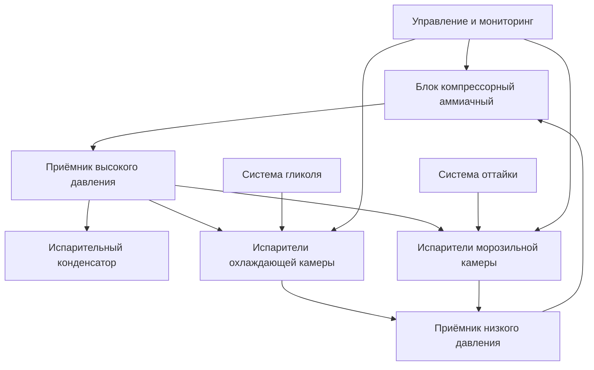

## Обзор

Холодильные системы на предприятиях переработки птицы поддерживают температуру продукции в критических диапазонах для обеспечения безопасности пищевых продуктов, продления срока хранения и сохранения качества продукции. Эти системы работают в отдельных температурных зонах: охлаждающие камеры (−1 до 4°C), камеры хранения (−2 до 1°C) и морозильные хранилища (−23 до −18°C). Надлежащее проектирование холодильной системы учитывает высокие явные и скрытые нагрузки, возникающие при охлаждении продукции, циклах оттайки и инфильтрации из-за частого открытия дверей.

## Требования к температуре и зоны хранения

Справочник ASHRAE по холодильной технике устанавливает спецификации температуры для продукции птицы на основе продолжительности хранения и этапа обработки.

### Классификация температурных режимов хранения

| Тип хранилища | Диапазон температуры | Относительная влажность | Применение |
|--------------|------------------|-------------------|-------------|
| Охлаждающая камера | −1 до 4°C | 85–95% | Свежее мясо птицы, хранение 1–7 дней |
| Камера хранения | −2 до 1°C | 90–95% | Подготовка перед распределением |
| Скоростная морозильная камера | −29 до −40°C | без данных | Операции скоростного замораживания |
| Морозильное хранилище | −23 до −18°C | 90–95% | Долгосрочное хранение замороженной продукции |
| Комната размораживания | −3 до −2°C | 85–90% | Контролируемое размораживание |

Охлаждающие камеры получают тушки птицы при температуре примерно 4–10°C после обработки и снижают температуру продукции ниже 4°C в течение 4 часов в соответствии с нормативными требованиями USDA-FSIS. Холодильная система должна извлекать как явное тепло из массы продукции, так и скрытое тепло от испарения поверхностной влаги.

## Расчёт холодильных нагрузок

Общая холодильная нагрузка для холодильного хранилища птицы состоит из нагрузки продукции, передаточной нагрузки, нагрузки инфильтрации, нагрузки оборудования и нагрузки от персонала.

### Холодильная нагрузка охлаждения продукции

Скорость удаления тепла во время охлаждения зависит от массового расхода продукции, удельной теплоёмкости и перепада температуры:

$$Q_{product} = \dot{m} \times c_p \times (T_{in} - T_{final})$$

Где:
- $Q_{product}$ = холодильная нагрузка продукции (кДж/ч)
- $\dot{m}$ = массовый расход птицы (кг/ч)
- $c_p$ = удельная теплоёмкость птицы (1,68 кДж/кг·°C выше точки замерзания, 0,84 кДж/кг·°C ниже точки замерзания)
- $T_{in}$ = температура входящей продукции (°C)
- $T_{final}$ = конечная температура продукции (°C)

Для предприятия, обрабатывающего 2 268 кг/ч птицы от 10°C до 2°C:

$$Q_{product} = 2 268 \times 1,68 \times (10 - 2) = 30 495 \text{ кДж/ч}$$

### Дыхание и скрытое тепло

Тушки птицы выделяют метаболическое тепло и поверхностную влагу при хранении. Компонент скрытого тепла от испарения влаги:

$$Q_{latent} = \dot{m}_{water} \times h_{fg}$$

Где $\dot{m}_{water}$ — скорость испарения (кг/ч) и $h_{fg}$ — удельная теплота парообразования (2 501 кДж/кг при 0°C). Скорость поверхностного испарения колеблется от 0,2–0,5% от массы продукции в день в зависимости от скорости воздуха и относительной влажности.

### Передаточная нагрузка через оболочку помещения

Приток тепла через изолированные стены, потолок и пол:

$$Q_{transmission} = U \times A \times \Delta T$$

Где:
- $U$ = общий коэффициент теплопередачи (кДж/ч·м²·°C)
- $A$ = площадь поверхности (м²)
- $\Delta T$ = разность температур между внутренней и наружной средой (°C)

Холодильные камеры требуют значений изоляции RSI 4,4–6,2 для стен и RSI 5,3–7,0 для потолков для минимизации передаточных нагрузок. Полы на грунте требуют изоляции и обогрева под полом для предотвращения промерзания грунта.

## Конфигурация системы проектирования

### Выбор хладагента

Промышленные предприятия по переработке птицы преимущественно используют аммиачные (R-717) холодильные системы для холодильного хранилища. Аммиак обеспечивает:

- Высокую удельную теплоту парообразования (1 387 кДж/кг при −23°C)
- Отличные свойства теплопередачи
- Более низкие эксплуатационные затраты по сравнению с синтетическими хладагентами
- Немедленное обнаружение утечек благодаря характерному запаху
- Нулевой потенциал глобального потепления (GWP = 0)

Вторичные системы гликоля, использующие пропиленгликоль (температура замерзания −40°C), распределяют охлаждение на охлаждающие камеры, минимизируя аммиачный заряд в занятых помещениях. Насосы гликоля циркулируют через пластинчато-рамные теплообменники, охлаждаемые аммиачными испарителями.

## Проектирование испарителей и распределение воздуха

Установочные охладители в холодильных хранилищах птицы должны обеспечивать высокие скрытые нагрузки при поддержании равномерного распределения температуры воздуха. Параметры проектирования включают:

- **Скорость воздуха над продукцией**: 250–500 м/ч для минимизации потери влаги
- **Температурный перепад испарителя (TD)**: 4–7°C для охлаждающих камер, 6–8°C для морозильных камер
- **Шаг оребрения**: 6–10 рёбер на дюйм для применения выше точки замерзания, 4–6 рёбер на дюйм для морозильного обслуживания
- **Частота оттайки**: Каждые 6–12 часов для морозильных испарителей с использованием горячего газа, электрической или водяной оттайки

Производительность испарителя должна учитывать неэффективность оттайки и деградацию от обледенения:

$$Q_{evaporator} = \frac{Q_{total}}{1 - t_{defrost}/24}$$

Где $t_{defrost}$ — общее суточное время оттайки в часах.

## Управление воздушной инфильтрацией

Инфильтрация через дверные проёмы составляет 30–50% от общей холодильной нагрузки на предприятиях холодильного хранилища с высокой проходимостью. Расчёт воздухообмена методом площади дверного проёма:

$$Q_{infiltration} = \rho \times V \times h \times E$$

Где:
- $\rho$ = разница плотности воздуха (кг/м³)
- $V$ = объём открытия двери за единицу времени (м³/ч)
- $h$ = разница энтальпии между внутренним и наружным воздухом (кДж/кг)
- $E$ = коэффициент эффективности дверного проёма (0,5–0,9)

Стратегии смягчения инфильтрации включают:
- Скоростные рулонные двери с быстрыми циклами открытия/закрытия
- Воздушные завесы с скоростью выпуска 2 500–5 000 м/ч
- Тамбуры с поэтапным открытием дверей
- Стыки и укрытия в зонах грузовых платформ
- Пластиковые полосовые завесы для прохода персонала

## Контроль температуры и управление

Современные холодильные предприятия используют распределённые системы управления с постоянным мониторингом температуры в нескольких зонах. Критические параметры управления:

- **Температурная стратификация**: Поддерживать вертикальный градиент температуры ±1°C
- **Перегрев хладагента**: 4–7°C на выходе испарителя
- **Управление давлением всасывания**: Модуляция производительности через приводы переменной скорости или байпас горячего газа
- **Завершение оттайки**: Алгоритмы на основе температуры или времени

Системы логирования данных записывают температуры продукции в соответствии с требованиями HACCP, с оповещением об отклонениях температуры за пределами допуска от уставки.

## Оптимизация энергоэффективности

Снижение удельного энергопотребления (кВт·ч на киловатт холодильной мощности) предполагает множество стратегий:

1. **Управление давлением конденсатора в плавающем режиме**: Снизить давление конденсатора при низких температурах окружающей среды
2. **Оптимизация давления испарителя**: Повысить давление всасывания при поддержании температуры продукции
3. **Приводы компрессора переменной скорости**: Соответствие производительности колебаниям нагрузки
4. **LED-освещение**: Снижение внутреннего прироста тепла на 60–70% по сравнению с люминесцентным
5. **Экономайзерные циклы**: Повышение эффективности компрессора путём удаления паров вспышки

Коэффициент производительности (COP) для аммиачных систем в холодильном хранилище птицы обычно находится в диапазоне 2,5–4,0 в зависимости от температур испарителя и конденсатора.

## Заключение

Эффективное холодильное хранилище на предприятиях переработки птицы требует комплексного проектирования системы, решающего проблемы охлаждения продукции, контроля инфильтрации и температурной равномерности. Надлежащий выбор оборудования, значения изоляции и стратегии управления обеспечивают соответствие требованиям безопасности пищевых продуктов при минимизации энергопотребления. Производительность системы должна учитывать пиковые нагрузки во время загрузки продукции при поддержании стабильных температур в периоды ночного хранения.
