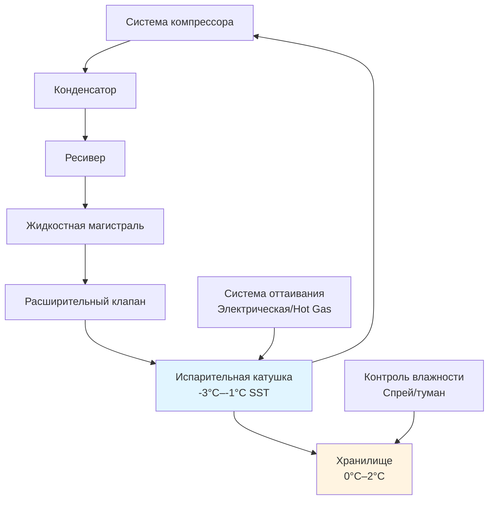

Хранение свежей птицы представляет одно из наиболее сложных применений холодильных систем из-за высокой скоропортяемости продукта, значительного содержания влаги и строгих допусков по температуре. Среда хранения должна обеспечивать быстрое удаление тепла с одновременным контролем влажности, чтобы предотвратить как рост бактерий, так и потерю веса из-за обезвоживания.

## Требования по температуре и термодинамика

Справочник ASHRAE—Refrigeration рекомендует температуру хранения от 0°C до 2°C для стандартной свежей птицы, с глубокой охлаждением от -2°C до 0°C для продления сроков хранения. Эти температуры подавляют рост мезофильных бактерий, сохраняя мышечную ткань в незамороженном состоянии.

Требуемое удаление тепла для птицы, поступающей в хранилище, определяется по формуле:

$$Q_{total} = m \cdot c_p \cdot (T_{initial} - T_{storage}) + Q_{respiration}$$

Где:
- $m$ = масса птицы (кг)
- $c_p$ = удельная теплоемкость птицы, приблизительно 3,31 кДж/(кг·К) выше температуры замерзания
- $T_{initial}$ = температура поступающего продукта, обычно 4°C–7°C после охлаждения
- $T_{storage}$ = целевая температура хранения
- $Q_{respiration}$ = тепло метаболизма (минимально для обработанной птицы)

Для партии в 1000 кг охлаждаемой с 7°C до 2°C:

$$Q_{total} = 1000 \times 3.31 \times (7-2) = 16,550 \text{ кДж} = 4,60 \text{ кВт·ч}$$

### Длительность хранения в зависимости от типа продукта

| Тип продукта | Температура (°C) | ОВ (%) | Максимальное хранение (дни) | Коэффициент порчи |
|--------------|------------------|--------|------------------------------|-------------------|
| Целые тушки | 0–2 | 85–90 | 7–10 | 1,0× |
| Разделанное мясо | 0–2 | 85–90 | 3–5 | 2,0× |
| Фарш из птицы | 0–2 | 85–90 | 1–2 | 4,0× |
| Глубокая охлаждение, целые тушки | -2–0 | 90–95 | 14–21 | 0,5× |
| Маринованные продукты | 0–2 | 85–90 | 5–7 | 1,5× |

## Проектирование холодильной системы

Предприятия по хранению свежей птицы, как правило, используют системы прямого расширения (DX) или затопленные испарительные системы с разностью температур (ΔT) между хладагентом и воздухом 4°C–6°C. Меньшие значения ΔT снижают температуру на испарительной катушке, минимизируя обезвоживание продукта.

### Критерии выбора испарителя

Испаритель должен обеспечивать удаление тепловой нагрузки от продукта и инфильтрации, сохраняя высокую относительную влажность. Ключевые параметры проектирования включают:

**Скорость потока через испаритель**: максимум 2,0–2,5 м/с (400–500 CFM) для предотвращения чрезмерного движения воздуха, ускоряющего обезвоживание

**Расстояние между ребрами**: 4–6 мм (6–8 ребер на дюйм) для размещения накопления льда без быстрого ухудшения потока воздуха

**Частота оттаивания**: каждые 6–8 часов на 20–30 минут с использованием электрических или горячих газовых методов

Расчет требуемой мощности холодильной системы:

$$Q_{evap} = Q_{product} + Q_{transmission} + Q_{infiltration} + Q_{equipment} + Q_{lights} + Q_{people}$$

Для хранилища площадью 200 м² с высотой 3 м:

**Тепловая нагрузка от продукта** (1000 кг/сутки, охлаждение на 5°C):
$$Q_{product} = \frac{1000 \times 3.31 \times 5}{24} = 690 \text{ Вт}$$

**Нагрузка от теплопередачи** (U = 0,25 Вт/м²·К, ΔT = 28°C):
$$Q_{transmission} = 0.25 \times (200 \times 3 \times 2 + 200) \times 28 = 4,620 \text{ Вт}$$

**Нагрузка от инфильтрации** (1,5 воздухообмена/час, внешний воздух 30°C, 60% ОВ):
$$Q_{infiltration} = \frac{V \cdot \rho \cdot \Delta h \cdot ACH}{3600} = \frac{600 \times 1.2 \times 45 \times 1.5}{3600} = 11,25 \text{ кВт}$$

**Общая холодильная мощность**: приблизительно 17 кВт с 20% коэффициентом безопасности = 20,4 кВт

## Управление влажностью

Поддержание относительной влажности 85–90% предотвращает потерю веса, избегая поверхностной конденсации, которая способствует росту бактерий. Птица теряет приблизительно 0,5–1,0% веса в день при снижении ОВ ниже 80%.

Разность давления водяного пара определяет миграцию влаги:

$$\dot{m}_{water} = h_m \cdot A \cdot (P_{surface} - P_{air})$$

Где:
- $h_m$ = коэффициент массопередачи
- $A$ = площадь поверхности продукта
- $P_{surface}$ = давление паров на поверхности продукта
- $P_{air}$ = давление паров в воздухе хранилища

Методы контроля влажности включают:

**Проектирование испарителя**: большая площадь поверхности катушки с меньшим ΔT снижает осушение
**Спрей-системы**: впрыск тонкого водяного тумана (требует питьевой воды)
**Ультразвуковые распылители**: капельки 5–10 мкм для прямого добавления влаги
**Влажные охлаждающие секции**: испарительное охлаждение перед основным испарителем

## Распределение и циркуляция воздуха

Равномерное распределение воздуха предотвращает стратификацию температуры и локальные теплые зоны, ускоряющие порчу. Скорость воздуха над штабелированным продуктом не должна превышать 0,5 м/с, чтобы минимизировать обезвоживание, сохраняя адекватный теплообмен.

Расчет скорости воздухообмена:

$$ACH = \frac{Q_{sensible}}{V \cdot \rho \cdot c_p \cdot \Delta T}$$

Для эффективного охлаждения с 8°C разностью температур на испарителе:

$$ACH = \frac{20,000}{600 \times 1.2 \times 1.006 \times 8} = 3,45 \text{ воздухообмена/час}$$

### Лучшие практики конфигурации хранилища

- **Расстояние между поддонами**: минимум 100 мм (10 см) от стен, 150 мм (15 см) между рядами
- **Высота штабеля**: максимум 2,4 м для сохранения циркуляции воздуха
- **Плотность загрузки**: максимум 250–300 кг/м³ для адекватной циркуляции воздуха через продукт
- **Мониторинг температуры**: датчики в нескольких местах и высотах, точность ±0,5°C

## Хранение с глубокой охлаждением

Суперохлаждение или глубокая охлаждение поддерживает температуру продукта между -2°C и 0°C, где приблизительно 10–15% влаги в тканях преобразуется в лед. Это частичное замораживание продлевает срок хранения до 14–21 дня без ухудшения качества, связанного с полным замораживанием и оттаиванием.

Скрытая теплота частичного замораживания:

$$Q_{latent} = m \cdot f \cdot L_f$$

Где:
- $f$ = доля замороженной воды (0,10–0,15)
- $L_f$ = скрытая теплота плавления воды = 334 кДж/кг

Для 1000 кг птицы с содержанием влаги 75%:

$$Q_{latent} = 1000 \times 0.75 \times 0.12 \times 334 = 30,060 \text{ кДж}$$

Глубокая охлаждение требует точного контроля температуры (±0,5°C), чтобы предотвратить чрезмерное образование кристаллов льда, повреждающих структуру клеток.

## Соображения упаковки

Выбор материала упаковки влияет на производительность холодильной системы через:

**Скорость передачи влажного пара (MVTR)**: низкие пленки MVTR (ПВХ, ПВДХ) снижают обезвоживание, но задерживают капельную потерю
**Скорость передачи кислорода (OTR)**: упаковка с модифицированной атмосферой (MAP) продлевает срок хранения, но требует герметичных уплотнений
**Теплопроводность**: упаковка добавляет тепловое сопротивление, влияя на время охлаждения

Ледяные аккумуляторы при доставке поддерживают 0°C во время распределения. Соотношение льда к продукту обычно составляет 1:3–1:5 по весу в зависимости от продолжительности транзита и условий окружающей среды.

## Стратегии управления

Современное хранилище свежей птицы использует интегрированные системы управления:

- **Ступенчатое охлаждение**: несколько компрессорных ступеней в зависимости от нагрузки
- **Плавающее давление всасывания**: оптимизация SST в периоды низкой нагрузки
- **Оттаивание по требованию**: инициирование оттаивания на основе времени и температуры
- **Оповещения**: превышение температуры, отказ оборудования, отклонение влажности
- **Логирование данных**: соответствие HACCP и отслеживание качества

Надлежащее проектирование и эксплуатация холодильной системы для хранения свежей птицы максимизируют качество продукта, продлевают срок хранения и минимизируют энергопотребление, сохраняя стандарты безопасности пищевых продуктов.
