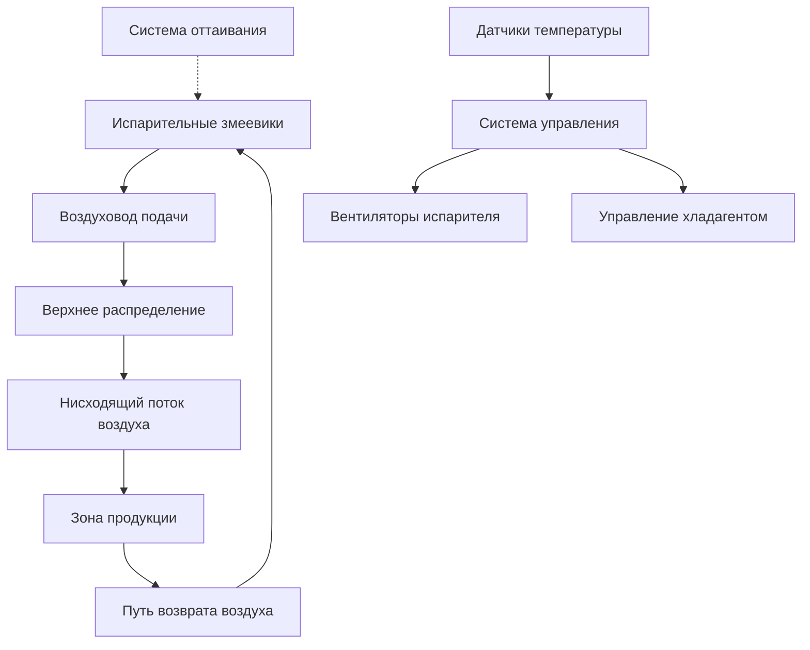
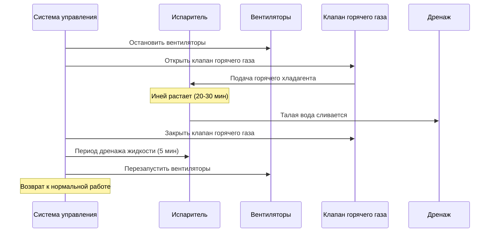

## Требования к температуре хранения

Хранение замороженной птицы поддерживает качество продукции и продлевает срок хранения благодаря точному контролю температуры. ASHRAE Refrigeration Handbook рекомендует температуры хранения -18°C или ниже для долгосрочного хранения замороженной птицы, при этом -23°C предпочтительна для расширенного периода хранения, превышающего шесть месяцев.

Зависимость между температурой хранения и деградацией качества продукта следует кинетике Аррениуса. Скорость потери качества удваивается примерно каждые 5-6°C повышения температуры выше -18°C.

### Классификация по температуре

| Тип хранения | Диапазон температур | Максимальная продолжительность хранения | Сохранение качества |
|--------------|-------------------|-------------------------|-------------------|
| Кратковременное замороженное | -15°C до -18°C | 3-6 месяцев | Хорошее |
| Стандартное замороженное | -18°C до -23°C | 6-12 месяцев | Очень хорошее |
| Долгосрочное замороженное | -23°C до -29°C | 12-24 месяца | Отличное |
| Ультранизкая температура | Ниже -29°C | 24+ месяца | Превосходное |

## Расчеты холодильной нагрузки

Общая холодильная нагрузка для хранения замороженной птицы состоит из нескольких компонентов теплоприхода, которые должны быть учтены для надлежащего выбора системы.

### Компоненты теплевой нагрузки

Уравнение общей холодильной нагрузки:

$$Q_{total} = Q_{transmission} + Q_{product} + Q_{infiltration} + Q_{equipment} + Q_{personnel}$$

**Нагрузка передачи тепла** через утепленные стены, потолок и пол:

$$Q_{transmission} = U \cdot A \cdot \Delta T$$

Где U = общий коэффициент теплопередачи (типично 0,15-0,25 Вт/м²·K для хорошо утепленного холодильного склада), A = площадь поверхности, ΔT = разность температур между окружающей средой и хранилищем.

**Нагрузка продукта** состоит из чувствительного и скрытого теплоудаления:

$$Q_{product} = m \cdot [c_p \cdot (T_{in} - T_{storage}) + h_{fg}]$$

Для птицы, поступающей при -2°C и замораживаемой до -23°C:
- Удельная теплоемкость выше точки замерзания: 3,52 кДж/кг·K
- Скрытая теплота плавления: 249 кДж/кг
- Удельная теплоемкость ниже точки замерзания: 1,77 кДж/кг·K

**Нагрузка инфильтрации** от воздухообмена при открытии дверей представляет значительный компонент в замороженном хранилище. Теплоприхода от инфильтрации:

$$Q_{infiltration} = \rho \cdot V \cdot f \cdot (h_{outside} - h_{inside})$$

Где ρ = плотность воздуха, V = объем помещения, f = частота воздухообмена (типично 0,5-2 воздухообмена в сутки в зависимости от интенсивности входа), h = энтальпия.

## Проектирование системы распределения воздуха

Надлежащая циркуляция воздуха поддерживает равномерное распределение температуры при минимизации обезвоживания продукта.

### Параметры циркуляции воздуха

| Параметр | Рекомендуемое значение | Влияние |
|-----------|------------------|---------|
| Скорость воздуха над продуктом | 0,5-1,5 м/с | Качество, обезвоживание |
| Температура подаваемого воздуха | -26°C до -29°C | Мощность охлаждения |
| Перепад температур | 3-5°C | Поддержание влажности |
| Воздухообмены в час | 10-20 | Равномерность |

### Выбор испарителя

Конструкция испарительного змеевика напрямую влияет на производительность системы. Ключевые соображения:

**Расстояние между ребрами**: Расстояние 6-10 мм между ребрами предотвращает чрезмерное накопление инея при сохранении достаточной площади поверхности теплопередачи. Меньшее расстояние увеличивает производительность, но требует более частых циклов оттаивания.

**Перепад температур (TD)**: Разность между температурой испарения хладагента и температурой воздуха в хранилище обычно находится в диапазоне 5-8°C. Меньший TD снижает обезвоживание продукта, но требует большей поверхности змеевика.

Соотношение теплопередачи:

$$Q = U \cdot A \cdot LMTD \cdot F$$

Где LMTD = логарифмическая средняя разность температур, F = поправочный коэффициент для конфигурации.

## Требования системы оттаивания

Накопление инея на испарительных змеевиках снижает эффективность теплопередачи и должно контролироваться периодическими циклами оттаивания.

### Сравнение методов оттаивания

| Метод | Энергоэффективность | Продолжительность оттаивания | Влияние на хранилище | Применение |
|--------|------------------|------------------|----------------|-------------|
| Оттаивание горячим газом | Высокая | 20-30 минут | Минимальное | Наиболее распространено |
| Электрическое оттаивание | Средняя | 30-45 минут | Среднее | Небольшие системы |
| Оттаивание водой | Низкая | 15-25 минут | Выше | Ограниченное применение |
| Оттаивание с отключением цикла | Наивысшая | Неприменимо | Отсутствует | Не подходит для -23°C |

### Конструкция оттаивания горячим газом

Оттаивание горячим газом циркулирует пар высокого давления и высокой температуры хладагента через испарительные змеевики. Теплопередача при оттаивании:

$$Q_{defrost} = \dot{m}_{refrigerant} \cdot (h_{gas,in} - h_{liquid,out})$$

Типичные температуры горячего газа: 50-70°C на входе испарителя.

**Частота цикла оттаивания** зависит от скорости накопления инея, на которую влияют:
- Частота и продолжительность открытия двери
- Скорость инфильтрации воздуха
- График загрузки продукции
- Условия влажности окружающей среды

Стандартная практика: 2-4 цикла оттаивания в сутки, каждый продолжительностью 20-30 минут.

## Требования к теплоизоляции и паронепроницаемому барьеру

Тепловая изоляция минимизирует теплоприхода и предотвращает проникновение влаги в слои изоляции.

### Спецификации теплоизоляции

**Панели из полиуретанового пенопласта**: Наиболее распространенный изоляционный материал с коэффициентом теплопроводности k = 0,020-0,024 Вт/м·K.

Расчет требуемой толщины изоляции:

$$t = \frac{k \cdot A \cdot \Delta T}{Q_{max}} - \frac{1}{h_{inside}} - \frac{1}{h_{outside}}$$

Типичные толщины для хранилища при -23°C:
- Стены: 150-200 мм
- Потолок: 200-250 мм
- Пол: 150-200 мм (с подогревом пола, если опирается на грунт)

**Паронепроницаемый барьер**: Непрерывный паронепроницаемый барьер на теплой стороне изоляции предотвращает миграцию влаги. Требуемая паропроницаемость: менее 0,06 перм (3,5 нг/Па·с·м²).

## Укладка продукции и поток воздуха

Надлежащее расположение продукции обеспечивает достаточную циркуляцию воздуха и равномерное распределение температуры.

### Руководство по укладке

- **Минимальные зазоры**: 150 мм от стен, 300 мм ниже потолка
- **Расстояние между поддонами**: 100-150 мм между поддонами
- **Высота нагрузки**: Максимум 6 м с достаточной структурной поддержкой
- **Воздушные каналы**: Поддерживайте вертикальные воздушные каналы 200-300 мм высотой через штабели

**Плотность хранения**: Типичное хранилище замороженной птицы работает с эффективной плотностью хранения 250-350 кг/м³, учитывая проходы и зазоры.

## Рассмотрения энергоэффективности

Потребление энергии в хранилище замороженной птицы представляет значительные операционные расходы.

### Меры по повышению эффективности

| Стратегия | Экономия энергии | Стоимость внедрения | Период окупаемости |
|-----------|---------------|---------------------|----------------|
| Светодиодное освещение | 50-70% освещения | Низкая | 1-2 года |
| Вентиляторы переменной скорости | 20-40% энергии вентиляторов | Средняя | 2-4 года |
| Требуемое оттаивание | 10-15% общей | Низкая | 1-3 года |
| Улучшенная изоляция | 15-25% общей | Высокая | 5-8 лет |
| Высокоэффективные испарители | 10-20% компрессора | Средняя | 3-5 лет |

**Коэффициент производительности (COP)** для систем замороженного хранилища:

$$COP = \frac{Q_{evaporator}}{W_{compressor}}$$

Типичные значения COP: 1,5-2,2 для температуры испарения -23°C с аммиачным хладагентом, ниже для хладагентов HFC.

## Системы безопасности и мониторинга

Непрерывный мониторинг предотвращает потерю продукции и обеспечивает безопасность работников в замороженной среде.

**Критические точки мониторинга**:
- Температура в хранилище (точность ±0,5°C)
- Температура испарительного змеевика
- Завершение цикла оттаивания
- Статус двери и сигнализация
- Давление и уровень хладагента
- Статус резервного питания

**Картирование однородности температуры**: Проводите ежеквартальные исследования распределения температуры для выявления холодных зон и проверки эффективности циркуляции воздуха. Руководящие принципы ASHRAE рекомендуют максимальное колебание температуры ±2°C во всем хранилище.

---

*Справочные стандарты: ASHRAE Refrigeration Handbook, ASHRAE Standard 15 (Safety), стандарты International Institute of Ammonia Refrigeration (IIAR) для проектирования аммиачных систем.*
