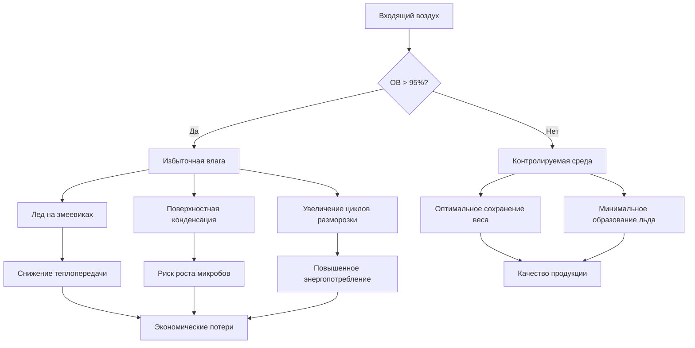
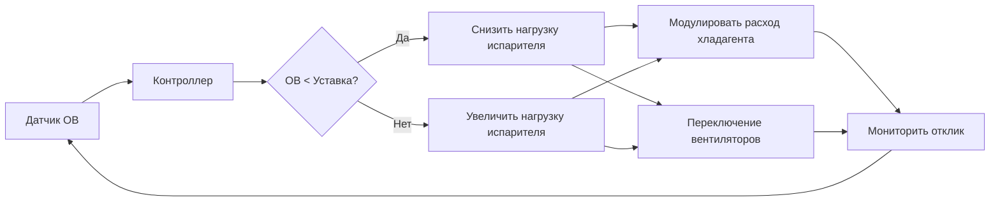

# Важность контроля влажности в холодильных хранилищах птицы

Точный контроль влажности в холодильных хранилищах птицы напрямую влияет на качество продукции, сохранение веса и эффективность работы. Градиент парциального давления водяного пара между поверхностью птицы и окружающим воздухом вызывает миграцию влаги, требующую рассчитанных стратегий контроля.

## Физические принципы передачи влаги

Передача влаги от продукции птицы происходит за счет диффузии, вызванной разностью парциальных давлений водяного пара. Скорость массопередачи следует уравнению:

$$\dot{m} = h_m A (P_{sat,surface} - P_{ambient})$$

Где:
- $\dot{m}$ = скорость массопередачи (кг/с)
- $h_m$ = коэффициент массопередачи (кг/м²·с·Па)
- $A$ = площадь поверхности (м²)
- $P_{sat,surface}$ = давление насыщения водяного пара на поверхности продукта (Па)
- $P_{ambient}$ = парциальное давление водяного пара в воздухе (Па)

Зависимость давления насыщения от температуры описывается уравнением Антуана:

$$\log_{10}(P_{sat}) = A - \frac{B}{C + T}$$

Для воды в диапазоне -30°C до 0°C типичные коэффициенты: A=8,81, B=1930,7, C=235,0, где давление выражено в кПа, а температура в °C.

## Механизмы потери веса

Потеря веса хранящейся продукции птицы происходит в результате сублимации (замороженные продукты) или испарения (охлажденные продукты). Рекомендации ASHRAE определяют необходимость поддержания относительной влажности на уровне 85-95% в охлаждающих помещениях для птицы и 95-100% в морозильных камерах для минимизации потери веса.

### Соотношения температуры и влажности

| Температура хранения | Целевая ОВ | Максимальная потеря веса (%/сутки) | Основная проблема |
|----------------------|-----------|-----------------------------------|-------------------|
| -1°C до 0°C (Охлаждение) | 90-95% | 0,15-0,25 | Подсыхание поверхности |
| -2°C до -4°C (Глубокое охлаждение) | 92-97% | 0,10-0,18 | Образование ледяных кристаллов |
| -18°C до -23°C (Морозильное) | 95-100% | 0,05-0,10 | Ожог от мороза |
| -29°C до -40°C (Глубокое морозильное) | 98-100% | 0,02-0,05 | Сублимация |

## Экономическое воздействие контроля влажности

Потеря веса напрямую влияет на прибыльность. Для объекта, перерабатывающего 100 000 кг птицы ежедневно с 10-дневным хранением при суточной потере веса 0,2%:

$$\text{Суточные потери} = 100\text{,}000 \text{ кг} \times 0{,}002 \times 10 \text{ сутки} = 2\text{,}000 \text{ кг}$$

При оптовой цене 3,00 евро/кг это представляет суточные потери в размере 6 000 евро или 2,19 млн евро в год. Надлежащий контроль влажности, снижающий потерю веса до 0,1% в сутки, экономит 1,095 млн евро в год.

## Образование льда и поверхностная конденсация

Чрезмерная влажность создает образование льда на испарительных змеевиках и поверхностях продукции. Скорость накопления инея зависит от:

$$\dot{m}_{frost} = \frac{\rho_{air} Q (W_{in} - W_{sat})}{1 + W_{sat}}$$

Где:
- $\rho_{air}$ = плотность воздуха (кг/м³)
- $Q$ = объемный расход воздуха (м³/с)
- $W_{in}$ = входное влагосодержание воздуха (кг воды/кг сухого воздуха)
- $W_{sat}$ = влагосодержание насыщения на поверхности змеевика (кг воды/кг сухого воздуха)

## Контроль микробов через управление влажностью

Относительная влажность влияет на скорость роста микробов на поверхностях птицы. Активность воды ($a_w$) связана с относительной влажностью:

$$a_w = \frac{P}{P_{sat}} = \frac{RH}{100}$$

Большинству патогенных бактерий требуется $a_w > 0{,}90$ для роста. При 85% ОВ ($a_w = 0{,}85$) рост бактерий становится незначительным, но происходит чрезмерная потеря влаги. Оптимальный диапазон 90-95% ОВ обеспечивает баланс между контролем микробов и сохранением влаги.

## Стратегии контроля влажности

### Соображения конструкции испарителя

Разница температур змеевика ($\Delta T$) между хладагентом и воздухом влияет на осушение:
- Малая $\Delta T$ (3-5°C): Минимальное осушение, сохраняет высокую ОВ
- Большая $\Delta T$ (8-12°C): Значительное осушение, снижает ОВ

Для хранения птицы, требующего 92% ОВ при -1°C, рассчитайте необходимую температуру змеевика:

При -1°C и 92% ОВ точка росы ≈ -2,2°C. Используя допуск подхода 4°C:

$$T_{coil} = T_{dewpoint} - \Delta T = -2{,}2°C - 4°C = -6{,}2°C$$

### Влияние скорости воздуха

Высокая скорость воздуха увеличивает конвективную теплопередачу и массопередачу:

$$h = C \cdot v^{0{,}8}$$

Где $h$ — коэффициент конвекции, а $v$ — скорость воздуха. Снижение скорости воздуха с 2,5 м/с до 1,5 м/с снижает потерю веса примерно на 25-30%.

## Системы измерения и контроля

Точное измерение влажности требует:

1. **Гигрометры с охлаждаемым зеркалом**: Точность ±0,1°C точка росы для критических применений
2. **Емкостные датчики**: Точность ±2% ОВ, подходят для общего мониторинга
3. **Психрометрический метод**: Измерения мокрого/сухого термометра, точность ±3% ОВ

Стратегии контроля включают:

## Соображения упаковки

Выбор материала упаковки влияет на миграцию влаги:

| Тип упаковки | Скорость передачи водяного пара | Применение | Важность контроля ОВ |
|-------------|----------------------------------|-----------|----------------------|
| Полиэтилен (ПЭ) | 10-15 г/м²/сутки | Кратковременное охлаждение | Умеренная |
| Поливинилхлорид (ПВХ) | 15-40 г/м²/сутки | Упаковка для выставки | Высокая |
| Вакуумная упаковка | <1 г/м²/сутки | Длительное морозильное хранение | Низкая |
| Без упаковки | N/A (неограниченная) | Этапы переработки | Критическая |

## Требования интеграции системы

Эффективный контроль влажности требует скоординированной работы:

- **Холодильная система**: Модуляция мощности для соответствия явным и скрытым нагрузкам
- **Управление вентилятором испарителя**: Приводы переменной скорости для управления циркуляцией воздуха
- **График разморозки**: Оптимизация частоты на основе скоростей накопления инея
- **Контроль инфильтрации**: Высокоскоростные двери, вестибюли и воздушные завесы
- **Загрузка продукции**: Поэтапное введение для предотвращения скачков влажности

Справочник по холодильной технике ASHRAE, Глава 31, содержит подробные рекомендации по поддержанию оптимальных условий для свежей и замороженной продукции птицы, подчеркивая, что контроль влажности значительно влияет на качество продукции и экономическую эффективность объекта.

## Заключение

Контроль влажности в холодильных хранилищах птицы представляет собой критический баланс между предотвращением чрезмерной потери веса и избежанием образования льда. Градиент парциального давления водяного пара вызывает скорости передачи влаги, которые напрямую влияют на качество продукции и экономику объекта. Поддержание 90-95% ОВ в помещениях охлаждения и 95-100% ОВ в морозильных камерах обеспечивает оптимальные условия при одновременном требовании сложных стратегий контроля и надлежащно спроектированных холодильных систем.
