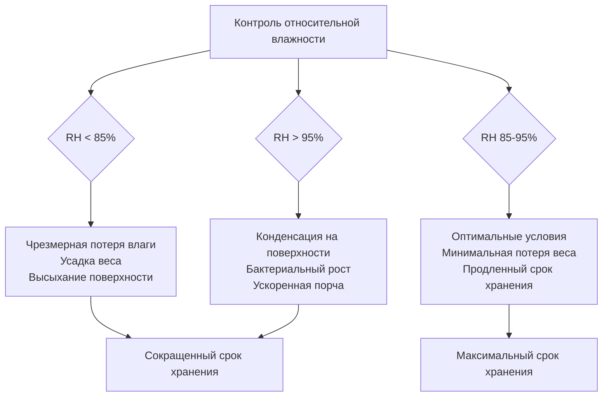
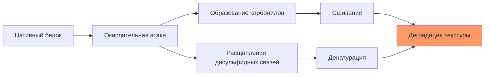

## Обзор

Срок хранения птицы в холодильном хранилище зависит от точного контроля параметров окружающей среды, которые управляют кинетикой микробного роста, скоростью биохимических реакций и передачей влаги. Основные факторы—температура, относительная влажность, скорость воздуха и время—взаимодействуют через термодинамические и массообменные принципы, определяя скорость деградации качества продукта.

## Влияние температуры на срок хранения

Температура представляет доминирующий фактор, контролирующий срок хранения через его экспоненциальное влияние на микробный рост и активность ферментов. Соотношение следует уравнению Аррениуса для кинетики реакций:

$$k = A \cdot e^{-\frac{E_a}{RT}}$$

Где:
- k = константа скорости реакции (день⁻¹)
- A = предэкспоненциальный множитель
- E_a = энергия активации (Дж/моль)
- R = универсальная газовая постоянная (8,314 Дж/моль·K)
- T = абсолютная температура (K)

### Коэффициент температурной зависимости Q10

Микробный рост и реакции порчи обычно демонстрируют значения Q10 от 2 до 3 для птицы, что означает удвоение или утроение скоростей реакций при повышении температуры на каждые 10°C:

$$Q_{10} = \left(\frac{k_2}{k_1}\right)^{\frac{10}{T_2-T_1}}$$

| Температура хранения | Типичный срок хранения | Относительная скорость порчи |
|---------------------|-------------------|------------------------|
| -2°C до 0°C | 14-21 день | 1,0 (базовая) |
| 2°C до 4°C | 7-14 дней | 2,0-2,5 |
| 5°C до 7°C | 3-7 дней | 4,0-5,0 |
| 8°C до 10°C | 1-3 дня | 8,0-12,0 |

### Требования к однородности температуры

Стандарты ASHRAE определяют максимальное изменение температуры в пределах холодильных помещений:

- Вертикальный градиент: ≤ 0,5°C на метр высоты
- Горизонтальные колебания: ≤ 1,0°C по зоне хранения
- Временные колебания: ≤ 0,5°C во время нормальной работы

Неравномерное распределение температуры создает локализованные теплые зоны, где порча ускоряется экспоненциально, компрометируя всю партию.

## Контроль относительной влажности

Активность воды (a_w) напрямую коррелирует с потенциалом микробного роста и скоростью потерь влаги. Соотношение между относительной влажностью и поверхностной активностью воды приближается к равновесию:

$$a_w = \frac{RH}{100}$$

### Оптимальные диапазоны влажности

Свежая птица требует высокой относительной влажности (85-95%) для минимизации потерь веса при одновременном предотвращении накопления поверхностной влаги, которое способствует бактериальному росту.

$$\dot{m}_{loss} = h_m \cdot A \cdot (C_{sat} - C_{\infty})$$

Где:
- ṁ_loss = скорость потери влаги (кг/с)
- h_m = коэффициент конвективного массообмена (м/с)
- A = площадь поверхности (м²)
- C_sat = концентрация насыщения на поверхности (кг/м³)
- C_∞ = концентрация паров в окружающей среде (кг/м³)

## Скорость воздуха и теплопередача

Скорость воздуха влияет как на скорость удаления тепла, так и на испарение поверхностной влаги. Коэффициент конвективной теплопередачи увеличивается со скоростью:

$$h_c = C \cdot v^{0.8}$$

Где:
- h_c = коэффициент конвективной теплопередачи (Вт/м²·K)
- C = эмпирическая константа
- v = скорость воздуха (м/с)

### Рекомендуемые скорости воздуха

| Конфигурация хранения | Скорость воздуха | Назначение |
|----------------------|--------------|---------|
| Начальное охлаждение | 2,0-4,0 м/с | Быстрое удаление тепла |
| Хранение после охлаждения | 0,5-1,0 м/с | Поддержание температуры, минимизация обезвоживания |
| Долгосрочное хранение | 0,2-0,5 м/с | Предотвращение застойности, снижение потерь влаги |

Чрезмерная скорость воздуха (> 2,0 м/с в хранилище) увеличивает потери при испарении без пропорциональных преимуществ срока хранения.

## Кинетика микробного роста

Рост популяции бактерий следует логарифмической кинетике в благоприятных условиях:

$$N_t = N_0 \cdot e^{\mu t}$$

Где:
- N_t = популяция бактерий в момент времени t (КОЕ/г)
- N_0 = начальная микробная нагрузка (КОЕ/г)
- μ = удельная скорость роста (час⁻¹)
- t = время (часы)

### Скорости роста в зависимости от температуры

Удельная скорость роста варьируется экспоненциально с температурой согласно модифицированному поведению Аррениуса. Для вида *Pseudomonas* (основные организмы порчи птицы):

| Температура (°C) | Время генерации | μ (час⁻¹) |
|------------------|-----------------|------------|
| 0°C | 24-48 часов | 0,014-0,029 |
| 4°C | 8-12 часов | 0,058-0,087 |
| 10°C | 3-4 часа | 0,173-0,231 |

## Механизмы биохимической деградации

### Окисление липидов

Ненасыщенные жирные кислоты в липидах птицы подвергаются автоокислению при воздействии кислорода, производя неприятный запах и привкус подогревания (WOF):

$$R-H + O_2 \rightarrow ROOH \rightarrow \text{Альдегиды + Кетоны}$$

Скорость окисления увеличивается экспоненциально с температурой и парциальным давлением кислорода. Хранение при температурах ниже 0°C значительно снижает кинетику окисления.

### Окисление белков

Деградация белков через окислительные и ферментативные механизмы изменяет текстуру и водоудерживающую способность:

## Влияние состава газа

Хранение в контролируемой атмосфере продлевает срок хранения путем использования модифицированного состава газов, который подавляет микробный рост и окислительные реакции.

### Упаковка в модифицированной атмосфере (MAP)

Типичные газовые смеси для птицы:
- CO₂: 25-35% (бактериостатический эффект)
- O₂: < 1% (предотвращает окисление)
- N₂: остаток (инертный заполнитель)

Растворение диоксида углерода в тканевой влаге создает локализованное снижение pH:

$$pH_{change} = -\log_{10}\left(1 + \frac{[CO_2]_{dissolved}}{K_a}\right)$$

Бактериостатический эффект CO₂ продлевает фазу лага и снижает максимальную удельную скорость роста (μ_max) для аэробных организмов порчи.

## Паттерны сенсорной деградации

### Последовательность развития запаха

1. **Дни 0-3**: Свежий, характерный запах птицы
2. **Дни 4-7**: Нейтральный или слегка неприятный запах
3. **Дни 8-14**: Кислые, кислотные ноты (при оптимальной температуре)
4. **Дни 15+**: Гнилостный, сернистые соединения (H₂S, меркаптаны)

Развитие запаха напрямую коррелирует с популяцией бактерий, достигающей 10⁷-10⁸ КОЕ/г, пороговой значения для сенсорного обнаружения.

### Изменения текстуры

Активность протеолитических ферментов и окисление белков вызывают прогрессивное смягчение текстуры:

$$\text{Скорость потери твердости} \propto k_{protease} \cdot e^{-\frac{E_a}{RT}}$$

Поддержание температуры на уровне -2°C до 0°C снижает ферментативную активность на 80-90% по сравнению с хранением при 4°C.

## Интегрирование по времени и температуре

Кумулятивное воздействие температур выше оптимальных определяет эффективный срок хранения через индикаторы времени-температуры:

$$TTI = \int_0^t k(T) \, dt$$

Где интеграция учитывает переменное температурное воздействие во всей холодовой цепи. Каждый градус-час выше оптимальной температуры непропорционально снижает оставшийся срок хранения.

### Эффекты нарушения температурного режима

| Сценарий нарушения | Температура | Продолжительность | Сокращение срока хранения |
|----------------|-------------|----------|----------------------|
| Незначительное отклонение | 4°C | 4 часа | 10-15% |
| Умеренное отклонение | 7°C | 2 часа | 20-30% |
| Серьезное отклонение | 10°C | 1 час | 40-50% |

## Защита упаковкой

Барьерные свойства упаковочных материалов контролируют скорости передачи кислорода и света:

$$J = P \cdot \frac{A \cdot \Delta p}{L}$$

Где:
- J = скорость проникновения (см³/с)
- P = коэффициент проницаемости (см³·см/см²·с·смHg)
- A = площадь поверхности (см²)
- Δp = разница парциального давления (cmHg)
- L = толщина материала (см)

Высокобарьерные пленки (скорость передачи кислорода < 5 см³/м²·день) эффективно удваивают срок хранения по сравнению с низкобарьерными альтернативами.

## Рекомендации проектирования ASHRAE

Справочник ASHRAE—Холодильная техника определяет параметры проектирования для холодильного хранения птицы:

- Температура хранения: -2°C до 0°C
- Относительная влажность: 90-95%
- Кратность воздухообмена: минимум 20-40 в день
- Загруженность продукта: максимум 250 кг/м² площади пола
- Мониторинг температуры: непрерывная запись в нескольких точках

## Практическое внедрение

Проектирование системы должно одновременно учитывать все факторы срока хранения:

1. **Точный контроль температуры**: ±0,5°C через модулирующую холодильную мощность
2. **Управление влажностью**: системы увлажнения или высокоэффективные испарительные катушки с минимальным температурным перепадом
3. **Распределение воздуха**: равномерные поля скорости через оптимизацию вычислительной гидродинамики
4. **Протоколы санитарии**: регулярная очистка для минимизации начальных микробных нагрузок (N₀)
5. **Управление запасами FIFO**: ротация первым пришел—первым ушел для минимизации продолжительности хранения

Взаимодействие между этими факторами создает сложную задачу оптимизации, при которой одновременное удовлетворение всех параметров максимизирует срок хранения при сохранении энергоэффективности и качества продукта.

## Заключение

Максимизация срока хранения требует точного термодинамического контроля температуры, влажности и движения воздуха при одновременном понимании основной микробной кинетики и явлений массообмена. Температура остается основной переменной управления, но оптимизация вторичных факторов—особенно относительной влажности и скорости воздуха—обеспечивает дополнительное продление срока хранения без энергетических затрат. Успешная работа холодильных хранилищ интегрирует эти физические принципы в скоординированные стратегии управления, которые поддерживают качество продукта от обработки через розничное распределение.
