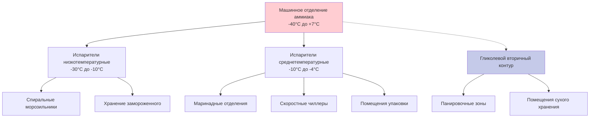

# Глубокая переработка мяса птицы - Холодильные системы

Глубокая переработка включает операции, выходящие за рамки первичного охлаждения: маринование, панировку, варку, замораживание и упаковку. Каждый этап представляет характерные проблемы холодоснабжения из-за различающихся тепловых нагрузок, требований пищевой безопасности и потребностей производственной пропускной способности.

## Требования к температуре по этапам процесса

USDA-FSIS предписывает строгий контроль температуры на протяжении всей глубокой переработки для предотвращения размножения патогенов, в частности *Salmonella* и *Listeria monocytogenes*.

| Этап процесса | Диапазон температур | Максимальное время хранения | Критическая контрольная точка |
|---|---|---|---|
| Удержание перед маринованием | 0-3°C | 2 часа | Предотвращение роста патогенов |
| Маринование | -2 до 1°C | 12-24 часа | Проникновение соли в сравнении с микробной безопасностью |
| Слив после маринования | 1-3°C | 1 час | Контроль влаги на поверхности |
| Панировочная линия | 3-7°C | 30 минут | Оптимизация адгезии панировки |
| Удержание перед варкой | 1-4°C | 1 час | Предотвращение преждевременной порчи |
| Охлаждение после варки | 60°C до 4°C за <90 мин | N/A | Критически для контроля патогенов |
| Помещение упаковки | 4-7°C | Непрерывно | Предотвращение конденсации |
| Хранение в замороженном виде | -23 до -18°C | Долгосрочное | Сохранение качества |

## Холодильная система маринадного отделения

Маринование включает погружение или вращение птицы в растворах, содержащих соль, фосфаты и ароматические соединения. Система холодоснабжения должна поддерживать температуры, близкие к точке замерзания, при управлении существенными скрытыми тепловыми нагрузками от открытых резервуаров.

### Компоненты тепловой нагрузки

Общая холодильная нагрузка состоит из:

$$Q_{total} = Q_{product} + Q_{infiltration} + Q_{equipment} + Q_{evaporation}$$

Где:
- $Q_{product}$ = Удаление явного тепла из поступающей птицы
- $Q_{infiltration}$ = Инфильтрация воздуха из смежных более теплых помещений
- $Q_{equipment}$ = Тепло, выделяемое мешалками и конвейерами
- $Q_{evaporation}$ = Скрытое тепло испарения с открытых поверхностей маринада

Тепловая нагрузка охлаждения продукта:

$$Q_{product} = \dot{m} \cdot c_p \cdot (T_{in} - T_{final})$$

Где:
- $\dot{m}$ = Массовый расход птицы (кг/ч)
- $c_p$ = Удельная теплоемкость птицы ≈ 3,31 кДж/(кг·K) выше точки замерзания
- $T_{in}$ = Входящая температура (обычно 4-4,4°C с первичного охлаждения)
- $T_{final}$ = Целевая температура маринования (0-1°C)

Для производственной линии, обрабатывающей 4536 кг/ч с понижением температуры на 3,3°C:

$$Q_{product} = 4536 \times 3,31 \times 3,3 = 49 600 \text{ кДж/ч}$$

Испарительная нагрузка с открытых резервуаров маринада вносит значительный вклад:

$$Q_{evap} = \dot{m}_{vapor} \cdot h_{fg}$$

Где $h_{fg}$ = скрытая теплота испарения ≈ 2451 кДж/кг при 0°C.

### Конструкция распределения воздуха

Маринадные отделения требуют равномерного распределения воздуха для предотвращения стратификации и локальных теплых зон. Параметры конструкции:

- **Скорость воздуха**: 0,25-0,76 м/с на высоте работы для минимизации сквозняков для персонала при сохранении равномерности температуры
- **Температура подаваемого воздуха**: -3 до -2°C для достижения температуры помещения 0-1°C
- **Относительная влажность**: 85-90% для снижения потерь влаги продуктом
- **Воздухообмены**: 15-25 в час в зависимости от геометрии помещения и плотности тепловой нагрузки

## Охлаждение панировочной линии

Операции панировки наносят панировочную массу и покрытие на маринованные продукты. Область должна охлаждаться достаточно для поддержания безопасности продукта, при этом избегая чрезмерного охлаждения, которое нарушает адгезию панировки.

### Соображения по проектированию панировочного отделения

**Контроль температурного градиента**: Постепенное увеличение температуры от 4°C до 7°C оптимизирует вязкость панировочной массы и адгезию. Резкие изменения температуры вызывают конденсацию на поверхности продукта, ухудшающую качество покрытия.

**Управление влажностью**: Целевая 60-70% ОВ предотвращает высыхание панировки во время установки. Более высокая влажность вызывает мягкость покрытия; более низкая влажность производит хрупкие покрытия.

**Отвод тепла оборудования**: Панировочное оборудование выделяет 5,8-17,5 кВт в зависимости от мощности двигателя. Разместите диффузоры подаваемого воздуха для захвата поднимающихся тепловых плюмов от оборудования.

## Охлаждение после варки

Приложение B USDA требует, чтобы вареная птица охлаждалась от 60°C до 4°C в течение 90 минут для предотвращения размножения *Clostridium perfringens*. Это быстрое охлаждение представляет наибольшую мгновенную холодильную нагрузку в глубокой переработке.

### Расчет скорости охлаждения

Для массы приготовленного продукта $m$, охлаждающейся от $T_1$ к $T_2$:

$$Q_{cooling} = \frac{m \cdot c_p \cdot (T_1 - T_2)}{\Delta t}$$

Для производства 454 кг/ч с понижением температуры на 55°C за 1,5 часа:

$$Q_{cooling} = \frac{454 \times 3,31 \times 55}{1,5} = 54 900 \text{ кДж/ч}$$

Это предполагает непрерывную работу. Пиковый спрос возникает, когда несколько партий поступают одновременно.

### Сравнение методов охлаждения

| Метод | Скорость охлаждения | Площадь пола | Энергопотребление | Капитальные затраты | Лучшее применение |
|---|---|---|---|---|---|
| Спиральный морозильник | 60°C до 4°C за 20-30 мин | Компактный вертикальный | Высокое | Очень высокое | Высокопроизводительное непрерывное |
| Скоростной чиллер | 60°C до 4°C за 60-90 мин | Среднее | Среднее | Среднее | Пакетные операции |
| Конвейерный охладитель | 60°C до 4°C за 90-120 мин | Большой горизонтальный | Низкое | Низкое | Низкопроизводительное непрерывное |
| Погружение в ледяную воду | 60°C до 4°C за 15-25 мин | Среднее | Низкое | Среднее | Продукты, переносящие влагу |

## Конструкция скоростного чиллера

Скоростные чиллеры используют высокоскоростной холодный воздух (2,5-5,1 м/с) для максимизации конвективной теплопередачи. Коэффициент конвекции увеличивается со скоростью воздуха:

$$h = C \cdot v^{0.8}$$

Где $h$ = коэффициент конвекции (кДж/ч·м²·K), $v$ = скорость воздуха (м/с), и $C$ = эмпирическая константа в зависимости от геометрии продукта.

Удвоение скорости воздуха увеличивает теплопередачу приблизительно на 75%. Однако энергопотребление вентилятора увеличивается с кубом скорости, требуя оптимизации между скоростью охлаждения и стоимостью эксплуатации.

### Выбор испарителя

Скоростные чиллеры требуют испарителей с:

- **Расстояние между ребрами**: 6-10 ребер на 10 см для испаряющейся температуры -12 до -10°C
- **Лицевая скорость**: 2,0-3,0 м/с для баланса теплопередачи и перепада давления
- **Цикл оттаивания**: Горячий газ или электрическое оттаивание каждые 4-6 часов
- **Материал катушки**: Нержавеющая сталь или алюминий с эпоксидным покрытием для санитарии

Перепад температур (ТР) между испаряющимся хладагентом и подаваемым воздухом обычно составляет 5,6-8,3°C. Более плотный ТР улучшает эффективность, но требует большей поверхности катушки испарителя.

## Климат-контроль помещения упаковки

Операции упаковки требуют точного контроля температуры и влажности для предотвращения конденсации на пленочных материалах и готовых упаковках.

**Управление точкой росы**: Точка росы воздуха в помещении должна оставаться ниже температуры поверхности пленки минимум на 2,8°C для предотвращения конденсации. Для упаковочных материалов при 4°C:

$$T_{dp} < 1,7°C \text{ (эквивалентное условие помещения: 4°C, 45% ОВ)}$$

**Положительное давление**: Поддерживайте +5,1-12,7 Па относительно смежных областей для предотвращения инфильтрации более теплого влажного воздуха.

**Фильтрация воздуха**: MERV 8 минимум для удаления частиц в воздухе, которые нарушают целостность упаковки.

## Архитектура системы холодоснабжения

Объекты глубокой переработки обычно применяют централизованные аммиачные или каскадные системы, обслуживающие несколько температурных зон через вторичные контуры или распределенные испарители.

### Оптимизация эффективности системы

**Контроль плавающего давления конденсации**: Снижайте давление конденсации при прохладных условиях окружающей среды. Каждое снижение на 1°C давления конденсации снижает энергопотребление компрессора приблизительно на 1,5-2%.

**Приводы с переменной частотой**: Установите VFD на компрессорах и вентиляторах испарителя для согласования производительности с мгновенной нагрузкой. Потенциальная экономия энергии 20-40% по сравнению с постоянной скоростью.

**Рекупирация тепла**: Захватывайте тепло выпуска компрессора для производства горячей воды, отопления объекта или кулинарных процессов. Типичный коэффициент производительности для рекупирации тепла составляет 3-5.

## Интеграция пищевой безопасности

Руководство ASHRAE 36 и нормативные акты USDA-FSIS требуют интеграции систем холодоснабжения с мониторингом HACCP:

- **Непрерывное логирование температуры**: Записывайте каждую ККП с точностью ±0,6°C
- **Уведомление об тревоге**: Оповещайте персонал при превышении температурой безопасных пределов
- **Резервирование**: Резервная холодильная производительность или протоколы чрезвычайных ситуаций
- **Совместимость санитарии**: Конструкция для мойки, надлежащего дренажа и микробного контроля

Проектирование объекта должно облегчать поток продукта из высокотемпературных в низкотемпературные зоны без риска перекрестного загрязнения, следуя принципам USDA "от высокого к низкому, от сырого к приготовленному".

## Заключение

Системы холодоснабжения глубокой переработки должны уравновешивать конфликтующие требования: скорость быстрого охлаждения для пищевой безопасности, точный контроль температуры для качества, энергоэффективность для экономики и требования санитарии для соответствия нормативным требованиям. Надлежащая конструкция системы, учитывающая профили тепловых нагрузок, распределение воздуха и интеграцию процесса, обеспечивает безопасные и эффективные операции глубокой переработки птицы в соответствии со стандартами USDA и производственными целями.
