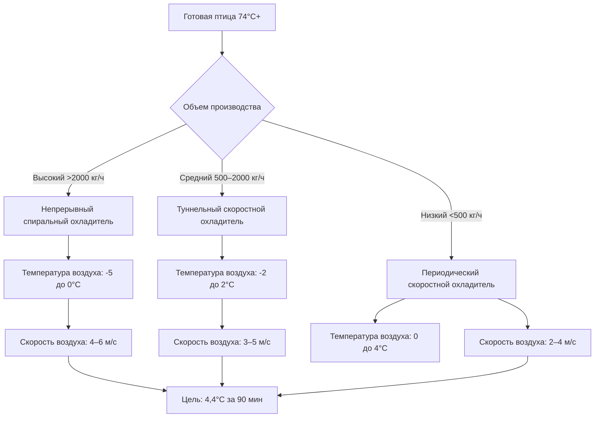

## Обзор

Производство готовой птицы генерирует значительные нагрузки по теплу и влаге, требующие специализированных систем HVAC для обеспечения безопасности продукции, комфорта рабочих и соответствия нормативным требованиям. Коммерческие среды готовки требуют комплексных стратегий по отводу тепла, извлечению паров, контролю загрязнений и быстрому охлаждению продукции после готовки.

Справочник ASHRAE — Приложение HVAC Глава 32 (Пищевые продукты) предоставляет базовое руководство для окружающей среды пищевой обработки, в то время как Глава 34 (Коммерческое и промышленное кондиционирование воздуха) описывает высокотепловые промышленные приложения.

## Расчеты тепловых нагрузок

### Явное тепло от оборудования для готовки

Нагрузка явного тепла от оборудования для готовки зависит от типа оборудования, входной мощности и доли излучения:

$$Q_{sensible} = q_{input} \times F_{usage} \times F_{radiation} \times (1 - F_{latent})$$

Где:
- $Q_{sensible}$ = прирост явного тепла (Вт)
- $q_{input}$ = номинальная входная мощность оборудования (Вт)
- $F_{usage}$ = коэффициент использования (0,5–1,0 в зависимости от периодической или непрерывной работы)
- $F_{radiation}$ = доля излучения в помещение (0,15–0,45)
- $F_{latent}$ = доля скрытого тепла (0,15–0,35 для готовки птицы)

### Скрытое тепло от выделения влаги

Птица выделяет влагу во время готовки через испарение и потери при вытекании жидкости:

$$Q_{latent} = \dot{m}_{evap} \times h_{fg}$$

Где:
- $Q_{latent}$ = нагрузка скрытого тепла (Вт)
- $\dot{m}_{evap}$ = скорость испарения влаги (кг/с)
- $h_{fg}$ = удельная теплота парообразования при температуре готовки (≈2257 кДж/кг при 100°C)

Типичные потери влаги составляют от 15–25% от массы сырого продукта в зависимости от метода готовки и конечной температуры.

## Сравнение методов готовки

| Метод готовки | Типичная температура | Потери влаги | Явное тепло | Скрытое тепло | Выхлоп CFM на единицу |
|---------------|----------------------|--------------|-------------|---------------|----------------------|
| Духовка для обжарки | 175–205°C | 18–22% | Высокое | Умеренное | 800–1200 (1355–2038 м³/ч) |
| Глубокое фритюрование | 165–180°C | 8–12% | Очень высокое | Низкое | 1000–1500 (1699–2548 м³/ч) |
| Паровая готовка | 95–105°C | 10–15% | Умеренное | Очень высокое | 600–1000 (1019–1699 м³/ч) |
| Гриль | 200–260°C | 20–25% | Высокое | Умеренное | 1200–1800 (2038–3058 м³/ч) |
| Су-вид | 62–74°C | 5–8% | Низкое | Низкое | 200–400 (339–679 м³/ч) |

## Проектирование системы вентиляции

### Требования к выхлопу вытяжки

Проектирование коммерческой кухонной вытяжки следует стандарту ASHRAE 154 (Вентиляция для коммерческих операций готовки). Требования к скорости захвата зависят от типа вытяжки и характеристик теплового потока:

$$Q_{exhaust} = V \times A_{face}$$

Где:
- $Q_{exhaust}$ = расход выхлопа (м³/с)
- $V$ = скорость захвата (0,25–0,50 м/с для навесных вытяжек)
- $A_{face}$ = площадь фасада вытяжки (м²)

Для высокотемпературной готовки птицы (гриль, фритюрование) улучшенный захват достигается через:

- Боковые панели, выступающие на 150–300 мм за пределы краев оборудования
- Козырек вытяжки 150–300 мм со всех открытых сторон
- Минимальное расстояние 450 мм между поверхностью готовки и нижним краем вытяжки
- Скорость выхлопа на фасаде вытяжки: 0,40–0,60 м/с

### Системы подпиточного воздуха

Подменный воздух должен соответствовать объемам выхлопа при сохранении герметизации помещения и контроля температуры:

$$Q_{makeup} = Q_{exhaust} \times (1 - F_{transfer})$$

Где $F_{transfer}$ представляет долю выхлопа, замещаемую воздухом, передающимся из смежных помещений (обычно 0,05–0,15).

Стратегии подачи подпиточного воздуха:

**Системы прямого выпуска**: Подача воздуха непосредственно в плену вытяжки, снижающая нагрузки нагрева/охлаждения на 30–40%

**Периметровые системы**: Диффузоры низкой скорости по периметру зоны готовки (скорость выпуска <0,50 м/с)

**Вытеснительная вентиляция**: Подача с уровня пола со стратификацией, эффективна для приложений с высокими потолками

## Требования к охлаждению продукции после готовки

### Протокол быстрого охлаждения

Приложение B USDA FSIS требует, чтобы готовые продукты из птицы достигали 4,4°C в течение определенных сроков, чтобы предотвратить рост патогенов. Скорость охлаждения зависит от массы и геометрии продукта:

$$\frac{T(t) - T_{\infty}}{T_0 - T_{\infty}} = \exp\left(-\frac{hA}{\rho Vc_p}t\right)$$

Где:
- $T(t)$ = температура продукта в момент времени $t$ (°C)
- $T_{\infty}$ = температура охлаждающей среды (°C)
- $T_0$ = начальная температура продукта (минимум 74°C)
- $h$ = коэффициент конвективной теплопередачи (Вт/м²·К)
- $A$ = площадь поверхности (м²)
- $\rho$ = плотность продукта (кг/м³)
- $V$ = объем продукта (м³)
- $c_p$ = удельная теплоемкость (3,5–3,8 кДж/кг·К для готовой птицы)

### Выбор метода охлаждения

## Требования к кондиционированию помещения

### Контроль температуры

Целевые температуры зоны готовки уравновешивают комфорт рабочих и эффективность эксплуатации:

- **Активные зоны готовки**: 20–24°C (сохранение несмотря на плотность тепла 15–20 кВт/м²)
- **Обработка после готовки**: 10–15°C (замедление роста микроорганизмов перед упаковкой)
- **Зоны упаковки**: 12–16°C (предотвращение конденсации, комфорт рабочих)

### Управление влажностью

Относительная влажность в зонах готовки требует активного контроля:

$$\phi = \frac{p_v}{p_{sat}(T)} \times 100\%$$

Целевые диапазоны влажности:
- Зоны готовки: 40–55% ОВ (предотвращение чрезмерного высыхания поверхности)
- Охлаждение/хранение: 75–85% ОВ (минимизация потерь влаги)
- Упаковка: 50–60% ОВ (снижение риска конденсации)

Нагрузки осушения от операций паровой готовки достигают 50–80 кг/ч на 1000 кг пропускной способности продукта. Осушение на основе рефрижерации с рекуперацией тепла обеспечивает экономию энергии 25–35% по сравнению с подходом только вентиляции.

## Контроль качества воздуха

### Источники загрязнений

Готовка птицы генерирует различные аэрозольные загрязнения:

- **Твердые частицы**: Жировые аэрозоли, белковые частицы (0,1–10 мкм)
- **Летучие органические соединения**: Альдегиды, кетоны от окисления липидов
- **Продукты горения**: CO, CO₂, NOₓ от газового оборудования
- **Биологические аэрозоли**: Бактериальные фрагменты, эндотоксины

### Стратегия фильтрации

Многоступенчатая фильтрация защищает оборудование и поддерживает качество внутреннего воздуха:

| Ступень | Тип фильтра | Эффективность | Целевое загрязнение | Перепад давления |
|---------|-----------|----------------|-------------------|-----------------|
| Предварительный | Сетчатый жировой | 60–70% по массе | Крупные капли >10 мкм | 50–100 Па |
| Вторичный | Перегородка/картридж | 85–95% по массе | Аэрозоли 1–10 мкм | 150–250 Па |
| Третичный | ЭСП/носитель | 95–99% по массе | Субмикронные частицы | 200–350 Па |
| Финальный | MERV 13–14 | 90%+ при 1 мкм | Тонкие частицы | 200–300 Па |

Электростатические осадители (ЭСП) в выхлопных потоках удаляют 85–95% субмикронных жировых аэрозолей при сохранении низкого перепада давления (150–250 Па при типичной скорости фасада 3 м/с).

## Стратегии рекуперации энергии

Выхлопной воздух из операций готовки содержит рекуперируемую явную и скрытую энергию:

$$\varepsilon_{sensible} = \frac{T_{supply,outlet} - T_{supply,inlet}}{T_{exhaust,inlet} - T_{supply,inlet}}$$

Технологии рекуперации тепла, применимые к выхлопу из кухни:

**Системы с жидкостным контуром**: Гликолевые контуры, передающие тепло между потоками выхлопа и подаваемого воздуха, эффективность 45–60%, минимальный риск перекрестного загрязнения

**Пластинчатые теплообменники**: Алюминиевая или нержавеющая конструкция с жирозащитными покрытиями, эффективность 50–70%, требует частой очистки

**Тепловые трубки**: Пассивная передача через трубки, заполненные хладагентом, эффективность 45–55%, отличная надежность для приложений с высоким содержанием жира

Типовые установки рекуперации энергии достигают 40–60% снижения нагрузок кондиционирования подпиточного воздуха с простым периодом окупаемости 2–4 года в операциях с высоким объемом.

## Интеграция системы

### Стратегия управления

Комплексное управление HVAC зоны готовки обеспечивает безопасность и эффективность:

- **Вентиляция по требованию**: Модуляция выхлопа на основе температуры вытяжки или оптического обнаружения дыма (снижение энергии вентилятора 20–40%)
- **Отслеживание подачи/выхлопа**: Поддержание герметизации помещения -2,5 до -7,5 Па относительно смежных зон
- **Координация охлаждения**: Последовательность охлаждения после готовки с графиками производства
- **Температурные блокировки**: Отключение оборудования при перегреве зоны (>30°C в целях безопасности)

### Соображения по техническому обслуживанию

HVAC в среде готовки требует интенсивных протоколов обслуживания:

- Очистка вытяжки и воздуховодов: Ежемесячно или ежеквартально в зависимости от объема
- Замена/очистка жирового фильтра: Минимум еженедельно
- Очистка электродов ЭСП: Раз в две недели до ежемесячно
- Очистка холодильного калорифера: Ежемесячно (ускоренное загрязнение от жираных аэрозолей)
- Замены фильтра подпиточного воздуха: Еженедельно до ежемесячно на основе мониторинга перепада давления

## Нормативное соответствие

Требования USDA Food Safety and Inspection Service (FSIS) предписывают:

- Готовку до минимальной внутренней температуры 74°C мгновенно
- Охлаждение с 54,4°C до 4,4°C в течение 6 часов для готовых продуктов
- Экологический мониторинг на Listeria в зонах после готовки
- Разделение сырых и готовых зон продукции (физические барьеры, перепады давления)

Стандарт ASHRAE 169 для тепловых зон информирует выбор оборудования, в то время как местные механические коды регулируют расположение выхлопа и скорости (обычно минимум 7,5–10 м/с конечная скорость для жираных паров).
