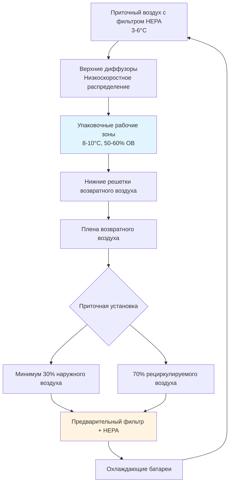

# Требования HVAC для упаковки и готовых к употреблению изделий из птицы

Помещения упаковки и обработки готовых к употреблению (РТЕ) изделий из птицы требуют наиболее строгих управлений HVAC на предприятиях пищевого производства. Эти среды после летальной обработки должны предотвращать повторное загрязнение благодаря точному контролю температуры, управлению качеством воздуха и каскадам дифференциального давления при сохранении энергоэффективности.

## Требования к тепловому проектированию

### Контроль температуры и влажности

ASHRAE Handbook - Refrigeration рекомендует температуру в упаковочных помещениях от 8 до 10°C с поддержанием относительной влажности на уровне 50-60%. Коэффициент чувствительного тепла (SHR) в этих помещениях обычно находится в диапазоне 0,75-0,85 из-за умеренных скрытых нагрузок от влаги продукта и персонала.

Расчет общей нагрузки охлаждения должен учитывать:

$$Q_{total} = Q_{product} + Q_{equipment} + Q_{lights} + Q_{personnel} + Q_{infiltration} + Q_{ventilation}$$

Где удаление тепла продукта является доминирующим:

$$Q_{product} = \dot{m}_{product} \times c_p \times (T_{in} - T_{setpoint}) + \dot{m}_{product} \times h_{fg} \times \Delta\omega$$

Для типовой линии РТЕ упаковки, обрабатывающей 2270 кг/ч вареного продукта, поступающего при 24°C и охлаждаемого до 10°C:

$$Q_{product} = \frac{2270}{3600} \times 3,56 \times (24-10) = 3,133 \text{ кВт} = 112,350 \text{ кДж/ч}$$

### Проектирование системы распределения воздуха

Температура приточного воздуха обычно находится в диапазоне 3-6°C для поддержания условий в помещении без создания чрезмерной скорости воздуха над открытым продуктом. Скорость воздуха на рабочих поверхностях не должна превышать 0,25 м/с для предотвращения ресуспензии частиц, сохраняя минимум 0,0025 м/с для обеспечения циркуляции воздуха.

## Качество воздуха и фильтрация

### Многоступенчатая система фильтрации

Помещения упаковки РТЕ требуют фильтрации HEPA (минимум 99,97% эффективности при 0,3 мкм) в качестве заключительного этапа фильтрации. Полная цепь фильтрации включает:

| Этап фильтрации | Эффективность | Перепад давления | Назначение |
|-----------------|------------|---------------|---------|
| Предварительный фильтр (MERV 8) | 70% @ 3,0 мкм | 49-98 Па | Удаление основных частиц |
| Вторичный (MERV 13) | 85% @ 1,0 мкм | 122-196 Па | Захват тонкой пыли |
| Финальный (HEPA H13) | 99,97% @ 0,3 мкм | 245-368 Па | Микробиологический контроль |

Требования к общему статическому давлению обычно составляют 860-1220 Па, что требует высокоэффективных вентиляторов плены с управлением частотными преобразователями для сохранения постоянного потока несмотря на засорение фильтров.

### Микробиологический контроль через управление воздухом

Логарифмическое снижение концентрации микробов в воздухе следует:

$$\frac{C(t)}{C_0} = e^{-\frac{Q \times E}{V} \times t}$$

Где:
- $C(t)$ = концентрация в момент времени $t$
- $C_0$ = исходная концентрация
- $Q$ = объемный расход воздуха (CFM)
- $E$ = эффективность фильтра (0,9997 для HEPA)
- $V$ = объем помещения (м³)
- $t$ = время (минуты)

Для упаковочного помещения объемом 283 м³ с 10 воздухообменами в час (ACH):

$$\text{Время для снижения на 99%} = \frac{-\ln(0,01) \times V}{Q \times E} = \frac{4,605 \times 283}{47,1 \times 0,9997} = 27,6 \text{ минут}$$

## Контроль дифференциального давления

### Проектирование каскада давления

Помещения упаковки РТЕ должны сохранять избыточное давление относительно смежных помещений с меньшим риском. USDA FSIS требует документирования дифференциалов давления, обычно указываемых как:

| Классификация зоны | Дифференциал давления | Типовое значение |
|-------------------|---------------------|---------------|
| РТЕ Упаковка → Коридор | Избыточное | +73-122 Па |
| Коридор → Сырая обработка | Избыточное | +49-98 Па |
| Любое помещение → Наружу | Избыточное | +122-196 Па |

Разница давления поддерживается путем балансирования приточного и вытяжного воздуха:

$$\Delta P = \frac{\rho \times (Q_{supply} - Q_{exhaust})^2}{2 \times A_{leakage}^2 \times C_d^2}$$

Где типовые отношения площади утечки находятся в диапазоне 0,1-0,3% площади стены для промышленного строительства.

### Мониторинг давления и тревоги

Датчики дифференциального давления с точностью ±0,024 Па должны постоянно контролировать критические границы. Системы управления должны модулировать частотные преобразователи приточного вентилятора для поддержания установок в пределах ±0,24 Па. Визуальные манометры Magnehelic обеспечивают резервное указание и проверку инспекции USDA.

## Требования к вентиляции

### Требования к наружному воздуху

ASHRAE Standard 62.1 предписывает минимальные скорости вентиляции, но предприятия РТЕ обычно превышают эти минимумы для контроля запахов и подачи подпиточного воздуха:

- Минимум: 2,03 м³/(ч·м²) (на основе занятости и требований процесса)
- Типичный проект: 3,39-5,08 м³/(ч·м²) для учета потребностей вытяжки
- Общая доля наружного воздуха: 30-50% приточного воздуха

Нагрузка охлаждения наружного воздуха в влажном климате значительно влияет на мощность системы:

$$Q_{OA} = 1,21 \times CFM_{OA} \times (h_{outdoor} - h_{supply})$$

Для 235 м³/ч (что примерно 138 CFM) наружного воздуха при 35°C/75% ОВ, охлаждаемого до 4°C:

$$Q_{OA} = 1,21 \times 138 \times (51,6 - 9,6) = 7,1 \text{ кВт} = 25,6 \text{ ГДж/ч}$$

## Конфигурация холодильной системы

### Выделенные в сравнении с общими системами

Помещения упаковки РТЕ выигрывают от выделенных холодильных систем, изолированных от сырой обработки для предотвращения риска перекрестного загрязнения через общие системы конденсата или хладагента. Вторичные контуры на основе гликоля обеспечивают дополнительное разделение при необходимости.

**Сравнение подходов холодильных систем:**

| Тип системы | Преимущества | Недостатки | Типовое применение |
|-------------|-----------|---------------|-------------------|
| Прямое расширение | Более низкая начальная стоимость, проще | Риск перекрестного загрязнения | Небольшие предприятия (<465 м²) |
| Вторичный контур на гликоле | Полная изоляция, упрощенное управление | Более высокие эксплуатационные расходы | Многозонные предприятия |
| Выделенная холодная вода | Лучший контроль, опции избыточности | Наивысшая начальная стоимость | Крупные предприятия (>1860 м²) |

### Проектирование испарительной батареи

Скорость лицевой стороны батареи не должна превышать 2,03 м/с для предотвращения переноса влаги в HEPA фильтры. Поддоны конденсата требуют непрерывного положительного уклона (минимум 6,35 мм на метр) с запираемыми сливами, заканчивающимися вне зоны РТЕ. Конструкция из нержавеющей стали (304 или 316) является стандартной для очистки.

Эффективность теплопередачи для охлаждающих батарей в этих приложениях:

$$\varepsilon = \frac{h_{air,in} - h_{air,out}}{h_{air,in} - h_{refrigerant}}$$

Типовая эффективность находится в диапазоне 0,65-0,75 для правильно размерных батарей с 4-6 рядами.

## Рассмотрение энергоэффективности

Рекуперация энергии между потоками вытяжного и наружного воздуха может снизить эксплуатационные расходы на 25-40%, но должна быть реализована осторожно в средах РТЕ. Рециркуляционные контуры на гликоле или колеса рекуперации энергии с секциями продувки предотвращают перекрестное загрязнение при одновременном восстановлении чувствительной и скрытой энергии.

Потенциал рекуперации чувствительной энергии:

$$Q_{recovered} = \varepsilon_{HX} \times \dot{m}_{min} \times c_p \times (T_{exhaust} - T_{OA})$$

Для теплообменника с эффективностью 70% с потоком воздуха 188 м³/ч и разностью температур 14°C:

$$Q_{recovered} = 0,70 \times 188 \times 1,01 \times 14 = 1,87 \text{ кВт} = 6,7 \text{ ГДж/ч}$$

## Интеграция системы управления

Современные предприятия упаковки РТЕ используют системы автоматизации зданий (BAS) с:

- Контролем температуры с точностью ±0,6°C через петли PID с интервалами обновления 30 секунд
- Контролем дифференциального давления с точностью ±0,24 Па через балансирование приточного-вытяжного воздуха
- Мониторингом дифференциального давления фильтров с автоматическими тревогами при 75% и 100% мощности
- Последовательностью холодильной системы для оптимизации эффективности при различных нагрузках
- Логированием данных для соответствия HACCP и нормативной документации

Стратегия управления должна приоритизировать безопасность пищевых продуктов над энергоэффективностью, с отказоустойчивыми режимами, сохраняющими избыточное давление и минимальную вентиляцию при отказах оборудования.
