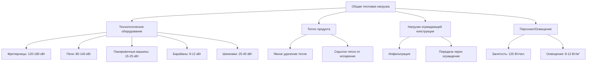
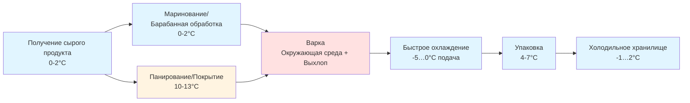

## Обзор

Глубокоотработанные продукты из птицы требуют специальных условий окружающей среды в зависимости от состава продукта, метода обработки и требований микробиологической безопасности. Проектирование системы HVAC должно учитывать тепловые свойства покрытий, миграцию влаги во время обработки и выделение тепла от оборудования при одновременном поддержании температуры продукта ниже критических порогов роста патогенов.

Различные категории продуктов—сырые панированные, полностью готовые, маринованные и приправленные изделия—создают уникальные проблемы в плане удаления скрытого тепла, контроля скорости воздуха и управления температурной стратификацией.

## Требования к температуре по категориям продуктов

### Сырые панированные продукты

Сырые панированные изделия (наггетсы, тендеры, котлеты) должны поддерживать температуру ядра продукта на уровне или ниже 4°C на протяжении всего процесса нанесения панировки для предотвращения размножения микробов и обеспечения прилипания теста.

**Критические параметры окружающей среды:**

- Температура воздуха в помещении панирования: 10-13°C
- Относительная влажность: 65-75% для предотвращения высыхания теста
- Скорость воздуха на уровне продукта: 0,15-0,25 м/с
- Температура поверхности продукта при панировании: 2-4°C

Низкая требуемая скорость воздуха предотвращает смещение материала панировки и обеспечивает надлежащее конвективное удаление тепла. Более высокие скорости вызывают неравномерное распределение панировки и чрезмерное обезвоживание продукта.

**Тепловая нагрузка от операций панирования:**

$$Q_{total} = Q_{product} + Q_{equipment} + Q_{personnel} + Q_{infiltration}$$

Где прирост тепла продукта при нанесении панировки:

$$Q_{product} = \dot{m} \cdot c_p \cdot \Delta T + \dot{m} \cdot \lambda$$

Для линий панирования с производительностью 4500 кг/ч и захватом панировки 25%:

- $\dot{m}$ = 1,25 кг/с (продукт плюс панировка)
- $c_p$ = 3,52 кДж/(кг·K) (среднее значение для панированной птицы)
- $\Delta T$ = прирост температуры при обработке (обычно 1-2°C)
- $\lambda$ = скрытое тепло испарения влаги (минимальное)

Вклад теплоты оборудования от панировочных машин, аппликаторов и конвейеров обычно добавляет 45-65 кВт для высокопроизводительных линий.

### Полностью готовые продукты

Готовые продукты (жареные полоски, жареные кусочки, жареные изделия) выходят из варочного оборудования с внутренней температурой 74-85°C и требуют быстрого охлаждения до уровня ниже 4°C в строгие временные рамки согласно руководящим принципам USDA-FSIS.

**Требования к скорости охлаждения:**

Продукты должны охлаждаться с 54°C до 4°C в течение 90 минут для соответствия протоколам предотвращения роста патогенов. Это требует агрессивного охлаждения в спиральных морозильниках или скоростных охладителях.

**Расчет удаления тепла:**

$$Q_{cooling} = \dot{m} \cdot c_p \cdot (T_{initial} - T_{final}) + \dot{m} \cdot h_{fg} \cdot x_{evap}$$

Где:
- $T_{initial}$ = 75°C (средняя температура после варки)
- $T_{final}$ = 4°C (целевая температура хранения)
- $h_{fg}$ = 2260 кДж/кг (скрытое тепло испарения воды)
- $x_{evap}$ = доля испаренной влаги (0,02-0,04)

Для линии готовых продуктов с производительностью 3000 кг/ч требуемая мощность охлаждения приближается к 180-220 кВт, с температурой испарителя -10…-15°C для достижения надлежащего температурного перепада.

### Маринованные и инъецированные продукты

Системы маринования вводят рассольные растворы (концентрация соли 3-15%), которые изменяют тепловые свойства и микробиологическую стабильность. Маринованные продукты должны оставаться при температуре 0-2°C во время барабанной обработки и хранения.

**Условия в помещении барабана:**

- Температура воздуха: 4-7°C
- Относительная влажность: 85-90% (предотвращает высыхание поверхности)
- Воздухообмены: 15-20 ACH для удаления паров этанола из маринадов
- Выделение тепла оборудованием: 8-12 кВт на 500 кг емкости барабана

Теплопроводность маринованного мяса увеличивается на 15-25% по сравнению с немаринованным продуктом из-за более высокого содержания влаги и ионной силы, что влияет на скорость охлаждения и замерзания.

### Эмульгированные продукты

Сосиски и сосиски в тесте требуют контроля температуры при эмульгировании, наполнении и скреплении для поддержания функциональности белка и предотвращения коалесценции жира. Целевая температура эмульсии при шинковании: -2…2°C.

**Требования к помещению обработки:**

- Температура окружающей среды: 7-10°C
- Относительная влажность: 75-85%
- Отвод тепла от чаши-шинковки: 25-40 кВт на 300 л емкости
- Температура в помещении шпигователя: 4-7°C

Механическая энергия, подаваемая во время эмульгирования, преобразуется непосредственно в тепловую энергию, повышая температуру продукта на 0,8-1,5°C в минуту смешивания. Системы охлаждения должны компенсировать это выделение тепла для поддержания стабильности эмульсии.

## Стратегии контроля окружающей среды

### Управление температурной стратификацией

Помещения обработки с высотой потолка свыше 4 метров испытывают значительные вертикальные температурные градиенты. Разница температур в 5-8°C между уровнем пола и потолка приводит к потере мощности охлаждения и создает несогласованные условия для продукта.

**Подходы к перемешиванию воздуха:**

| Метод | Эффективность перемешивания воздуха | Влияние на энергию | Применение |
|-------|-------------------------------------|-------------------|-----------|
| Потолочные вентиляторы (HVLS) | Снижение ΔT на 65-75% | +3-5% энергии вентилятора | Большие открытые площади |
| Высокоскоростные струи | Снижение ΔT на 80-90% | +8-12% энергии вентилятора | Помещения <2000 м³ |
| Подпольная подача | Снижение ΔT на 85-95% | -5-10% энергии охлаждения | Новое строительство |
| Вытеснение по периметру | Снижение ΔT на 70-80% | -2-5% энергии охлаждения | Модернизация |

### Контроль влажности в зонах панирования

Поддержание 65-75% относительной влажности в помещениях панирования требует точной осушки. Избыточная влажность (>80%) вызывает слипание панировки и загрязнение оборудования; недостаточная влажность (<60%) приводит к растрескиванию теста и отказу прилипания.

**Уравнение баланса влаги:**

$$\dot{m}_{water,add} = \dot{m}_{infiltration} + \dot{m}_{product} + \dot{m}_{personnel} - \dot{m}_{removal}$$

Системы осушки должны удалять 40-70 кг/ч влаги в типичных объектах панирования при одновременном нагреве подаваемого воздуха для предотвращения чрезмерного охлаждения.

## Вклад тепловой нагрузки оборудования

### Отвод тепла варочного оборудования

Непрерывные фритюрницы отводят 60-70% входной мощности горелки в виде лучистого и конвективного тепла в помещение. Газовые фритюрницы с номинальной входной мощностью 250 кВт добавляют приблизительно 160 кВт к нагрузке охлаждения помещения, плюс дополнительно 30-40 кВт от явного нагрева воздуха подпитки из вытяжного колпака.

Конвекционные печи, работающие при 205°C с тепловой мощностью 100 кВт, обычно добавляют 55-70 кВт к нагрузке охлаждения помещения через потери изоляции и циклы открытия дверей.

## Тепловые свойства продуктов

| Тип продукта | Удельная теплоемкость (кДж/кг·K) | Теплопроводность (Вт/м·K) | Содержание влаги (%) | Критическая температура (°C) |
|--------------|-----------------------------------|---------------------------|---------------------|-------------------------------|
| Сырая панированная | 3,52 | 0,48 | 62-68 | ≤4 |
| Готовые полоски | 3,20 | 0,52 | 58-64 | ≤4 (после охлаждения) |
| Маринованная сырая | 3,78 | 0,58 | 72-78 | ≤2 |
| Эмульсия (сырая) | 3,65 | 0,54 | 65-72 | ≤2 |
| Ротиссери (готовая) | 2,95 | 0,48 | 52-58 | ≤60 (горячее хранение) |
| Нарезанная деликатесная | 3,45 | 0,51 | 68-74 | ≤4 |

Вариация тепловых свойств существенно влияет на расчеты нагрузки охлаждения. Увеличение содержания влаги на 10% повышает требования к охлаждению приблизительно на 12-15% из-за более высокой удельной теплоемкости и вклада скрытого тепла.

## Рекомендации по проектированию системы

### Конфигурация системы охлаждения

Мульти-испарительные системы с независимым контролем температуры каждой зоны обработки обеспечивают оптимальную гибкость:

- **Зона панирования:** Температура испарителя -5…0°C, подаваемый воздух 10-13°C
- **Варочная зона:** Вентиляция выхлопа с кондиционированием приточного воздуха
- **Зона охлаждения:** Температура испарителя -10…-15°C, высокая скорость воздуха (3-5 м/с)
- **Зона упаковки:** Температура испарителя -2…2°C, контролируемая влажность
- **Помещение эмульгирования:** Температура испарителя -8…-3°C, подаваемый воздух 7-10°C

### Проектирование распределения воздуха

Зоны контакта с продуктом требуют ламинарных картин потока с равномерным распределением скорости. Приточные диффузоры должны поддерживать отклонение скорости в пределах ±10% по всей зоне продукта для обеспечения постоянных коэффициентов теплопередачи.

**Рекомендуемые воздухообмены:**

- Помещения панирования: 25-35 ACH
- Варочные зоны: 40-60 ACH (требования кодекса из-за вытяжки)
- Охлаждающие туннели: 60-100 ACH
- Помещения упаковки: 20-30 ACH
- Помещения эмульгирования: 20-28 ACH
- Зоны маринования: 15-20 ACH

Размещение возвратного воздуха на низком уровне (в пределах 0,6 м от пола) в зонах охлаждения захватывает самый холодный, самый плотный воздух и улучшает эффективность системы на 8-15% по сравнению с потолочными возвратами.

### Стратегия зонирования

Физическое разделение между температурными зонами минимизирует перекрестное загрязнение тепловых условий и снижает нагрузку охлаждения на 18-25% по сравнению с однозонными конструкциями.

## Соответствие нормам и соображения безопасности

Стандарт ASHRAE 15 регулирует использование хладагентов на предприятиях пищевой промышленности. Системы на основе аммиака требуют изоляции машинного отделения и аварийной вентиляции в соответствии со стандартами IIAR-2. Для объектов с производительностью >20000 кг/день двойные системы охлаждения или аварийная резервная мощность обеспечивает соответствие требованиям безопасности пищевых продуктов при отказе оборудования.

USDA-FSIS требует непрерывного мониторинга температуры с точностью ±0,5°C во всех зонах контакта с продуктом, что требует калиброванных датчиков и резервных точек измерения на критических контрольных точках согласно протоколам HACCP.

Качество воздуха должно соответствовать рекомендациям FDA по уровням взвешенных в воздухе частиц (<100 частиц/м³ >5 мкм) в помещениях упаковки после варки для предотвращения загрязнения продукта.

**Мониторинг критических контрольных точек:**

- Хранение сырого продукта: Температура каждые 15 минут
- Выход после варки: Непрерывная проверка внутренней температуры
- Фаза охлаждения: Запись времени-температуры (соответствие 90 минутам)
- Вход в упаковку: Проверка температуры продукта ±0,5°C

## Стратегии оптимизации энергии

Рекуперация тепла из варочных операций обеспечивает значительную экономию энергии. Выхлопной воздух из фритюрниц и печей при температуре 65-95°C может предварительно нагреть приточный воздух, снижая нагрузки на отопление на 40-60% при холодных условиях эксплуатации.

Системы рекуперации тепла с гликолем захватывают отходящее тепло от конденсаторов охлаждения (35-45°C) для предварительного нагрева воды, предварительного нагрева систем санитарной обработки и обогрева помещений в административных зонах. Эффективность рекуперации энергии достигает 25-35% от общего отводимого теплохладагентом.

Приводы с переменной частотой вращения на вентиляторах испарителя снижают потребление энергии на 30-45% при частичной нагрузке, что обычно происходит при переналадке продукта и периодах санитарной обработки.

## Ссылки

- ASHRAE Handbook—Refrigeration, Chapter 31: Food Processing Facilities
- USDA-FSIS: Time-Temperature Tables for Cooking Ready-to-Eat Poultry Products
- ASHRAE Standard 15: Safety Standard for Refrigeration Systems
- IIAR-2: Equipment, Design, and Installation of Closed-Circuit Ammonia Mechanical Refrigerating Systems
- FDA Food Code: Temperature Control Requirements for Potentially Hazardous Foods
