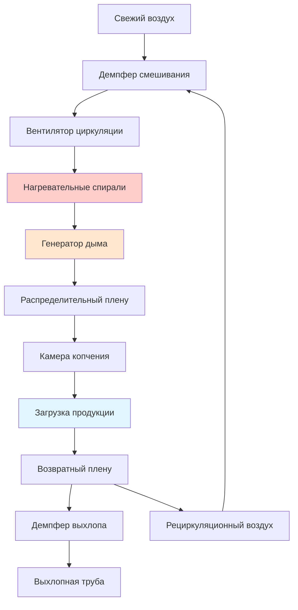

## Обзор

Процессы копчения птицы требуют точного контроля окружающей среды для достижения последовательного качества продукции, безопасности пищевых продуктов и оптимального удаления влаги. Системы HVAC управляют связанными процессами передачи тепла и массы, которые определяют проникновение дыма, развитие цвета, потерю влаги и снижение микробной контаминации. Окружающая среда камеры копчения уравновешивает температуру, относительную влажность, плотность дыма и скорость воздуха для управления как поверхностной сушкой, так и внутренней варкой.

## Требования к окружающей среде камеры копчения

### Профили температуры

Копчение птицы обычно использует три отчетливых термических этапа:

**Холодное копчение (20–30°C):** Минимальная варка, основное развитие вкуса дыма, требует точного управления влажностью для предотвращения конденсации на поверхности при сохранении влаги для адгезии дыма.

**Теплое копчение (30–60°C):** Частичная варка с применением дыма, контролируемое удаление влаги инициирует образование пеллицулы, начинается денатурация белка, влияя на адгезию частиц дыма.

**Горячее копчение (60–85°C):** Полная тепловая обработка до безопасной внутренней температуры, одновременная варка и применение дыма, максимальная скорость удаления влаги.

### Основы управления влажностью

Баланс влаги в камерах копчения прямо влияет на выход продукции, текстуру и проникновение дыма. Психрометрическое соотношение, управляющее поверхностной влагой:

$$\frac{dm}{dt} = h_m A (P_{sat,surface} - P_{vapor,air})$$

где $h_m$ — коэффициент передачи массы (м/ч), $A$ — площадь поверхности (м²), $P_{sat,surface}$ — давление насыщенного пара на поверхности продукта (кПа), и $P_{vapor,air}$ — парциальное давление водяного пара в воздухе камеры (кПа).

Относительная влажность прямо управляет градиентом давления пара. Целевые диапазоны влажности:

| Этап копчения | Диапазон OВ | Цель |
|--------------|----------|-----------|
| Начальная сушка | 30–50% | Удаление поверхностной влаги, образование пеллицулы |
| Применение дыма | 60–75% | Сохранение поверхностной влаги для адгезии дыма |
| Окончательная варка | 40–60% | Контролируемая сушка, развитие цвета |
| Охлаждение после копчения | 85–95% | Минимизация дополнительной потери влаги |

## Механизмы передачи тепла

Передача тепла к продуктам птицы во время копчения объединяет конвективные, радиационные и кондуктивные компоненты:

$$Q_{total} = Q_{conv} + Q_{rad} + Q_{cond}$$

**Конвективная передача тепла:** Доминирующий механизм в камерах копчения с принудительной циркуляцией воздуха. Конвективный тепловой поток:

$$q_{conv} = h_c (T_{air} - T_{surface})$$

где $h_c$ колеблется от 45 до 140 Вт/(м²·K) в зависимости от скорости воздуха (0,5–2,5 м/с типичные значения).

**Радиационная передача тепла:** Значительна в коптильнях с прямым обогревом, где пламя и нагретые поверхности способствуют процессу:

$$q_{rad} = \epsilon \sigma (T_{source}^4 - T_{surface}^4)$$

Излучательная способность $\epsilon$ для поверхностей птицы составляет 0,85–0,92. Радиационный вклад увеличивается с 15% при холодном копчении до 35% при операциях горячего копчения.

## Генерация и распределение дыма

### Методы производства дыма

**Фрикционные генераторы:** Твердая древесина под давлением на вращающееся колесо, производит плотный дым при 200–370°C, частицы диаметром 0,1–1,0 мкм, требует 210–420 м³/ч подачи воздуха на генератор.

**Тлеющие опилки:** Традиционный метод, опилки тлеют при 300–400°C, большее распределение частиц (0,5–3,0 мкм), прерывистая плотность дыма, минимальное требование воздуха (42–84 м³/ч).

**Атомизация жидкого дыма:** Атомизированный жидкий дым в потоке нагретого воздуха (120–175°C), точный контроль плотности, равномерное распределение, требует сжатого воздуха (550 кПа) и 84–170 м³/ч воздуха-носителя.

### Проектирование системы распределения дыма

Равномерная плотность дыма во всей камере требует контролируемой циркуляции воздуха. Эффективность смешивания:

$$\eta_{mix} = \frac{C_{min}}{C_{avg}} \times 100\%$$

где $C_{min}$ — минимальная концентрация дыма и $C_{avg}$ — средняя концентрация. Целевая эффективность смешивания превышает 85% для последовательного качества продукции.

Скорости циркуляции воздуха: 50–150 воздухообменов в час в зависимости от плотности загрузки. Более высокая циркуляция улучшает равномерность, но увеличивает скорость поверхностной сушки.

## Воздушные потоки и циркуляционные схемы

### Проектирование системы циркуляции

Коптильни с принудительной циркуляцией воздуха используют центробежные вентиляторы для циркуляции воздуха через нагревательные спирали и генераторы дыма. Требуемая производительность вентилятора:

$$\text{м³/ч} = \frac{\text{Объем камеры} \times \text{ОВ}}{60}$$

Для камеры объемом 28 м³ при 100 ОВ: м³/ч = (28 × 100)/60 = 47 м³/ч.

Требования по статическому давлению составляют 25–50 Па в зависимости от конфигурации спирали, загрузки продукции и положения демпферов.

### Оптимизация схемы потока

Вертикальный воздушный поток (сверху вниз или снизу вверх) обеспечивает превосходную равномерность для подвешенных на стеллажах продуктов по сравнению с горизонтальным потоком. Профиль скорости на высоте продукции должен поддерживать 0,5–1,5 м/с для адекватной передачи тепла без чрезмерной поверхностной сушки.

## Управление выхлопом и вентиляцией

### Определение скорости выхлопа

Выхлопной воздух удаляет избыточную влагу и поддерживает целевую влажность. Требуемый поток выхлопа на основе удаления влаги:

$$\text{м³/ч}_{\text{выхлоп}} = \frac{W_{evap}}{60 \times \rho_{air} \times (W_{sat} - W_{inlet})}$$

где $W_{evap}$ — скорость испарения влаги (кг/ч), $\rho_{air}$ — плотность воздуха (кг/м³), $W_{sat}$ — коэффициент влажности при насыщении при температуре камеры (кг воды/кг сухого воздуха), и $W_{inlet}$ — коэффициент влажности входящего воздуха (кг воды/кг сухого воздуха).

Типичные скорости выхлопа: 10–30% от общей циркуляции при активном копчении, увеличиваются до 40–60% во время фаз высокотемпературной варки.

### Управление давлением

Камеры копчения работают при легком отрицательном давлении (–5 до –25 Па) относительно окружающих территорий для предотвращения миграции дыма. Это требует модуляции демпферов выхлопа на основе датчиков дифференциального давления.

## Рекуперация энергии

### Рекуперация тепла из выхлопа

Выхлопной воздух при 60–85°C и высокой влажности представляет возможности рекуперации тепла. Теплообменники воздух-воздух (пластинчатые или роторные) восстанавливают 50–70% энергии выхлопа при предотвращении перекрестного загрязнения.

Восстановленная энергия предварительно нагревает свежий воздух подачи, снижая нагрузку на нагревательную спираль:

$$Q_{recovered} = \text{м³/ч}_{\text{выхлоп}} \times \rho_{air} \times c_p \times \epsilon \times (T_{exhaust} - T_{ambient})$$

где $\epsilon$ — эффективность теплообменника (0,50–0,70 типичные значения).

### Управление конденсатом

Высокая влажность выхлопа конденсируется в воздуховодах и трубах. Дренажи конденсата требуют надлежащего уклона (6 мм/м минимум) и конструкции сифона для предотвращения утечки воздуха при дренировании конденсата, содержащего остатки дыма и органические соединения.

## Архитектура системы управления

### Стратегия управления температурой

Многоступенчатое управление нагревом поддерживает уставку при изменяющихся условиях нагрузки:

1. **Модулирующий клапан пара/горячей воды** для точного управления (±1°C)
2. **Частотный преобразователь на вентиляторе циркуляции** влияет на коэффициент конвективной передачи тепла
3. **Модуляция демпфера свежего воздуха/рециркуляции** обеспечивает грубую подстройку температуры

### Реализация управления влажностью

Датчики сухого и влажного термометров позволяют рассчитать относительную влажность в психрометрической диаграмме. Цикл управления модулирует:

- **Положение демпфера выхлопа** (первичное управление)
- **Впрыск пара** (быстрое увеличение влажности при необходимости)
- **Свежий воздух на входе** (снижение влажности)

Время отклика: 30–90 секунд для регулировки ±5% ОВ при установившейся температуре.

## Безопасность пищевых продуктов и соответствие стандартам USDA

Нормативные акты USDA-FSIS (9 CFR часть 381) предписывают определенные комбинации времени-температуры для продуктов птицы. Для готовых к употреблению копченых продуктов птицы:

- Минимальная внутренняя температура: 74°C мгновенно, или
- Комбинации времени-температуры согласно Приложению A

Системы HVAC должны обеспечивать равномерный нагрев по всей камере с проверкой через несколько датчиков температуры продукции. Однородность температуры в пределах ±3°C по всей загрузке гарантирует, что все продукты получат адекватную тепловую обработку.

## Заключение

Эффективное управление HVAC в операциях копчения птицы интегрирует управление температурой, контроль влажности, распределение дыма и оптимизацию воздушных потоков. Понимание связанных механизмов передачи тепла и массы позволяет спроектировать системы, которые постоянно производят безопасные высококачественные копченые продукты птицы при одновременной максимизации энергоэффективности и производительности. Надлежащее размещение датчиков, настройка алгоритма управления и регулярная калибровка обеспечивают долгосрочную производительность и соответствие требованиям нормативных актов.
