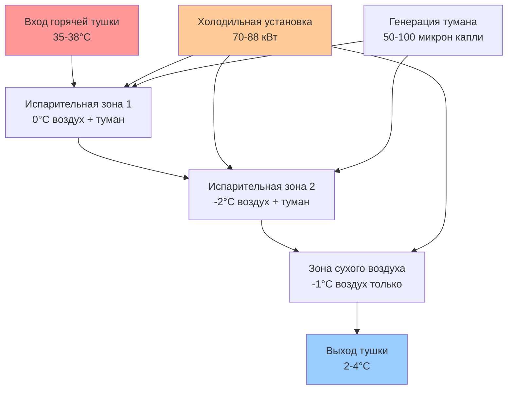
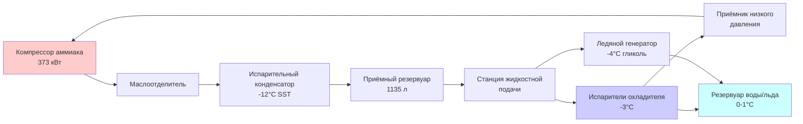
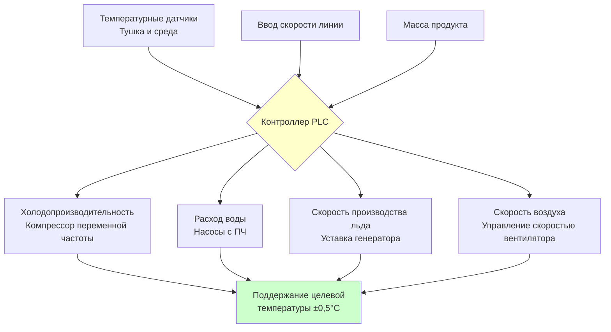

## Обзор

Охлаждение птицы представляет собой критический тепловой переход между обработкой при забое (внутренняя температура 40-42°C) и хранением (-2-0°C). Процесс охлаждения должен быстро снизить температуру тушки ниже 4°C в установленные сроки при одновременном сохранении микробиологической безопасности, качества продукта и выхода. Тепловая динамика включает одновременную передачу тепла и массы с учетом фазовых переходов как для поглощения воды, так и для образования льда.

## Фундаментальные механизмы теплопередачи

### Компоненты охлаждающей нагрузки

Общая требуемая величина отвода тепла включает несколько тепловых составляющих:

$$Q_{total} = Q_{sensible} + Q_{respiration} + Q_{metabolism} + Q_{equipment}$$

Для типичной тушки бройлера массой 2,04 кг основная явная охлаждающая нагрузка:

$$Q_{sensible} = m \cdot c_p \cdot \Delta T$$

Где:
- m = масса тушки (4,5 фунта = 2,04 кг)
- c_p = удельная теплоемкость птицы (3,4 кДж/кг·К)
- ΔT = снижение температуры (40°C типичное)

$$Q_{sensible} = 2,04 \times 3,4 \times 40 = 277 \text{ кДж на тушку}$$

Для линии переработки, обрабатывающей 140 птиц в минуту (8400 птиц/ч), постоянная охлаждающая нагрузка:

$$Q_{process} = \frac{277 \times 8400}{3600} = 646 \text{ кВт} = 184 \text{ кВт холодопроизводительности}$$

### Динамика скорости охлаждения

Скорость охлаждения следует закону охлаждения Ньютона с учетом конвективной теплопередачи:

$$\frac{dT}{dt} = -h \cdot \frac{A}{m \cdot c_p} \cdot (T - T_{\infty})$$

Где:
- h = коэффициент конвективной теплопередачи (Вт/м²·К)
- A = площадь поверхности (м²)
- T∞ = температура охлаждающей среды

## Системы погружного охлаждения

### Принципы конструкции

Погружные охладители используют непрерывные или периодические перемешиваемые резервуары с водой при 0-1°C. Турбулентный поток воды повышает коэффициенты теплопередачи до 200-400 Вт/м²·К, обеспечивая быстрое охлаждение. Нормативы USDA предписывают максимальное поглощение воды 8% для целых бройлеров.

**Основные параметры конструкции:**

| Параметр | Характеристика | Основание |
|-----------|----------------|-----------|
| Температура воды | 0-1°C | Требование USDA |
| Время пребывания | 45-60 минут | Зависит от размера тушки |
| Скорость воды | 1,2-2,4 м/с | Режим турбулентного потока |
| Скорость добавления льда | 15-25% от массы производства | Поддержание температуры |
| Обновление воды | 1,9-3,8 л/птица | Санитарный стандарт |

### Расчет тепловой производительности

Для противоточного погружного охладителя с входом тушки при 35°C и выходом при 3°C:

$$\Delta T_{lm} = \frac{(T_{in} - T_{w,out}) - (T_{out} - T_{w,in})}{\ln\left(\frac{T_{in} - T_{w,out}}{T_{out} - T_{w,in}}\right)}$$

При температурах воды в диапазоне 0-2°C:

$$\Delta T_{lm} = \frac{(35 - 2) - (3 - 0)}{\ln\left(\frac{33}{3}\right)} = \frac{30}{2,40} = 12,9°C$$

Требуемая площадь теплопередачи на тушку:

$$A = \frac{Q}{h \cdot \Delta T_{lm}} = \frac{277000 \text{ Дж}}{300 \text{ Вт/м²·К} \times 12,9 \text{ К} \times 3600 \text{ с}} = 0,020 \text{ м²}$$

### Требования по производству льда

Поддержание температуры воды требует постоянного добавления льда. Для 8400 птиц/ч с отводом 277 кДж на птицу:

$$m_{ice} = \frac{Q_{total}}{h_{fusion}} = \frac{646000 \text{ Вт}}{334000 \text{ Дж/кг}} = 1,93 \text{ кг/с} = 6955 \text{ кг/ч льда}$$

## Системы воздушного охлаждения

### Эксплуатационные характеристики

Системы воздушного охлаждения используют высокоскоростной охлаждённый воздух (-2-0°C) при 2,5-5 м/с. Коэффициенты теплопередачи (15-40 Вт/м²·К) значительно ниже, чем при погружении, требуя 90-180 минут времени пребывания.

**Характеристики конструкции воздушного охладителя:**

| Компонент | Значение | Примечания |
|-----------|----------|-----------|
| Температура воздуха | -2-0°C | Точка росы испарителя -4-(-3)°C |
| Скорость воздуха | 2,5-5 м/с | Над поверхностью тушки |
| Относительная влажность | 90-95% | Управление потерей влаги |
| Холодопроизводительность | 5,3-7 кВт/454 кг/ч | Зависит от системы |
| Мощность вентилятора | 0,11-0,19 кВт/142 м³/ч | Преодоление статического давления |

### Анализ теплопередачи

Конвективная теплопередача при потоке воздуха над подвешенными тушками:

$$h = 10,45 - v + 10v^{0,5}$$

Для скорости воздуха v = 3 м/с:

$$h = 10,45 - 3 + 10(3)^{0,5} = 24,8 \text{ Вт/м²·К}$$

Оценка времени охлаждения методом сосредоточенной теплоемкости:

$$t = \frac{m \cdot c_p}{h \cdot A} \ln\left(\frac{T_i - T_{\infty}}{T_f - T_{\infty}}\right)$$

$$t = \frac{2,04 \times 3400}{24,8 \times 0,12} \ln\left(\frac{35 - (-1)}{4 - (-1)}\right) = 2331 \times 2,26 = 5268 \text{ с} = 88 \text{ минут}$$

## Испарительное воздушное охлаждение

### Термодинамика гибридной системы

Испарительное воздушное охлаждение вводит тонкий водяной туман в поток охлаждённого воздуха, сочетая механизмы явной и скрытой теплопередачи. Испарительная составляющая обеспечивает повышенные коэффициенты теплопередачи (40-80 Вт/м²·К) при ограничении поглощения воды до 2-4%.

### Сравнение производительности

| Метод охлаждения | Время (мин) | Потери выхода (%) | Расход воды (л/птица) | Энергия (кВт·ч/454 кг) | Капитальные затраты |
|------------------|------------|-------------------|----------------------|------------------------|----------------------|
| Погружение | 45-60 | -2 до +4 | 1,9-3,8 | 2,3-3,5 | Низкие |
| Воздух | 90-180 | 1,5-2,5 | 0 | 4,4-7,3 | Высокие |
| Испарительное | 60-90 | 0-1,5 | 0,4-1,1 | 2,9-5,3 | Средние-высокие |
| CO₂ криогенное | 15-30 | 2,0-3,5 | 0 | 13,2-19,1 | Очень высокие |

## Конструкция холодильной системы

### Конфигурация системы

### Выбор испарителя

Для приложений погружного охлаждения пластинчатые или кожухотрубные испарители, погруженные в ледяной/водяной раствор, обеспечивают оптимальную теплопередачу. Требуемая холодопроизводительность испарителя:

$$Q_{evap} = Q_{process} \times SF$$

Где SF = коэффициент безопасности (1,15-1,25):

$$Q_{evap} = 646 \text{ кВт} \times 1,2 = 775 \text{ кВт} = 220 \text{ кВт холодопроизводительности}$$

Расчет площади испарителя при общем коэффициенте теплопередачи U = 800 Вт/м²·К:

$$A_{evap} = \frac{Q_{evap}}{U \cdot \Delta T_{evap}} = \frac{775000}{800 \times 8} = 121 \text{ м²}$$

## Системы управления и мониторинга

### Критические контрольные точки

Мониторинг температуры согласно USDA 9 CFR 381.66 требует:

- Температура ядра тушки ≤ 4°C в течение 4 часов после потрошения
- Максимум 16 часов совокупного времени от забоя до 4°C
- Непрерывная запись температуры воды (системы погружения)
- Мониторинг температуры и относительной влажности воздуха (воздушные системы)

**Стратегия управления:**

## Обработка воды и санитария

### Системы противомикробной обработки

USDA разрешает противомикробные вмешательства в воду охладителя:

- Хлор: 20-50 мг/л свободного активного хлора
- Надуксусная кислота: 200-2000 мг/л
- Диоксид хлора: 3-5 мг/л
- Подкисленный гипохлорит натрия: 500-1200 мг/л

Параметры качества воды влияют как на безопасность пищевых продуктов, так и на эффективность теплопередачи. Взвешенные твёрдые вещества снижают эффективные коэффициенты теплопередачи на 10-30%.

## Аспекты энергоэффективности

### Удельное энергопотребление

Эталонные показатели энергетической производительности для различных методов охлаждения:

$$SEC = \frac{E_{total}}{m_{product}}$$

Целевые значения (кВт·ч на 454 кг пропускной способности):
- Оптимизированное погружение: 2,3-2,9 кВт·ч
- Стандартное погружение: 2,9-4,1 кВт·ч
- Воздушное охлаждение: 4,4-7,3 кВт·ч
- Испарительное воздушное: 3,5-5,3 кВт·ч

Улучшение эффективности посредством:
- Компрессоры переменной частоты (экономия 20-35%)
- Рекуперация тепла для подогрева технологической воды (экономия 10-15%)
- Оптимизация испарительного конденсатора (экономия 5-10%)
- Тепловые аккумуляторы для управления спросом (сдвиг нагрузки)

## Стандарты ASHRAE и нормативные требования

Ключевые ссылки для конструкции системы охлаждения птицы:

- **ASHRAE Handbook - Refrigeration Chapter 31**: Переработка птицы и требования холодильной техники
- **USDA 9 CFR 381.66**: Температуры и процедуры охлаждения
- **USDA 9 CFR 381.93**: Стандарты поглощения воды
- **NSF/ANSI 3**: Коммерческое оборудование для мойки распылением (санитария водной системы)
- **IIAR 2**: Оборудование, конструкция и установка закрытых систем механического охлаждения с аммиаком

## Заключение

Конструкция системы охлаждения птицы уравновешивает тепловую производительность, микробиологическую безопасность, качество продукта, соответствие нормативам и экономическую жизнеспособность. Погружное охлаждение обеспечивает быстрый отвод тепла при более низких капитальных и операционных затратах, но требует значительного расхода воды и её обработки. Воздушное охлаждение исключает проблемы поглощения воды за счет более длительного времени пребывания и более высокого потребления энергии. Гибридные испарительные системы предлагают промежуточную производительность с оптимизированным использованием ресурсов. Надлежащая конструкция холодильной системы, интеграция управления и протоколы санитарии обеспечивают последовательное снижение температуры продукта при соответствии требованиям USDA и сохранении эффективности переработки.
